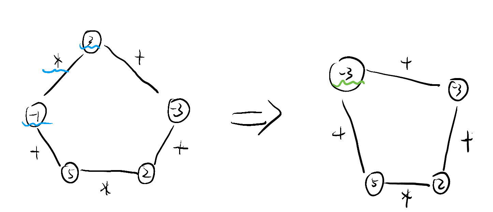

# Ep.5 动态规划

在穷举和分治的基础上进行优化，  
相当于减枝的搜索。

但与分治不同的是，**子问题之间可能并不独立**（分治法中子问题要求相互独立），  
并且并不能很明确地划分成若干个子问题，而是在实际求解过程中进行分解。
同时在计算子问题的时候，会将子问题的解保存下来。

主要利用递归的方法，  
需要转化为递推。

## 例1 - 矩阵连乘

对于矩阵的连续相乘，其满足结合律，  
而乘法的顺序不同，会造成乘法运算的次数不同。

如何求：$A_{P_1P_2}\times A_{P_2P_3}\times A_{P_3P_4}\times\cdots\times A_{P_{n-1}P_n}\times A_{P_nP_{n+1}}$的乘法次数最小的方法。

**分析：**  
无论怎么结合，其矩阵的相对位置不变，  
因此最后得到的肯定是矩阵$A_{P_1P_{n+1}}$。

从最后开始**倒序分析**，最后一步是由$A_{P_1 P_K}\times A_{P_K P_{n+1}}$得到的，分别为左右两部分相乘。  

* 左部分为：$A_{P_1P_2}\times A_{P_2P_3}\times\cdots\times A_{P_{k-1}P_K}$
* 右部分为：$A_{P_KP_{K+1}}\times A_{P_{K+1}P_{K+2}}\times\cdots\times A_{P_nP_{n+1}}$

乘法次数：$P_1*P_K*P_{n+1}$。

为“穷举”+“减治”法。

**动规方法：**

我们用$dp[i][j]$来记录得到矩阵$A_{P_iP_j}$的最小乘法次数，  
可以得到以下动态规划方程：
$$
dp[i][j]=\min(dp[i][k-1]+dp[k][j]+P_i*P_k*P_{j+1})\\(k\in[i+1,j-1])
$$
边界条件：$dp[i][i]=0, dp[i][i+1]=P_i*P_{i+1}*P_{i+2}$

要得到方法，记录每次$k$所取的值。

## 例2 - 最长递增子序列

**分析：**

这里是**顺推**，  
先从只有一个元素开始，此时$dp[1]=1$，  
添加一个元素后，其如果比前面的元素大，则此时长度为$dp[k]+1$，  
若比前面的元素小，则此时应选取之前的子序列，作为当前位置的最大子序列，及长度为$dp[k]$。

为“穷举”+“增治”法。

**动规方法：**

用$dp[i]$记录$i$位置之前的最长子序列。
$$
dp[i]=\max((a[k]<a[i])?(dp[k]+1):(dp[k])) \\
(k\in[1,i-1])
$$

边界条件：$dp[1]=1$

## 例3 - 最长公共子序列

两序列$A(n):a_1,a_2,\cdots,a_n$，$B(m):b_1,b_2,\cdots,b_m$，  
求最长的公共子序列。

**分析：**

逆推。  
对于最后的元素，如果$a_n=b_m$，则必定属于最长公共子序列的末尾（要最长肯定要放进去），因此可以求$A(n-1),B(m-1)$的最长公共子序列；  
若$a_n\ne b_m$，则有三种情况：$a_n$不属于最长公共子序列、$b_n$不属于、均不属于。  
但对于均不属于的情况，包含在前两种情况中，所以对前两种情况取$\max$即可。

**动规方法：**

$$
dp[i][j]=\left\{\begin{array}{l}
dp[i-1][j-1]+1 \quad\left(a_{i}=b_{j}\right) \\
\max \left(dp[i-1][j], dp[i][j-1]\right) \quad\left(a_{i} \neq b_{j}\right)
\end{array}\right.
$$

边界条件：$dp[i][0]=dp[0][j]=0$

> 拓展 - 求$n$个序列的最长公共子序列
>
> 即把$dp$扩展到多维，回溯搜索$(a_i\ne b_j\ne c_k\cdots)$时，每次只用去掉一个，一个序列减$1$即可。

## 例4 - 序列的最大子段和

对于序列$A(n)$，求$\max\sum_{k=i}^ja_k$。

**分析：**  
顺推。  
用$sum[i]$表示$a_1\sim a_i$的最大子段和，并必须取$a_i$，则$sum[1]=a[1]$。  
开始向后求解：对于$sum[i]$，若$sum[i-1]$是负数，肯定不要这段，则$sum[i]=a[i]$，否则肯定要，$sum[i]=sum[i-1]+a[i]$

**动规方法：**
$$
dp[i]=\left\{\begin{array}{l}
dp[i-1]+a[i] \quad\left(dp[i-1]>0\right) \\
a[i] \quad\left(dp[i-1]\le0\right)
\end{array}\right.
$$

边界条件：$dp[1]=a[1]$

> 拓展 - [二维矩阵](http://poj.org/problem?id=1050)
>
> 对于每一行，认识按照之前的方法处理，  
> 对于前$i$行，可以直接将其合并为一行（每列相加），再当成一行处理，  
> 这样就可以得到前$i$行的最大子矩阵。

## 例5 - 凸多边形的最优三角形剖分

将一个凸多边形，分成若干个三角形。

## 例6 - 多边形游戏问题

如图，有若干个数，两两之间有$+$和$\times$两种操作，
  
决定操作顺序，使得结果最大。

**分析：**

可先将循环链，从任意一处拆开，分为左右两部分，  
先把左右两部分计算出来，最后执行拆开处的操作。

拆开后需要搜索，左右两部分的分界位置。

## 一、背包问题系列

### 1. 01背包

$$
dp[i][w]=\max(dp[i-1][w],dp[i-1][w-c[i]]+v[i])
$$

### 2. 完全背包

$$
dp[i][w]=\max(dp[i-1][w],dp[i-1][w-k*c[i]]+k*v[i]) \quad(kc[i]<w)
$$
