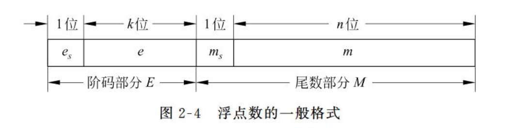
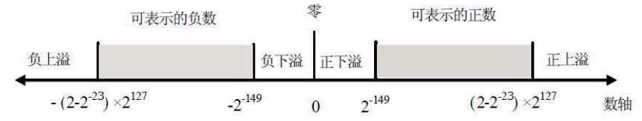
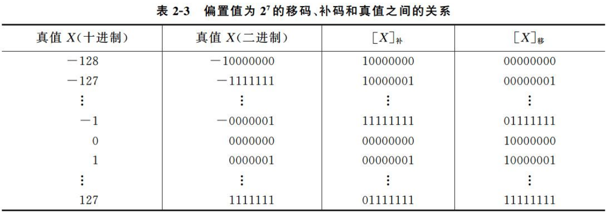
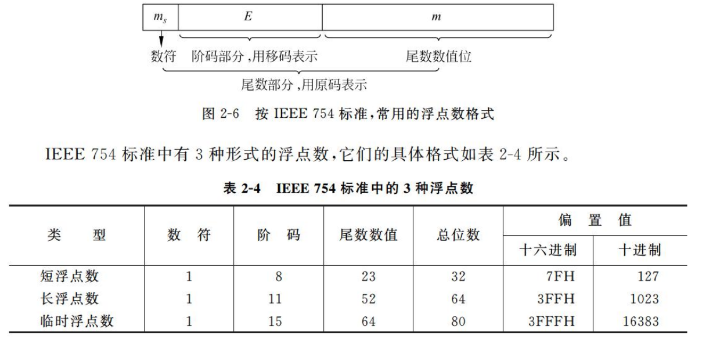

# 第二节 机器数的定点表示与浮点表示

算术运算时需要指明小数点的位置，  
因此根据小数点位置是否固定，有两种对小数的表示方法。

1. 定点表示法
2. 浮点表示法

## 一、定点表示法

操作数数据格式中小数点的位置是固定的。  
计算机中的定点数只采用**纯整数**或者**纯小数**表示。

## 二、浮点表示法

即为小数点会改变位置的表示方法。

可以将小数用如下形式表示：  
$$
N=M\times r^E
$$
其中：

* 基数$r$：是常数，通常$r=2$，也可以为$2^n$。  
* 尾数$M$：一般为**纯小数**$\textrm{?.xxx}$。
* 阶码$E$：反应小数点的实际位置。

故可将浮点数记为$<\textrm{阶码}E,\textrm{尾数}M>$。

**将阶码和尾数均采用补码**来表示，故浮点数一般为以下格式。
  
对于尾数，忘记纯小数的补码表示，可以看[机器的数值表示](../2.1%20数值数据的表示/2.1-Data_Representation-1.md#1-计算公式)。

需要知道：浮点数中精度和表示范围是两者冲突的。  
范围由阶码$E$影响；精度由位数$M$影响。  
*补充：对于基数$r$，其越大，则表示范围越大，而精度越低。*

同时浮点数的正负性也由尾数的正负性决定。

### 1. 浮点数表示范围

表示范围如下图：  
  

可以看到，浮点数会存在一个最大正数和最小正数（负数一样），  
在趋近无穷和**趋近0**的时候都无法表示。（但可以表示0，此时尾数为0）

*以下负数的最大最小均是指绝对值的负数，最大负数趋近负无穷、最小负数趋近0。*

* 最大正数：尾数$M$为最大正数、阶码$E$为最大正数。
* 最小正数：尾数$M$为最小正数、阶码$E$为最大负数。
* 最大负数：尾数$M$为最大负数、阶码$E$为最大正数。
* 最小负数：尾数$M$为最小负数、阶码$E$为最大负数。

### 2. 规格化浮点数

要提高数据运算的**精度**，就要充分利用尾数的有效位数。  
因此规格化限制：**尾数的最高数位必须为1**。【虽然这句话我看不懂orz……  
通过**左移**调整。

规格化浮点数的尾数$M$应在下面的范围内：
$$
\frac{1}{r}\le|M|<1
$$

即对于$r=2$（$M$**用补码表示**）：

* $M$为正数（$\frac{1}{2}\le M<1$）：应为`0.1xxx...`的形式。
* $M$为负数（$-1\le M<-\frac{1}{2}$）：应为`1.0xxx...`的形式。

可以发现**只能通过左移调整**，因为右移正数增加的位是`0`，负数增加的位是`1`。

*注：若$M$用原码表示，则让尾数最高位（注意是符号位的后一位）为`1`即可（`0.1xxx`或`1.1xxx`）。*

> e.g.
>
> * $(0.000011)_2\to(0.1011000)_2\times2^{-3}$，为规格化数
> * $(0.000011)_2\to(0.0101100)_2\times2^{-2}$，非规格化数
> * $(1.000000)_2$，规格化数
> * $(1.100000)_2$，非规格化数（转化为$(1.000000)_2\times2^1$则规格化）

---

对于溢出的处理：

* 出现上溢时，需要中止运算操作、进行溢出处理。
* 出现下溢时，一般不做特别处理、直接将结果置为机器零即可（完全的0）。

虽然只要尾数为$0$就可以代表机器零，  
但为了保证$0$的唯一性，通常规定阶码要为最小值（绝对值最大的负数）。

### 3. 阶码的移码表示法

> 问题 - 为什么要引入移码：
>
> 补码有个最重要的问题就是：不好直接根据编码比较大小。
> 比如`0111`(7)>`1000`(-8)，但直接按编码来看应该是`1000`最大。
>
> 原本补码的正负不是按顺序来的，从上（全0）到下（全1）依次是：  
> 0→最小正数→最大正数→最大负数→最小负数
>
> 由于机器码的循环性，若将上面的顺序平移一下，则可变为：
> 最大负数→最小负数→0→最小正数→最大正数
>
> 此时便可以直接根据编码来判断大小了。

* 移码：在真值$X$上加一个常数（偏置值），使数据的正负符号数字化的一种编码方法。

故公式为：
$$
[X]_\textrm{移}=X+\textrm{偏移值}
$$

对于字长为$n+1$的定点数，偏移值为$2^n$。  
对于补码：只用对符号位求反。

> 例 - 8字长的移码、补码和真值的关系
>
> 

特点：

1. 符号位中：$0$表示负数、$1$表示正数。
2. 全$0$时，所表示真值最小；全$1$时，所表示真值最大。  
   因此可以直接视为无符号数进行大小比较。
3. 移码的$0$也是唯一的，$[\pm0]_\textrm{移}=10000000$
4. 当阶码、尾数全为$0$时，则为机器零，可以简化判0电路。

### 4. 定点、浮点表示法的比较

* 精度：一般情况浮点的精度低于定点。  
  （但其实在靠近$0$时，浮点数的精度反而更高（更密））

### 5. IEEE754标准浮点数

与普通的规格化浮点数的区别：

1. 尾数的**符号位放在最高位**。
2. 尾数的规格化是从$1.\textrm{xxxxxxx}$开始的，但首位的$1$不放入$m$中，为**隐含尾数最高位**。
3. 阶码是移码，但**偏移值是$2^n-1$！**（**可以先符号位取反再减$1$***（区别补码：除符号位取反加1）*）
4. 阶码存在两个特殊情况，为**全$0$**(代表真值$-127$)和**全$1$**(代表真值$128$)，分别代表正负无穷、非正规浮点数、异常值。

> e.g.1 $(100.25)_{10}$转换为浮点数。
>
> $(100.25)_2\to(1100100.01)_2\to(1.10010001)_2\times2^6$
>
> * 数符$m_s$：正数 → $m_s=0$
> * 阶码$E$：$6$ → $110+(2^7-1)\rightarrow10000101$
> * 尾数数值$m$：$10010001 000\cdots$
>
> 故浮点数：`0;10000101;100_1000_1000_0000_0000_0000`
>
> ---
>
> e.g.2 `C1C9000H`转化为十进制数。
>
> `1;10000011;10010010000000000000000`
>
> * 数符$m_S$：$m_S=1$ → 负数
> * 阶码$E$：$10000011$加1符号位取反 → $(100)_2\rightarrow4$
> * 尾数数值$m$：$1001001$
>
> 故二进制：$-(1.1001001)_2\times2^4 = (-11001.001)_2$  
> 十进制：$-25.125$

4种特殊情况（阶码全0或1情况）：

1. $E$和$m$全$0$时：代表机器零$F=0$（其中数符代表正负）  
   e.g. `0;0000_0000;000_..._0000`。
2. $E$全$0$，但$m$不是全$0$时：代表非正规浮点数（用来表达接近$0$的数）  
   此时阶码$E$的真实为$-126$，尾数$m$为实际值（即不加$1$，变为`0.xxxx...`）。  
   故只有真值为$0.xxx\times2^{-126}$的时候采用非正规浮点数。  
   e.g. `0;0000_0000;100_..._0000`，代表$0.5\times2^{-126}$
3. $E$全$1$，$m$全$0$时：代表正负无穷（其中数符代表正负）  
   e.g. `1;1111_1111;000_..._0000`。
4. $E$全$1$，但$m$不是全$0$时：代表异常值`NaN`。  
   一般为数学错误（$0/0,\infty-\infty$）出现。

> 拓展 - 为什么偏移值是127的讨论：
>
> *这个在网上感觉并没有准确回答，只能按照偏移值计算方法的来。*
>
> 首先移码的作用是将负数去掉，全部转化为正数，方便比较大小。  
> 因此$8$位移码，表示范围就是$[0,255]$为256个数。
>
> 而真值是作为**带符号数**看待的，即`0000_0000`代表$+0$、`1111_1111`代表$-127$。  
> 则真值的表示范围为：$[-127,127]$（注意内含$\pm0$）
>
> 同时规定了将`0000_0000`和`1111_1111`作为特殊值使用，  
> 则移码的`0000_0000`为$0$，`1111_1111`为$255$，去掉后范围变为$[1,254]$；  
> 真值的`0000_0000`为$+0$`1111_1111`为$-127$，去掉后范围变为$[-126,127]$（此时只有唯一零$-0$）
>
> 根据$[X]_\textrm{移}=X+\textrm{bias}$计算可得偏移值bias=127。

**⚠提醒**：做题时注意看清用的是**普通浮点数还是IEEE754**。

## 三、十进制数和数串的表示

### 1. 十进制数的编码

不一定需要把十进制整体转成二进制来存储，而可以**每一位**转成一个编码来存储，  
就是利用BCD码。

用4位二进制数，来表示1位十进制数。

### 2. 十进制数串

* 非压缩的十进制数串表示法：一个字节存放一个十进制数或符号的ASCII-7码。*【不懂什么意思orz……*
* 压缩的十进制数串表示法：一个字节存放两位BCD码表示的十进制数。

## 四、非数值数据的表示

### 1. 字符和字符串的表示

1. 字符 - ASCII  
   原本为7位存放128个字符，后来扩充到8位（1字节）。
2. 字符串 - 向量存放法（字符数组）  
   在存储器中占用一片连续的空间，每个字节存放一个字符的ASCII码。

### 2. 汉字的表示

1. 汉字输入编码（输入的模式）  
   * 简拼
   * 全拼
   * 五笔
   * 区位码：一种较早的输入方式，将汉字分成某区某位编排。  
     注意：区是从**第一区开始**！
2. 国标码、汉字内码
   * 国标码(GB2312-80)：两个字节表示，但每个字节最高位是0（不能与ASCII区分）。
   * 汉字机内码：仍为两个字节表示，但每个字节最高位是1。
3. 汉字字模码  
   用于汉字的字形显示输出。每个汉字采用$N\times N$的点表示。  
   e.g. $16\times16$的汉字点阵，用$32$字节表示。
   * 向量编码
   * 点阵码
4. 汉字编码的发展
   * GB2312
   * GB12345
   * GB18030
