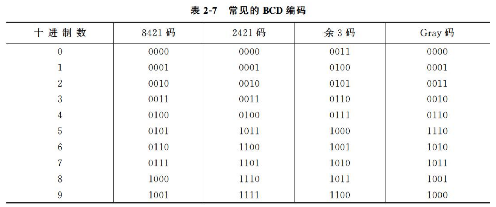
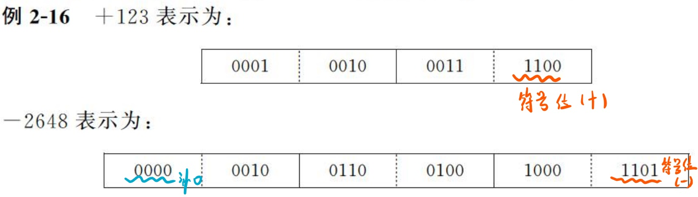

# Ep.3 十进制、非数值和类型转换

## 一、十进制数和数串的表示

### 1. 十进制数的编码

不一定需要把十进制整体转成二进制来存储，  
而可以**每一位**转成一个编码来存储，  

就是利用BCD码。  
用4位二进制数，来表示1位十进制数。

### 2. 十进制数串

* 非压缩的十进制数串表示法：一个字节存放一个十进制数或符号的ASCII-7码。  
  就是一个字节（$8$位），就用低四位纯BCD码，高四位空着。

  符号位有两种方式：
  * 前分割式：符号位单独占一个字符，用ASCII存，放在数值最前面。  
    正数的ASCCI为`2B`，负数为`2D`。
  * 后嵌入式：符号位不再单独占一个字符，将**最后一位数**用ASCII带符号存。  
    正数的$0\sim9$为`30~39`，负数为`70~79`。
* 压缩的十进制数串表示法：一个字节存放两位BCD码表示的十进制数。  
  一个字节存两个，分为低四位和高四位存。

  符号位占半个字节（$4$位），放在最低数位之后。  
  正号为`1100`(`C`)，负号为`1101`(`D`)。

  规定：位数与符号位加起来必须是**偶数位**，否则在高位补零。
  

## 二、非数值数据的表示

### 1. 字符和字符串的表示

1. 字符 - ASCII  
   原本为7位存放128个字符，后来扩充到8位（1字节）。
2. 字符串 - 向量存放法（字符数组）  
   在存储器中占用一片连续的空间，每个字节存放一个字符的ASCII码。

### 2. 汉字的表示

1. 汉字输入编码（输入的模式）  
   * 简拼
   * 全拼
   * 五笔
   * 区位码：一种较早的输入方式，将汉字分成某区某位编排。  
     注意：区是从**第一区开始**！
2. 国标码、汉字内码
   * 国标码(GB2312-80)：两个字节表示，但每个字节最高位是0（不能与ASCII区分）。
   * 汉字机内码：仍为两个字节表示，但每个字节最高位是1。
3. 汉字字模码  
   用于汉字的字形显示输出。每个汉字采用$N\times N$的点表示。  
   e.g. $16\times16$的汉字点阵，用$32$字节表示。
   * 向量编码
   * 点阵码
4. 汉字编码的发展
   * GB2312
   * GB12345
   * GB18030

## 三、类型转换

对于不同类型数据的运算，满足“**类型提升**”的要求，  
即将**较低类型**（小范围、低精度）转换为**较高类型**（大范围、高精度）。  
如：`short`→`int`→`long`→`float`→`double`。

类型提升（升格）的时候，其**值保持不变**。  
如将16位与32位数相加时，必须把16位拓展为32位，称为“**符号扩展**”，用符号位填充附加位。

类型降低（降格）时，其**可能会丢失信息**。
