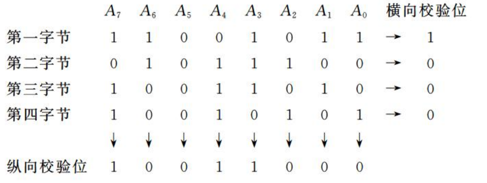
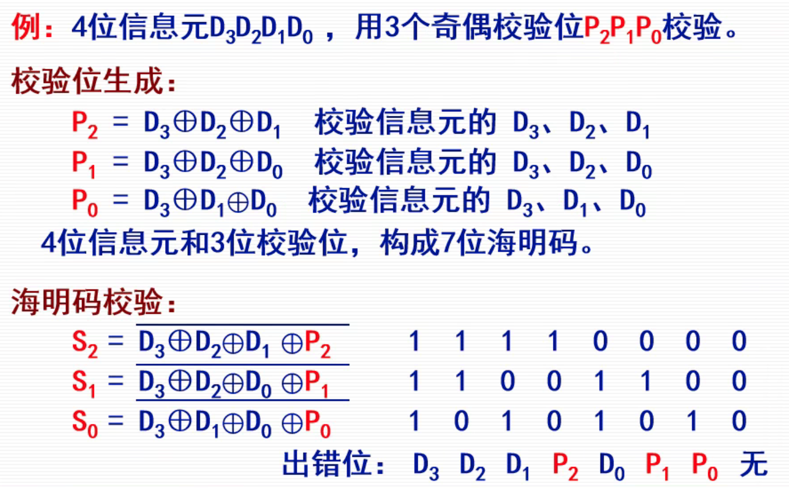

# 第六节 数据校验码

数据校验码是能够**发现错误**或能够**自动修正错误**的数据编码。

防止数据在传输过程中出现错误，有很多种方法，如重复发送两次等。  
其中效率最高的则是：在原始数据添加若干**校验位**，形成**校验码**。

数据校验码的检错和纠错能力**由码距决定**。

> 概念 - 码距：
>
> 对于一种二进制编码方式，每一种编码称为码字，分为合法码字和非码码字。  
>
> 任意两个码字之间最小变化的二进制位数称为校验码的码距。  
> 即从一个合法编码变为另一个合法编码，变动的最小位数。
>
> 如：
>
> * 由$4$位构成的编码，$16$种都是合法码字，  
>   则码距为$1$。
> * 由$4$位构成的编码，只有$8$种是合法码字（如下的奇偶校验码），  
>   则码距为$2$（至少变两位）。

当码距越高，检错纠错能力越强。  

* 码距为$1$时，不存在检错纠错能力。
* 码距为$2$时，只存在检错能力。
* 码距大于$2$，检错能力更强，开始有纠错能力。

## 一、奇偶校验码

### 1. 定义

在若干位有效信息上，增加一个二进制位（校验位），其值为有效信息的奇偶信息，从而组成校验码。  
常用于校验内存数据存取过程中是否出现错误。

1. 奇校验（常用）：整个校验码码（有效信息位和校验位）中`1`的个数为奇数个。
2. 偶校验：`1`的个数为偶数个。

> e.g. 1
>
> * 有效信息：`0000_0000`
> * 奇校验：`1;0000_0000`
> * 偶校验：`0;0000_0000`
>
> e.g. 2
>
> * 有效信息：`0010_1100`
> * 奇校验：`0;0010_1100`
> * 偶校验：`1;0010_1100`

对于奇偶校验码，码距为$1$，  
因此只有检错能力，无纠正能力。

### 2. 编码与解码

1. 编码

   计算“校验位”$P$ - 运用异或取非：
   $$
   P=\overline{D_n\oplus D_{n-1}\oplus\cdots\oplus D_1\oplus D_0}
   $$
   *对于偶校验，则$P$不用取非。*
2. 解码

   可以检验出“奇校验错误”$S$。
   $$
   S=\overline{P\oplus D_n\oplus D_{n-1}\oplus\cdots\oplus D_1\oplus D_0}
   $$
   若$S=1$，则接收到的检验码有误，有效信息不能使用。

### *3. 交叉奇偶校验

*为拓展内容，课堂未将但书上有。*

对于由多个字节传输时（数据块传输），  
不仅可以每一个字节形成一个奇偶校验码，进行**横向校验**，  
也可以全部字节的同一位形成奇偶校验码，进行**纵向校验**。

> e.g. $4$个字节组成的数据块：
>
> 

此时可以发现两位（偶数个）同时出错的情况，  
如第二字节的$A_3,A_5$出错，虽然横向检验不会错，但纵向会错。

但也只是增强检错能力，仍然没有纠错能力。

## 二、海明校验码

是一种分组的**多重奇偶校验**码。

原理为：  
在有效信息位中加入多个校验码形成海明码，使得码距被均匀拉大。  
同时把海明码每一个二进制位分配到几个奇偶校验组中。

当某一位出错时，就会引起有关的几个校验位值发生变化。  
因此不断可以发现错误，也**可以纠正错误**。

> e.g.
>
> 
>
> 对于纠错，则看出错与未出错的校验码有哪些共同的部分，以此来确定哪一位出错。
