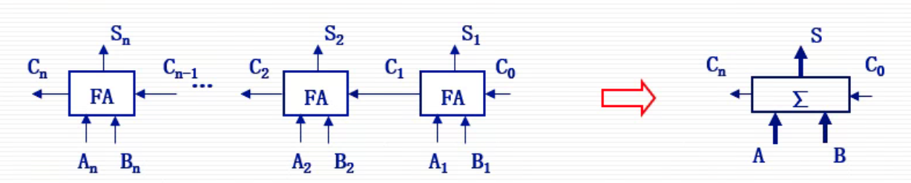
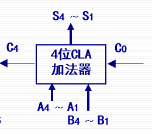
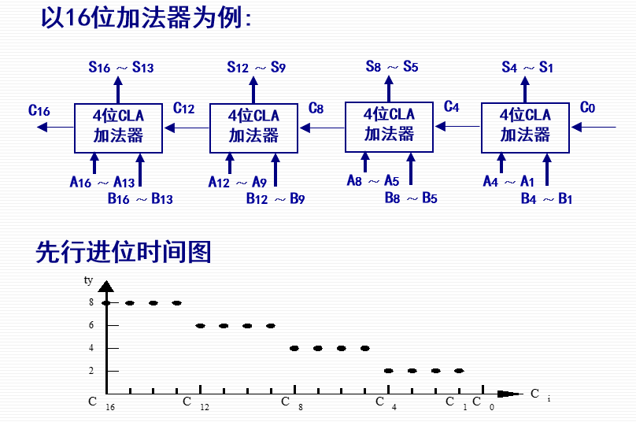
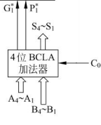
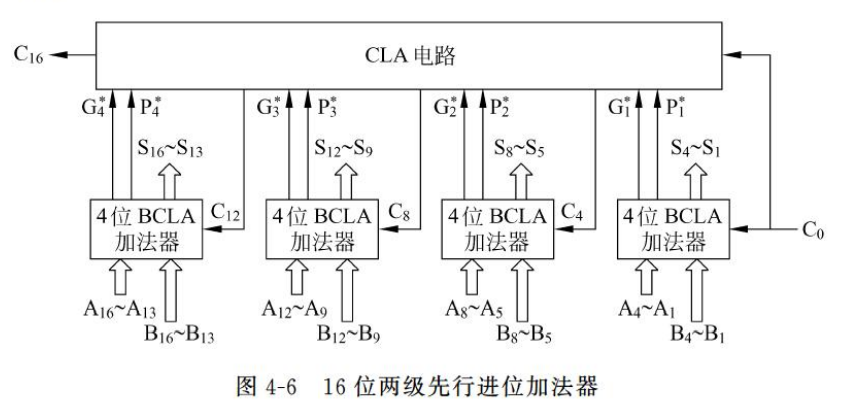

# 第一节 基本算术运算的实现

基本的算术运算（加减乘除）都可以归结转化为**加法运算**。  
因此先讨论加法的部件与实现。

## 一、加法器

由执行一位加法的“全加器”，搭配其他逻辑电路，实现多位数据的加法，  
分为串行加法器和并行加法器。

### 1. 全加器

全加器(FA)是针对一位的加法运算，同时考虑了进位信号。

* 输入：
  * $A_i$ - 运算位A
  * $B_i$ - 运算位B
  * $C_{i-1}$ - 低位传来的进位信号
* 输出：
  * $S_i$ - 本位运算结果
  * $C_i$ - 向高位的进位信号
* 表达式：
  * $S_i = A_i\oplus B_i\oplus C_{i-1}$
  * $C_i = A_iB_i+(A_i\oplus B_i)C_{i-1}$

### 2. 串行加法器与并行加法器

* 串行加法器：器件少，构成简单，只用一个全加器；但运算速度慢，需要逐位进行运算。  
  处理方式是一位位送入全加器，运算完一位再从寄存器取出下一位运算。
* 并行加法器：器件多，构成复杂，需要若干全加器；但运算速度快，各位同时进行运算。  
  处理方式是同时对所有位同时进行全加运算，  
  但此时进位信号也是依次从低位传向高位的，因此**仍存在延时**，  
  不过不再主要来自于加法器本身的运算延迟，而来自于**进位信号的传递延迟**。

> 注意 - 串行与并行的真正含义
>
> 此处的串并行并不是指$n$个加法器是串联还是并联，  
> 而是指针对每一位，是依次运算还是一起运算。
>
> 因此即便是并行加法器，也存在将$n$个加法器串联起来的情况。

## 二、并行加法器中进位的产生与传递

一般都运用并行加法器，  
但不同并行加法器对于进位的处理方式也不用。

存在以下几种处理方式：

1. 串行进位（行波进位）
2. 并行进位（先行进位）
3. 分组并行进位

### 1. 串行进位（行波进位）

虽然操作数的各位是同时提供的，  
但**高位**运算**需要**使用**低位**运算后产生的**进位**。

### 2. 并行进位（先行进位）

也称先行进位(Carry Look Ahead, CLA)。

串行进位中，由于进位也是要一位位传递，减慢了速度，  
因此提高速度的基本思路是：  
让各位的**进位输入**与低位的进位产生无关，**仅与参加的两个操作数有关**。

> 观察每一位的运算公式：
>
> * $S_{i+1} = A_{i+1}\oplus B_{i+1}\oplus C_{i}$
> * $C_i = A_iB_i+(A_i\oplus B_i)C_{i-1}$
>
> 因此最关键的是确定$C_i$。
>
> 记：本地进位$G_i=A_iB_i$，传递进位$P_i=A_i\oplus B_i$，  
> 转化为$C_i=G_i+P_iC_{i-1}$
>
> * $C_1 = G_1+P_1C_0$
> * $C_2 = G_2+P_2C_1$
> * $C_3 = G_3+P_3C_2$
> * $C_4 = G_4+P_4C_3$
>
> 依次向上带入可得：
>
> * $C_1 = G_1+P_1C_0$
> * $C_2 = G_2+P_2G_1+P_2P_1C_0$
> * $C_3 = G_3+P_3G_2+P_3P_2G_1+P_3P_2P_1C_0$
> * $C_4 = G_4+P_4G_3+P_4P_3G_2+P_4P_3P_2G_1+P_4P_3P_2P_1C_0$
> * $C_n = G_n+P_nG_{n-1}+P_nP_{n-1}G_{n-2}+\cdots+\Pi_{i=2}^nP_iG_1+\Pi_{i=1}^nC_0$

因此该方法将每位的进位信号$C_n$，转化为仅由$G_x$、$P_x$和$C_0$决定，  
而$G_x$、$P_x$在事先也可以根据每位本身输入决定（$G_i=A_iB_i$、$P_i=A_i\oplus B_i$），  
故成功将进位信号仅由各位输入决定，可以**同时产生**。

当存在两个$n$位数据输入$A_i,B_i$，以及最低进位$C_0$后，  
便可以先算出所有$C_i$，再算出所有$S_i$。  
可以集成为如下组件：  

此时延迟时间最长为定值，**不与字长有关**。  
但**缺点**是：随着位数增加，$C_i$的表达式会越来越长、**实现越来越复杂**。  
故仅采用并行进位是不可行的。

### 3. 分组并行进位

通常都采用分组并行进位的方式。

由于单纯的并行进位方式，随着字长增多，表达式和电路越来越复杂，  
故可以将字长分组，每一组内字节数少，故结构变得简单。、

该方法将$n$位字长分为若干小组，组内采用并行进位方式，  
在组间串并行进位方式均可。

#### (1) 单级先行进位（组内并行、组间串行）

#### (2) 多级先行进位（组内并行、组间并行）

单级先行进位在位数很大时仍会存在延迟。  
因此在组间也采用并行进位，可以降低延迟。

以下研究**两级**先行进位。

> 跟并行进位一样的分析：
>
> 第一组的进位：$C_4 = G_4+P_4G_3+P_4P_3G_2+P_4P_3P_2G_1+P_4P_3P_2P_1C_0$  
> 若用$G_1^*$代表$G_4+P_4G_3+P_4P_3G_2+P_4P_3P_2G_1$，称为“**组进位产生函数**”；  
> 用$P_1^*$代表$P_4P_3P_2P_1$，称为“**组进位传递函数**”。
>
> 则：
>
> * $C_4 = G_1^*+P_1^*C_0$
> * $C_8 = G_2^*+P_2^*G_1^*+P_2^*P_1^*C_0$
> * $C_{12} = G_3^*+P_3^*G_2^*+P_3^*P_2^*G_1^*+P_3^*P_2^*P_1^*C_0$
> * $C_{16} = G_4^*+P_4^*G_3^*+P_4^*P_3^*G_2^*+P_4^*P_3^*P_2^*G_1^*+P_4^*P_3^*P_2^*P_1^*C_0$

其中$P_x^*$、$G_x^*$也是可以根据每组内本身数据输入$A_i$、$B_i$决定，  
因此需要改动原先的CLA组件，让其额外计算出$P_i^*$、$G_i^*$，并不用再计算最终进位信号$C_i$，  
改动后的电路为“成组先行进位电路”(Block Carry Look Ahead, BCLA)，元件如下：  
  
*注：BCLA内部还会产生内部需要的$C_1$、$C_2$、$C_3$（针对第一小组而言）*

此时需要额外一个CLA元件，根据各个BCLA传来的$P_i^*$、$G_i^*$以及$C_0$，同步生成各BCLA需要的$C_i(i\ne0)$，  
故最终**16位**的**两级**先行进位加法器如图：  
  

此时进位的步骤如下：

1. 先经过2ty，产生第一小组的$C_1$、$C_2$、$C_3$，以及所有组的$G_i^*$和$P_i^*$。
2. 再经过2ty，CLA由传入的所有$G_i^*$和$P_i^*$以及$C_0$，产生$C_4$、$C_8$、$C_{12}$、$C_{16}$。
3. 最后经过2ty，各小组产生本组内的$C_5\sim C_7$、$C_9\sim C_{11}$、$C_{13}\sim C_{15}$。

因此进位的耗时为6ty，**是单纯的CLA的$3$倍**。

> 拓展 - 64位加法器
>
> 对于16位，采用的是**两级**先行进位加法器，  
> 若要实现64位运算，则可采用**三级**先行进位加法器。  
>
> 即4位一组用BLCA后，再4个一组用BCLA，最后再同一到CLA中。  
> （此只为大致思路，具体实现需要自我查询）
