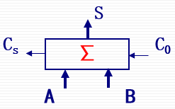
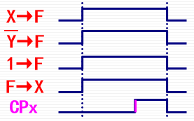

# 第二节 定点加减运算

由于加法器本身处理的是无符号数，  
因此需要对其他形式编码（带符号数）进行特别处理（符号位）。  
包括：原码、反码、补码。

同时减法运算也可以转换为加法运算（三种编码方式转换方法不同），  
因此计算机中只设置加法器。

## 一、原码加减运算

运算规则：

1. 符号位单独处理，用尾数参加运算。
2. 原码同号（符号位均为`0`或`1`）相加或异号（符号位一个为`0`一个为`1`）相减时，  
   尾数做加法运算，得和为原码尾数（需要判别溢出），  
   最后结果取被加（减）数（即第一个数）的数符。
3. 原码异号相加或同号相减时，  
   尾数做减法运算（不判溢出），若正则直接为结果尾数、若负则需变补才为结果尾数。  
   结果的原码按是否能够减决定结果数符。（手动判断减数被减数大小决定）

或者书上的方法：
  

减法转换：
$$
|X|-|Y| = |X| + [|Y|]_\textrm{变补}
$$

*注：变补均是各位取反加$1$。*

可以看见十分复杂，故一般不采用原码进行加减运算。

## 二、补码加减运算

运算的时候**符号位也可以参加运算**，**当成无符号数**，  
故运算简单，一般采用该方法。

### 1. 运算方法

存在两个重要公式：

1. 加法
   $$
   [X+Y]_\textrm{补}=[X]_\textrm{补}+[Y]_\textrm{补} \pmod M
   $$
2. 减法
   $$
   \begin{aligned}
   [X-Y]_\textrm{补} & =[X]_\textrm{补}+[-Y]_\textrm{补} \pmod M \\ & = [X]_\textrm{补}   +\overline{[Y]_\textrm{补}}(\textrm{每位求反})+\textrm{末位}1 \pmod M
   \end{aligned}
   $$

因此可以用一个加法器如下图，  
  

加减运算统一为：
$$
S=A+B+C_0
$$

* 加法：将$A,B$原样输入，$C_0$赋$0$。
* 减法：将$A$原样输入，$B$**取反输入**，**$C_0$赋$1$**。

所得**结果也是补码**。

### 2. 符号扩展

在部分算术运算中，可能所给两数位数不同，  
因此需要对位数更少的数进行“[**符号扩展**](../../Ep.2%20数据的机器层次表示/2.3%20十进制、非数值和类型转换/2.3-Data_Representation-3_4_5.md#三类型转换)”，变成与位数更多的数位数相同的数。

* 对于正数：新的符号位仍为`0`，其他位填充`0`。
* 对于负数：新的符号位仍未`1`，其他位**填充`1`**。

> e.g.
>
> `1;010_0101` → `1;111_1111_1010_0101`

### 3. 运算溢出判断

将加减法**统一转换为加法**，则会有以下三种运算：

1. 两个正数相加
2. 一个正数加一个负数
3. 两个负数相加

对于一个**一正一负相加**（此处加减都转换为加），实际上相当于两数相减，**肯定不会溢出**。  
但如果两个正数相加，和为负数；或者两个负数相加，和为正数，  
则发生了溢出情况。

---

判断方法如下：

其中$S$代表运算结果，下标$s$代表符号位（双符号位中$s1$代表第一个符号位、$s2$为第二个）。  
若$V_f$为真，则代表溢出。

1. 根据运算前后数的**符号位**判断
   * 两个正数（符号位为`0`）相加，结果为负数（符号位为`1`）
   * 两个负数（符号位为`1`）相加，结果为正数（符号位为`0`）

   判断公式表达为：
   $$
   V_f=\overline{A_s}\cdot\overline{B_s}\cdot S_s+A_s\cdot B_s\cdot\overline{S_s}
   $$

   第一个式子（正数相加、结果负数）为正溢出，  
   第二个式子（负数相加、结果正数）为负溢出。
2. 根据进位位判断  
   若最高位数值产生进位，而符号位不产生进位，则发生溢出，反之亦然。

   记：$C_s$为符号位产生的进位，$C_1$为最高位数值位产生的进位，  
   则判断公式为：
   $$
   V_f=\overline{C_s}\cdot C_1+C_s\cdot\overline{C_1}=C_s\oplus C_1
   $$

   第一个式子（符号位不进、最高位进位）为正溢出，  
   第二个式子（符号位进位、最高位不进）为负溢出。
3. 采用双符号位（[变形补码](../../Ep.2%20数据的机器层次表示/2.1%20数值数据的表示/2.1-Data_Representation-1.md#2-变形补码)）  
   *变形补码则直接将符号位复制成两位。*  
   变形补码两位不相同，代表溢出。

   判断公式为：
   $$
   V_f=\overline{S_{s1}}\cdot S_{s2}+S_{s1}\cdot\overline{S_{s2}}=S_{s1}\oplus S_{s2}
   $$

   对于$S_{s1} S_{s2}$：  
   `01`时，为正溢出（双符号位`00+00 → 01`），  
   `10`时，为负溢出（双符号位`11+11 → 10`）。

## 三、补码定点加减运算的实现

### 1. 逻辑电路图和控制信号

实现两个补码加法的逻辑电路如下（只画出某一位）：

如图存在四个控制信号和一个时钟信号：

* $X\to F$ - 把寄存器X的$X$送进加法器F
* $Y(\overline{Y})\to F$ - 把寄存器Y的$Y(\overline{Y})$送进加法器F
* $1 \to F$ - 把末位1送进加法器F（做减法运算时所用）
* $F\to X$ - 把加法器F运算结果$S$送进寄存器X（但**并没有存储**）
* $CP$ - 当$CP$为上升沿时，寄存器X才会将送进的信号寄存下来  
  （相当于$F\to X$只是摆姿势，$CP$为上升沿时相机才按快门）。

控制信号的时机：  
对于$X\to F$、$Y \to F$、$F \to X$三者（或者加上$1\to F$四者），应该同时发生，  
再延迟一段时间后（等待运算完成），此时$CP$再为上升沿，寄存结果。

波形如图：  
 

> 拓展 - PSW：
>
> 上图中的PSW(Program Status Word)为程序状态字（程序状态寄存器），用来记录运算结果的信息。  
> 其四个字母分别代表运算结果的四种状态。
>
> * S(SF) - 结果正负。
> * Z(ZF) - 结果是否为0。
> * O(OF) - 结果有无溢出。
> * C(CY) - 结果有无进位或借位。

### 2. 概念 - 微操作

计算机硬件所实现的所有的功能，都是通过把它分解成一步步的基本操作来实现的，  
这些**基本操作**称为“**微操作**”，每个微操作都是**寄存器到寄存器的传送**。

微操作**不可再分**，因为中间的部件没有记忆功能，会在传输过程中丢失。

对于硬件电路的微操作，可以用“寄存器传送语言”来描述。  
如：

* `R0←R1` - 寄存器R1的数据，送给寄存器R0
* `AR←DB←PC` - 寄存器PC的数据，经过数据总线DB，送给寄存器AR
* `X←X+Y` - 寄存器X和寄存器Y，相加后的结果，送给寄存器X
