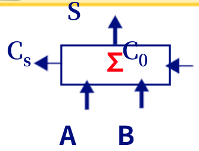
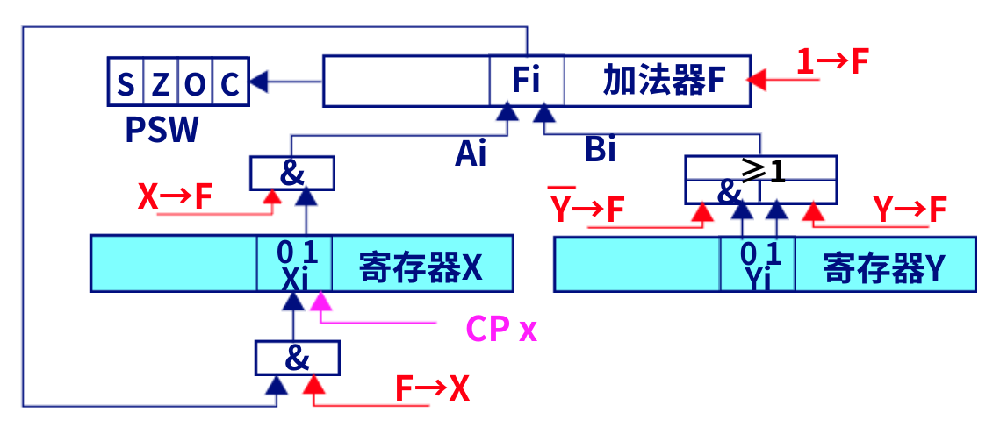
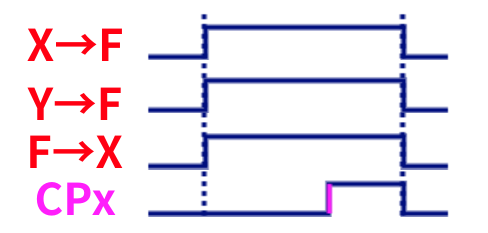

# 第二节 定点加减运算

由于加法器处理的是无符号数，  
因此需要对其他形式编码进行处理。
包括：原码、反码、补码。

## 一、原码加减运算

运算规则：

1. 符号位单独处理，用尾数参加运算。
2. 原码同号相加或异号相减时，尾数做加法运算，得和为原码尾数（需要判别溢出），最后结果取原来的数符。
3. 原码异号相加或同号相减时，尾数做减法运算（不判溢出）

## 二、补码加减运算

运算的时候**符号位也可以参加运算**，当成无符号数，  
故运算简单。

### 1. 运算方法

存在两个重要公式：

$$
[X+Y]_\textrm{补}=[X]_\textrm{补}+[Y]_\textrm{补} \pmod M
$$

$$
\begin{aligned}
[X-Y]_\textrm{补} & =[X]_\textrm{补}+[-Y]_\textrm{补} \pmod M \\ & = [X]_\textrm{补}+\overline{[Y]_\textrm{补}}(\textrm{每位求反})+\textrm{末位}1 \pmod M
\end{aligned}
$$

因此可以用一个加法器如下图，  
  
运算为$S=A+B+C_0$。

加法则将$A,B$原样输入，$C_0$赋$0$；  
减法则将$A$原样输入，$B$**取反输入**，**$C_0$赋$1$**。

### 2. 运算溢出判断

1. 根据运算前后数的**符号位**判断
   * 两个正数（符号位为`0`）相加，结果为负数（符号位为`1`）
   * 两个负数（符号位为`1`）相加，结果为正数（符号位为`0`）

   判断公式表达为：
   $$
   V_f=A_s\cdot B_s\cdot\overline{S_s}+\overline{A_s}\cdot\overline{B_s}\cdot S_s
   $$
   $S$代表运算结果，下标$s$代表符号位。
2. 根据进位位判断  
   记：$C_s$为符号位产生的进位，$C_1$为最高位数值位产生的进位，  
   则判断公式为：
   $$
   V_f=\overline{C_s}\cdot C_1+C_s\cdot\overline{C_1}=C_s\oplus C_1
   $$
3. 采用双符号位（[变形补码](../../Ep.2%20数据的机器层次表示/2.1%20数值数据的表示/2.1-Data_Representation-1.md#2-变形补码)）  
   *变形补码则为将符号位复制成两位。*  
   变形补码两位不相同，代表溢出。

   判断公式为：
   $$
   V_f=\overline{S_{s1}}\cdot S_{s2}+S_{s1}\cdot\overline{S_{s2}}=S_{s1}\oplus S_{s2}
   $$

   对于$S_{s1} S_{s2}$：  
   `01`时，为正溢出。  
   `10`时，为负溢出。

## 三、补码定点加减运算的实现

如图存在四个控制信号：

* $X\to F$ - 把寄存器X的$X$送进加法器F
* $Y(\overline{Y})\to F$ - 把寄存器Y的$Y(\overline{Y})$送进加法器F
* $1 \to F$ - 把末位1送进加法器F（做减法运算时所用）
* $F\to X$ - 把加法器F运算结果$S$送进寄存器X（但**并没有存储**）
* $CP$ - 当$CP$为上升沿时，寄存器X才会将送进的信号寄存下来（相当于$F\to X$只是准备，$CP$为上升沿时相机才按快门）。

控制信号的时机：  
对于$X\to F$、$Y \to F$、$F \to X$三者，应该同时发生，  
再延迟一段时间后（等待运算完成），此时$CP$再为上升沿寄存结果。

波形如图：  

> 上图中的PSW为对运算结果的信息记录：
>
> * S - 
> * Z - 是否全0

---

计算机硬件所实现的所有的功能，都是通过把它分解成一步步的基本操作来实现的，  
这些**基本操作**称为“**微操作**”，每个微操作都是**寄存器到寄存器的传送**。

微操作**不可再分**，因为中间的部件没有记忆功能，会在传输过程中丢失。

对于硬件电路的微操作，可以用“寄存器传送语言”来描述。  
如：

* R0←R1 - 寄存器R1的数据，送给寄存器R0
* AR←DB←PC - 寄存器PC的数据，经过数据总线DB，送给寄存器AR
* X←X+Y - 寄存器X和寄存器Y，相加后的结果，送给寄存器X
