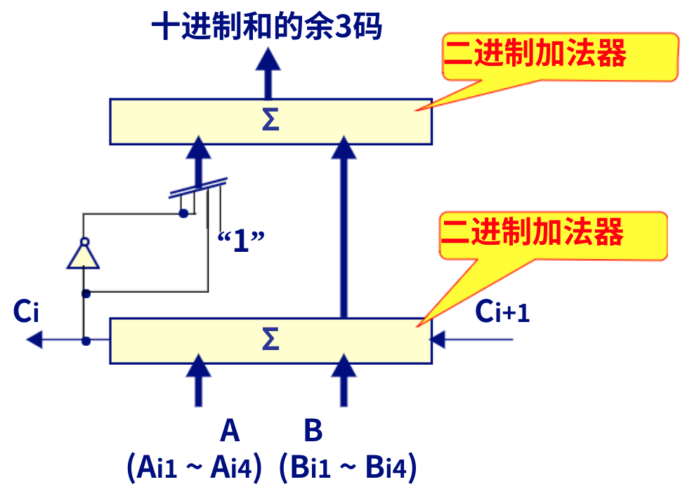

# 第三节 十进制整数的加法运算

一些计算机设有十进制数据表示，可以直接对十进制数进行运算。

实现方法：

1. 十进制运算器（本节不讲）
2. 二进制运算部件上增加少量设备与通路（下面两种加法器的方法）
3. 二进制运算指令+十进制调整指令（微机上常用）

一般十进制数都是BCD码表示的，也可以用余3码表示。

## 一、8421BCD码十进制加法器

8421BCD就是**十进制数的二进制表示**方法，可以直接运算。  
但十进制的进位是$10$，而$4$位二进制的进位是$16$，  
因此必须要对按二进制码运算后的**结果进行修正**，才能使进位正确。

例如下：  

包括“和校正”和"进位校正"两种校正。

* 相加结果$\le9$时，不需要校正。
* **相加结果$>9$或有进位**（此时4位结果$<9$），**需要$+6$校正**，并**产生进位**。

判断方式：
$$
V_f=C_{i4}+S'_{i4}S'_{i3}+S'_{i4}S'_{i2}
$$
$C_{i4}$表示进位信号，后两项则是数值$>9$的表达。

最后形成的8421BCD码十进制加法器示意图：  
 

## 二、余3码十进制加法器

余3码是8421BCD截去头尾而来的，因此也可以直接相加。  
修正方式如下例：

* **无进位**：结果应**减$3$修正**。
* **有进位**：结果应**加$3$修正**。

对于$+3$或$-3$，可以按以下处理：  

最后形成的余3码加法器示意图：  

## 三、十进制调整指令

计算机中实现十进制运算，  
是通过运算时采用二进制加法，最后再加上调整指令（如`DAA`）。
