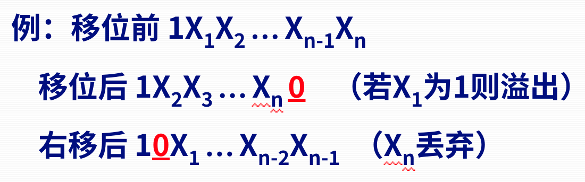
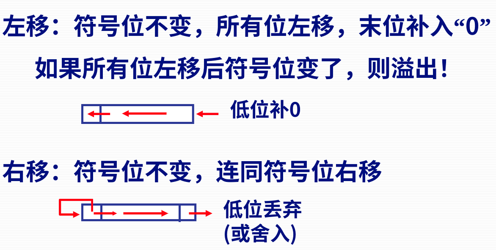
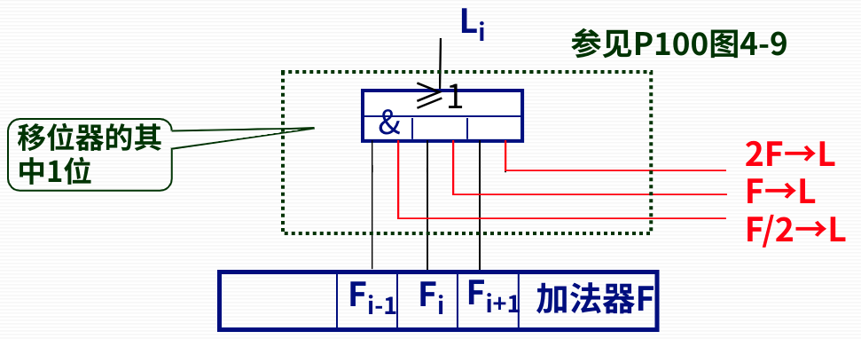
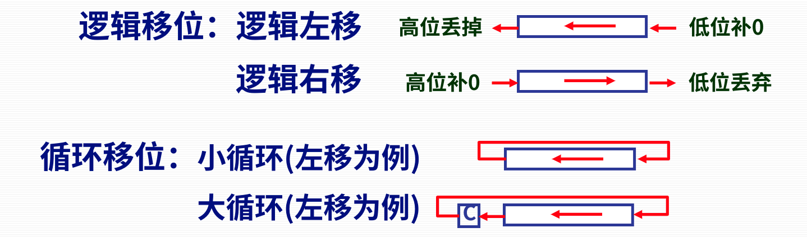

# 第四节 带符号数的移位和舍入操作

计算机中实现乘除法，是通过加减法以及移位这两种操作来实现的。  
因此这里需要先提前讲移位操作如何进行。

## 一、带符号数的移位操作

### 1. 移位规则

左移可能产生溢出。

1. 原码移位规则  
   **符号位均不变，空出位一律补`0`。**  
   左移时，若原来的最高位为`1`，则溢出。

   
2. 补码移位规则  
   * 左移：**所有位**左移，末位补`0`。  
     若符号位变了，则溢出。
   * 右移：符号位不变，**连同符号位**右移。

   

### 2. 移位实现

1. 用移位寄存器实现
2. 用移位器实现  
   是在普通寄存器的**输出端直接加**上个**移位器**，而不直接是一个移位寄存器。

   移位器由多路选择器（与或三门）构成，可直接实现直传、左移、右移。  
     
   上图为某一位的移位器，  
   当$F\to L$激活时，则$L_i=F_i$；  
   当$F/2\to L$（右移信号）激活时，则$L_i=F_{i-1}$。

⚠注意：**移位器不具备寄存功能**，因此移位后需要及时保存到相应的寄存器。

### 3. 特殊移位操作

计算机移位操作除了算术移位外，还支持“逻辑移位”和“循环移位”。

* 逻辑移位：所有位（包括符号位）直接移位。
* 循环移位：舍弃的位移动到新增的位。

## 二、带符号数的舍入操作

若进行**右移**，则**末位数据可能丢失**，  
因此需要确定相应的舍入方法，来决定如何丢失。

常见舍入方法：

1. 恒舍法（切断）：  
   末尾多余部分的位**一律舍去**。
2. 恒置1法（冯·诺依曼舍入法）：  
   **末尾一律舍去**后，再把**最低位置`1`**。
3. 下舍上入法：  
   相当于四舍五入。  
   判断即将舍入的若干位中的最高位，`0`则全舍，`1`则舍后加1。  
   精度最高、但运算复杂。
4. *查表舍入法（ROM舍入法）：  
   类似于下舍上入，但将所有情况以及对应舍入结果都存在了表中，直接查表即可。
   精度较高、运算仍有点复杂。
