# 第五节 定点乘法运算

实现途径：

1. 纯软件实现（计算机只提供加、减、移位等基础指令）
2. 在加减运算器基础上增加少量电路实现（仍是由加法、位移实现乘法）
3. 设置专用的高速阵列乘除运算器

一般都为第二种。

## 一、原码一位乘法

一位乘法的一位指的是：乘数一位位与被乘数相乘累加，就像模拟乘法运算一样。

* 符号位单独处理
  $$
  P_s=X_s\oplus Y_s
  $$
* “绝对值相乘的积”的尾数  
  $$
  |P|=|X|\times|Y|
  $$
  绝对值则是**直接将符号位直接置0。**

对于尾数的乘法，则是模拟手算乘法实现的。  
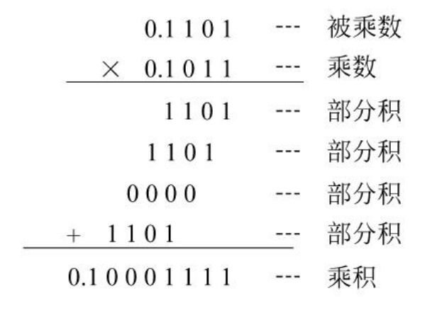

在计算机中，将$n$位乘法，转换为$n$次“累加和移位”。  
每次只求一位乘数与被乘数相乘的部分积（需要相应位移），然后与之前运算的累加。

但为了实现简单，将原本的部分积左移，改为：**累加的部分积右移**。  
*如果让每个部分积左移相加的话，就要移$\sum i$次；而让累加的部分积右移，只用移动$n$次。*

因此需要$3$个寄存器，被乘数放$B$、乘数放$C$，  
还有一个累加器$A$记录一位位运算累加的值。

方法为：  
若$C_n$（乘数末尾）为$1$，则$A$加上$B$，完成这一位的乘法；否则进行下一位。  
每乘一次，累加器$A$右移一次，  
$C$也右移（新的一位进行乘法）。

> 讨论 - A如何右移：
>
> 如果直接将$A$右移，则末尾运算的结果会被舍去，  
> 因此必须每右移一次，就要把$A$末尾给存储下来。
>
> 发现$C$也在随着每一位运算而右移，因此高位就会空出来，  
> 因此直接**将$A$的低位右移到$C$的高位**，  
> 再设置个计数器$CR$，运算完成后将$C$左移回$A$即可。

电路为：  
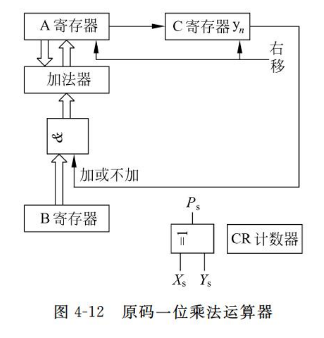  

计算过程举例：  
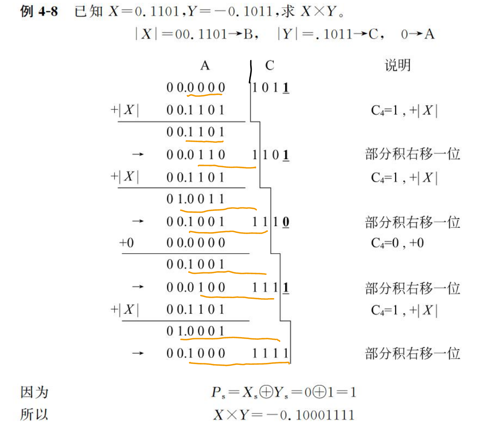  
黄色下划线部分代表每次累加的结果。  
*注意考试可能会考乘法运算模拟。*

## 二、补码一位乘法

设：  
被乘数$[X]_\textrm{补}=X_s.X_1X_2\cdots X_n$  
乘数$[Y]_\textrm{补}=Y_s.Y_1Y_2\cdots Y_n$

则：
$$
[X\times Y]_\textrm{补} = [X]_\textrm{补}\times(0.Y_1Y_2\cdots Y_n) + [-X]_\textrm{补}\times Y_s
$$

总结为：  
为$[X]_\textrm{补}$乘$|[Y]_\textrm{补}|$，  
如果$Y_s$为1（$Y$为负数），还要再加个$[-X_\textrm{补}]$

对于最后$[-X]_\textrm{补}\times Y_s$，有两种不同处理方法。

### 1. 校正法

就老实地按照原式进行判断：

1. 当乘数$Y>0(Y_s=0)$时：  
   则直接按照原码乘法一样的规则进行运算。  
   但移位的时候**按照[补码规则移位](../4.4%20带符号数的移位和舍入操作/4.4-Machine_Arithmetic-3.md)**！
2. 当乘数$Y<0(Y_s=1)$时：  
   先不管$Y$符号位，用$|Y|$按原码运算。  
   最后再加上$[-X]_\textrm{补}$进行校正。

但需要额外进行逻辑判断，电路不统一较复杂。

### 2. 比较法 - Booth乘法

Booth将校正法改进为如下：

1. 乘数最低位后面增加一位附加位$Y_{n+1}$，初值为$0$。
2. $Y_nY_{n+1}$决定每次累加器如何操作被乘数。
   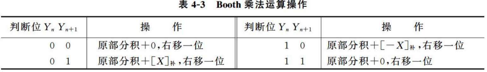
   **`01`加、`10`减。**
3. 移位按补码规则右移。
4. 做$n+1$次累加，$n$次移位($n+1$次不移位）。

方法为：  
寄存器仍为$A,B,C$，但寄存器、加法器、与或门均为$n+2$位（注：$C_0\sim C_n$有$n+1$位）。  
由乘数$C$的最后两位$C_nC_{n+1}$的4种情况，决定是加/减被乘数还是加$0$，  
然后右移$A$到$C$，计数器$CR$加$1$。  
直到$C$**只剩最后两位**，**操作一次，不移位**。

电路为：  
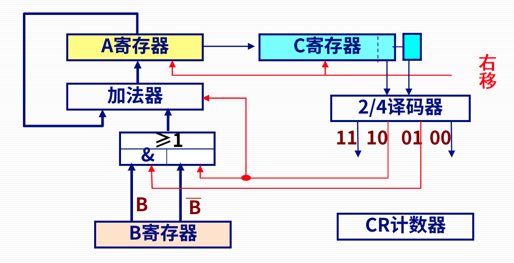  
注：$[X-Y]_\textrm{补} = [X]_\textrm{补}   +\overline{[Y]_\textrm{补}}(\textrm{每位求反})+\textrm{末位}1$。

计算过程举例：  
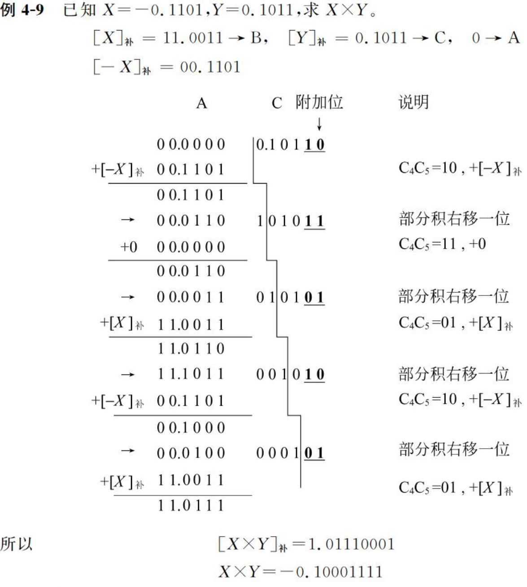  
可见：做了五次加法，四次位移。

## 三、补码两位乘法

是对Booth一位乘法的改进。

上面一位乘法都是一位位进行相乘的，  
可以改进为每两位进行操作，使速度提高一倍。

类似于Booth乘法，不过是取$C$最后的**三位**来判断，  
同时被乘数$X$和部分积$A$用**三位符号位**。

判断情况如下表：  
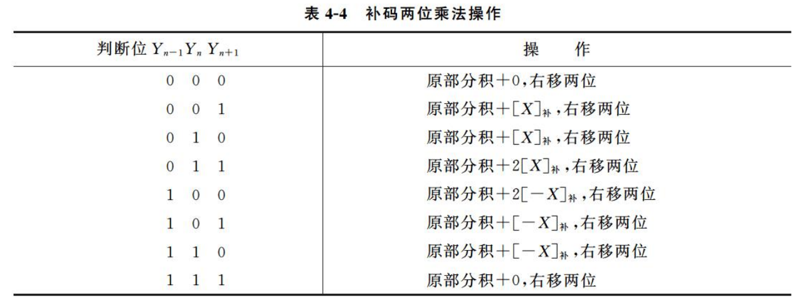

对于乘数$Y$：  
先**补一位附加位**，看$Y_{n-1}Y_nY_{n+1}$三位。

* 若数值位$n$为奇数：**符号位取$1$位**，**移位和加次数一样**！**最后一次位移只位移一位***（移到还剩三位的时候，仍操作一次，并移一位结束）*。
* 若数值位$n$为偶数：**符号位取$2$位**，移位$\frac{n}{2}$次，多加一次*（移到还剩三位的时候，仍操作一次，直接结束）*。

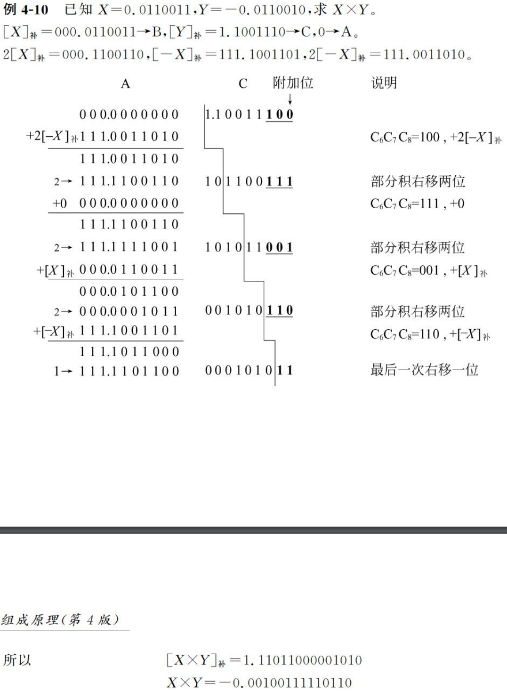  

## 四、乘法阵列器

1. 不带符号的乘法阵列器  
   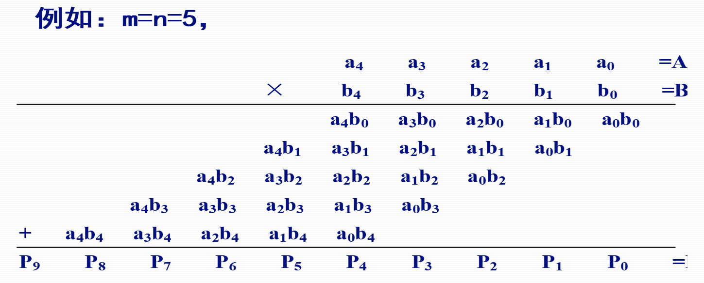 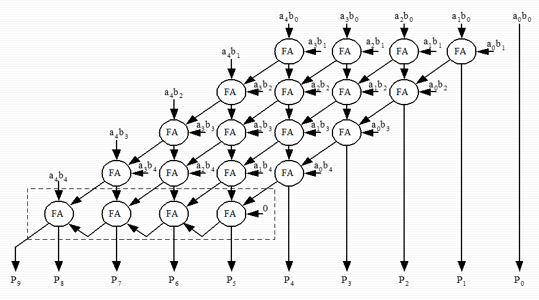  
2. *带符号的乘法阵列器  
   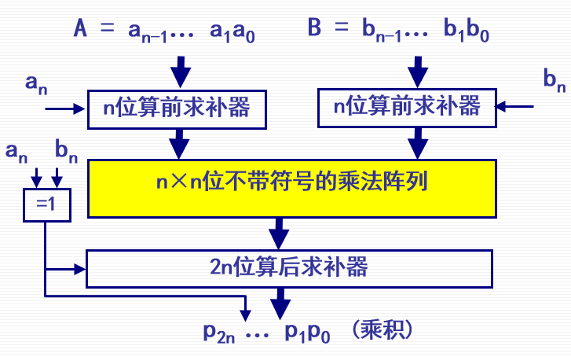  
