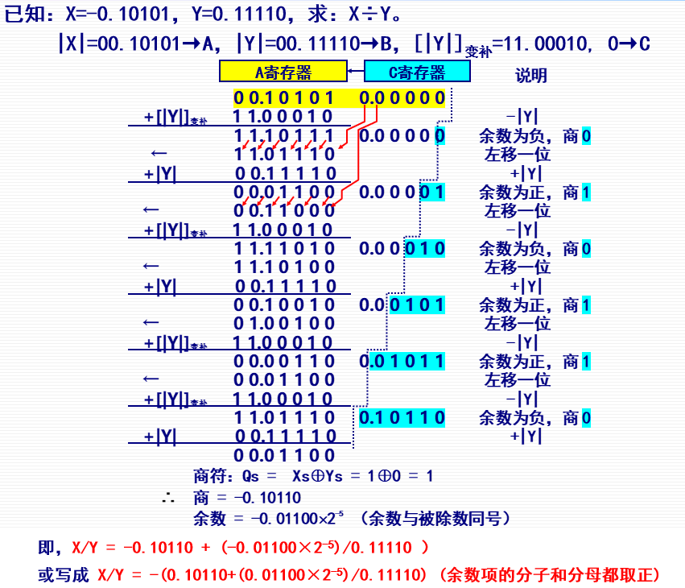
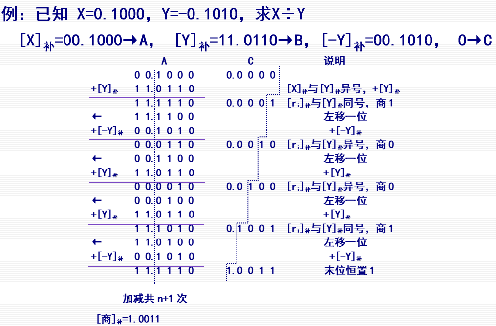
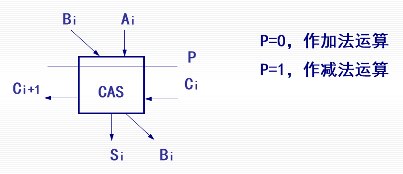
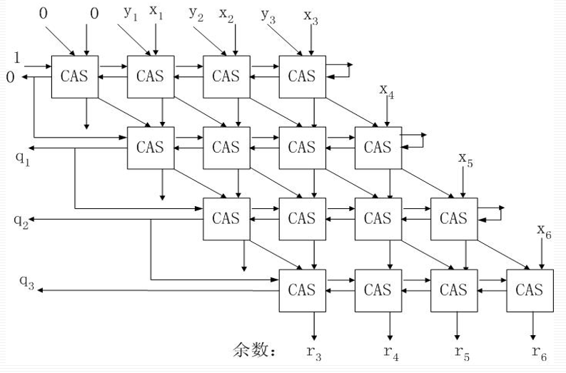

# 第六节 定点除法运算

也是模拟手算的过程，转化成若干次“**减法 - 移位**”的操作。  
因为为二进制，所以每一次操作只有**减或不减两个选项**。

需要考虑两个问题：

1. 如何判断商的数符  
   就直接被除数和除数的符号抑或。
2. 机器如何判断每位能不能能够减
   1. 直接对余数和除数进行逻辑大小判断。
   2. 先减，在判断结果是否大于零。

部分计算机采用阵列除法模块可实现快速除法。

原本的手算除法，每除一位，商就向右移一位（再新的后面一位开除），相当于除数左移一位（当前减数=商×除数）。  
为了计算机实现简单，可以改成商或除数不动，**变为部分余数左移一位（即末尾补一位）**。

## 一、原码除法运算

根据上面的第二个问题，分为三种方法：

1. 原码比较法
2. 恢复余数法
3. 原码加减交替法

对于第一种方法，就是直接进行大小判断，  
但因为增加了判断电路部分，硬件代价增大了，一般不用。

### 1. 恢复余数法

即先做减法，然后试探是否够减：

* 若部分余数（即结果）为非负数，表示够减，该位商`1`。
* 若部分余数（即结果）为负数，表示不够减，该位商`0`，并要恢复正确的余数（加回去）。

记：第$i$次除法的部分余数为$r_i$，  
因此微操作为：  

1. $r_i \leftarrow (r_{i-1}<<1) - Y$（$<<1$代表左移一位，即乘$2$）
2. 若够减($r_i\ge 0$)，则保留所商的$1$；  
   否则($r_i<0$)，将商变为$0$、并恢复余数（$r_i \leftarrow r_i+Y$（或$r_i\leftarrow 2r_{i-1}$））。

缺点：

* 运算的实际操作次数不固定。
* 恢复余数操作带来额外开销。

### 2. 不恢复余数法（原码加减交替法）

是对恢复余数法的改进，减少了恢复余数和加法的浪费时间。

因为在出现不够减的情况时，是多减了个$Y$，恢复余数法则立刻让$r_i\leftarrow r_i+Y$，  
但此时我们也可以lazy一下，先不急着恢复，而是在**下一位运算的时候给他加回去**，  
这就是不恢复余数法的思想，也正因为减了一次不够后加回去，称为加减交替法。

对于第$i$位，当$r_i \leftarrow (r_{i-1}<<1) - Y$后$<0$，此时先只商$0$，  
若根据恢复余数法，$r_i \leftarrow r_i+Y$；  
此时我们直接进行**恢复**与下一位的**试减合并起来**，即：  
$\begin{aligned} &r_{i+1} \leftarrow (r_i << 1) - Y \\\Rightarrow &r_{i+1} \leftarrow2(r_{i} + Y) - Y \qquad(\textrm{带入恢复式子}) \\ \Rightarrow & r_{i+1}\leftarrow 2r_i + Y\end{aligned}$

则操作变为：
$$
r_{i+1}=2r_i+(1-2Q_i)\times Y
$$
其中$Q_i$是第$i$次所得的商（上次商$1$则减$Y$；上次商$0$则加$Y$）。

试减后：

* 若部分余数为正：则$Q_i=1$，部分余数左移一位，下一位继续减除数。
* 若部分余数为负：则$Q_i=0$，部分余数左移一位，下一位加除数。

**第一步恒减Y，**  
最后：

* 商符：$Q_s=X_s\oplus Y_s$
* 商：$C$寄存器里存下来的
* 余数：为最后的余数，左移了$k$次，则乘了$2^{-k}$。  
  若要和商一起表示，则为$\frac{R\times 2^{-k}}{Y}$。

一般都采用该方法。

## 二、补码除法运算

自然就采用加减交替法，  
但肯定有些变化。

### 1. 求商及新余数的运算规则

求商不再是看$r$与$0$的关系，而**是与$Y$的关系**！

* $[r_{i+1}]_{\textrm{补}}$与$[Y]_\textrm{补}$同号：上商`1`，下一位左移，相减。
* $[r_{i+1}]_{\textrm{补}}$与$[Y]_\textrm{补}$异号：上商`0`，下一位左移，相加。
* **第一步就要看$X$与$Y$的符号关系！决定加减$Y$，得到$r_1$**
* 对于末尾恒置`1`。

⭐总结：**同号够减置$1$；异号不够置$0$。**  

## 三、*阵列除法器

CAS为可控的加减法运算单元。  

则利用这个组件完成阵列除法。  

