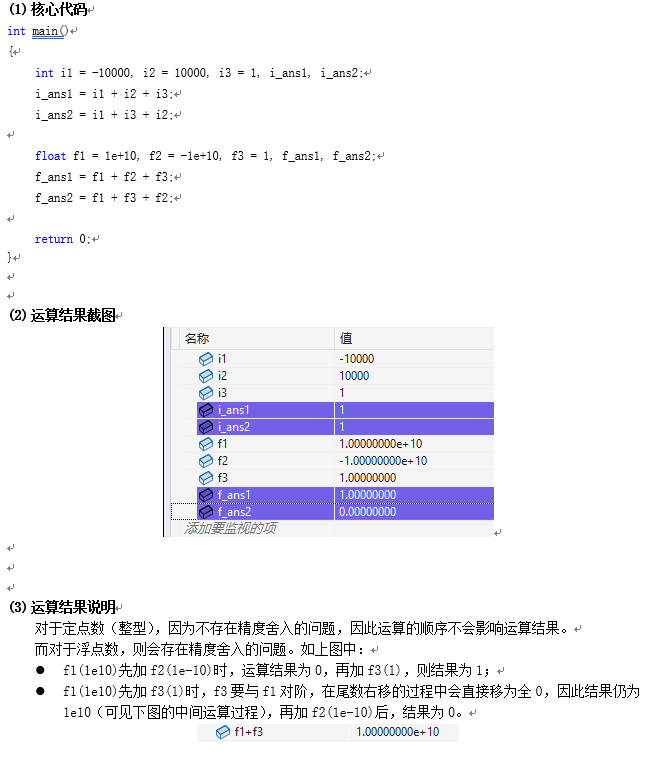
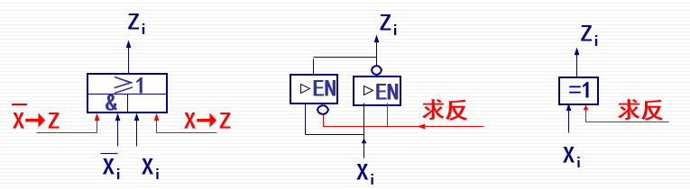

# 第七节 规格化浮点数运算与逻辑运算

## 一、规格化浮点数运算

需要明白浮点数其实就是现实中的**科学计数法**，  
因此根据科学计数法的运算来模拟。

### 1. 浮点加减运算

浮点数记为$<\textrm{阶码}E,\textrm{尾数}M>$。

模拟科学计数法运算，先把两个数调为同阶，再直接底数运算，最后再调为标准形式。

故步骤：

1. 对阶$E$  
   使两个浮点数的阶码相等（小数点位置对齐），  
   需要**阶码小**的数，**通过右移**，向**阶码大**的数对齐（注意右移是数位整体右移，不是小数点右移）。

   可以求阶差判断：$\Delta E = E_B-E_A$
   * $\Delta E<0 \Rightarrow E_B<E_A$，$B$不断右移，使得$E_B=E_A$
   * $\Delta E>0 \Rightarrow E_A<E_B$，$A$不断右移，使得$E_A=E_B$
   * $\Delta E=0$，不用对。
2. 尾数$M$直接运算  
   $M_C\leftarrow M_A\pm M_B$
3. 尾数结果$M_C$规格化  
   将尾数规格化形如：`00.1xxx...`或`11.0xxx`。

   ⚠注意：若产生溢出如`10.xxx`、`01.xxx`，此时也可以通过右移为`11.0xx`、`00.1xx`纠正。  
   ⚠注意：不能规格化到阶码$E$超过其表示范围了（如8位阶码的范围为$-128\sim127$）。
4. 舍入  
   规格化中右移可能造成舍入处理，
   直接**截断**即可。
5. 溢出判断  
   规格化后，判断阶码$E$的双符号位，若仍不同，则溢出。  
   分为两种处理：
   1. `01.xxxxxx` - 上溢：停止运算，进行溢出中断操作。
   2. `10.xxxxxx` - 下溢：不做溢出处理，当作机器零。

> e.g.
>
> 浮点数格式：  
> 阶码$E$为4位，移码表示（偏移值为$2^3$）  
> 尾数$M$为8位。补码表示，包含一位符号位。
>
> $[A]_{\textrm{浮}} = 0111;0.1011100$（$0.101110\times2^{-(01)_2}$）  
> $[B]_{\textrm{浮}} = 0110;1.0101010$（$-(0.101011)\times2^{-(10)_2}$）
>
> 1. 对阶  
>    $[B]_{\textrm{浮}}' = 0111;1.1010101$（阶码小1，右移一位）
> 2. 尾数求和  
>    $00.1011100 + 11.1010101 = 00.0110001$
> 3. 尾数结果规格化
>    $[A+B]_{\textrm{浮}} = 0110;0.1100010$（左移一位，阶码减1）
>
> 则结果：$A+B=0.11001\times2^{-10}$

### 2. 浮点乘法运算

模拟科学计数法运算，  
直接**阶码相加**，**底数相乘**。
$$
X\times Y = (M_X\times M_Y)\times 2^{E_X+E_Y}
$$

**⚠需要注意**：

* 阶码用**移码**表示时，加减法**需要修正符号位**。  
  $$
  [E_A+E_B]_\textrm{移}=[E_A]_\textrm{移}+[E_B]_\textrm{移}+2^n
  $$
  即**符号位要变一下**（因为移码自带$+2^n$，加法后便加了两次$2^n$，需要修正符号位）。
* 结果规格化时，特别**关注上下溢**的情况（乘法很容易上下溢出）。

### 3. 浮点除法运算

方法：
$$
X / Y = (M_X / M_Y)\times 2^{E_X-E_Y}
$$

步骤：

1. 尾数调整  
   为了保证商的尾数是一个定点小数，需要保证$|M_A|<|M_B|$。  
   若不小于，则将$M_A$右移，$E_A+1 \rightarrow E_A$使得满足。
2. 阶码相减  
   阶码用补码表示，无需修正；  
   阶码用$bias=2^n$的移码表示，需要符号位取反。
3. 尾数相除  
   直接除。

### 4. 浮点运算器的实现

组成：

1. 阶码运算部件  
   完成阶码的加、减、对阶右移、阶码规格化调整。
2. 尾数运算部件  
   完成尾数四则运算，判断是否规格化。
3. 溢出判断电路

现代计算机可把浮点运算部件做为任选件，或称为协处理器。  
其只能协助主处理器工作，不能单独工作。

### ⭐5. 定点数与浮点数的运算特质

由浮点数运算的步骤可以看出：

* 定点数的加法运算符`+`，满足结合律。  
  `i1+i2+i3`与`i1+(i2+i3)`结果恒相同。
* 浮点数的加法运算符`+`，不满足结合律。  
  `f1+f2+f3`与`f1+(f2+f3)`结果不一定相同。

原因：浮点数对阶时，**尾数的右移可能造成信息丢失**。  
一般为极大浮点数加减极小浮点数时发生。

## 二、逻辑运算与实现

逻辑运算（按位运算）的特点：位与位之间**没有进位与借位**。

就用最基本的逻辑部件（与或非门、三态门等）。

1. 逻辑非（按位非、求反） - 跟控制信号用与或门、两个三态门、异或门。  
   
2. 逻辑乘（按位与） - 就与门
3. 逻辑加（按位或） - 就或门
4. 逻辑异或（也称半加、不带进位加、模$2$加）
