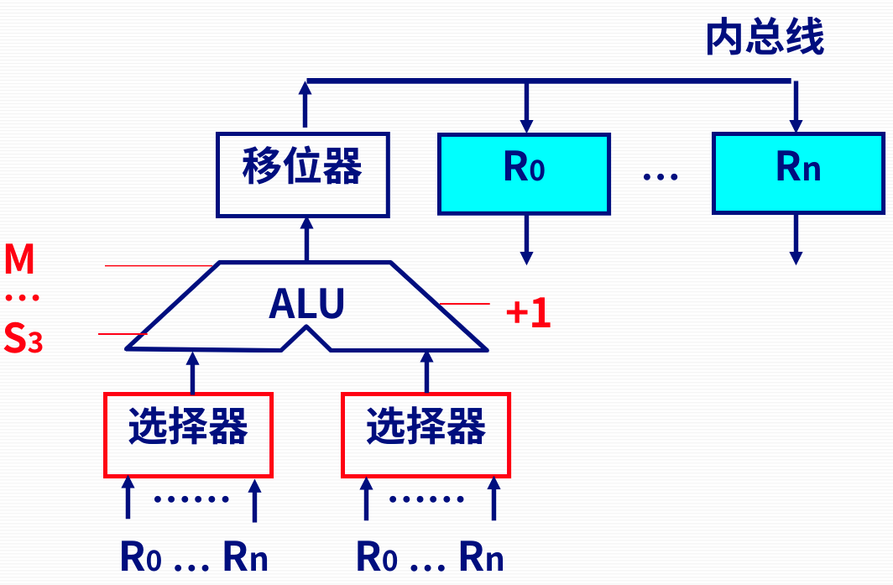
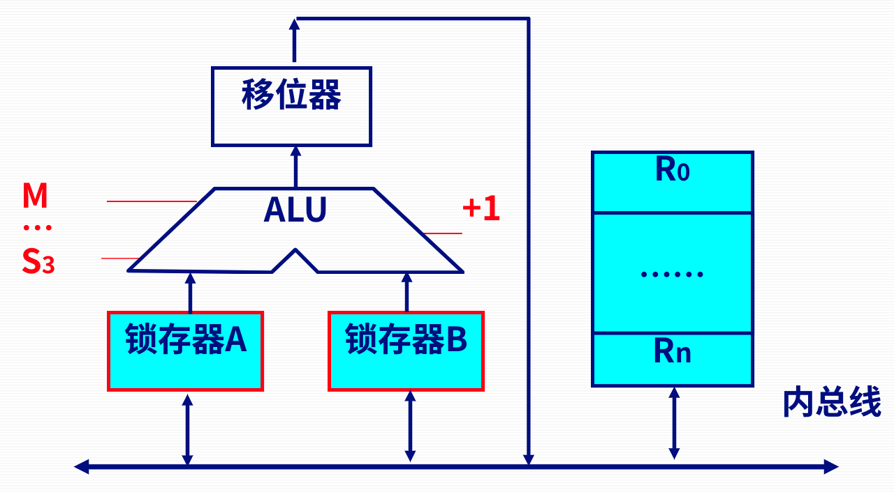
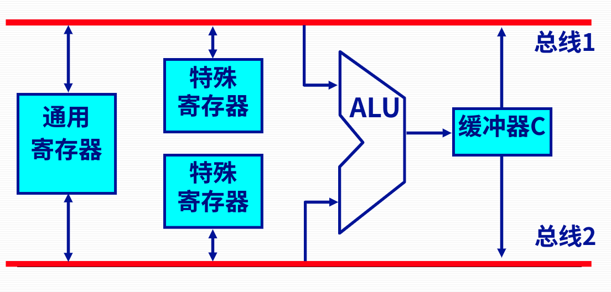
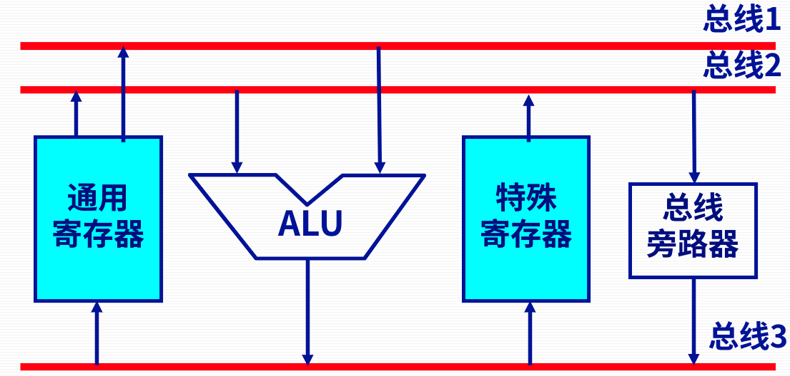
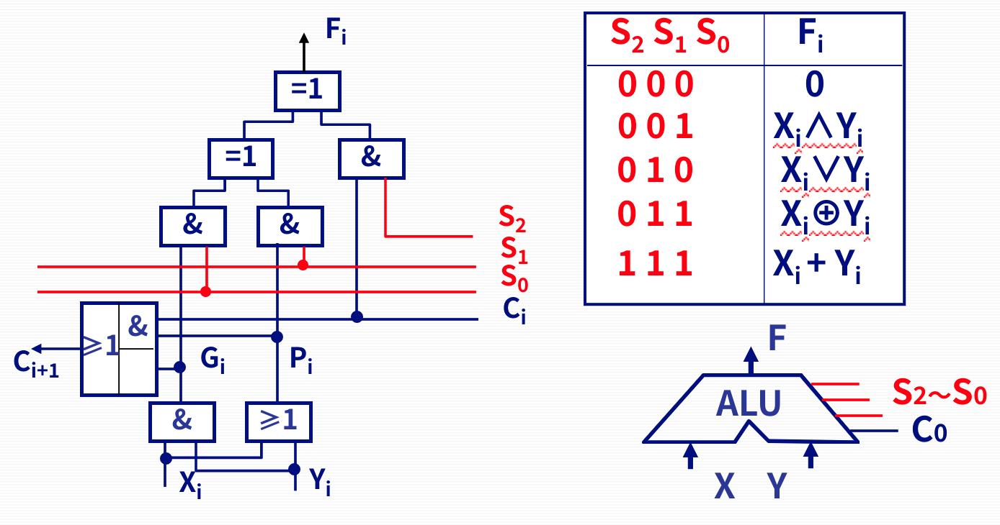
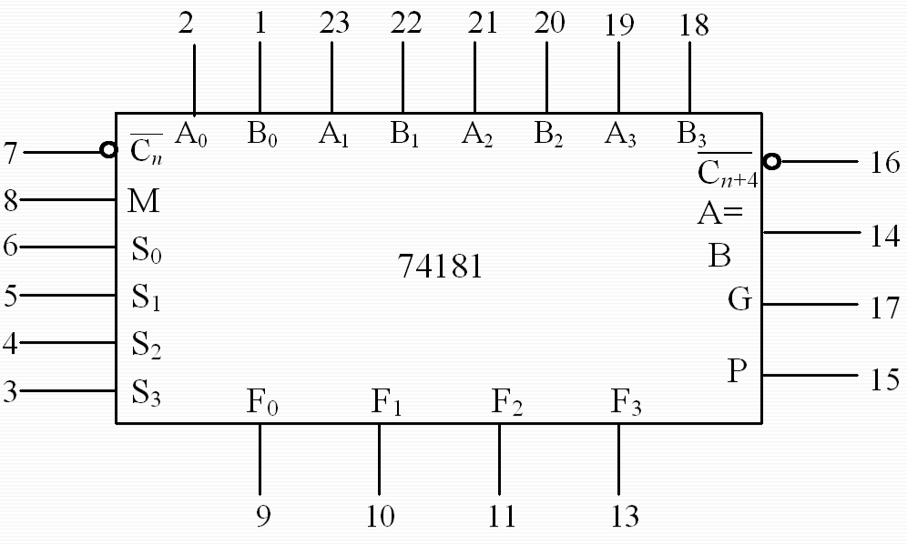
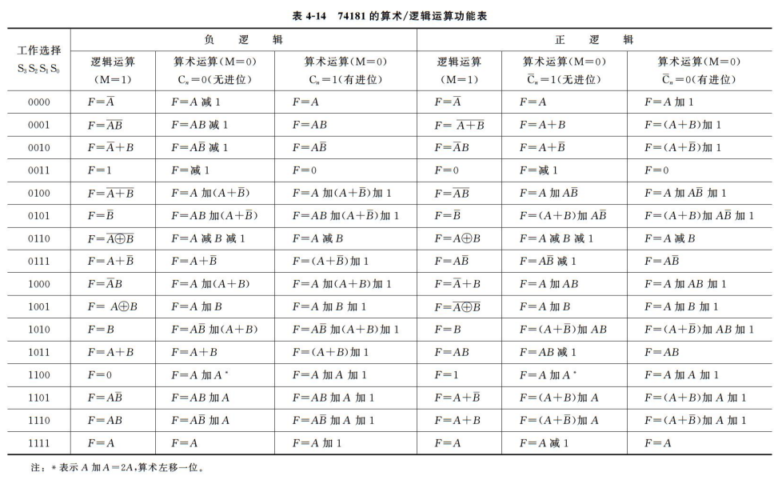
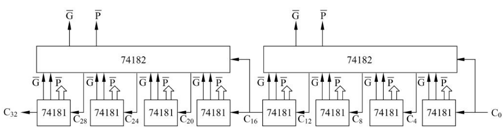

# Ep.9 运算器的基本组成结构

运算器在控制器的控制下，  
不仅可以完成数据信息的**逻辑运算**，  
还可以作为数据信息的**传送通路**。

## 一、运算器结构

### 1. 运算器基本结构

* ALU（核心部件）：实现基本算术（加减乘除）、逻辑运算功能（与或异或等）​。
  * 加法器：就实现加法。
* 寄存器组：提供操作数与暂存结果​。
* 判别逻辑和控制电路
* 数据传输通路

针对如何向ALU提供操作数，有两类结构：

* 带多路选择器的运算器  
    
  多路选择器：用于选择需要运算的寄存器$R_i$。  
  移位器：在加法的时候直传、乘法等根据运算规则位移。

  注意：多路选择器无记录功能。  
  所以不能把数据提前储存到ALU入端，需要等运算完后再关闭选择器。

  特点：效率高速度快（实现加法只需1步）；但连线多。  
  > e.g. 实现`R0+R1→R2`
  >
  > 只需要`R0→ALU左端, R1→ALU右端, ALU做加法, 移位器做直传, R2接收`。
* 带输入锁存器的运算器  
    

  寄存器部分改为了若干个寄存器集成，称为“寄存器组”。  
  但某一时刻只能对一个寄存器读写。

  移位器和寄存器组末端都由三态门控制。

  特点：连线少，结构简单；速度慢（实现加法为3步（`R0→A`、`R1→B`、`A+B→R2`））。

### 2. 运算器的内部总线结构

运算器内的各功能模块间采用总线连接，成为运算器的内部总线。  
存在三种总线结构：

* 单总线结构运算器  
  跟上面的带输入锁存器的运算器对应，  
  因为只有一条总线，所以完成一个加法要分成三步，每次操作一个数。
* 双总线结构运算器  
    
  针对带输入锁存器运算器的改进，  
  此时可以同时取两个数进行操作并即时传出结果。

  但需注意运算出结果后不能走总线返回寄存器，因为总线正在被送进来的两数据占用。  
  因此要设计个缓冲器，用来暂存运算结果，等占用结束再送回去。

  使得运算只用两步（`R0+R1→C​`和`C→R2​`）。
* 三总线结构运算器  
    
  一次可以操作三个数，既能同时读两个操作数也能写回运算结果，  
  速度更快了！只用一步（`R0+R1→R2`）！

  但寄存器组有三个端口，线路又复杂了【他又变回去了.jpg……

## 二、ALU举例

### 1. 最基本的ALU电路

* 逻辑运算：用与门、或门或异或门实现。
* 算术运算：加法器为核心。

  
通过**控制信号$S$的组合**，能使得ALU通过加法器**完成各种不同的算术或逻辑运算**。

因为能完成多种功能，所以又称ALU为“多功能函数发生器”。

### 2. 4位ALU芯片 - 74181

  
其中$F_3\sin F_0$为输出结果，  
$G$为组进位产生函数输出，$P$为组进位传递函数输出（若忘了这两个是什么可查看[基本算术运算实现](../4.1%20基本算术运算的实现/4.1-Machine_Arithmetic-1.md#2-多级先行进位组内并行组间并行)这一节），  
$M$为工作方式（$0$代表算术运算，$1$代表逻辑运算），$S_3\sim S_0$为功能选择线。

能执行针对4位操作数的16种算术运算（用先行进位法）和16种逻辑运算。

> 拓展 - 74181的位数扩展：
>
> 可以用74181级连实现多位ALU（串行进位），  
> 或用74181和74182构成多级先行进位的ALU（并行进位）。
>
>   

## 三、*浮点运算器

PC机上的80X87就是浮点数协处理器。

80X87从主存取数或向主存写数时，均**用80位的临时浮点数**与其他数据类型执行自动转换。  
在80X87中的全部数据，**都以80位临时浮点数的形式表示**。

> 解释 - 为什么`f4=f1+f2+f3`与`f5=f1+f2; f5=f5+f3`不一样：
>
> 由内部结构可知，`f4`运算在执行`f1+f2`的时候会从32位转到80位，运算后直接用80位的临时结果`+f3`；  
> 而`f5`再执行完第一个加法后，从80位的临时结果转成32位`f5`存储，故产生舍入误差。
