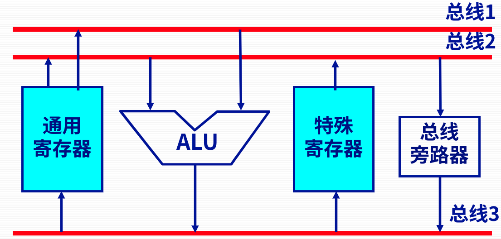

# Ep.9 运算器的基本组成结构

运算器在控制器的控制下，  
不仅可以完成数据信息的逻辑运算，  
还可以作为数据信息的**传送通路**。

## 一、运算器的结构

### 1. 运算器基本结构

* ALU（核心部件）：实现基本算术（加法）、逻辑运算功能（与或异或）​。
  * 加法器：就实现加法。
* 寄存器组：提供操作数与暂存结果​。
* 判别逻辑控制和控制电路
* 数据通路

有两类：

* 带多路选择器的运算器  
    
  多路选择器：用于选择需要运算的寄存器$R_i$。  
  移位器：在加法的时候直传、乘法等根据运算规则位移。

  注意：多路选择器无记录功能。  
  所以不能把数据提前储存到ALU入端。

  特点：效率高速度快（实现加法为3步）；连线多。
* 带输入锁存器的运算器  
    

  寄存器部分改为了若干个寄存器集成，称为“寄存器组”。  
  但某一时刻只能对一个寄存器读写。

  移位器和寄存器组末端都由三态门控制。

  特点：连线少，结构简单；速度慢（实现加法为3步）。
* 双总线结构运算器  
    
  针对带输入锁存器运算器的改进，  
  使得运算只用两步（`R0+R1→C​`和`C→R2​`）。
* 三总线结构运算器  
    
  速度更快了！只用一步（`R0+R1→R2`）！  
  但寄存器组有三个端口，线路有复杂了【他又变回去了.jpg……

## 二、ALU举例

### 1. 最基本的ALU电路

* 逻辑运算：用与门、或门或异或门实现。
* 算术运算：加法器为核心。

  
通过控制信号$S$的组合，能使得ALU通过加法器完成各种不同的算术或逻辑运算。

### 2. 4位ALU芯片 - 74181

能执行16种算术运算（用先行进位法）和16种逻辑运算。

## 三、浮点运算器

> 解释 - 为什么`f4=f1+f2+f3`与`f5=f1+f2; f5=f5+f3`不一样：
>
> 由内部结构可知，`f4`运算在执行`f1+f2`的时候会从32位转到80位，运算后直接用80位的临时结果`+f3`；  
> 而`f5`再执行完第一个加法后，从80位的临时结果转成32位`f5`存储，故产生误差。