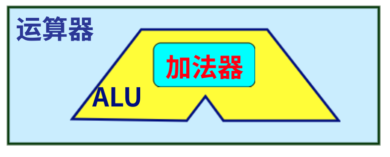

# Ep.4 数值的机器运算

## 运算器件

* 运算器：执行各种算术运算和逻辑运算操作的部件。
* ALU（算术逻辑运算部件）：运算器中的核心部件。
* 加法器：ALU中最基本部件。

## 预备知识

* 三态门：当使能端为`0`时，原样输出，否则输出高阻态。  
  用于控制数据总线
* 寄存器：具有记忆（存储）功能。
* 计算机内部电路种类
  * 组合逻辑电路：没有记忆功能（没有反馈）。
  * 时序逻辑电路：带记忆功能的器件，典型为“寄存器”。
