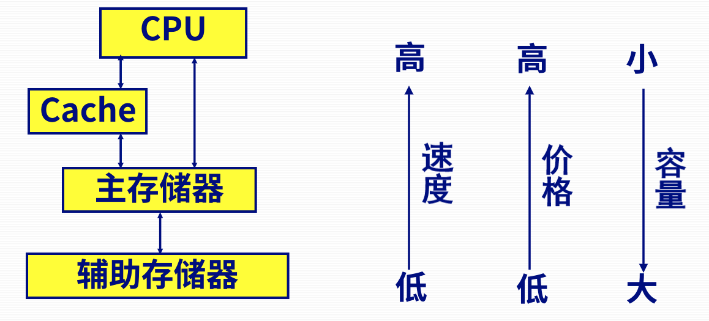
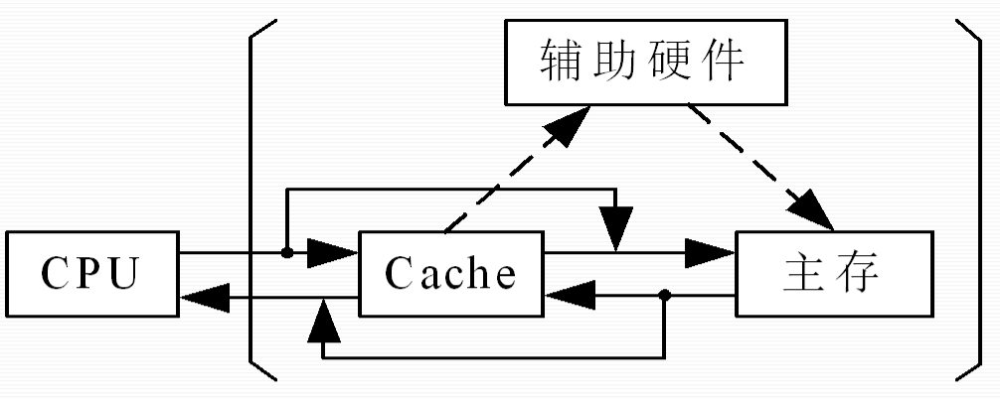
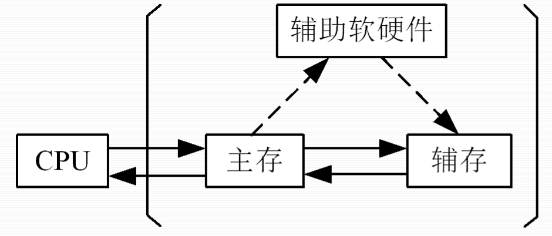

# 第一节 存储系统的组成

## 一、存储器的分类

* 按存储介质分类
  * 半导体存储器
    * 双极型 - 速度快
    * MOS - 集成度高
  * 磁表面存储器：磁盘、磁带
  * 磁芯存储器（已被半导体存储器取代）
  * 光存储器：光盘等
* 按存储方式分类
  * 存取时间与物理地址无关（随机访问）  
    读取任意位置的单元，耗时一样。
    * **随机存储器(RAM)** - 程序执行过程中可读可写  
      注意：不仅可读可写，关键是**随机访问**（磁盘也是可读可写）。  
      特性：断电数据消失，**易失性**。
    * **只读存储器(ROM)** - 程序执行过程中只读  
      特性：断电数据保留，**非易失性**。
  * 存取时间与物理地址有关（串行访问）
    * 顺序存取存储器：磁带
    * 直接存取存储器：磁盘  
      磁盘移动分为径向移动（很快，约等于RAM）和扇区转动（很慢，约等于顺序存取），  
      其速度为两者折中，故单独分为**直接存取**。
* 按在计算机中的作用分类
  * 高速缓冲存储器(Cache)
  * 主存储器（内存）
    * RAM - 易失性：静态RAM、动态RAM
    * ROM - 非易失性：MROM、PROM、EPROM、EEPROM、NOR Flash
  * 辅助存储器（外存）：磁盘、磁带、光盘、SSD、NAND Flash（固态硬盘构成芯片）

## 二、存储器的层次结构

* 目的：解决**存储容量**、**存取速度**和**价格**之间的矛盾。
* 方法：采用多级存储层次，以提高存储系统的整体性能。​

### 1. 多级存储层次

经典的三级物理存储体系：“Cache - 主存 - 外存”  

* Cache  
  存放少量内存数据的副本，速度很快，可与CPU速度匹配。​  
  （与主存之间有数据映射算法、淘汰算法）​  
  但CPU所需访问的数据在Cache中则直接访问，否则再访问主存。  
  *但注意数据都是缓存的，因此增大Cache容量并不会增大储存容量。*
* 主存  
  能由**CPU直接编程访问**。  
  **运行的程序及数据**要**放在主存**中。​
* 外存  
  存放需本地（或联机）**保存但暂不使用**的程序与数据。​  
  当要运行其中的程序时，**先传到内存**再运行。​

### 2. Cache-主存存储层次

Cache存储系统是为了**解决主存速度不足**而提出来的（而不是主存容量）。  
速度接近CPU。  
*拓展：Cache采用双极型而非MOS型，速度快但集成低功耗大。*

Cache存储系统全部用硬件来调度（增加**辅助硬件**），  
因此它对系统程序员和应用程序员是封闭的（只感觉到速度快了，不知道Cache存在）。  
因此避免了总体结构的修改。
  

### 3. 主存-辅存存储层次（虚拟存储系统）

虚拟存储系统是为了**解决主存容量不足**而提出来的。  
一般是用外存（如硬盘）的容量来扩展主存的容量。  
*方式：当主存需要哪部分的数据，就只将该部分数据读入到主存，其他暂存到硬盘，等读到这部分再换。*

虚拟存储系统需要通过操作系统来调度（增加**辅助软硬件**），  
因此对系统程序员封闭，但对应用程序员透明（本来就是OS开发人员写的软件）。

