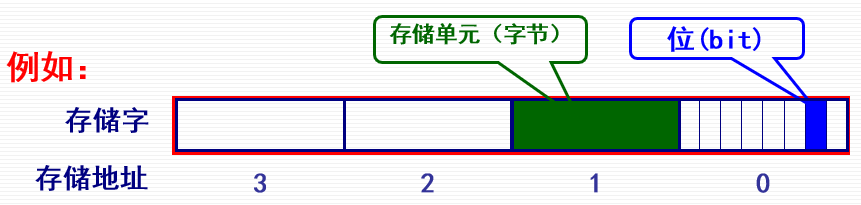
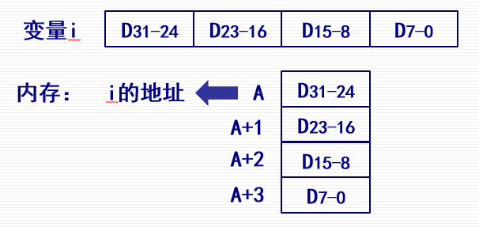
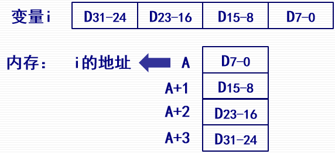
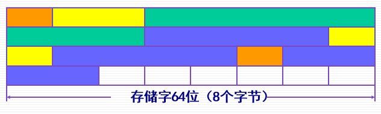
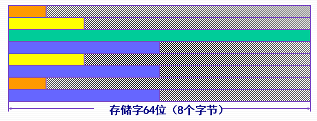
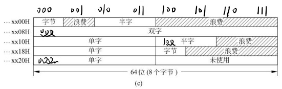

# 第二节 主存储器的组织

## 一、主存储器的基本结构

主存通常由四部分组成：

* 存储体  
  就存储数据用。
* 地址译码驱动电路  
  用来找到某个数据存放在存储体的哪个位置。
* I/O和读写电路  
  控制输入和输出。

对于动态存储器还会有刷新电路。

## 二、主存储器的存储单元

### 1. 基本概念

* 位(bit, b)：**存储器**信息**存储的最小单位**。  
  就是**一位二进制数**，只有`0`或`1`。
* *字节*(byte, B)：计算机**数据处理**的基本单位。  
  八位为一字节，如：`0000_0000`、`1101_0110`。
* 存储字（字）：CPU一次能处理数据的数量，用字节数衡量，  
  或说可**作为一个整体**存入或取出的二进制位数。  
  如：32位计算机，存储字至少为32位，即为4字节。
* 存储单元：存放存储**字/字节**的主存空间（一般就是字节），  
  **CPU**对主存可**访问的最小单位**。
* 存储地址：每个**存储单元的编号**称为（存储）地址。​

⭐关系：$1$字→$n$字节（32位机器为$4$）→$8n$位



### 2. 地址编排方式

1. 按位编址：编址单位为1 bit
2. **按字节编址**：编址单位为1 byte
3. 按字编址：编址单位为计算机字长(1 word)

因为字节是数据处理的基本单位，一般来说都采用“按字节编址”，  
因此地址每增加$1$，位就增加$8$。


### 3. 按字节编址时的字地址

对于组成字节的位而言，都是高位在前，低位在后，  
即一个字节为$B_7\sim B_0$。

但对于组成字的字节而言，是低字节在前还是高字节在前，  
则存在两种方案：

1. 大端方案  
   字地址等于最高有效字节地址。  
   即：高字节在前。
   
2. **小端方案**（现在常用）  
   字地址等于最低有效字节地址。  
   即：**低字节在前**。  
   

> e.g. - 一个字`A0_3C_7F_FF`：
>
> * 大端方案存储：`A0_3C_7F_FF`。
> * 小端方案存储：`FF_7F_3C_A0`。

但注意只是**对数据**来说用**小端方法**，  
对于**操作指令**一般还是**直接存放**（相当于大端方案）​。

## 三、数据在主存中的存放

对于**按字节编址**的编排方式，  
数据在主存中有三种存储方法：

以下以如图所示的数据类型进行举例，  


### 1. 紧缩存放

各种不同长度的数据，紧挨着存放。



* 优点：不浪费主存资源
* 缺点：可能会增加访存次数，且读写控制困难。  
  一个字节或半字可能跨两个存储单元，因此两个单元都要读，且还要各取部分组合。  
  *（如上图的绿色双字，就跨了第一和第二两个存储单元）*

### 2. 存储字字边界存放  

一个数据就占用一个存储字长。  
从存储字的起始位置开始存放。

  

* 优点：读写速度快，控制简单。
* 缺点：浪费主存资源。

### 3. 整数边界存放  

为前两种方法的折中。  
数据在满足只访存一次的前提下，尽量紧挨存放。  

方式：

* 对于双字(8 byte)：起始地址最末三位只能是`000`。
* 对于单字(4 byte)：起始地址最末两位只能是`00`。
* 对于半字(2 byte)：起始地址最末一位只能是`0`。
* 对于字节：任意存放（因为无论怎样存都不可能会被拆分存放）。



---

由于各个硬件平台对存储空间的处理上有很大不同，  
因此需要按平台要求，对数据存放进行对齐，否则损失存储效率。
> 如：
>
> 32系统的`int`型，  
> 如果放在偶地址开始的地方，则一个读周期可以读出；  
> 如果放在奇地址开始的地方，则需要两个周期，且需要拼接。

编写高级语言的时候，编译器会根据平台，自动选择对齐方式。

高级语言中手动更改方式：

1. 代码中声明：  

   ```c++
   int main(...)
   {
     #pragma pack(2) //必须声明在函数里。
   }
   ```

2. 在开发环境中设置：  
   设置 - 结构成员对齐。

## 四、存储器的主要技术指标

### 1. 存储容量

对于容量的表示：

* 以“字节编址”的计算机：就以字节为单位。  
  如：2KB，就代表能存2K(2048)个字节。
* 以“字编址”的计算机：需要按“字数×字长”的方式表达。  
  如：64K×16，代表能存64K(64*1024)个字，每个字长度是16位(2 byte)，相当于128K字节。

> 注意 - 容量单位在计算机上和商用上存在区别
>
> 对于K、G、T这种单位，在计算机中和商用上存在区别。
>
> * 计算机上：是按照$2^{10}$为换算基数的。  
>   如：$1$MB=$1024$KB
> * 硬盘容量上：是按照$10^3$为换算基数的。  
>   如：$1$MB=$1000$KB
>
> 补充原因：  
> 因为在计算机中的内存，寻址采用二进制，按照$2^k$这样来寻，  
> 又因为$2^{10}=1024$跟$1000$相近，因此规定$2^{10}$为换算基数。
>
> 但厂商制造的硬盘，与CPU内存寻址完全没有关联，基本存储单位是扇区而不是字节，  
> 因此一开始就按照国际标准，K、G之间的换算基数是$10^3$。  
> 因此造成不同。
>
> 后来国际标准ISO规定：  
> k、M、G之内的前缀，倍率关系是$1000$；  
> 而另采用Ki、Mi、Gi，代表$1024$的倍率关系。  
> 即$1$GiB=$1024$KiB

*注：k通常被写为小写，因为大写的K代表开尔文温度。*

### 2. 存取速度

* 存取时间$T_a$  
  从启动一次存储器操作，到完成该操作，所经历的时间。  
  $T_a$越小，存取速度越快。  
  *就是完成一次读写所需要的时间。*
* 存取周期$T_m$  
  存储器进行一次完整的读写操作所需要的全部时间。  
  即两次连续访问存储器（读或写）操作之间，所需要的最小**时间间隔**。  
  一般$T_m>T_a$。  
  *当不考虑刷新时，理论上$T_m=T_a$；但考虑刷新后$T_m$则会增大。*
* 主存带宽$B_m$  
  每秒从主存进出信息的最大数量。  
  单位为：$bit/s$（位/秒）

### 3. 其他指标

* 可靠性：在规定时间内，存储器无故障的概率。
* 功耗：反应存储器耗电的多少和发热的成都。
* 性价比：衡量存储器经济性能好坏。
