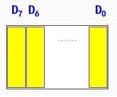
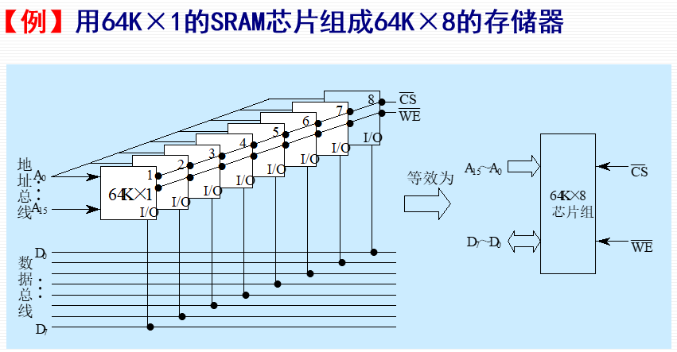
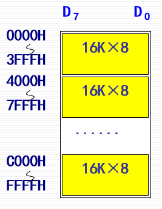
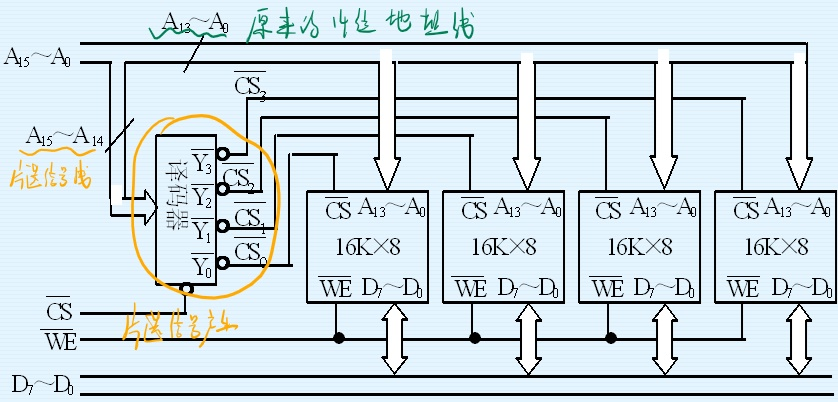
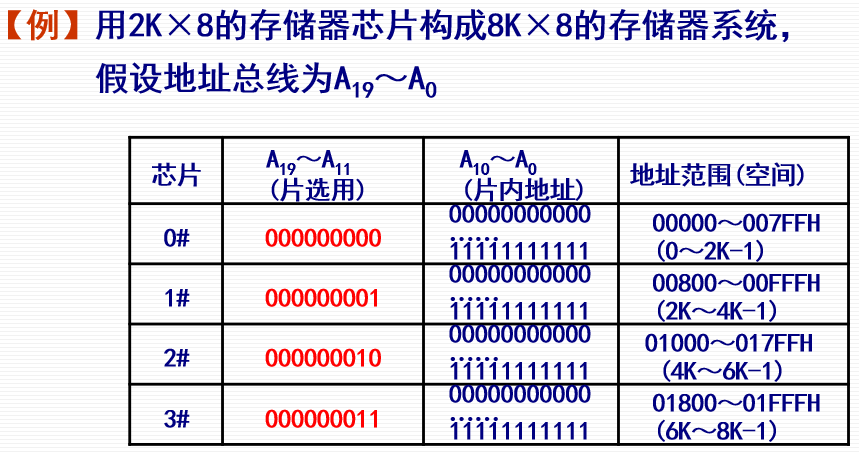
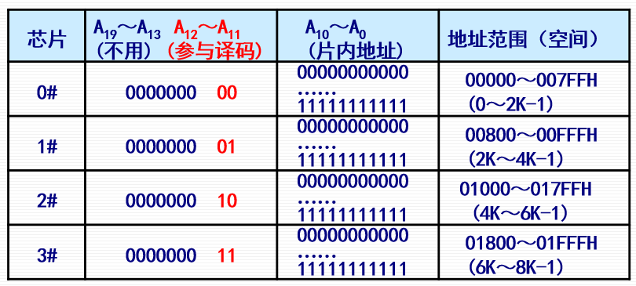
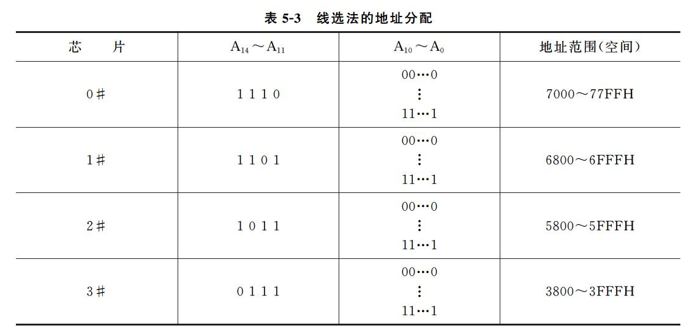

# 第四节 主存储器的连接与控制

## 一、主存储器的扩展

当一个存储器芯片的容量规格，不能满足主存系统容量规格的要求时，  
需要用多个芯片来构成主存系统，即对存储体进行扩展。 

存储体的规格：字数×位。

### 1. 位扩展

对位进行扩展，字数不变。  
相当于横向并联扩展。

连接方式：  
各存储芯片的地址线、片选线和读/写线并联，  
各芯片的数据线单独列出，共同输出。

### 2. 字扩展

对字数进行扩展，位不变。  
相当于纵向串联扩展。

连接方式：  
各芯片的原本的地址线、数据线和读/写线并联，  
再由多出来的地址线决定**片选信号**来**区分各个芯片**。

### 3. 字位同时扩展

## 二、存储芯片的地址分配和片选

* 片选：选择存储器芯片。  
  由高位地址决定，$M$个芯片，为$\log M$位。
* 字选：选择某芯片的存储单元。  
  由低位地址决定，$2^k\times N$，为$k+\log N$位。

片选信号的产生方法：

1. 全译码法
2. 部分译码法
3. 线选法

### 1. 全地址译码法

将CPU给的了多少位地址，将低位用去作为字选信号（芯片内部选择存储单元）后，  
剩余的高位，**都拿去参加片选译码**。

  
可以看到虽然高位没全部用到，但还是参加了片选信号的产生。

虽然电路复杂，但之后在扩展CPU地址线时很容易，  
同时还能检测CPU未用的高位是否出错。

### 2. 部分地址译码法

片选地址移码，需要多少位就用多少位高位地址。  
如8个芯片，就只用$2$位片选地址线。

电路简单，但失去了扩展性，  
同时若未用的高位出错，则无法检测。
> e.g.
>
> CPU给`000yy,xxx_xxxx_xxxx`，即前三位未被使用，  
> 但若CPU出错给出`100yy,xxx_xxxx_xxxx`，但内存也会被译码出片选信号。

---

考试时，若未直接要求用哪个方法，则看起始地址：

* 起始地址从`0000`开始，则可用部分地址译码。
* 起始地址不是从`0000`开始，则用全地址译码。

### 3. 线选法

*相当于部分地址译码，但参与译码的部分变成了线选（即独热码），如下。*

## 三、主存储器与CPU的连接

将主存与CPU相连，需要考虑一下问题：

* 寻址逻辑  
  即：如何按地址来产生存储芯片的片选信号及片内地址
* 主存与CPU读写控制信号的连接、工作时序的配合
* 主存与CPU速度的匹配​  
  （∵CPU的速度>>主存速度）
* 使用DRAM芯片时的刷新问题  
  一般是通过内存控制器与CPU相连
* 系统总线的负载能力

### 1. 主存与CPU的硬连接

### 2. CPU对主存的基本操作

### 3. 8位静态存储器设计举例

## 四、主存的校验

一般来说用奇校验。

主存分为：没有校验、有奇偶校验、ECC（有纠错能力）。

## 五、PC系列微机的存储器接口

对于存储器，存在其每一次操作能输入输出多少位的接口。

1. 8位存储器接口  
   此时只能一个字节一个字节的读入输出。
2. 16位存储器接口  

> 定义 - 规则字：
>
> 若存储器接口大于一字节，存在规则字这个概念。  
> 其代表从`xxxx000`到`xxxx111`这若干字节的一个组合。  
> 可变位数决定于接口是多少字。

因此需要修改控制信号，使其技能读写字节，也能读写字。
