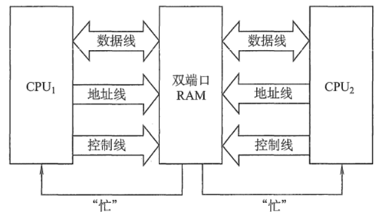
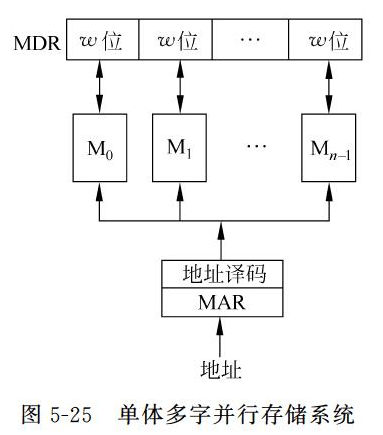
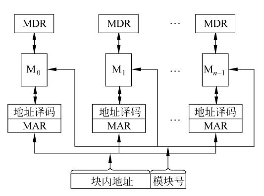

# 第五节 *提高主存读写速度的技术

CPU频繁地和主存交换数据，主存的读写速度直接决定CPU性能，  
为了让主存与CPU的速度相匹配，可采用以下方法。

1. 提高存储芯片的数据存取速度​
2. 改进存储体系结构

## 一、改善主存的速度

### 1. 快速页模式 动态随机存储器(FPM DRAM)

因为主存一般采用双译码方式，  
会先读取主存的一整行，再选择某一列。

因此若连续读写时，  
可以保持读取的一整行数据不变，只改变列地址。  
则能对给定行的所有数据提高读写速度。

### 2. 扩展数据输出 DRAM(EDO DRAM)

可以在输出当前数据的同时，准备下一个数据的输出。

### 3. 同步动态随机存储器(SDRAM)

### 4. 双数据传输同步动态随机存储器(DDR SDRAM)

对于原来的主存，只选择在上升沿或者下降沿读取。  
因此可以改进：不仅在CLK的上升沿读写，下降沿也可以读写。  
因此不需要提高时钟频率就可以加倍提高SDRAM的速度。

该方法则称为DDR，  
之后仍可以改进：增加每次读写数据的位数。  
如“DDR2”，则每次读写位数是DDR的两倍。  
*这个就是内存条上DDR的意思。*

### 5. Rambus DRAM

## 二、（改进存储体系结构）并行存储器和相联存储器

从物理存储结构方面，改进存储体系结构

### 0. 双端口 RAM

双端口 RAM 是指同一个存储器有左、右两个独立的端口，分别具有两组相互独立的地址线、数据
线和读写控制线，允许两个独立的控制器**同时异步地访问存储单元**。

如图所示。当两个端口的地址不相同时，在两个端口上进行读写操作一定不会发生冲突。  

### 1. 单体多字同时访问方式（并行访问存储器）

相当于位扩展。

### 2. 多体单字交叉访问方式（交叉访问存储器）

拥有多个相同的存储模块，可以并行和交叉工作（交叉的话则分时启用）。

### 3. 相联存储器

**按照内容访问单元**，而不是按照地址访问单元。

所有内容同时比较。
