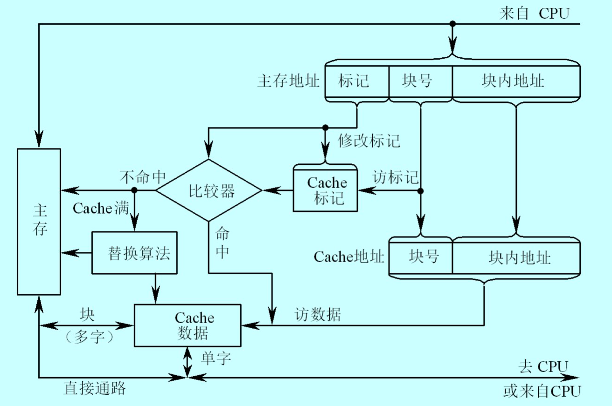
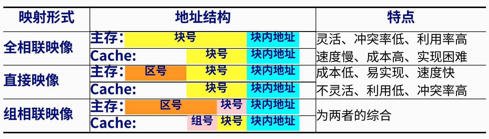
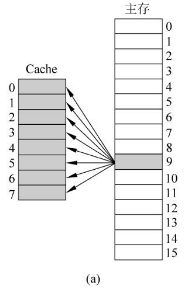
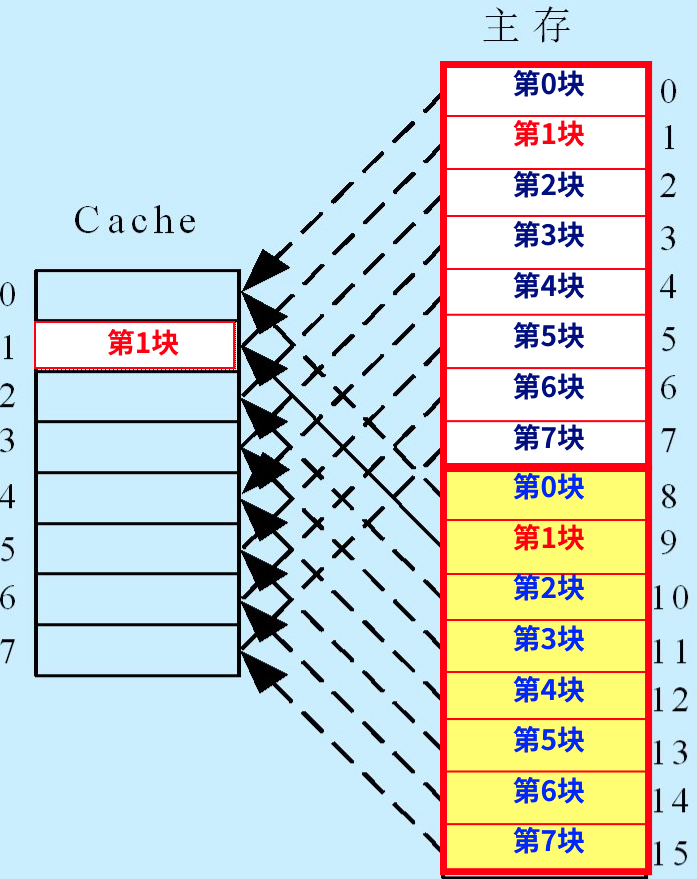

# 第七节 高速缓冲存储器

用来解决主存速度不足的问题，  
Cache并不是必须部件。

用Cache来保存主存中最活跃的数据。

⭐Cache由**硬件**调度管理！  
（区别于虚存，由OS）

## 一、工作原理

### 1. 程序的局部性原理

> 定义 - 时间局部性和空间局部性：
>
> * 时间局部性：  
>   如果一个存储单元被访问，则这个存储单元会再次被访问的概率很高。这是由于循环程序的执行，相应的程序要重复访问。​
> * 空间局部性：
>   如果一个存储单元被访问，则这个存储单元及其相邻单元被访问的概率较高。这是由于程序的顺序执行时，一条指令和下一条指令在存储器中的位置是相邻或相近的。

因为程序一般有循环语句，且为顺序执行，  
所以一条语句被访问，则有很大概率会被再次访问，为时间局部性，  
一条语句被访问，其相邻语句很大概率被访问，为空间局部性。

### 2. Cache的基本结构

基本术语：

* 命中(Hit)  
  CPU发出访问主存操作请求后，所访问的内容已经位于Cache中。​
* 未命中(Miss, 失效)  
  CPU发出访问主存操作请求后，如要访问的内容不在Cache中。

## 二、读写操作

当读取时：

* 若**命中**，则**直接返回**Cache内容。
* 若**未命中**，则只能**从主存中读取**内容，  
  又根据时间局部性和空间局部性，应该**将该内容替换进Cache中**，  
  若Cache已满，则由“替换算法”决定替换掉哪块信息。

当写入时：

* 若**命中**，针对是否修改主存数据，存在两种方法：
  * 写直达法：CPU写操作时，把数据**同时写入主存和Cache**。​
  * 写回法：CPU写操作时，只把数据**暂时写入Cache**，并用标志将该块注明。等需要将该块替换回到主存时，才写回主存。​
* 若**未命中**，针对是否放入Cache，存在两种方法：
  * 不按写分配法：只把要写的信息**写入主存**。​
  * 按写分配法：把要写信息**写入主存**，并把该块从主存中**读入Cache**。​

## 三、地址映像和变换​

考虑的是怎么把数据从主存放入Cache，  
以及怎么建立其间的对应联系的问题。

需要处理好这个问题，才能判断所需数据是否在Cache中，即判断是否命中。

> 定义 - 地址映射
>
> 把主存地址空间映像到Cache地址空间，  
> 即按某种规则，把主存的块复制到Cache中。​

放入数据的基本方法：  
Cache和主存都被分成若干个大小相等的块，每块由**若干个字节组成**，  
主存和Cache的数据交换是以块为单位，需要考虑二者**地址的逻辑关系（映射方式）**。​

存在下面三种地址映射：

1. 全相联映像​
2. 直接映像
3. 组相联映像

### 1. 全相连映像

主存中任何一个块，均可以映像装入到Cache中任何一个块的位置上。​  
即为$n:m$。

* 主存地址分为两部分：块号、块内地址。
* Cacha地址分为两部分：块号、块内地址。

方法：  
可以建立一张映射表，长度跟主存一样，用来记录对应主存地址映射到Cache中哪一地址。  
当主存某一块装入到Cache中时，直接修改该表相同位置的记录。

* 优点：灵活、快速、冲突率低、Cache利用率高。
* 缺点：地址变化机构复杂，成本高（要采用相联存储器）。

### 2. 直接映象

把主存分成若干个区，**每个区与Cache大小相同**。  
区内再分块，其**块的个数与Cache中块的个数相等**。​

任意一个主存块**只能映像到**Cache中**唯一指定的块**中，  
即$1:1$
（如上图，主存中只有一个箭头指向Cache）

直接映像的关系可定义为：​

$$
K=I mod 2^C
$$

* 优点：实现很简单，无需考虑替换算法
* 缺点：冲突概率最高、空间利用率最低

### 3. 组相连映像

为前两种方法的综合。

将 Cache 分为若干组，  
每个主存块，可以装入**固定组**中**任意一行**。

当每组一行时($Q=$Cache行数)，为直接映射；  
当只有一组时$(Q=1$)，为全相联映射。

## 四、替换算法

* *随机算法(RAND)*
* *先进先出算法(FIFO)*  
  上两者实现简单，但没有依据局部性原理，命中率低
* 近期最少使用算法(LRU)
* 最不进场使用算法(LFU)

## 五、PC机中Cache实现

### 1. 单一缓存和多级缓存

* 单一缓存：在CPU和主存之间只设一个Cache。​
* 多级缓存：在CPU芯片内、CPU芯片外扩展以及在主板上设置多级Cache。 ​

### 2. 统一缓存和分开缓存
