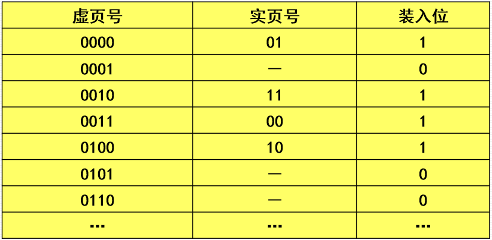
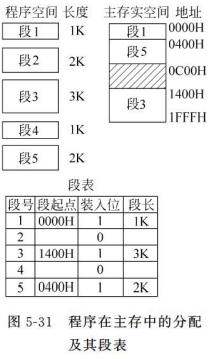

# 第七节 虚拟存储器

解决内存容量不够问题。

## 一、基本概念

将主存和部分**辅存地址**空间统一编址，形成一个庞大的存储空间。  
在这个空间里，用户可自由编程，**不必考虑**程序在**主存中的实际存放位置**，程序可像访问内存一样访问这部分辅存空间。

虚拟存储器是建立在主－辅存层次上，由**附加硬件装置**和**操作系统的存储管理软件**组成的存储体系。

* 虚拟地址(逻辑地址)：用户编程的地址。
* 物理地址(实际地址)：实际主存单元地址。
* 虚拟地址空间：虚拟地址的范围(程序员可看到的地址空间)。  
  它比实际主存单元数大得多。

## 二、地址映像

虚拟存储器需要提供**动态的地址映像机制**，将**逻辑地址**转换为对应的**物理地址**。

常见的有三种：

* 页式虚拟存储器
* 段式虚拟存储器
* 段页式虚拟存储器

### 1. 页式虚拟存储器

将主存和辅存空间都分成**大小相同的页**。

* 虚地址＝虚页号＋页内地址
* 实地址＝实页号＋页内地址

其中虚地址和实地址中的页内地址相同。

为了管理映射，需要建立一个“页表”，  
其中每一行就代表一个虚页号，存储的则是映射的实页号，  
最后还需要个标识位，标记是否真的存在映射，称为“**装入位**”。

不考虑程序的逻辑功能，面向存储器物理结构。

* 优点：
  * 页长固定，页表的建立方便，页的调入调出容易实现。
* 缺点：
  * 当存储空间较大时，页表占的空间将很大，效率降低。
  * 页不是逻辑上独立的实体，使程序的处理、保护和共享较困难。

> 拓展 - 页表的存放
>
> 现在因为内存容量发展迅速，已经足够容纳页表，  
> 因此将大部分放在内存中，最活跃的部分放在高速缓存中，  
> 分别称为慢表和快表。

### 2. 段式虚拟存储器

将程序**按逻辑功能**分段，**各段大小不等**，逻辑地址均从0开始，  
装入时按段分别装入主存，  
运行时按段进行虚－实地址转换。

* 虚地址＝虚段号＋段内地址
* 实地址＝实存段首地址＋段内地址

* 优点：
  * 用户地址空间分离，段表占用空间少，管理简单。
  * 段具有逻辑独立性，易于实现程序的编译、管理和保护，也便于多道程序共享。
* 缺点：
  * 随着程序的不断运行，会在**主存**空间中形成**较多碎片**。

### 3. 段页式虚拟存储器

为前两种方法的综合，  
将存储空间**先按逻辑功能分成段**，**每段又分成若干页**。  
目前大多数计算机系统都采用段页式管理。

* 虚地址＝虚段号＋段内虚页号＋页内地址
* 实地址＝实页号＋页内地址

虚地址和实地址中的页内地址相同。

特点：

* 兼有段式管理和页式管理二者的优点，但地址变换的速度较慢。  
* **段的起点不能是任意**的，必须是主存中**某页的起点**。
* 页表的个数与段数相同，即每个段都有自己的页表。

## 三、虚存与Cache的区别

在管理方式上，虚拟存储器与Cache存在区别。