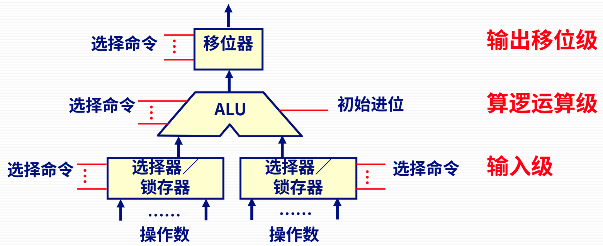
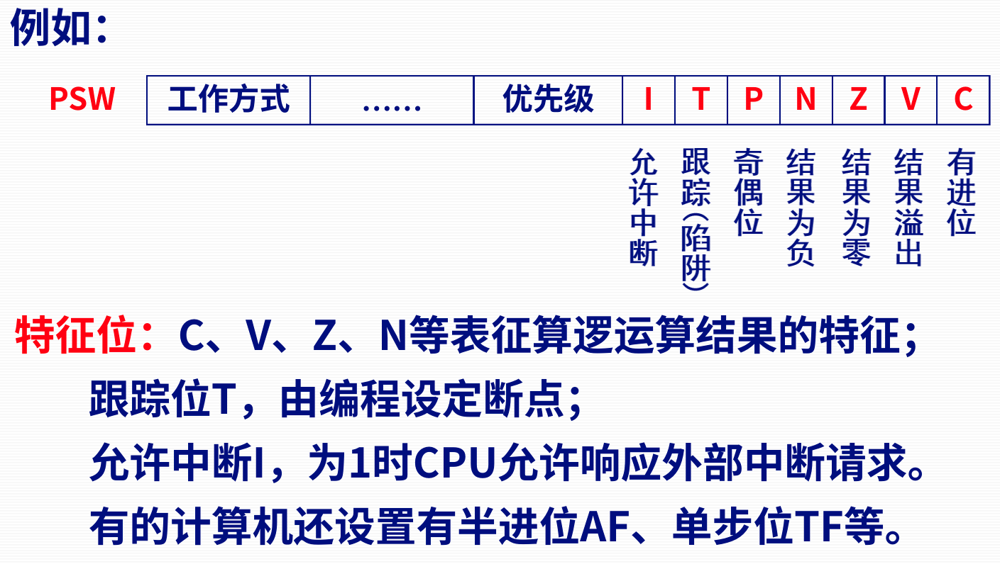
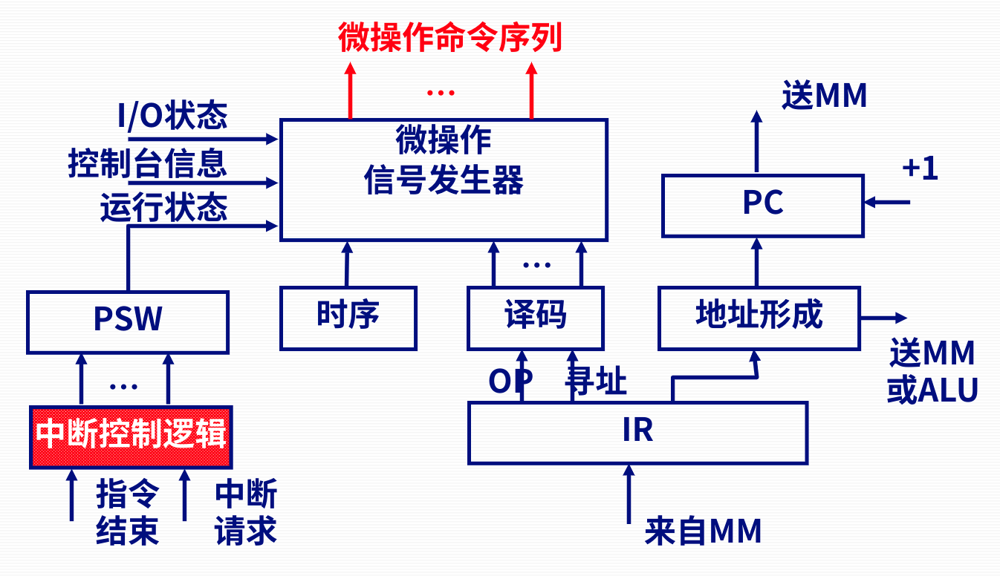

# 第一节 CPU的功能

## 一、CPU的功能

以下几个功能：

* 指令控制：产生下一条指令在内存中的地址、取指令。
* 操作控制：把指令分解成一系列的微操作控制信号，控制各部件完成指令所要求的动作。
* 时序控制：对指令的各个微操作实施时间的定时，使它们能够按先后顺序来执行。
* 数据加工：算术运算、逻辑运算。
* 中断处理：处理异常情况和特殊请求。​
* 其它：如总线管理等。
  
> 补充 - 执行一条命令的功能
>
> 1. 读内存  
>    控制器以PC中的二进制编码为内存地址，通过系统总线（的地址线）向MM发送地址信息，并且通过系统总线（的控制线）向MM发“读内存”命令
> 2. 找指令  
>    MM接到地址信息和“读内存”命令后，按第5章中所学的原理把内存相应单元中的二进制编码（即指令）读到内存的数据缓冲寄存器（MDR）中；  
>    同时，PC内容递增，为取下一条指令作准备；
> 3. 回CPU  
>    MM把MDR中的指令通过系统总线（的数据线）传到CPU的指令寄存器（IR）中，为下一步指令译码作准备。

## 二、CPU的组成

四个部分：

* ALU
* 寄存器
* 中断系统
* CU

### 1. 基本的运算部件

* 选择器：不带记忆功能。
* 锁存器：带记忆功能，可以在输入之前存下来。

不同档次的运算部件：

* 低档处理器  
  一个ALU；  
  硬件级只能实现基本的算逻运算功能。
* 普通处理器  
  一个ALU；  
  硬件级可实现定点加减乘除法运算；  
  浮点运算可通过软件（子程序）或浮点协处理器硬件来实现。
* 较高档处理器  
* 高档处理器

### 2. 寄存器

#### (1) 通常寄存器 - Rx

* 存放原始数据和运算结果。
* 用户可编程访问。
* 数量少则几个，多则上百个。

#### (2) 程序计数器 - PC

是专用寄存器。

#### (3) 指令寄存器 - IR

是专用寄存器。

* 用于存放现行指令。
* 为提高读取指令的速度，大多计算机将IR扩充为指令队列  
  允许预先取若干条指令。

#### (4) 暂存器

是专用寄存器。

用户不能直接访问，  
用来给硬件某些操作提供暂存数据的寄存器。

#### (5) 状态寄存器 - PSW

用来指示CPU的工作方式、算术逻辑运算指令运行结果的特征等。

> 拓展 - PSW所存放信息
>
> 
>
> 对于前一部分（上图红色部分），是PSW的特征位，  
> 作用如名称。
>
> 下一部分为“优先级”，存放当前运行程序的优先级。  
> 当有外部中断请求的优先级高于它时，CPU才会响应中断请求。
>
> 最后还会有“工作方式”，  
> 有些计算机将CPU状态分为用户态和管态。

#### (6) 地址寄存器 - AR(MAR)

是用作主存接口的寄存器。

存放需要访问的内存单元的地址。

#### (7) 数据寄存器 - DR(MDR)

是用作主存接口的寄存器。

存放准备写入到内存单元的数据，  
或存放从内存读出后进入CPU的数据。

### 3. 控制单元CU

CU主要包括：

* 时序部件
* 微操作信号发生器

#### (1) 时序部件

用于产生工作周期、节拍、脉冲等时间信号标志(时序信号)。

* 脉冲源 -- 基准时钟（主频）
* 启停控制逻辑
* 时序信号发生器等

#### (2) 微操作信号发生器

产生微操作的依据：

* 时序信号
* 指令代码
* 状态
* 外部请求

根据控制信号形成方式，可以分为以下两种控制器：

* 组合逻辑控制器
* 微程序控制器

### 4. 中断系统

### 5. 数据通路

就是如何连接上面四个部件的。

一般采用总线的连接方式。

* 单组内总线数据通路结构
  * 分立寄存器结构
  * 集成寄存器结构
* 多组内总线结构
  * 双总线结构
  * 三总线结构

不同的总结结构，同时能传输的数据个数不同，复杂程度也不同。

### 三、CPU的主要参数指标

* 字长
* 内部工作频率
* 外部工作频率
* 前端总线频率
* 片内Cache容量和速率
* 工作电压  
  指的是CPU正常工作所需的电压。
  越低，功耗越小。
* 地址总线宽度  
  决定了CPU可以访问的最大的物理地址空间。
* 数据总线宽度
* 制造工艺