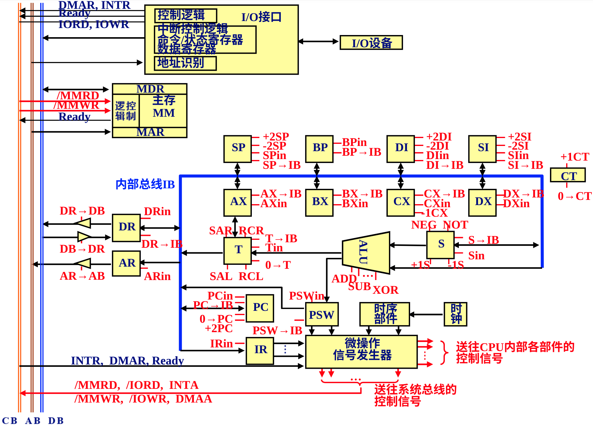
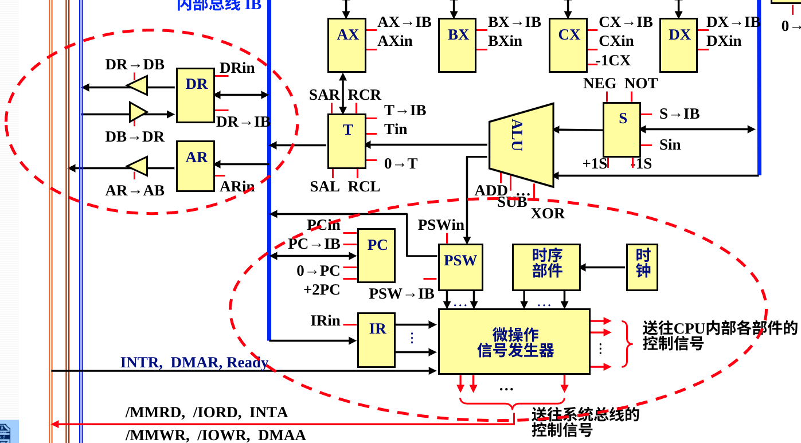
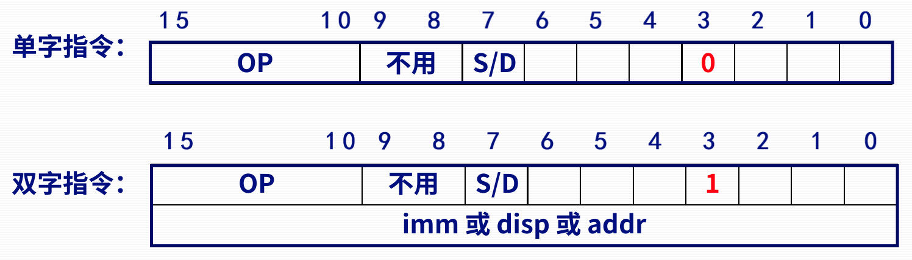
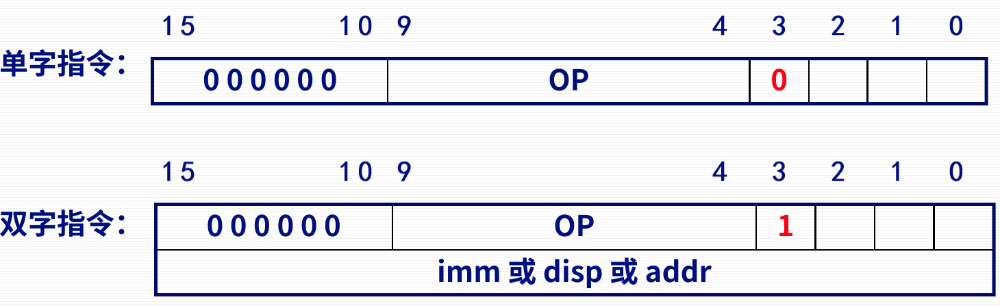
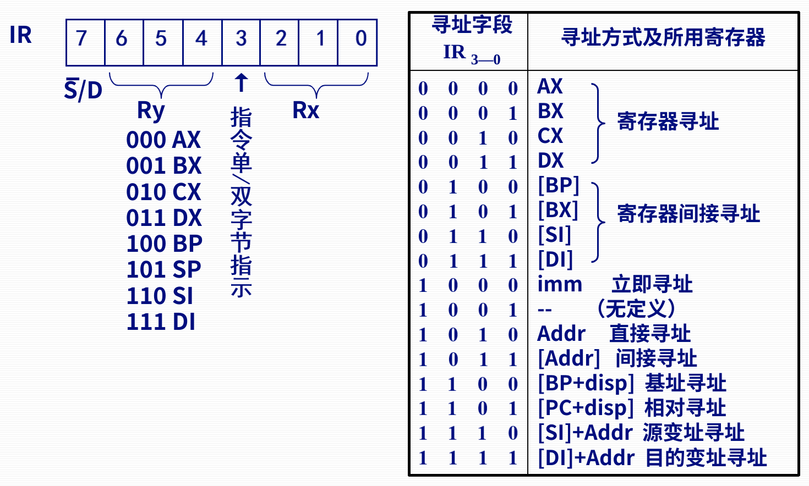
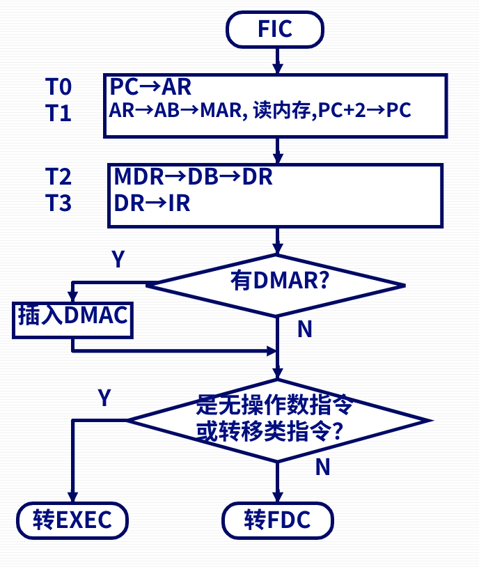

# 第四节 指令的微操作序列

以“模型机”为例子讲解。

## 一、模型机简介

一种计算机的最基本模型。

  

### 1. 硬件结构

#### (1) 总线

* 系统总线
  * 地址线
  * 数据线
  * 控制线
* 内部总线ID  
  CPU内部寄存器的连接，用三态门接入。

#### (2) 控制器

  

途中各种红色的引角，即是控制信号。

#### (3) 运算器

* ALU  
  可执行各种算术逻辑运算功能（`ADD`、`IMUL`、`OR`、`CMP`等）。
* 寄存器
* 暂存器
  * S - 传入到ALU时暂存的
  * T - 暂存ALU运算结果的
* 乘除步数计数器CT

#### (4) 内存和I/O设备

内存除了基本的内存模块，还存在寄存器和控制信号。

* 寄存器
  * MAR
  * MDR
* 控制信号

### 2. 指令系统

双操作数：  
  
后8位($7\sim0$)为IR的内容。

单操作数：  
  
后4位($3\sim0$)为IR的内容。

无操作数：  

先取单字节前16位，发现还要取再取后16位。

### 3. 寻址方式

IR的处理方式。

对于双操作数指令，要求有一个操作数必须来自于寄存器，即采用寄存器寻址，由IR6~IR4决定。  
其既可以是源操作数，也可以是目的操作数，用IR7决定。

另一个操作数，则可以使用多种寻址方式，由IR3~IR0决定。

  
*搭配之前的指令格式，可以知道imm,Addr,disp是什么意思。*

可以知道：

* 寄存器寻址是直接写的  
  此时不需要“取操作数FDC”，在EXEC中直接通过IB传ALU中即可。
* 寄存器间接寻址是加了`[]`  
  需要进行“取操作数FDC”，详细看[下面](#2-取操作数周期fdc)。

---

⚠需要注意：微操作中，**谨慎分步骤**，  
有些操作规定**必须在一步中**同时完成。

如数据传输过程中：数据输到总线，与接受数据使能需要同时开启。

## 二、时序系统与控制方式

### 1. 三级时序

CPU工作周期：5个  
基本工作周期为：取指FIC、取数FDC、执行EXEC

节拍：工作周期最多64个节拍（微操作）。

节拍周期：每个节拍一个？

### 2. 时序控制方式

CPU内采用同步控制；  
CPU与MM及I/O之间采用准同步。

## 三、微指令操作流程

### 1. 取指周期FIC

根据`PC`到内存取指令→内存取的指令返回`IR`→`PC`加2（因为内存16位，PC跳两字节）

| 时间周期 | 微操作意义                | 微操作序列                 |
| -------- | ------------------------- | -------------------------- |
| $T_0$    | `PC`→`AR`                 | `PC`←`IB`, `ARin`          |
| $T_1$    | `AR`→`AB`→`MAR`（读内存） | `AB`←`AR`, `/MMRD`, `+2PC` |
| $T_2$    | `MDR`→`AB`→`DR`           | `DB`←`DR`, `DRin`          |
| $T_3$    | `DR`→`IR`                 | `IB`←`DR`, `IRin`          |

*其中PC加2可以放在任意一步后进行，**但必须要写！***

注：$T_i$是每个微操作所用时间，不一定一样。

  
该流程图只是针对用户示意的，计算机看不懂这个流程。

### 2. 取操作数周期FDC

目的：把操作数取到`DR`中。

若从内存中取数，则内存地址放在`AR`中，  
然后转到相应的执行周期。

由于取操作数有多种寻址方式，所以比起FIC更困难。

*一般只考寄存器寻址和寄存器间接寻址，但寄存器寻址就不用取操作数了，因此只用管寄间寻址如下：*

| 时间周期 | 微操作意义      | 微操作序列         |
| -------- | --------------- | ------------------ |
| $T_0$    | `BX`→`AR`       | `IB`←`BX`, `ARin`  |
| $T_1$    | `AR`→`AB`→`MAR`(读内存) | `AB`←`AR`, `/MMRD` |
| $T_2$    | `MDR`→`DB`→`DR` | `DR`←`DB`, `DRin`  |

### 3. 执行周期EXEC

两个操作数

* **源操作数（一般是`ADD X, Y`后面的`Y`）要送到`S`**。
* 目的操作数：都是通过`IB`直接传到ALU。  
  如果在寄存器就用寄存器传，在`DR`就用`DR`传。

则对于`ADD AX, [BX]`的EXEC操作序列为如下：

| 时间周期 | 微操作意义 | 微操作系列         |
| -------- | ------------ | ----------------------- |
| $T_0$    | `DR`→`S`     | `IB`←`DR`, `Sin`      |
| $T_1$    | `AX`+`S`→`T` | `IB`←`AX`, `ADD`, `Tin` |
| $T_2$    | `T`→`AX`     | `IB`←`T`， `AXin`    |

需要注意：如果是`ADD [AX], BX`：  
不仅`DR`不用传`S`（因为微目的操作数，直传ALU），是`BX`传`S`  
并且运算后的结果要传回地址为`AX`的内存！  
因此后一步改为`T`→`DR`，再加一步“`AR`→`AB`→`MAR`”（此时地址`[AX]`已在`AR`中）和“`DR`→`AB`→`MDR`(写内存)”（注意`/MMWR`）
