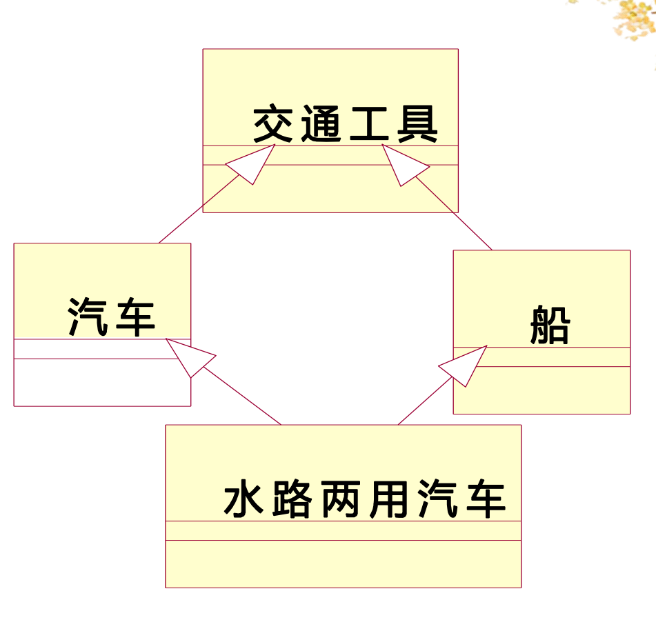

# 第二节 派生类的新特性

派生类的构造析构函数、同名隐藏、多继承、虚基类、虚继承。

## 一、派生类的构造和析构函数

派生类的构造和析构函数，不会继承基类的，  
但需要用到。

对于构造函数：

派生类的成员包括“从基类继承的成员”和“自己的新成员”，  
因此执行派生类的构造函数时，需要先**执行基类的构造函数**（尤其是私有继承、只能用基类的构造函数)。

方式：

```c++
class FC1
{
    FC1(int i) {}
};
class FC2
{
    FC2() {}
};
class FC3
{
    FC3(int j, int k) {}
};

class SC: private FC1, private FC2, private FC3
{
  int a;

  SC(int _a, int _i, int _j, int _k) : FC1(_i), FC3(_j, _k), a(_a)
  {
    ...
  }
};
```

对于基类的构造函数，必须**使用初始化列表**，  
且初始化列表顺序要**跟继承顺序一致**。

调用基类的构造函数有两个方式：

* 显式方式：就是使用初始化列表直接调用（上例中`FC1`、`FC3`）。
* 隐式方式：如果要调用基类的默认构造函数（不带参数的），则直接不写跳过（上例中的`FC2`）。

若同时包含“基类”和“成员对象类”，  
则先按照**继承顺序**，调用**基类**的构造函数，  
再按照**定义顺序**，调用**成员对象类**的构造函数。

---

对于析构函数：  
**先执行派生类**的析构函数，执行完后**再执行基类**的析构函数。

就是**与构造函数的顺序相反**。

## 二、多继承

### 1. 同名隐藏

指的是派生类的成员，**隐藏了基类中同名的成员**（包括数据和函数）。

就是派生类和基类都有个同名成员，  
则使用派生类的。

基类如果同名还是有重载，则都会被隐藏。  
即**隐藏只看名字，不看参数**。

但，只是被隐藏，仍可以使用。  
采用如下方法：

```c++
class Father1C
{
public: int data;
};
class Father2C
{
public: int func() {}
};
class sonC: public Father1C, public Father2C
{
public:
  int data;
  int func() {}
};

sonC.Father1C::data = 5;
sonC.Father2C::func();
```

### 2. 同名覆盖

只能是**函数的覆盖**。
跟隐藏的区别是：隐藏可以继续调用，覆盖则完全不存在。

拥有以下条件：

1. 函数名字相同。
2. **参数相同**。
3. 基类中的函数必须有关键字`virtual`。

### 3. 作用域分辨符号

写为`::`，用来限定要访问的成员所在的类的名称使用形式。

若多个**基类中有同名成员**，则只能通过作用域分辨符来调用。  
如下“菱形继承情况”：  
  
直接使用相同的成员会**出现二义性**，编译不通过。

```c++
class son: public f1, public f2
{
private:
  int a; //均有a
public:
  void print() //均有print,打印本类的a
  {
    f1::print();
    f2::print();
    print(...);
  }
}
```

但如果被同名覆盖（派生类定义了同名），  
可以直接使用，使用的是派生类的。

### 4. 虚继承

在上述的菱形继承问题中，  
多继承路径上，有一个公共基类，  
则在汇合处的类，会有该基类的多个拷贝（若干个同名成员）。

但有时候可能**只需要一个拷贝**（如员工的菱形继承，只需要一个工资），  
便可以采用“虚继承”的方法解决。

将公共基类说明为“虚基类”，  
继承模式是“虚继承”。

语法：

```c++
class sonClass : virtual public FatherClass
{
};
```

> e.g.
>
> ```c++
> class staff // 公共基类
> {
> public:
>   int salary
>   staff(int _salary) : salary(_salary) {}
> }
>
> class programmer : virtual public staff
> {
> public:
>   int group_p;
>   programmer(int _salary, int _group) : staff(_salary), group_p(_group) {}
> }
>
> class designer : virtual public staff
> {
> public:
>   int group_d;
>   designer(int _salary, int _group) : staff(_salary), group_d(_group) {}
> }
>
> class manager : public programmer, public designer
> {
> public:
>   int partment,
>   manager(int _salary, int _group_p, int _group_d, int _partment) : staff(_salary), programmer(_salary,_group_p), disigner(_salary,_group_d), partment(_partment) {}
> }
> ```

目的：

* 防止二义性
* 节约内存空间（尤其是公共基类成员很多的情况）

需要调用公共基类的构造函数