# 错误记录

*部分在作业文档里。*

* 方法：用`DevStack`安装 OpenStack。
* 虚拟机：WSL

## 0x01 在 systemctl 命令出错

### 1.1. 表现


直接用`systemctl`也报错。

### 1.2. 原因

根进程不是"systemd"。  

老版本的 WSL 根进程是微软的"init"，而新版本的 WSL 已经默认为"systemd"了。  

### 1.3. 解决方法

推荐是更新 WSL，然后重安装（或者按照“参考资料 2”启用）。

### 1.4. 成功表现

输入`pstree`，可以看到根进程为“systemd”：  
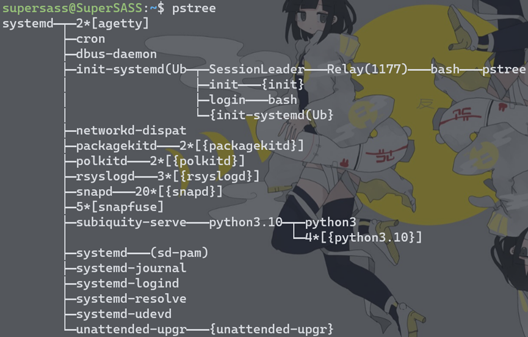

### 1.5. 参考资料

* [WSL2开启systemctl命令简单方法，重启WSL2后仍生效](https://zhuanlan.zhihu.com/p/352994199?utm_id=0)  
  需要注意！不是按照文中的方式进行，而是按照评论中"yinghaodang → Sensor"的评论知道，新版本 WSL 已经支持"systemd"。
* [使用 systemd 通过 WSL 管理 Linux 服务](https://learn.microsoft.com/zh-cn/windows/wsl/systemd)  
  “Systemd 现在是将使用 wsl --install 命令默认值安装的 Ubuntu 的当前版本默认值”。

## 0x02 在 systemctl start 命令出错

### 2.1. 表现


自己输入`sudo systemctl start openvswitch-switch.service`时，也会弹出如下错误。  


然后输入`sudo journalctl -xe`，可以定位到关键错误信息：  
  

### 2.2. 原因

`modprobe`所需要的"/lib/modules/\<KERNEL_NAME\>"不存在。

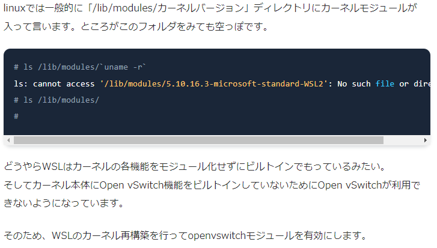  
虽然是日文，但大概能看懂。

机翻：  
在Linux中，内核模块一般存放在“/lib/modules/kernel version”目录下，  
然而因为WSL虚拟机内置了每个内核函数，而不会对其进行模块化，并且由于Open vSwitch功能并没有内置到内核本身中，因此无法使用Open vSwitch。

### 2.3. 解决方法

按照“参考资料 1”中“カーネル再構築”到“WSL再起動”的方法进行。

### 2.4. 成功表现

输入`sudo systemctl start openvswitch-switch.service`不会报错。  
再输入`sudo systemctl status openvswitch-switch`后结果如下：
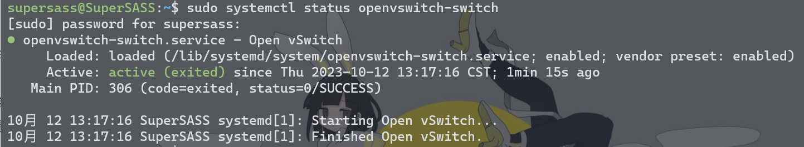

### 2.5. 参考资料

* [WSL2にOpen vSwitchをインストール(カーネル再構築)](https://zenn.dev/takai404/articles/9c96d5d1bcc9d0#%E3%82%AB%E3%83%BC%E3%83%8D%E3%83%AB%E5%86%8D%E6%A7%8B%E7%AF%89)  
  * **注意事项**：  
    在第一步安装必要组件时，需要安装`dwarves`，即输入命令（省略了部分）：

    ```bash
    sudo apt install -y build-essential flex bison libssl-dev libelf-dev dwarves libncurses-dev bc
    ```

    否则在执行`time make -j $jobs`构建内核时会出现如下错误：  
    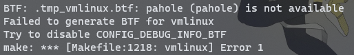  
    不安装`bc`也可能在构建的时候报“bc找不到”。

    同时，如果发现`md5sum Microsoft/config-wsl <(zcat /proc/config.gz)`不一样，`diff Microsoft/config-wsl <(zcat /proc/config.gz)`有差异也不用怕，  
    只要你选对了大的版本号，是可能有差异的。  
    比如我之前安装的版本用`screenfetch`输出的内核是"x86_64 Linux 5.15.90.1-microsoft-standard-WSL2"，后面安装却又在最后多了一个"+"号，导致最开始没差异，后面有差异。  
    但继续按照教程运行，没有问题。

## 0x03 安装 mysql 出错

### 3.1. 表现

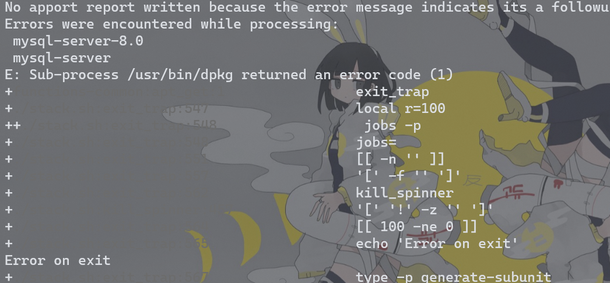

```bash
update-alternatives: error: alternative path /etc/mysql/mysql.cnf doesn't exist
```

### 3.2. 原因

未知

### 3.3. 解决方法

```bash
sudo apt-get remove --purge mysql-\*
sudo apt-get install mysql-server mysql-client
```

### 3.4. 成功表现

### 3.5. 参考资料

* [Mysql 候选项路径/etc/mysql/mysql.cnf不存在](https://blog.csdn.net/qq_24210421/article/details/53261436)

## 0x04 创建实例出错

### 4.1. 表现


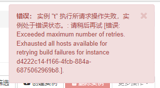

【忘了怎么诊断问题的了orz，应该是用`journeltcl`看的……

### 4.2. 原因

创建实例本质是创建一个虚拟机，而 WSL 默认不支持嵌套虚拟化，  
所需需要开启 WSL 的嵌套虚拟化。

### 4.3. 解决方法

**注意**：只有 Windows 11 才能开启 WSL(2) 的嵌套虚拟化，详见“参考资料 1”。

这里的解决方法：用 Hyper-V 安装一个 Windows 11 的虚拟机，然后再安装 WSL 2，这个时候 WSL 2 会**默认支持嵌套虚拟化**。  
【不用 VMWare 的原因是因为开了 WSL 后 VMWare 一直不支持嵌套虚拟化，懒得用了……

### 4.4. 成功表现

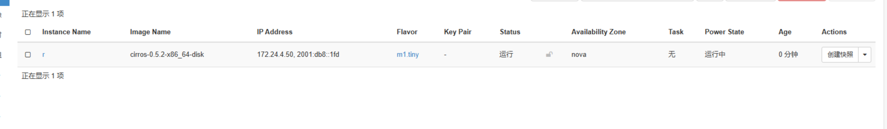  


### 4.5. 参考资料

1. [WSL 中的高级设置配置 - 主要 WSL 设置](https://learn.microsoft.com/zh-cn/windows/wsl/wsl-config#main-wsl-settings)  
   在表格中的`nestedVirtualization`说了**只有 Windows 11 支持嵌套虚拟化**。
2. [*WSL2配置安装KVM*](https://blog.csdn.net/m0_46161993/article/details/114946221?spm=1001.2014.3001.5501)  
   在这里提到的".bat/.js"文件参考于[WSL Nested Virtualization](https://gist.github.com/steffengy/62a0b5baa124830a4b0fe4334ccc2606)，但该方法**只支持以前的 WSL 版本**（里面有提到怎么降级 WSL），  
   但但，降级后的 WSL 根进程为"init"，无法使用`systemctl`【**故该方法也不行**orz……

## 0x05 C-API 未启动

### 5.1. 表现

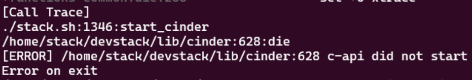

### 5.2. 原因

可能是虚拟机**内存不够**（可能要求 8G 以上）。

### 5.3. 解决方法

调！

### 5.4. 成功表现

安装成功。

### 5.5. 参考资料

1. [Error-Openstack Installation Cinder API did not Start](https://stackoverflow.com/questions/38262823/error-openstack-installation-cinder-api-did-not-start)  
   第二个回答，调整等待时间的方法没试过。

## 0x06 各种网络问题

### 6.1. 表现

好像之前 pip 安装的时候报了很多次 HTTP 500 错误，  
还以为是非网络问题，结果就是。

### 6.2. 原因

网络问题！

### 6.3. 解决方法

重新安装即可。

```sh
./unstack.sh && ./clean.sh && ./stack.sh
```

### 6.4. 成功表现

不能保证稳定成功，但成功后就不会报网络问题。

### 6.5. 参考资料

无！

## 0x07 挂载硬盘出错

### 7.1. 表现

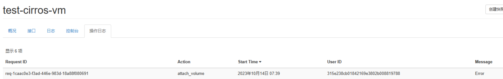

### 7.2. 原因

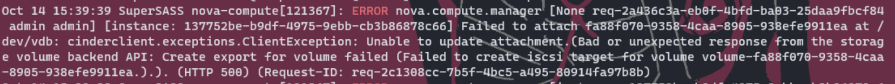  
关键："Failed to create iscil target for volume id:"。

经过查找资料，发现"devstack"使用的"lioadm"（而不是网上找的很多"tgtadm"），即`cinder-rtstool`这个工具来管理 target 的（见参考资料 1）。

那么手动使用该工具，输入`cinder-rtstool get-targets`，报错：  
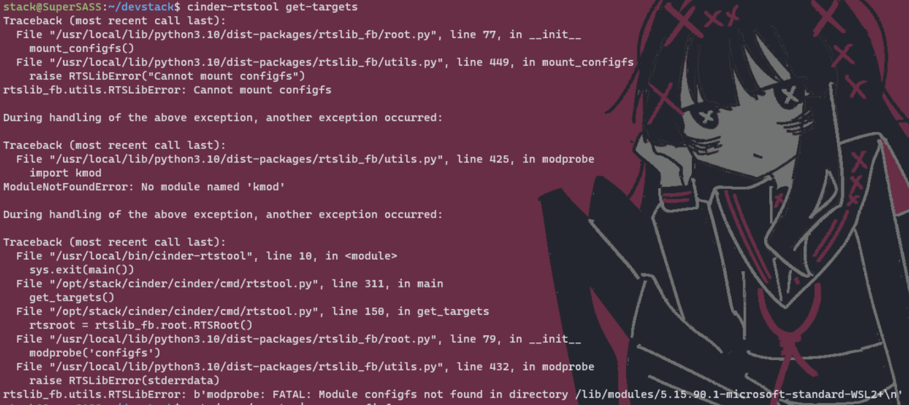  
发现"Cannot mount configfs"这个关键错误。

然后编译内核。

如果出现错误："make: *** [Makefile:1080: vmlinux] Error 137"，可以查看“参考资料 3”。

### 7.3. 解决方法

# 886咯您嘞，谁爱解决解决……

### 7.5. 参考资料

1. [openstack cinder 使用LVMVolumeDriver 时。虚拟机NovaException: iSCSI device not found问题](https://blog.csdn.net/zhongbeida_xue/article/details/103215553)  
   没看前面，只看到后面使用`cinder-rtstool`工具，于是顺着下找。
2. [如何让内核生成对应KO文件](https://blog.csdn.net/duhui75/article/details/128542926)  
   在最后有"configfs"在`make menuconfig`的位置。
3. [编译内核常见错误](https://blog.csdn.net/weixin_44723661/article/details/116749959)
