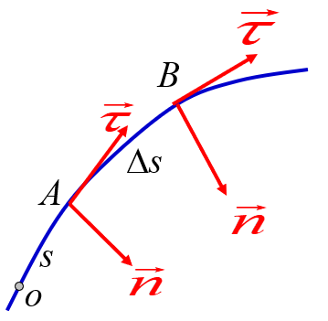
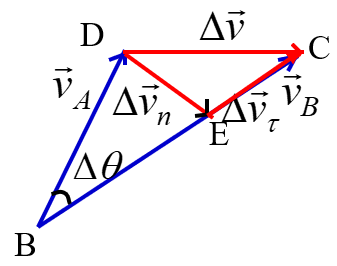
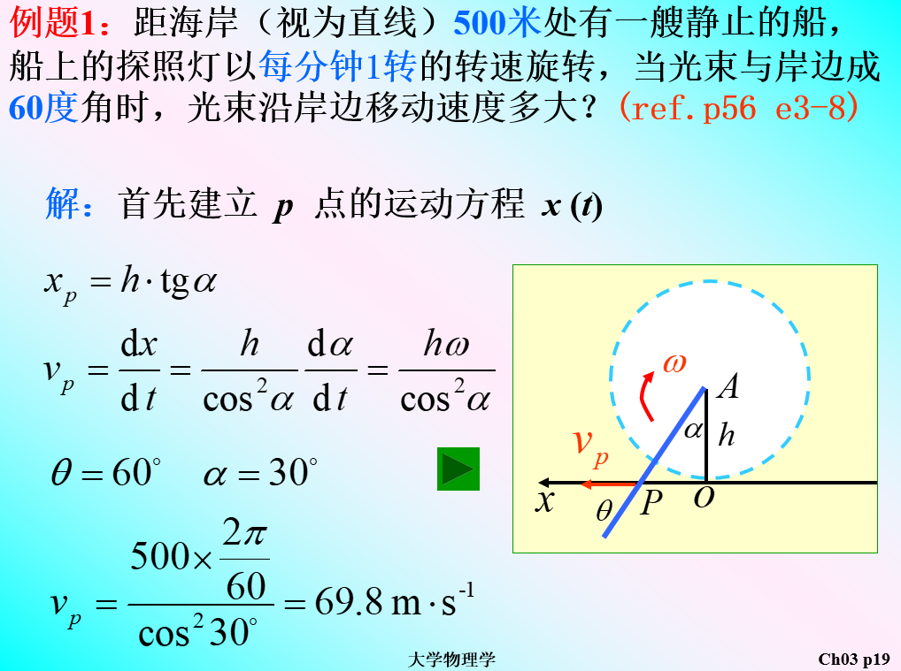
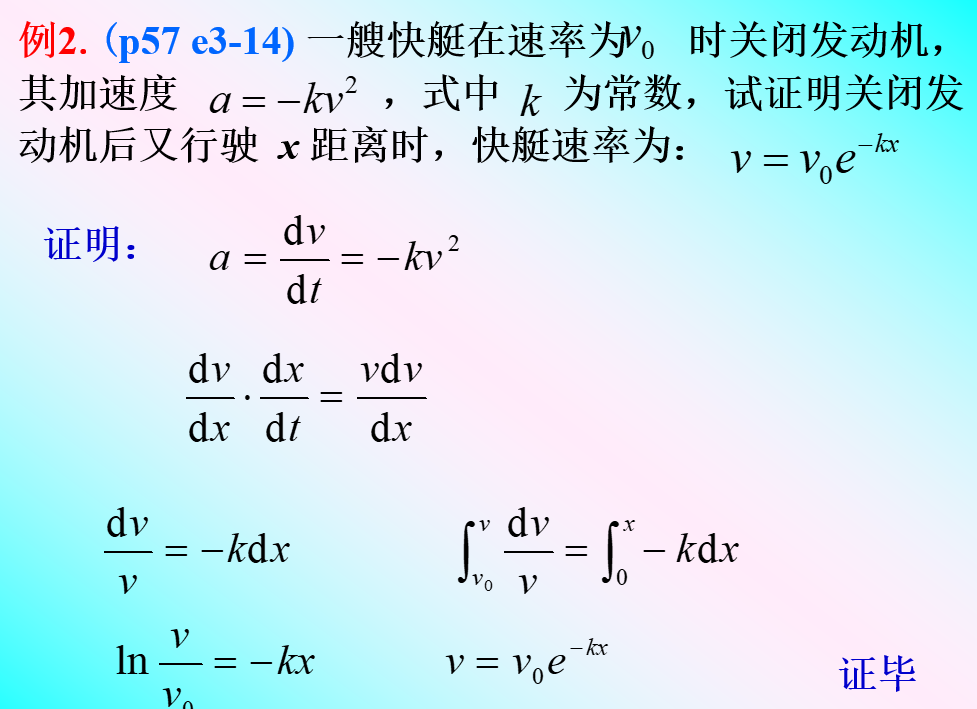

# Ep.3 运动的描述

## 第一节 质点、质点系和刚体

* 刚体：一系列质点组成的物体，**两两之间距离确定**。

## 第二节 参考系和坐标系

* 参考点：描述一个物体的运动时，选定的另一个（或一些）做**为参考的物体**。
* 坐标系：定量的描述物体的**空间位置**，在选定的参考点上建立的带有标尺的数学坐标。
  * 直角坐标系
  * 极坐标系
  * 柱坐标系
  * 球坐标系
  * 自然坐标系（径切坐标系）
* 同步时钟系：定量描述物体的**时间位置**，建立同步时钟。

以上三者合起来为参考系：

* 参考系：描述物体运动时用其他物体做**参考点**，用**同步时钟系**描述不同时间，用**坐标系**描述物体与参考点的相对位置，以**描述此物体时间空间状态的系统**。

## 第三节 运动的描述

### 一、矢量

1. 描述质点在空间的位置——**位置矢量**
   $$
   \vec{r}=x\vec{i}+y\vec{j}+z\vec{k}
   $$
2. 描述质点位置变动的大小和方向——**位移矢量**
   $$
   \vec{AB}=\vec{r_B}-\vec{r_A}=\Delta\vec{r}
   $$
   是位置矢量的差。
3. 描述质点运动的快慢和方向——**速度矢量**
4. 描述质点速度大小、方向变化的快慢——**加速度矢量**

> 注意位移和路程、速度和速率的区别：
>
> * 位移的模不等于路程，一般小于路程，$|\Delta\vec{r}|\le\Delta s$。  
>   只有在直线运动、或者曲线运动且$\Delta t\to0$才数值相等。
> * 平均速度的大小不等于平均速率，$|\bar{\vec{v}}|\ne\bar{v}$（因为$\Delta\vec{r}\ne\Delta s$）
> * 速度的模等于速率，$|\vec{v}|=v$（因为$t\to0$时，$\textrm{d}\vec{r}=\textrm{d}s$）

### 二、自然坐标系和加速度

#### 1. 自然坐标系

> 定义 - 自然坐标系：
>
> 原点固定于运动原点，坐标轴沿质点运动轨迹的切向(运动方向为正，记为$e_\tau$)和法向(以指向曲线凹侧的方向为正，记为$e_n$)，这样的坐标系为自然坐标系。

* 位置：在轨道上取一参考点$O$，质点距离$O$的**路程长度**$s$，可确定指点位置。$s$存在正负之分。
* 速度：为该点沿轨迹的**切线**方向，大小与速率$v=\frac{\textrm{d}s}{\textrm{d}t}$相同。  
  可以将速度表示为$\vec{v}=\frac{\textrm{d}s}{\textrm{d}t}\vec{\tau}$，其中$\vec{\tau}$为切向的单位向量。

#### 2. 加速度

加速度：$\vec{a}=\vec{a}_\tau+\vec{a}_n$

* 切向加速度：$\vec{a}_\tau=\frac{\text{d}v}{\text{d}t}\vec{\tau}$  
  为**速率**对时间的一阶导，乘上**切向的单位向量**。  
  > 来源：
  >
  > $\vec{v_{\tau}}'=v'$，切向上速度变化就是速率变化。

  描述速度大小改变的快慢，不影响速度的方向。
* 法向加速度：$\vec{a}_n=\frac{v^2}{\rho}\vec{n}$，  
  为**速率的平**方除以**曲率半径**，乘上法向的单位向量。  
  其中$\rho$为曲率半径，为曲率（圆心角对路程的一阶导）的倒数，$\frac{1}{\rho}=\frac{\textrm{d}\theta}{\textrm{d}s}$。  
  > 来源：
  >
  > $$
  > \lim_{\Delta t\to0}\frac{\Delta\vec{v_n}}{\Delta t}
  > $$
  > 由于时间间隔短，可以用$\Delta\vec{v_n}$的那段圆弧来代替它，即$\Delta\vec{v_n}=v\Delta\theta$，  
  > $$
  > \therefore\lim_{\Delta t\to0}\frac{\Delta\vec{v_n}}{\Delta t}=v\frac{\textrm{d}\theta}{\textrm{d}t}\vec{n}=v\frac{\textrm{d}s}{\textrm{d}t}\frac{\textrm{d}\theta}{\textrm{d}s}\vec{n}=\frac{v^2}{\rho}\vec{n}
  > $$

  描述速度方向改变的快慢，不影响速度的大小。

速度加速度的值不等于速率加速度，即$|\vec{v}'|\ne v'$

### 三、圆周运动的角量描述

* 线量：在自然坐标系下，以运动曲线为基准的基本参量。
* 角量：在极坐标系下，以旋转角度为基准的基本参量。

#### 1. 参量

* 角位置$\theta$
* 角位移$\Delta\theta$（以**逆时针为正**）
* 角速度
  * 平均角速度$\bar\omega=\frac{\Delta\theta}{\Delta t}$
  * （瞬时）角速度$|\omega|=\frac{\textrm{d}\theta}{\textrm{d}t}$  
    方向：采用右手法则——垂直运动平面，四指沿旋转方向，大拇指指向即为角速度矢量$\vec{\omega}的方向$。
* 角加速度  
  单位：$\textrm{rad/s}^2$
  * 平均角加速度$\bar\beta=\frac{\Delta\omega}{\Delta t}$
  * （瞬时）角加速度$|\beta|=\frac{\textrm{d}\omega}{\textrm{d}t}=\frac{\textrm{d}^2\theta}{\textrm{d}t^2}$

#### 2. 角量和线量的关系

$$
\textrm{线量}=R\cdot\textrm{角量}
$$

* 位置-角位置：$s=R\theta$
* 路程-角位移：$\Delta s = R\Delta\theta$
* 速率-角速度：$v=R\omega$
* 切向加速度-角加速度：$a_\tau=R\beta$
* ⭐径向加速度-角速度平方：$a_n=R\omega^2$  
  来源：$a_n=\frac{v^2}{\rho}$，圆中$\rho=R$，代入得。

### 四、刚体的运动

一共两类基本运动：

* 平动：各质点的速度、加速度、轨道均相同。
* 转动：质点都绕同一直线作圆周运动，一般为定轴转动。

对于定轴转动：不同点运动的线量可能不同，但**角量一定相同**。

## 第四节 运动学的两类基本问题

主要分为微分问题和积分问题。

> 例1 - 微分问题：
>
>   
> 已知路程阶$x$（对应题中的$h$），求速度阶$v$，路程→速度，故利用路程阶求微。
>
> 例2 - 积分问题：
>
>   
> 已知加速度阶$a$（对应题中的$a$），求速度阶$v$，加速度→速度，故利用加速度阶求积。

## 第五节 相对运动

只有相对确定的参考系才能具体描述物体的运动，  
选择的参考系不同，对同一物体的描述不相同。

## 二、低速下的变换

$$

