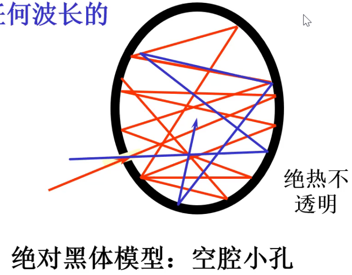
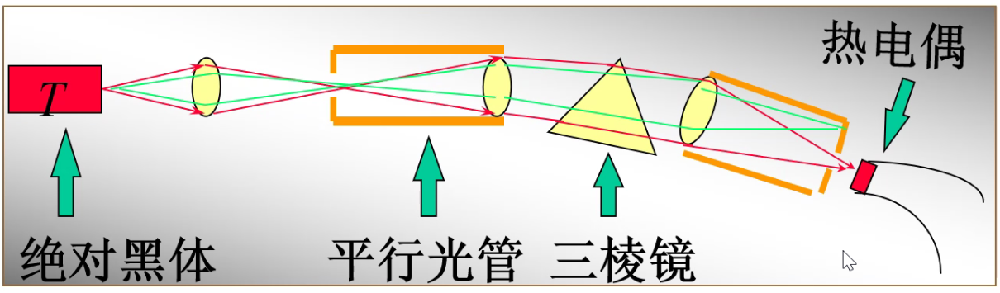
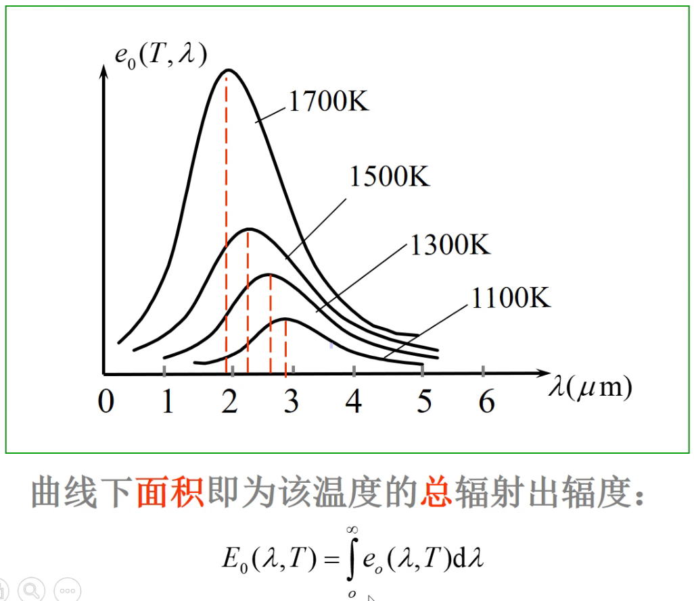
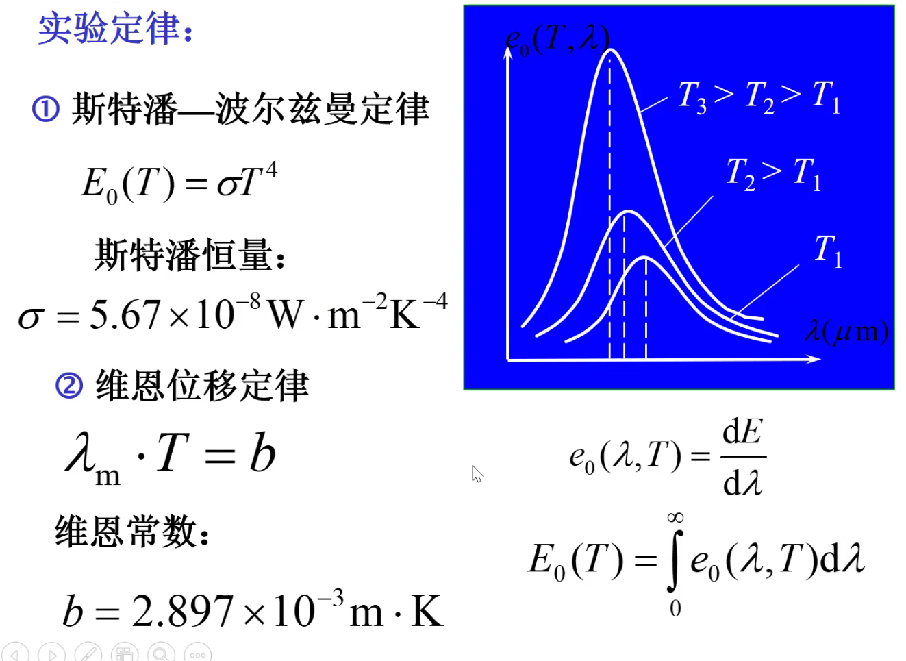
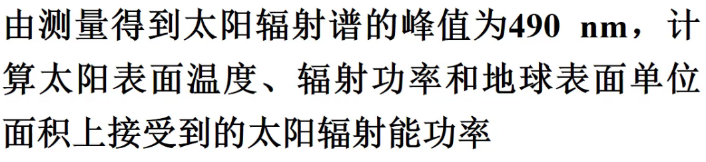
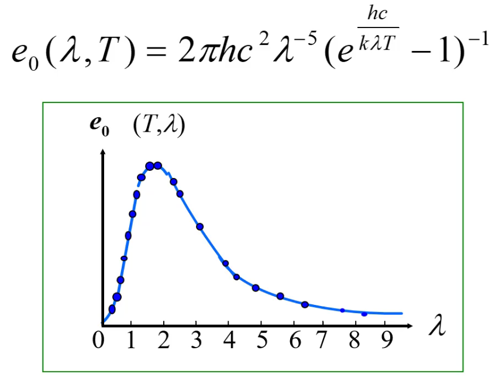

# 第一节 热辐射 普朗克能量子假设

## 一、热辐射

### 1. 定义

> 定义 - 热辐射：
>
> 一切物体都以电磁波形式向外辐射能量，其功率和波长取决于物体的温度。  
> 称为热辐射。

物体辐射能量的同时，又吸收周围其他物体的辐射能，  
当“辐射 = 吸收”时，其温度不变。  
称为平衡热辐射。

> 例子：
>
> 1. 固体温度升高时，颜色发生变化，是因为其热辐射发生变化。  
> 一般来说，**温度越高的物体，其热辐射的短波（高频率波）越丰富（占比越高）**。
> 2. 不同物质加热到同一温度，颜色不同。

### 2. 绝对黑体

是研究热辐射最简单理想的模型。

一般的物体对外来辐射能量的吸收、反射具有选择性，  
便于研究，提出了绝对黑体。

> 定义 - 绝对黑体：
>
> 能全部吸收（不反射）任何波长的入射辐射能的物体。  
> 称为绝对黑体。

**实验室的绝对黑体模型：**  
利用绝热不透明的材质制成球体，并在其表面上开一个小孔。  
  
这样电磁波射入后，会在里面不断反射，几乎不会射出。

⚠注意：黑体≠黑色物体。  
一些没法入射的会反射，同时自身还会辐射电磁波。  
比如太阳则是一种黑体。

而黑色物体，则不会辐射可见光（但还是会辐射不可见光）。  
对于黑洞，则完全不会辐射任何波。

### 3. 绝对黑体的热辐射定律

实验发现：黑体的电磁辐射能力与吸收能力一致。  
黑体即是完全吸收体，也是理想发射体。

定义两个物理量：

* 单色辐射本领：  
  **单位时间**内从物体表面**单位面积**上发射的波。  
  为长度$\lambda\rightarrow\lambda+\textrm{d}\lambda$范围内的辐射能，与波长间隔$\textrm{d}\lambda$之比。
  $$e_0(\lambda,T)=\frac{\textrm{d}E}{\textrm{d}\lambda}$$

* 总辐射本领：
  **单位时间**内从物体表面**单位面积**上，发射的各种波长的**总辐射能**。
  $$E_0(\lambda,T)=\int_0^\infty e_0(\lambda,T) \textrm{d}\lambda$$

测定黑体单色辐射本领$e_0(\lambda,T)$，按波长分布的实验装置：  

测量后得到如下实验曲线：  
  

不同温度，都有一个最大辐出波长。

* 随着温度升高，最大辐出波长向短波方向移动。
* 随着温度的升高，总辐射本领升高。

---

实验定律：

1. 斯特潘-玻尔兹曼定律：$E_0=\sigma T^4$  
   斯特潘衡量$\sigma$
2. 维恩位移定律：$\lambda_m\cdot T=b$  
   维恩常数$b$

> 例题：  
> 
>
> 1. 表面温度：  
>    利用维恩位移定律 - $T=\frac{b}{\lambda_m}$。
> 2. 辐射功率：  
>    先利用斯特潘公式算出单位面积的辐射本领（功率） - $E_0=\sigma T^4$，  
>    再乘上表面积得到总辐射功率 - $P=E_0\cdot4\pi R^2$。
> 3. 地球表面单位面积接受的太阳辐射功率：  
>    用总辐射功率除以以日的距离为半径的球体的表面积 - $w=\frac{P}{4\pi d^2}$
> 4. 地球表面接收到的太阳辐射能功率：  
>    用单位面积辐射功率乘表面积 - $W=w\cdot \pi r^2$

## 二、经典物理的困难

尝试从经典物理理论推到$e_0(\lambda,T)$函数表达式：

1. 瑞利-金斯公式：长波与实验曲线吻合，但短波相差很大（紫外灾难）
2. 维恩公式：短波与实验曲线接近，长波相差很大。

由此可见经典物理学难以解释热辐射现象。

## 三、普朗克能量子假说

### 1. 经验公式

普朗克**通过东拼西凑**（将上两个公式组合在一起），  
偶然得到一个公式。

之后普朗克得出了一个物理解释，提出能量子假设模型。  
*但本人对其解释却感到难以置信。*

### 2. 能量子假设

1. 黑体：由大量包含各种固有频率$\nu$的谐振子组成的系统。
2. 谐振子的能量的变化是**不连续**的，只能以某个**基本单元$\epsilon_0$的整数倍跳跃性**的增减。
3. 能量子能量：$\epsilon_0=h\nu$，  
   $h$称作朗克常量。

> 与经典物理学的矛盾：
>
> 1. 推翻了“一切自然过程连续”的经典原理。*（微积分的使用便是基于连续的经验）*
> 2. 同经典物理中能量的概念不相容，经典能量值不存在最小单元。

### 3. 意义

1. 解决黑体辐射的困难。
2. 引入能量量子化概念，是量子物理的开端。
3. 普朗克常量$h$是物理学最基本最重要的常数之一。
