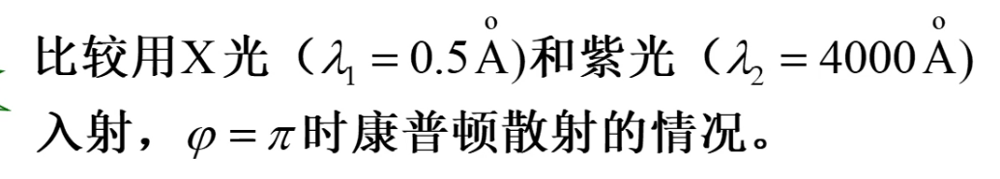

# 第二节 爱因斯坦光子理论

普朗克的能量子假设存在两难问题：

1. 只有谐振子能量变化是分立的，才能导出他的黑体辐射公式
2. 黑体空腔内的辐射场应该遵循麦克斯韦方程，能量变化应该是连续的。

他构想了一种矛盾设想，  
后经爱因斯坦的研究，提出光量子理论，消除了这种矛盾。

> 光电子假设：
>
> 爱因斯坦认为，既然带电谐振子辐射和吸收光的时候能量具有分立性，  
> 因此直接认为光本身的能量具有分离性。

因此爱因斯坦假设光是一种粒子流，  
频率为$\nu$的光波的每一个粒子，对应能量$E=h\nu$

## 一、光电效应

> 定义 - 光电效应：
>
> 当光照射在某种金属导体上时，可能使金属中的电子逸出金属表面。  
> 这种现象称为光电效应。

### 1. 光电效应实验规律

1. 光电效应是瞬时发生的。  
   一照射光，便在极短的时间内产生电流。
2. 入射光频率一定，饱和光电流与入射光强成正比。  
     
   截止电压：施加一反向电压，使得电流恰好为$0$，即没有光电子定向移动到阳极。  
   说明光电子具有初动能，且跟光强没有关系。
3. 光电子的初动能，和光的频率成正比。  
   $$eU_a=\frac{1}{2}mv_\textrm{m}^2$$
   
4. 对于任何金属，都存在一个红限频率$\nu_0$。  
   只有$\nu>\nu_0$才有光电效应发生。

### 2. 经典电磁波理论的困难

认为光电子是因为吸收光波的能量而逃逸，当逃逸到一定程度时则产生电流。  
但无论光强度（能量）如何高、时间如何长（吸收足够能量），  
只要低于红线频率，都不能发生光电效应。

### 3. 爱因斯坦光子理论

1. 光是以光速运动的光子流。
2. 每个光子能量和动量：
   $$E=h\nu=\frac{hc}{\lambda}$$
   $$p=mc=\frac{E}{c}=\frac{h}{\lambda}$$
3. 光强是光的能流密度：$I=Nh\nu$  
   $N$ - 单位时间通过垂直于光传播方向上的单位面积的光子数。  
   故光强跟0光子的数目有关。

### 4. 光电效应方程

由能量守恒知：  
入射光子能量 = 逸出做功 + 光电子初动能
$$h\nu=A+\frac{1}{2}mv_\textrm{m}^2$$

又因为：

* 光电子初动能与截至电压有关：$\frac{1}{2}mv_\textrm{m}^2=eU_a$
* 逸出功跟红外频率有关：$A=h\nu_0$（只与材料有关）

得出如下图像：

### 5. 对光电效应解释

1. 电子只要吸收一个光子，就可以从金属表面逸出。  
   故无需时间的累计过程。
2. 光强大，光子数多，释放的光电子多，  
   所以饱和光电流也大。
3. 光电子的初动能与照射光的频率成线性关系。  
   $\frac{1}{2}mv_\textrm{m}^2=h\nu-A$  
4. 初动能为零时，可以得到红线频率：  
   $\nu_0=\frac{A}{h}$

## 二、康普顿效应

### 1. 康普顿效应实验规律

实验装置 - X光被石墨散射。

实验规律：

1. 散射光分为两种
   1. 瑞利散射 - 原波长$\lambda_0$成分
   2. 康普顿散射 - $\lambda>\lambda_0$成分
2. 波长改变量：  
   只跟散射方向$\varphi$有关，不与$\lambda_0$和散射物质有关。  
   $\varphi\uparrow \rightarrow \Delta\lambda\uparrow$  
   $I_\lambda\uparrow \rightarrow I_{\lambda_0}\downarrow$
3. 原子量越小的物质，康普顿效应越显著。  
   $\varphi, \Delta\lambda$一定，轻元素散射的$\frac{I_\lambda}{I_{\lambda_0}}$较大。

  
规律1、2
  
规律2、3

### 2. 经典物理理论问题

1. 不应该出现新频率成分的光
2. $90\degree$处不应该存在光。

### 3. 光子理论解释

基本思想：X射线是一种光子流。  
散射物资由原子实和外层电子构成。

碰撞情况：

* 弹性碰撞
* ~~非弹性碰撞~~（光子、电子为点粒子，无形变，不考虑这个）
* 完全非弹性碰撞

1. 完全非弹性碰撞  
   光子被电子吸收，能量增加。  
   当能量足够大时逃逸，形成光电效应。
2. 弹性碰撞  
   光子跟内层电子作用时，因为内层电子束缚强，故相当于光子跟原子作用。  
   因为$M_\textrm{光}<<M_\textrm{原}$，故光子能量不变$\Delta\lambda=0$。  
   为瑞利散射。

   光子跟外层电子作用时，因为外层电子束缚弱，故相当于光子跟自由电子作用。  
   光子能量减少，$\nu\downarrow, \lambda\uparrow$，解释出为什么产生波长更长的光。同时电子反冲。  
   为康普顿散射。

   原子量较小的物质，外层电子占比更大，故康普顿散射更明显。

### 4. 定量计算

光子能量远大于自由电子热运动能量，可以忽略。

注意不能用牛顿力学，而要用相对论。

最终得到式子：
$$\Delta\lambda=\frac{2h}{m_0c}\sin^2\frac{\varphi}{2}$$
令$\lambda_c=\frac{h}{m_0c}$，称为电子的康普顿波长。  
则$\Delta\lambda=2\lambda_c\sin^2\frac{\varphi}{2}$

意义：

1. 证明

> 例题 1：
>
> 
>
> 
>
> 例题 2：
>
> 
>
>   
> 

## 三、光的波粒二象性

光的不同性质体现在不同过程中：

* 波动性：突出表现子传播过程中。（干涉、衍射）
* 粒子性：突出表现在与物质相互作用中。（光电效应、康普顿效应）

故光不能单纯用波动和粒子来描述光的性质。  
既不是经典的波，也不是经典的粒子。

> 经典粒子、经典波、量子力学体力中的粒子和波，三者区别：
>
>   

对于光子：

$E=h\nu=\frac{hc}{\lambda}$  
$P=mc=\frac{h}{\lambda}$  
前者为粒子性，后者为波动性。

$\left.\begin{array}{l}I \propto A^{2} \\I \propto N\end{array}\right\} N \propto A^{2}$  
振幅越大，光子数密度越大，光子到达该处的概率越大。  
故光也是一种概率波。
