# 第二节 爱因斯坦光子理论

普朗克的能量子假设存在两难问题：

1. 只有谐振子能量变化是分立的，才能导出他的黑体辐射公式
2. 黑体空腔内的辐射场应该遵循麦克斯韦方程，能量变化应该是连续的。

他构想了一种矛盾设想，  
后经爱因斯坦的研究，提出光量子理论，消除了这种矛盾。

> 光电子假设：
>
> 爱因斯坦认为，既然带电谐振子辐射和吸收光的时候能量具有分立性，  
> 因此直接认为光本身的能量具有分立性。

因此爱因斯坦假设光是一种粒子流，  
频率为$\nu$的光波的每一个粒子，对应能量$E=h\nu$

## ⭐一、光电效应

*之前的光都认为只具有波动性。*

> 定义 - 光电效应：
>
> 当光照射在某种金属导体上时，可能使金属中的电子逸出金属表面。  
> 这种现象称为光电效应。

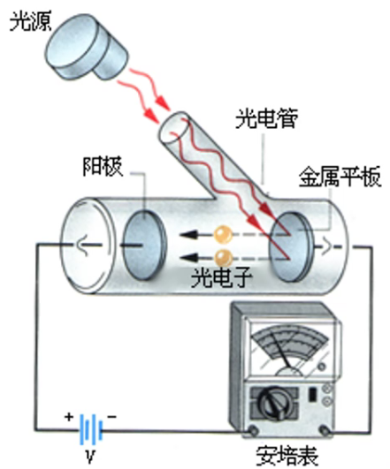

### 1. 光电效应实验规律

1. 瞬时发生：

   光电效应是瞬时发生的。  
   一照射光，便在极短的时间内产生电流。
2. 饱和光电流 - 与光强有关：

   入射光频率一定，**饱和光电流**$i_s$与**入射光强**$I$成正比。  
   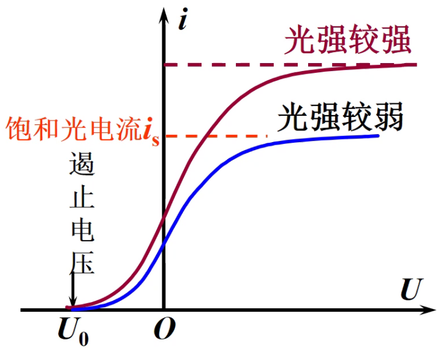

   * 截止电压：施加一反向电压，使得电流恰好为$0$，即没有光电子定向移动到阳极。  
3. 初动能 - 与频率有关：

   *由上图中的截止电压可知：*  
   *说明光电子具有初动能，可用截止电压来表示。且初动能且跟光强没有关系。*

   光电子的**初动能**（截至电势差），和**光的频率**成正比。  
   $$E_{k0}=eU_a=\frac{1}{2}mv_\textrm{m}^2$$
   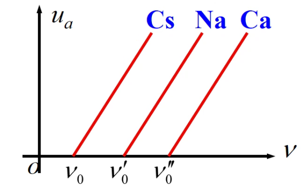
4. 红限频率 - 与材料有关：

   对于任何金属，都存在一个红限频率$\nu_0$。  
   只有$\nu>\nu_0$才有光电效应发生。

### 2. 经典电磁波理论的困难

认为光电子是因为吸收光波的能量而逃逸，当逃逸到一定程度时则产生电流。  
但经典理论认为**光的能量是跟光强有关系**的，而不是与频率有关系。**初动能应该与光强有关**。

且无论光强度（“能量”）如何高、时间如何长（吸收足够能量），只要低于红限频率，都不能发生光电效应。  
但经典理论认为电子在电磁波下做受迫振动，只要吸收足够能量就能溢出，**不应该存在红限频率**。

同时能量积累需要时间，**不可能是瞬时**的。

### 3. 爱因斯坦光子理论

1. 光是以光速运动的光子流。
2. 每个光子能量和动量：
   $$E=h\nu=\frac{hc}{\lambda}$$
   $$p=mc=\frac{E}{c}=\frac{h}{\lambda}$$
3. 光强是光的能流密度：$I=Nh\nu$  
   $N$ - 单位时间通过垂直于光传播方向$\vec{c}$上的单位面积的光子数。  
   故光强跟光子的数目有关。

### 4. 光电效应方程

由能量守恒知：  
入射光子能量 = 逸出做功 + 光电子初动能
$$⭐h\nu=A+\frac{1}{2}mv_\textrm{m}^2$$
为“**光电效应方程**”。

又因为：

* 光电子初动能与截至电压有关：$\frac{1}{2}mv_\textrm{m}^2=eU_a$
* 逸出功跟红外频率有关：$A=h\nu_0$（只与材料有关）

得出如下图像：
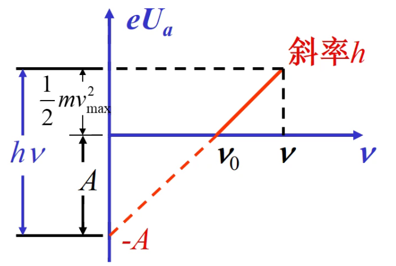

### 5. 对光电效应解释

1. 瞬时发生的解释：

   电子只要吸收一个光子，就可以从金属表面逸出。  
   故无需时间的累计过程。
2. 饱和光电流的解释：

   由$I=Nh\nu$知：光强大，光子数多，释放的光电子多，  
   所以饱和光电流也大。
3. 初动能的解释：

   由光电效应方程知：$\frac{1}{2}mv_\textrm{m}^2=h\nu-A$  
   光电子的初动能与照射光的频率成线性关系。
4. 红限频率的解释：

   初动能为零时，可以得到红限频率：  
   $\nu_0=\frac{A}{h}$

## 二、康普顿效应

只是一种对光电效应的验证。

### 1. 康普顿效应实验规律

实验装置 - X光被石墨散射。
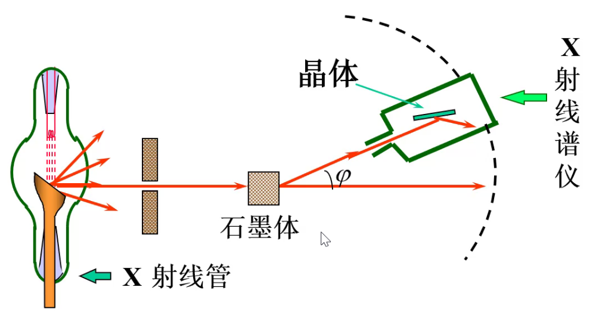

实验规律：

1. 散射光分为两种
   1. 瑞利散射 - 原波长$\lambda_0$成分
   2. 康普顿散射 - $\lambda>\lambda_0$成分
2. 波长改变量：  
   **仅跟散射方向$\varphi$有关**，不与$\lambda_0$和散射物质有关。  
   $\varphi\uparrow \rightarrow \Delta\lambda\uparrow$  
3. 原子量越小的物质，康普顿效应越显著：  
   $\varphi$一定（则$\Delta\lambda$也一定），轻元素散射的$\frac{I_\lambda}{I_{\lambda_0}}$较大。  
   *光强总和一定：故新波长成分越高，原波长成分越低：$I_\lambda\uparrow \rightarrow I_{\lambda_0}\downarrow$*

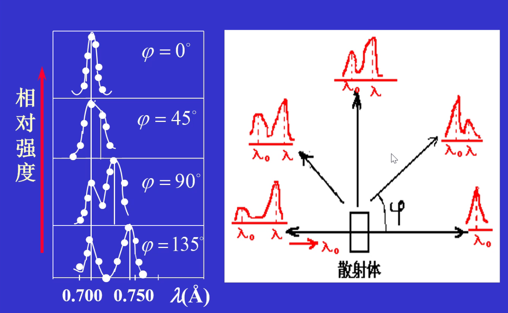  
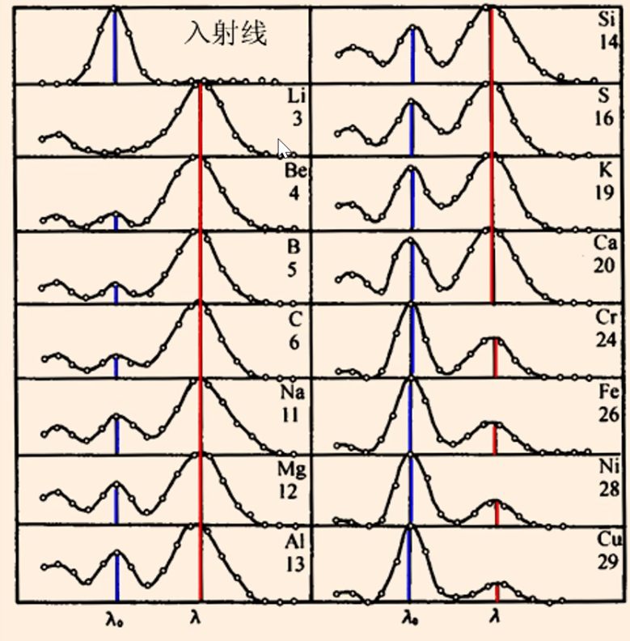

### 2. 经典物理理论问题

经典物理 - 光的波动说：

认为入射光以波长$\lambda_0$、频率$\nu_0$的电磁波入射，  
会使得散射物体里的电子**做受迫振动**，从而辐射出新的电磁波。

则出现问题：

1. 不应该出现新频率成分的光。  
   做受迫振动，则频率应该只跟原频率$\nu_0$一致。
2. $90\degree$处不应该存在光。

### 3. 光子理论解释

基本思想：X射线是一种光子流（粒子说）。

散射物质由原子和外层电子构成。
发生上述现象，主要由**光子和这两个物质的碰撞**形成。

由于只与微观粒子（原子、电子）作用，  
不同物质也是由这两种粒子组成（虽然原子不同，但对于光子来说都足够大），  
可以解释为什么$\Delta\lambda$与物质无关。

碰撞情况：

* 弹性碰撞
* ~~非弹性碰撞~~（光子、电子为点粒子，无形变，不考虑这个）
* 完全非弹性碰撞

1. *完全非弹性碰撞*  
   光子直接被电子吸收，能量增加。  
   当能量足够大时逃逸，形成光电效应。
2. **弹性碰撞**  
   * 光子跟内层电子作用时 - 为瑞利散射：  
     因为内层电子束缚强，故相当于光子**跟原子作用**。  
     因为质量$M_\textrm{光}\ll M_\textrm{原}$，故光子能量不变，$\Delta\lambda=0$，解释为什么存在原波长的光。

   * 光子跟外层电子作用时 - 为康普顿散射：  
     因为外层电子束缚弱，故相当于光子**跟自由电子作用**，且该电子动能远小于光子能量，可忽略**视为静止**。  
     光子能量减少，$\nu\downarrow, \lambda\uparrow$，解释出为什么产生波长更长的光。

   **原子量较小的物质，外层电子占比更大，故康普顿散射更明显。**

### 4. 定量计算

*自由电子热运动能量远小于光子能量，其可以忽略。*

碰前碰后光子和电子的能量与动量如图：  
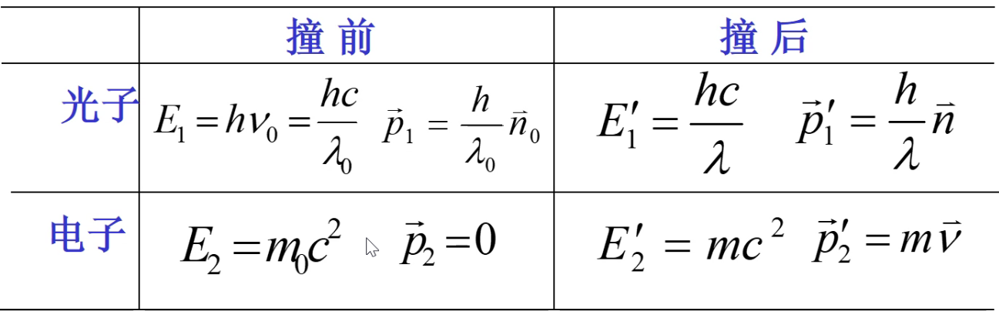  
*注意不能用牛顿力学的能量$E=\frac{1}{2}mv^2$，而要用相对论中的能量$E=mc^2$来算。*

根据能量守恒和动量守恒以及相对论的质速关系，  
最终得到式子：
$$\Delta\lambda=\frac{2h}{m_0c}\sin^2\frac{\varphi}{2}(=\frac{h}{m_0c}(1-\cos\varphi))$$

令$\lambda_c=\frac{h}{m_0c}\approx0.024\overset{\circ}{A}$，称为电子的康普顿波长，**为一个常数**。  
则$\Delta\lambda=2\lambda_c\sin^2\frac{\varphi}{2}$

意义：

1. 证明了爱因斯坦光子理论的正确性。
2. 证明了能量守恒、动量守恒定律的普适性。
3. 证明了相对论效应在宏观、微观均存在。

> 例题 1：
>
> 比较用X光($\lambda_1=0.5\overset{\circ}{A}$)，紫光($\lambda_2=4000\overset{\circ}{A}$)入射，$\varphi=\pi$时，康普顿散射情况。
>
> 解析：  
>
> 波长改变量只与$\varphi$有关，故相同，  
> 然后判断改变后波长与原波长的比例关系，得出康普顿效应显著情况。
>
> 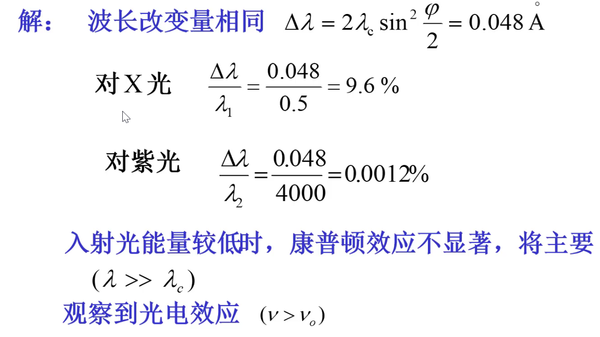
>
> 例题 2：
>
> $\lambda_0=0.1\overset{\circ}{A}$的光子与静止自由电子发生弹性碰撞，  
> 在$\varphi=90\degree$方向上：
>
> 1. 观测到的散射波长（反冲光子）的$\lambda$为多少？
> 2. 反冲电子的动能$E_k$、动量$p_e$为多少？
>
> 解析：
>
> 1. 散射波长：$\lambda=\lambda_0+\Delta\lambda=\lambda_0+2\lambda_c\sin^2\frac{\varphi}{2}$  
> 2. 反冲电子动能：为光子失去的能量 - $E_k=\Delta E=\frac{hc}{\lambda_0}-\frac{hc}{\lambda}$
> 3. 反冲电子动量：用动量守恒。知道反冲光子的方向为$90\degree$，且知道反冲前和反冲后的动量，两个方向正交分解相等即可。
>
> 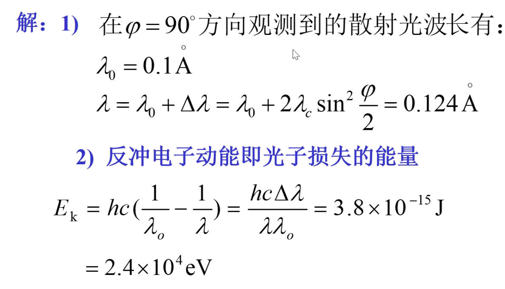  
> 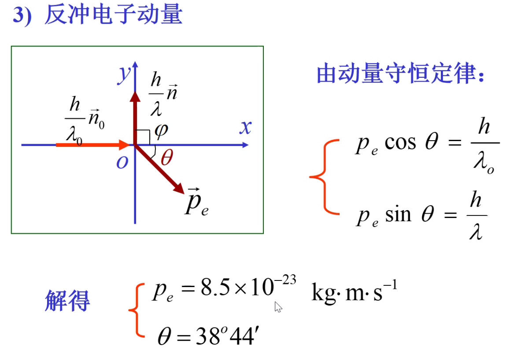

## 三、光的波粒二象性

光的不同性质体现在不同过程中：

* 波动性：突出表现子传播过程中。（干涉、衍射）
* 粒子性：突出表现在与物质相互作用中。（光电效应、康普顿效应）

故光不能单纯用波动和粒子来描述光的性质。  
既不是经典的波，也不是经典的粒子。

> 经典粒子、经典波、量子力学体力中的粒子和波，三者区别：
>
> 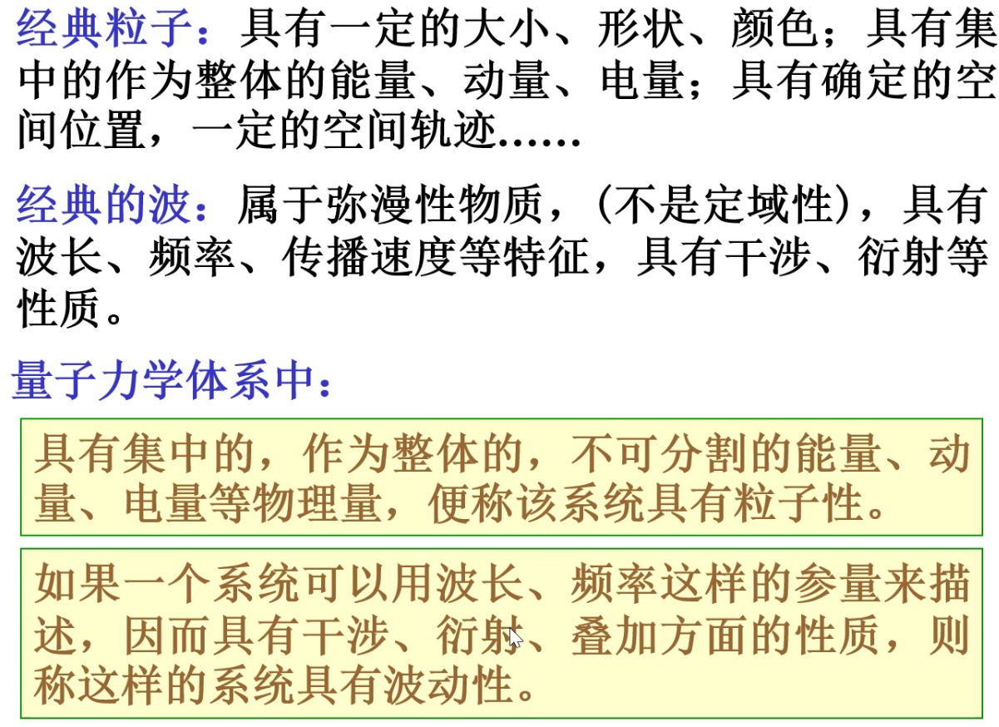  

* $\nu$越高,$\lambda$越短，$E$越大的光子，粒子性越显著
* $\nu$越低,$\lambda$越长，$E$越小的光子，波动性越显著

---

对于光子：

$E=h\nu=\frac{hc}{\lambda}$  
$P=mc=\frac{h}{\lambda}$  
$E,p,m$为粒子性，$\nu,\lambda$为波动性。

---

$\left.\begin{array}{l}I \propto A^{2} \\I \propto N\end{array}\right\} N \propto A^{2}$  
振幅越大，光子数密度越大，光子到达该处的概率越大。  
故光也是一种概率波。
