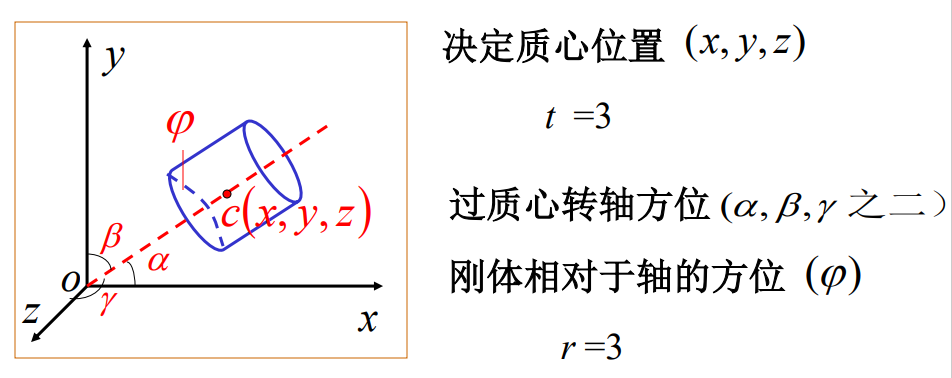
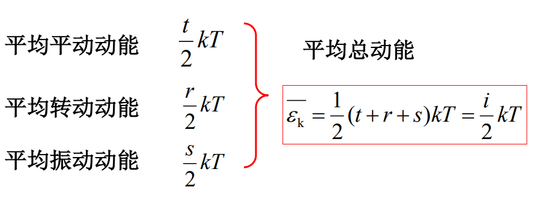

# 第四节 能均分定律、理想气体内能

即理想气体的内能（各种平动动能）这一能量的平均分配。

推导压强时，只考虑理想气体分子，故可以看作质点，  
二讨论能量问题时，要考虑分子内部结构，要看成质点组。

分子热运动包含三种：

* 平动
* 转动
* 分子内原子间振动

## 一、自由度

确定一个物体的**空间位置**所需独立坐标数。

总自由度数=平动自由度+转动自由度+振动自由度。  
$i=t+r+s$

1. 质点：  
   只有平动自由度，只需要$x,y,z$确定位置，$t=3$。

   则自由度：$l=t=3$  
   当运动受到限制时，自由度相应减少（如轮船，$t=2$）。
2. 刚体：
   * 平动：确定质心。  
     $t=3$
   * 转动：
     * 确定转轴：$r_1=2$（由三个角确定一条方向线，但两个角度确定后，第三个角度也会被确定）
     * 刚体相对于轴的方位：$r_2=1$  

     $r=3$

     

   则自由度：$l=6$  
   若定轴转动刚体：$l=1$（顺时针还是逆时针）
3. 双原子气体分子：  
   * 平动：质心。  
     $t=3$
   * 转动：只用考虑转轴。  
     $r=2$
   * 振动：相对距离。  
     $s=1$

   则自由度：$l=6$
4. 多原子气体分子：
   * 平动：质心。  
     $t=3$
   * 转动：转轴和相对转轴方位。  
     $r=3$
   * 振动：相对距离。  
     $s=3n-6$

   则自由度：$l=3n$

   若为刚体：$s=0$，自由度$l=6$

总结：

* 非刚体：
  * 单原子：$l=3$
  * 双原子：$l=6$
  * 多原子：$l=3n$
* 刚体：
  * 单原子：$l=3$
  * 双原子：$l=5$
  * 多原子：$l=6$

## 二、能均分定理

在温度$T$的平衡态下，物质（固体，液体，气体）分子的每一个可能的自由度，  
**都有相同的平均动能$\frac{1}{2}kT$**。

则分子的平均总动能：

$$
⭐\overline{\epsilon_k}=\frac{i}{2}kT
$$

*也就是分子的平均总动能被所有自由度均分。*

第二节算的$\overline{\epsilon_t}$只是平均平动动能，属于$t$自由度的。  
即温度公式中：$\overline{\epsilon_t}\xlongequal{i=t=3}\frac{3}{2}kT$，  
则每一个自由度的平均动能：$\frac{1}{2}kT$。

⚠注意：**对低温系统不成立**。

## 三、理想气体的内能

理想气体的内能只由平均总动能$\overline{\epsilon_k}$决定。

> 推导 - 理想气体的内能：
>
> 记分子数为$N$。  
> 内能=动能+势能
>
> * 所有分子的动能：  
>   $E_k=N\cdot\overline{\epsilon_k}=N\cdot\frac{i}{2}kT=N\cdot \frac{1}{2}(t+r+s)kT$
> * 分子间相互作用势能  
>   对于理想气体，不用考虑，无振动自由度$s=0$。
>
> 若为$1\textrm{mol}$的刚性分子理想气体：$E=N_A\frac{i}{2}kT=\frac{i}{2}RT$（$k=\frac{R}{N_A}$）  

最终，对于$N=\frac{m_g}{M}\textrm{mol}$的刚性分子理想气体：
$$
⭐E=\frac{m_g}{M}\frac{i}{2}RT
$$

单、双、多原子：  

刚性分子理想气体，**内能只与温度$T$呈正相关**。
