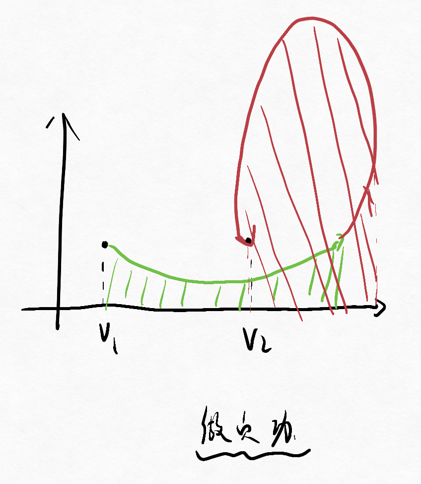

# 第一章 内能、功、热量

## 一、系统状态变化——热力学过程

* 非静态过程：中间状态不是平衡态  
  主要指系统变化的很快，整个系统来不及实现新的平衡，使得部分地方数值大、部分小，无法整体分析。
* 准静态过程（平衡过程）：过程进行得足够缓慢。  
  变化的很慢，使得每一次微小变化都能及时平衡，整个变化过程中均可看作平衡，可以整体分析。

---

相平面、相图：  
选取状态参量（$p,V,T$）为坐标变量。  
可以从三者中任选两个构成坐标系。

* 平衡态——对应相图中的点。
* 平衡过程——对应相图中的线。

## 二、系统内能

系统内能$E$：

* 广义：系统内所有粒子各种能量总和
* 狭义：所有分子**热运动能量**和分子间**相互作用势能**。

$E=E(T,V)$  
对于理想气体：$E=\frac{m_g}{M}\frac{i}{2}RT=E(T)$

内能只是状态函数，只与初末状态有关，与所经历过程无关，  
故可以选择最简单的过程进行计算。

内能变化方式：

1. 做功
2. 热传递

## 三、功

准静态过程的体积功：

$\textrm{d}A=\vec{F}\cdot\textrm{d}\vec{l}=pS\textrm{d}V=p\textrm{d}V$

$$
A=\int_{V_1}^{V_2}p\textrm{d}V
$$

示功图：$p-V$相图上过程曲线下的面积。  
**注意：只能为$p-V$图。**  
并且面积只有正的，但实际正负要根据系统做功情况来判断。

但需要注意，虽然$\textrm{d}V>0\rightarrow\textrm{d}A>0$，  
但不能说某过程$V_2>V_1$，则一定做正功。  
如下图：  

## 四、热量

1. 热量  
   热力学系统中，系统与外界通过热运动传递的能量，  
   用$Q$表示。

   * 系统从外界吸热，$Q>0$
   * 系统向外界放热，$Q<0$
2. 摩尔热容$C_m$：一摩尔物质改变$1K$温度所变化的热量  
   $C_m=cM$
   * 定容摩尔热容$C_{V,m}$  
     理想气体中：$C_V=\frac{i}{2}R$  
   * 定压摩尔热容$C_{p,m}$  
     理想气体中：$C_p=\frac{i+2}{2}R$
3. 功$A$与热量$Q$比较  
   * 做功：与宏观位移相联系，将机械运动和热运动能量相转换
   * 热传递：与温差相联系，将热运动和热运动能量相转换

