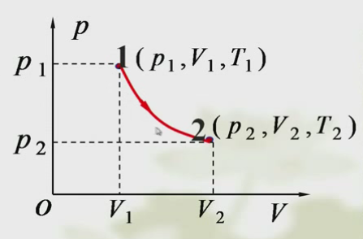
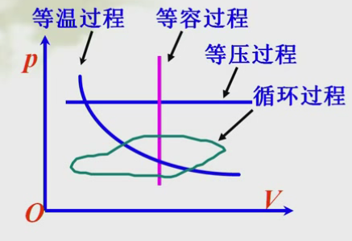
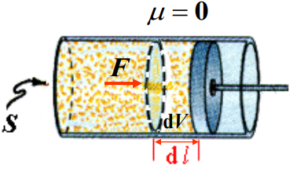
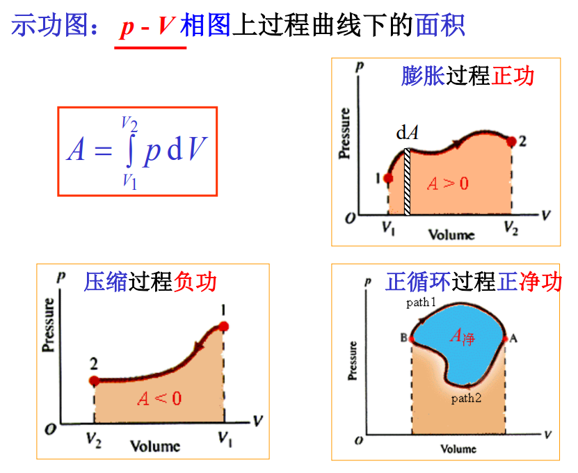
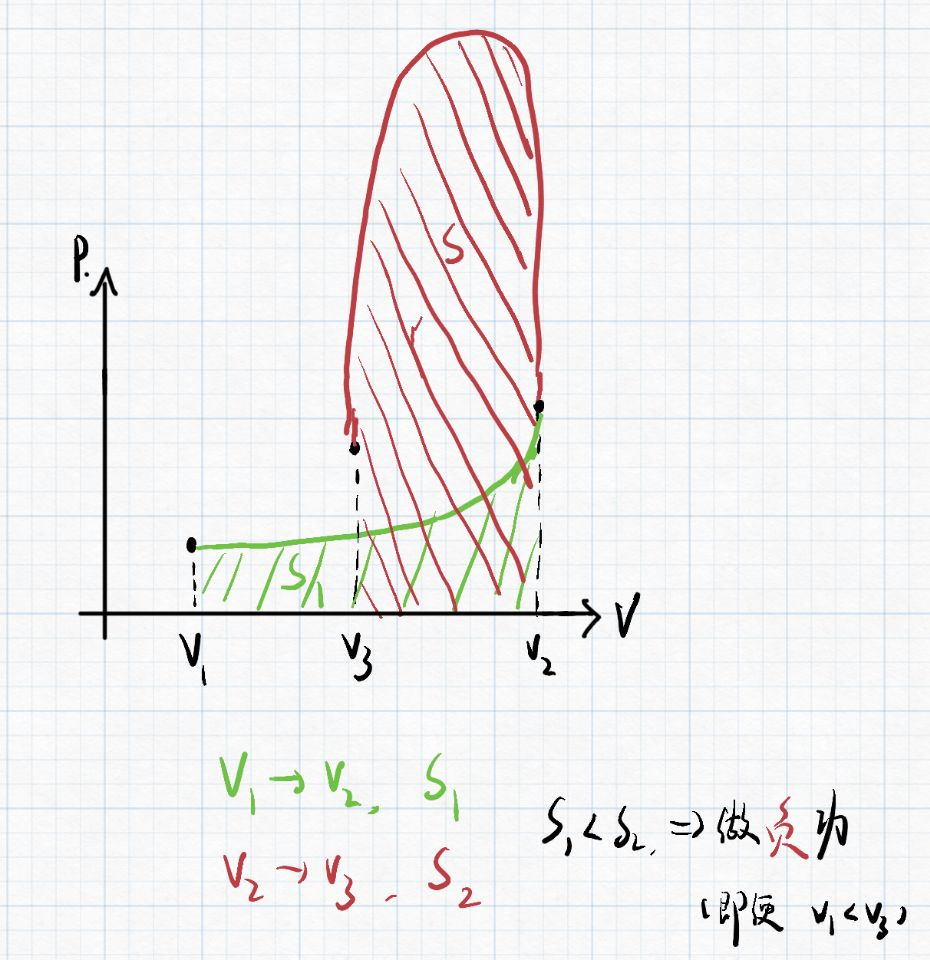
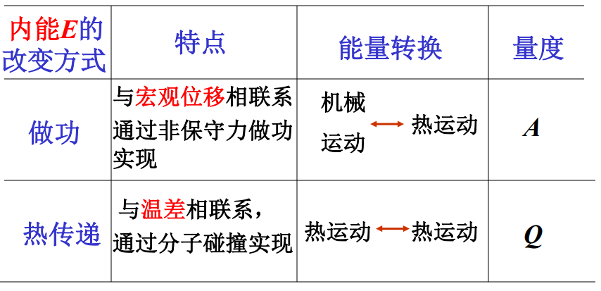

# 第一章 内能、功、热量

## 一、系统状态变化——热力学过程

过程，指系统在于外界能量交流的时候，他的状态发生了变化，  
最终的结果**从一个状态过度到另一个状态**。

* 非静态过程：中间状态不是平衡态。  
  主要指系统变化的很快，整个系统来不及实现新的平衡，使得部分地方数值大、部分小，无法整体分析。  
  如：气体自由膨胀。
* 准静态过程（平衡过程）：中间的每一个状态都可以近似当作平衡态。  
  过程进行得足够缓慢，使得每一次微小变化都能及时平衡，整个变化过程中均可看作平衡，可以整体分析。  
  如：气体等温膨胀。

## 二、相图

选取状态参量（$p,V,T$）为坐标变量，  
从三者中任选两个构成坐标系。

**只有准静态过程**能用相图表示。

一般都是$p-V$图，如下：  
  

* 平衡态——对应相图中的点。
* 平衡过程——对应相图中的线。  
  存在四种平衡过程如下：  
    

⚠注意：相图**并不只有$p-V$形式**，也可能是$V-T$等形式，注意区分。

## 三、系统内能

系统内能$E$：

* 广义：系统内所有粒子各种能量总和。
* 狭义：所有分子**热运动能量**和分子间**相互作用势能**。

$E=E(T,V)$  
对于理想气体：  
$$
⭐E=\frac{m_g}{M}\frac{i}{2}RT=E(T)
$$

内能只是状态函数，只与初末状态有关，与所经历过程无关，  
故可以选择最简单的过程进行计算。

内能变化方式：

1. 做功
2. 热传递

## 四、系统内能变化度量

### 1. 功

用来描述能量传递和转化过程的量度，引起系统热运动状态的变化，用$A$表示。  
是一种过程量，只存在平衡过程当中。

计算准静态过程的体积功：  
  
对于一个很小的位移，其功为$\textrm{d}A$，称为元功，  
$\textrm{d}A=\vec{F}\cdot\textrm{d}\vec{l}=pS\textrm{d}V=p\textrm{d}V$

求积得：
$$
A=\int_{V_1}^{V_2}p\textrm{d}V
$$

---

上式中，几何意义即为$p-V$相图中曲线下方的面积，  
故可以用图像表示做功大小，称为示功图。

示功图：$p-V$相图上过程曲线下的面积。  
**⚠注意：只能为$p-V$图。**  
并且面积只有正的，但实际正负要根据系统做功情况来判断。  

对于简单曲线（只有一个朝向的曲线）：向右（$V$增大）则做正功；向左（$V$减小）则做负功。  
但需要注意，对于复杂过程，不能说某过程$V_2>V_1$，则一定做正功。  
如下图：  

### 2. 热量

通过传热方式传递能量的量度，系统和外界之间存在温差而发生的能量传递，用$Q$表示。  
也是一种过程量。

* 系统从外界**吸热**：$Q>0$
* 系统向外界**放热**：$Q<0$

---

**摩尔热容：**

1. 摩尔热容$C_m$：一摩尔物质改变$1K$温度所变化的热量。  
   也是过程量。

   $C_m=cM$
   则：$Q=cm\Delta T=\frac{m}{M}C_m\Delta T$
2. 定容摩尔热容$C_{V,m}$：一摩尔物质在**等容过程**改变$1K$温度所变化的热量。  
   $C_V=(\frac{\textrm{d}Q}{\textrm{d}T}|_{\textrm{d}V=0})$  
   则：$Q_V=\frac{m}{M}C_V\Delta T$

   理想气体中可推出：
   $$
   C_V=\frac{i}{2}R\
   $$
   *具体见后“热力学第一定律”。*
3. 定压摩尔热容$C_{p,m}$：一摩尔物质在**等压过程**改变$1K$温度所变化的热量。  
   $C_p=(\frac{\textrm{d}Q}{\textrm{d}T}|_{\textrm{d}p=0})$  
   则：$Q_p=\frac{m}{M}C_p\Delta T$

   理想气体中可推出：
   $$
   C_p=\frac{i+2}{2}R
   $$
   *具体见后“热力学第一定律”。*

### 3. 两者联系区别

拓展 - 功和热量的相同与区别：

* 相同：都是过程量，都会改变系统热运动状态（系统内能）。
* 不同：功是宏观运动与分子热运动之间的关系；热量是分子热运动之间的关系。

