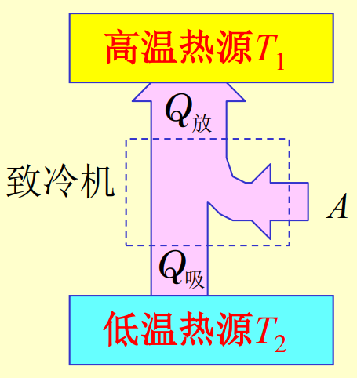

# 第三节 循环过程 卡诺循环

## 一、循环过程

> 定义 - 循环过程：
>
> 系统经历一系列变化后又回到初始状态的整个过程叫循环过程。

在相图中，沿顺时针的叫正循环，反之逆循环。

$\Delta E=0 \qquad Q_\textrm{净}=A_\textrm{净}=S_\textrm{曲线}$

### 1. 正循环和热机

如：蒸汽机。

工作特点：

* 需要一定工作物质。
* 需要两个热源。  
  *注：热源并不一定就是发出热量，甚至不一定是热的，只是代表两个恒温的对象。*
* 热机是正循环工作的。

目的：对外做功。  
来源：高温热源吸热。  
特征：
$$
Q_\textrm{净}=A_\textrm{所有净}>0
$$

  

**对外做功是产生的效果（目的）**，代价是从高温热源吸热，  
故效率：
$$
\begin{aligned}
\eta&=\frac{A_\textrm{净}}{Q_\textrm{吸}}\\
&=\frac{Q_\textrm{吸}-|Q_\textrm{放}|}{Q_\textrm{吸}}\\
&=1-\frac{|Q_\textrm{放}|}{Q_\textrm{吸}}
\end{aligned}

$$

在pV向图上表现为**顺时针**的封闭圈：  

*为了更加明确，个人称其为：做功机。*

### 2. 逆循环和冷机

如：制冷机

工作特点：

* 需要一定工作物质。
* 需要两个热源。
* 冷机是逆循环工作的。

目的：从低温热源吸热。  
来源：外界做功。  
特点：
$$
Q_\textrm{净}=A_\textrm{净}<0
$$

  
可以看出为正循环的逆过程。

**从低温热源吸热是产生的效果（目的）**，代价是外界做功，  
故制冷系数（效率）：
$$
w=\frac{Q_\textrm{吸}}{A}
=\frac{Q_\textrm{吸}}{|Q_\textrm{放}|-Q_\textrm{吸}}
$$

在pV向图上表现为**逆时针**的封闭圈：  
  

*为了更加明确，个人称其为：吸热放热机。*

### 2.5 冷泵和热泵

对于空调，分别在夏天和冬天采用了冷机的两种方向，达成制暖制冷效果。  
需要明确：对于热泵和冷泵，**都是冷机**（吸热放热机）。

* 夏天：  
  室内为低温热源，室外为高温热源，  
  冷机从室内吸热放到室外，对室内制冷。
  * 供暖系数：  
  $$
  e=\frac{|Q_\textrm{放}|}{A}
  $$
* 冬天：  
  室内为高温热源，室外为低温热源，  
  冷机从室外吸热放到室内，**对室外制冷**。
  * 供冷系数：  
  $$
  \epsilon=\frac{Q_\textrm{吸}}{A}
  $$

  

由能量守恒：$|Q_\textrm{放}|=A+Q_\textrm{吸}$  
得：$e=\frac{A+Q_\textrm{吸}}{A}$
故：
$$
e=1+\epsilon
$$
**供暖系数为$1$加制冷系数。**

## 二、卡诺循环

一切热机都有一下两个共同点：

* 都有高温热源和低温热源
* 工作物质总是从高温热源吸热，向低温热源放热，对外做功。

作用为：在相图中找到一个最理想最简单的循环过程。  

* 最理想：工作物质至于两个恒温热源接触，不存在其他散热、漏气。
* 最简单：即**只有两个热源**。

作为最基本的循环单元，可以组成其他各种循环。

---

因为只有两个热源，  
故可做**两条等温线**（简单），然后在这两条线上**绝热变化**（理想）。  
可以得到如下pV相图：  
  
即为卡诺循环。

分为卡诺正循环或卡诺逆循环：

* 卡诺正循环 - 制热过程（$1\to2\to3\to4\to1$）：
* 卡诺逆循环 - 制冷过程（$1\to4\to3\to2\to1$）：

### 1. 制热过程

> 推导 - 制热过程：
>
> * 两个等温：
>   * $1\to2$：$Q_1=A_1=\frac{m}{M}RT_1\ln\frac{V_2}{V_1}$
>   * $3\to4$：$Q_2=A_2=\frac{m}{M}RT_2\ln\frac{V_3}{V_4}$
> * 两个绝热：
>   * $2\to3$：$T_1V_2^{r-1}=T_2V_3^{r-1}$
>   * $4\to1$：$T_1V_1^{r-1}=T_2V_4^{r-1}$
>
>   联立得：$\frac{V_2}{V_1}=\frac{V_3}{V_4}$
>
> $\eta=\frac{Q_1-|Q_2|}{Q_1}=\cdots=\frac{T_1-T_2}{T_1}$

效率：
$$
\eta=1-\frac{T_2}{T_1}
$$

* $\eta$只由$T_1,T_2$决定。
* $T_1\ne\infty,T_2\ne0\quad\Rightarrow\quad\eta<1$
* 提高$\eta$：升高初始温度$T_1$，降低终末温度$T_2$。

### 2. 制冷过程

*推导略。*

制冷系数：
$$
w=\frac{T_2}{T_1-T_2}
$$

$T_2\downarrow, w\downarrow$，可以得出从温度更低的低温热源吸热，需要更大的功。  
*空调温度越低，耗电越大。*

---

注意：

* $\eta=1-\frac{|Q_\textrm{放}|}{Q_\textrm{吸}}$  
  $w=\frac{Q_\textrm{吸}}{A}$  
  对一切循环适用。
* $\eta=1-\frac{T_2}{T_1}$  
  $w=\frac{T_2}{T_1-T_2}$  
  只对卡诺循环使用。

并且算效率的时候，  
将所有$Q>0$的吸热加在一起，为**总吸热**；  
将所有$Q<0$的放热加载一起，并取绝对值，为**总放热**。  
再根据是热机还是冷机，求得$A$。  
热机为：$A=Q_\textrm{吸}-|Q_\textrm{放}|$  
冷机为：$A=|Q_\textrm{放}|-Q_\textrm{吸}$