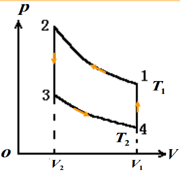

# 总结

* 理想气体系统内能：
  $$
  E=\frac{m}{M}\frac{i}{2}RT
  $$
* 泊松比：
  $$
  \gamma=\frac{i+2}{i}
  $$
* 四个过程：
  |      | 过程方程    | $Q$                                  | $A$                                      | $\Delta E$               |
  | ---- | --------------- | ------------------------------------ | ---------------------------------------- | ------------------------ |
  | 等体 | $p\propto T$    | $\frac{m}{M}C_V\Delta T$             | $0$                                      | $\frac{m}{M}C_V\Delta T$ |
  | 恒压 | $V\propto T$    | $A+\Delta E\\\frac{m}{M}C_p\Delta T$ | $p\Delta V$                              | $\frac{m}{M}C_V\Delta T$ |
  | 恒温 | $pV=C$          | $A$                                  | $\frac{m}{M}RT\ln\frac{V_2}{V_1}$        | $0$                      |
  | 绝热 | $pV^{\gamma}=C$ | $0$                                  | $-\Delta E\\-\frac{\Delta(pV)}{\gamma-1}$ | $\frac{m}{M}C_V\Delta T$ |

  注：绝热$A$第二式由来：$nR\Delta T=\Delta(pV)$
* 非准静态的对外做功：$A=Q-\Delta EA=Q−ΔE$
* 热机制热效率：
  $$
  \begin{aligned}
  \eta&=\frac{A_\textrm{净}}{Q_\textrm{吸}}\\
  &=\frac{Q_\textrm{吸}-|Q_\textrm{放}|}{Q_\textrm{吸}}\\
  &=1-\frac{|Q_\textrm{放}|}{Q_\textrm{吸}}
  \end{aligned}
  $$
* 冷机制冷效率：
  $$
  w=\frac{Q_\textrm{吸}}{A}
  =\frac{Q_\textrm{吸}}{|Q_\textrm{放}|-Q_\textrm{吸}}
  $$
* 空调（冷机）
  * 供暖系数：
    $$
    e=\frac{|Q_\textrm{放}|}{A}
    $$
  * 供冷系数：
    $$
    \epsilon=\frac{Q_\textrm{吸}}{A}
    $$
  * 关系：$e=1+\epsilon$
* 卡诺热机效率：
  $$
  \eta=1-\frac{T_2}{T_1}
  $$
* 卡诺冷机效率：
  $$
  w=\frac{T_2}{T_1-T_2}
  $$
* 斯特林循环  
    
  不考虑$2\to3$和$4\to1$过程。

## 例题

* 对于图像，问两点变化是什么过程:  
  可以考虑两点间气态方程$pV=nRT$的比，用斜率等可以表示大小。
  
    
