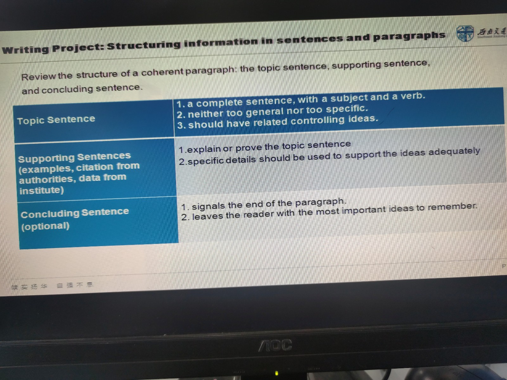
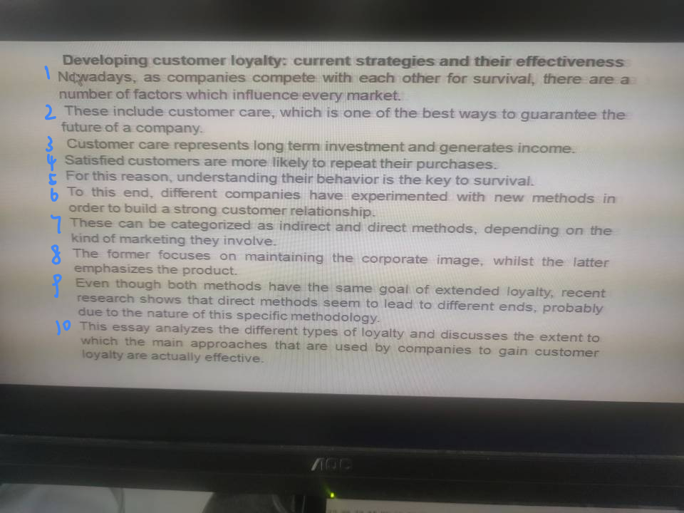

# Unit.5 AI in Daily Life

## Text A

文章有严格的逻辑要求。

## Lecture Cues

在演讲中所用到的提示词。

* structure cues -
* transition cues -  
  "Let me take you on a tour"
* organization cues - 连结提示词

## Prestation

开头：

1. 介绍自己
2. 介绍自己讲述的、研究的内容
3. 对演讲主题的背景介绍
4. 展示文章基本结构和内容

## Writing Project

*书P137。*

有关段落的写作：

1. Topic sentence
2. Supporting sentences
3. Concluding sentence

---

写简介(Introduction)部分：

要求：

1. 字数将近于文章$10\%$长度。
2. 文章要先写主体部分，再写结论，最后写简介部分。
3. 虽然简介部分最后写，但观者最先看到。

点：

* 关于topic的介绍、写作背景
* 写这篇文章目的
* 一个关于文章结构的提纲  
  > The essay analyzes the different types of ... and discussed ...
* 一些关键术语的定义
* thesis statement

* 1~4 - 介绍文章观点
* 5 - 这篇文章的正当理由（目的）
* 6～8 - 定义关键术语
* 9 - thesis statement
* 10 - 文章结构
