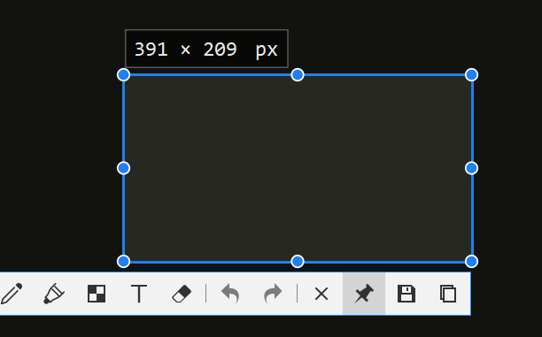
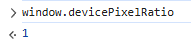

# CSS 相关

## 有关各种长度单位(px, em, ...)

网上说的各种概念，都写得十分难懂不直接，主要是没有与我们最直接接触的“**屏幕**”、及其“**显示器分辨率**”这些对应起来。  
也就是说了那么多，还是不知道 CSS 中`1px`对应我们显示器分辨率的多少像素。  
故这里：

1. 以“显示器分辨率”为出发点
2. 介绍 DPR：决定 CSS 中的`px`，与显示器分辨率中的`px`，两者的比例关系
3. 介绍 CSS 长度中的“国际单位”（绝对单位） - `px`
4. 介绍 CSS 长度中相对于字体`px`的单位 - `em`, `rem`
5. 介绍 CSS 长度中相对于窗口`px`的单位 - `vw`, `vh`, `vmin`, `vmax`
6. 介绍 CSS 长度中相对于父容器的单位 - `%`

### 有关物理屏幕

首先先介绍屏幕的一些重要概念：

* 尺寸：对应屏幕的**物理大小**，单位为"inch"(英寸)  
  如对于电脑屏幕常见的 15.6, 17.2 寸。  题:9），但总之这个指标是反应看在眼里/拿在手上的大小的。*
* 分辨率：对应屏幕的**像素点个数**，**单位为"px"**  
  如常见的 1920x1080。  

  ⭐这个分辨率，就是我们日常接触到的分辨率。  
  在用各种截图软件时，会显示一个大小，**其就代表我们这个图片是“多少px * 多少px”的**。（如显示屏是 1920x1080，则截全屏就为 1920x1080）  
  
* PPI(Pixels Per Inch)：每英寸的像素个数，单位为"px/inch"  
  这个指标才对应“**清晰程度/画质细腻程度**”这种**感觉**。  
  > 举例：
  >
  > 同样是 1080p，对于一个小屏幕 5.5 寸（PPI 约为 400 px/inch）和大屏幕 24 寸（PPI 约为 92 px/inch），明显大屏幕的会看着超糊（甚至可能直接看到每个方块像素点）  
  > *即如果追求显示清晰，则应该选高 PPI 的显示器（同尺寸下分辨率越高），而不仅是高分辨率的显示器。*

  PPI 的计算方式也自然就表示为“分辨率/尺寸”（准确来说是 斜对角线像素个数 / 尺寸）

### DPR(Device pixel ratio, 设备像素比)

然后引出 JS 中一个最重要的属性 - `window.devicePixelRatio`，  
其直接决定了：**CSS 当中`px`这个单位，对应屏幕分辨率多少`px`**。
*为了区分 CSS 和屏幕的`px`，后续将前者记为`px`/`px-css`、后者则特别记为`px-device`。*

这个属性的值，应该是 **JS 引擎内核**调用 OS 底层有关**屏幕显示信息**的 API **计算出来**的。
该属性值可以通过开发者工具的控制台直接查看，如下图。



⭐**计算方式**：

*其具体计算方式和原理暂时不清楚，但总之只与以下两个属性有关（个人测试如此，不一定完全正确）*。

1. **屏幕本身配置** $screen$  
   * 对于电脑屏幕：通常都是$1$（**无论分辨率、尺寸等是多少**）
   * 对于现代手机屏幕：通常都$\ge2$（如网上教程经常提到的“苹果 Retina 屏”则是$2$；我的一加 13 则是$4$）
2. **系统设置的缩放等级** $scale_{system}$  
   * Windows：在“设置 - 屏幕 - 缩放”里设置（100% 则是$1$；150% 则是$1.5$）
   * 安卓：通常在“显示大小”里设置（对于本人的手机，标准则是$1$；较小则是$0.875$）
3. 浏览器设置的缩放等级 $scale_{browser}$  
   需要注意：对于手机浏览器，缩放等级**不是双指放大缩小**，而是在设置里调整的（如 Chrome 的缩放；Edge 的字体大小）

最终的值则是：

$$
DPR = screen \times scale_{system} \times scale_{browser}
$$

*故对于电脑，DPR 就是：系统设置的缩放等级$\times$浏览器的缩放等级。*

---

以下介绍 CSS 的具体长度单位，**总共**有：

* 绝对单位：`px`, `pt`, `cm`
* 相对单位：`em`, `rem`, `vw`, `vh`, `vmin`, `vmax`, `%`

但常用的是`px`、`em/rem`、`vw/vh/vmin/vmax`、`%`，以下分别介绍。

### CSS 中长度的“国际单位”（绝对单位） - `px`

具有以下性质：

1. **`px`的“国际单位”性**

   对应于物理尺度中“国际单位”的概念，`px`可以看作 CSS 长度单位中的国际单位。  
   因为**相对单位（如`em`, `rem`）都是相对于`px`的**。

2. **`px`的相对性 - 如何对应到`px-device`**

   `px`是 CSS 中的一种**逻辑/虚拟单位**，**不直接对应**屏幕的`px-device`（即：设置`div`的`width: 500px`，用截图软件截图不一定是`500px-divice`）。
   那么`px`如何与设备屏幕的`px-device`对应上呢？  
   就是根据上面提到的`DPR`，公式如下：

   $$
   1\text{px} = DPR \times 1\text{px-device}
   $$

   > 实例 - 对于以下 HTML：
   >
   > ```html
   > 【TODO】
   > ````
   >
   > 在浏览器无缩放的情况下：
   >
   > * `DPR=1`（系统缩放为 100%）：横向刚好占据整个屏幕
   > * `DPR=2`（系统缩放为 200%）：横向会是两倍屏幕宽，超出屏幕、出现横向拖动条
   >
   > 可以看到，如果使用`px`，对于同样分辨率设备，**因为缩放等级不同，占据屏幕的比例也不同**。

3. **`px`的绝对性**

   说`px`是绝对单位，是因为“**CSS 的其他任何属性都无法影响他**”。  
   *区别于相对单位，`em`, `rem`是基于`font-size`这个属性的值而确定最终长度的，调整该属性值则能调整所有`em`, `rem`的最终长度（具体在下方讲解）*

   并且通过`DPR`运算后，最终会得到一个确定的`px-device`，也是绝对的值（假如`DPR=1`，设定`width=100px`，则截图这一部分横向分辨率就是`100`）。

   这一点，加上上面说的“因缩放等级不同导致占据屏幕比例不同”的原因，导致了`px`不适合应用于响应式布局。

### 相对于字体`px`的单位 - `em`, `rem`

> `em`名字的来源：
>
> `px`是 pixel 的简写，代表像素，因此顾名思义很容易知道其对应到像素，是绝对的。
>
> 而`em`，来源于印刷中“大写字母 M 的宽度”。  
> 这也是为什么`em`就是`font-size`的值的原因。  
> 因此如果改变字母的大小，则`em`这个单位代表的实际长度也会变化，是相对的。

如上面所说，`1em`为`font-size`设置的大小。  
而`em`, `rem`的区别如下：

* `em`：父容器的`font-size`  
  因此具有继承性，如：

  ```html
  <div style="font-size: 20px;">
      <div style="font-size: 2em;"> <!-- font-size 为 40px -->
          <div style="font-size: 2em;"> <!-- font-size 为 80px -->
              <div class="test" style="width: 2em;"></div> <!-- width 为 160px -->
          </div>
      </div>
  </div>
  ```

  上例如果将父容器（第三个`div`）改为`font-size: 20px`，则`width = 40px`。
* `rem`(root em)：根`<body>`容器的`font-size`  
  只与根`<body>`相关，故不具继承性。

### 相对于窗口`px`的单位 - `vw`, `vh`, `vmin`, `vmax`

这里要引入`window`的另一个属性 - `window.innerWidth` / `window.innerHeight`，  
这两者就是**页面窗口的宽度`px`和高度`px`**。

**注意**：不是`px_device`！  
也就是说，对于 1920x1080 屏幕，浏览器全屏，如果`DPR=2`，则`window.innerWidth = 960`。

可以在开发者工具里查看，找一个占满整个屏幕横向/纵向的元素，用选取工具查看其大小，其值则为`innerWidth`/`innerHeight`。
【TODO: 截图】

---

* `vw`：`window.innerWidth`的占比  
  如`50vw`，则是`50% * window.innerWidth`；`100vw`则是整个窗口的宽度。
* `vh`：`window.innerHeight`的占比
  如`20vh`，则是`20% * window.innerHeight`；`100vh`则是整个窗口的高度。
* `vmin`：`min(window.innerWidth, window.innerHeight)`的占比  
  如果宽度更小（手机），则是窗口宽度的占比
* `vmax`：`max(window.innerWidth, window.innerHeight)`的占比  
  如果宽度更大（PC / 平台），则是窗口宽度的占比
  这两者的应用：
  1. 让`width, height`都为`vmin`，可保证一定在页面内；都为`vmax`，可保证一定覆盖整个页面。
  1. `font-size`用`vmin`，可以保证移动端横竖屏字体大小一致。（虽然一般都不这么用）

### 相对于父容器`px`的单位 - `%`

很简单，就是相对于父容器**在该属性上的值的百分比**。  

如：

```html
<body style="font-size: 16px;">
    <div style="font-size: 3rem;">
        <p style="font-size: 50%;">这里的 font size 为 1.5rem(24px)</p>
    </div>
</body>
```

## 选择器

## 盒子模型

## position 定位

## display 布局

### 1. Grid

### 2. Flex

## 一些效果实例

### 1. 分栏布局