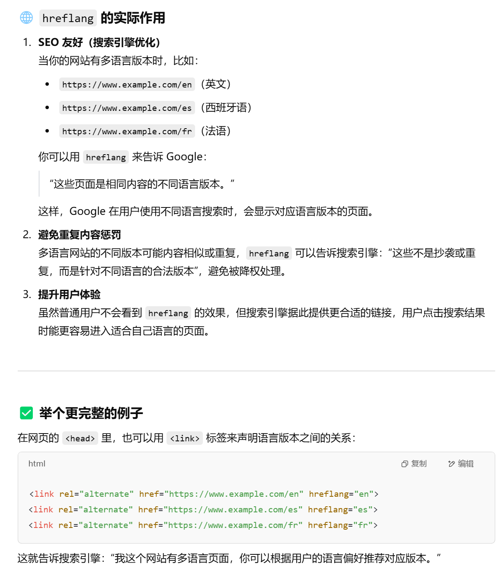

# HTML 相关问题

因为 HTML 十分简单，故只记录个人在学习 HTML 问题和回答。

## 1. 元素分类

* 按是否有内容分类
  * 空元素：`<br />`、`<link />`、`<meta />`
  * 普通元素
* 按显示方式分类（对应 CSS 的`display`）
  * 块级元素(`block`)：`<div>`  
    单独一行，倾向占据父容器整个宽度。
  * 行内元素(`inline`)：`<span>`
    行内显示，只占据必要宽度，
  * 行内块元素(`block-inline`)：``
    跟行内元素差不多，只不过可以指定属性`width`和`height`。

## 2. HTML 头部`<head>`相关

头部中常见的有以下标签：

* `<title>`：设置标题，显示在标签页上，对 SEO 有用
* `<link>`：引入外部资源，通过`rel`属性区分类型，常有：
  1. （**最常用**）`stylesheet`：加载 CSS 样式  
     如使用 Font Awesome：`<link rel="stylesheet" href="//netdna.bootstrapcdn.com/font-awesome/4.7.0/css/font-awesome.min.css">`
  2. `shortcut icon`：指定标签页图标
     `<link rel="shortcut icon" href="xxx.ico">`
  3. `canonical`：指定网站主要版本（当有多个类似的网站版本时），用于优化 SEO  
     `<link rel="canonical" href="https://www.youtube.com/">`
  4. `alternate`：指定备用网站（如不同平台、不同语言）  
     如手机平台：`<link rel="alternate" media="handheld" href="https://m.youtube.com/">`  
     如不同语言：`<link rel="alternate" hreflang="en-US" href="...">`
* `<meta>`：指定网站的元信息，如描述、关键词、推特分享展示信息等，以服务于 SEO、其它服务。  
  **特殊用法 - 要求每 30s 刷新网页**：`<meta http-equiv="refresh" content="30">`
* `<style>`：直接在头部中写 CSS
* `<script>`：直接在头部中写 JS

## 3. 超链接`<a>`相关

### 3.1. `<a>`的`target`属性

用于定义**超链接的打开方式**，  
有四个选项：

| 选项           | 作用                                | 简述                   |
|----------------|-------------------------------------|------------------------|
| `_self`        | 在**当前窗口/标签页**打开链接（默认）| 替换当前页面           |
| `_blank`       | 在**新窗口/新标签页**中打开链接      | 不关闭原页面，常用于外链 |
| `_parent`      | （用于嵌套iframe）在**父框架**中打开链接 | 适用于有框架结构的页面 |
| `_top`         | （用于嵌套iframe）在**最外层框架**中打开链接 | 跳出所有嵌套，回到最外层（即本标签页窗口`<body>`） |
| 某个`iframe`的`id` | 在某个内嵌框架中打开链接 | 替换页面当中的某个框架 |

*注：`_parent`只能跳出一层，如果要跳出若干层或到指定层，则需要使用 JS。*

### 3.2. `<a>`的`rel`属性（涉及安全、SEO）

`rel`是个通用属性（在`<link>`中也会用到），用于表示“**指向链接与本网页的关系(relation)**”。

对于`<a>`标签，通常有以下值：

| 值             | 作用简述                                                       | 使用场景举例                              |
|----------------|----------------------------------------------------------------|-------------------------------------------|
| `noopener`     | 防止新窗口页面能通过 `window.opener` 控制当前页面（防劫持）   | 保证本网站安全，和 `target="_blank"` 一起使用         |
| `noreferrer`   | 不传 `Referer` 头信息                                       | 保证本网站隐私，和 `target="_blank"` 一起使用     |
| `nofollow`     | 告诉搜索引擎**不要传递权重**（不参与排名）                    | 付费广告、用户评论等外链                  |
| `ugc`          | 用户生成内容（User Generated Content）                        | 评论、论坛发帖中的链接                      |
| `sponsored`    | 付费广告链接（广告/赞助）                                      | 合规使用，配合 `nofollow` 用更准确        |

> 有关 SEO 的传权：
>
> 在搜索引擎中，每个网页都有一个“权重值”，代表它的重要性（比如，别人引用我、推荐我，那我就更重要）。  
> 当一个页面 A 链接到页面 B，就好像是 A 给 B 投了一票，传递了“信任”或“权威”。  
> 如果页面 A 本身权重很高（比如是知名门户），那么它链接到 B 时，搜索引擎会认为：“A 很重要，它推荐了 B，说明 B 可能也很优质”，于是 B 的排名也会受到提升。
> 但如果 B 页面很劣质，则 A 会被当成“乱推荐”，从而降低 A 的排名。
>
> 故对页面中的超链接加上`nofollow`禁止传权，防止个人网站的权重降低。  
> 通常来说有两种情况：
>
> 1. 需要链接到某网站，但其质量不能保证（自己不信任）：`nofollow`
> 2. 网站有评论区或其它“用户内容”，用户可能在其中留下各种蹭权重的网站：`nofollow ugc`
> 3. 自己的赞助方/广告，需要放在页面上，但不想被影响权重：`nofollow sponsored`

通常有以下场景：

| 分类       | 推荐值              | 含义                       |
|------------|---------------------|----------------------------|
| 🔒 安全     | `noopener noreferrer` | 防止新标签劫持 & 隐私保护 |
| 🔗 SEO     | `nofollow` / `nofollow ugc` / `nofollow sponsored`  | 不传权重 / 是用户内容（如评论区） / 是赞助推广内容  |

### 3.3. `<a>`链接锚点（锚点相关介绍）

> 介绍 - 锚点(Anchor)：
>
> 就是用于定位一个网页中的某个位置。  
> 用`<a href="#...">`该锚点可以直接到达该锚点位置。

* 定义锚点：任意标签均可作为锚点，但**只能通过**`id`属性定义。
* 使用/跳转锚点：在地址栏可以用`#...`跳转到锚点，HTML 中可以用`<a href="#...">`跳转锚点。

示例：

```html
<body>
    <p id="anchor-p1"> 第一段落 </p>
    <p> 大段大段文本 </p>
    <p id="anchor-p2"> 第一段落 </p>
    <p> 大段大段文本 </p>

    <a href="#anchor-p1"> 跳转到第一段落 </a>
    <a href="#anchor-p2"> 跳转到第二段落 </a>
</body>
```

### 3.4. `<a>`的其它有用属性

* `download`：将链接**进行下载**而非打开。
  * `<a href="1.pdf" download> 下载 PDF </a>`：点击后下载文件，保持源文件名。
  * `<a href="1.pdf" download="下载内容.pdf" 下载 PDF </a>`：点击后下载文件，重命名为属性值`下载内容.pdf`。
* `type`：指定连接的 MIME 类型，通常搭配上面的`download`

> 有关 `hreflang` 属性：
>
> 对于菜鸟教程中讲到的`hreflang`属性，其更多的作用是“**对自己的多语言网站优化 SEO**”，在使用`<a>`指向别人的网站加上该属性实际并没有什么作用。  
> 

### 3.5. `<a>`的其它用法

| 方法                    | 作用                     | 是否会跳转 | 场景适用性              |
| ------------------------- | -------------------------- | ---------- | ---------------------------- |
| `href=""`                    | **刷新当前页面**         | 是        | 需要页面刷新时        |
| `href="#"`                  | 导航到页面顶部      | 是        | 占位符，捕获点击事件 |
| `href="about:blank"`        | 打开空白页面         | 是        | 本窗口变为空白页面  |
| `href="javascript:void(0)"` | 阻止默认行为，不刷新页面 | 否        | 阻止跳转，配合 JS 使用 |

## 4. HTML 5 相关

需要在 HTML 文档第一行使用`<!DOCTYPE html>`。

### 4.1. 有关语义元素

HTML 5 多了很多语义元素，即相比于常用的`div/span`，标签本身就有含义（如`<article>`、`<section>`）。

### 4.2. 有关存储

HTML 4.01 只有`cookie`这种本地存储方式存储方式，  
HTML 5 新增了两个：`localStorage`、`sessionStorage`。

| 特性              | Cookie                          | localStorage                   | sessionStorage                 |
|-------------------|----------------------------------|--------------------------------|--------------------------------|
| **生命周期**      | 可自定义过期时间，**默认会话结束** | 永久保存，除非手动清除         | 页面会话结束（窗口或标签页关闭）即清除 |
| **存储大小**      | 约 4KB                           | 约 5MB                          | 约 5MB                          |
| **与服务器通信**  | 每次请求都会自动携带到服务器     | 仅本地存储，不会自动发送         | 仅本地存储，不会自动发送         |
| **可访问性**      | 前端（JS）和后端都可访问         | 仅限前端 JS 访问                | 仅限前端 JS 访问                |
| **作用域**        | 同源 + 路径控制                  | 同源（协议+主机+端口）                           | 同源，**同窗口/标签页**             |
| **使用场景**      | 登录状态、跨会话持久数据、小型配置 | 长期保存用户设置、本地缓存等     | 页面临时状态存储，如表单数据暂存 |
| **安全性**        | 易受 XSS、CSRF 攻击             | 易受 XSS 攻击，不受 CSRF 影响     | 易受 XSS 攻击，不受 CSRF 影响     |
| **API 简单性**    | 操作复杂（需编码解码、字符串拼接）| API 简单：`setItem/getItem`     | API 简单：`setItem/getItem`     |

总结：

* 使用 `cookie` 处理**需要与服务器交互**的小数据（如身份认证）
* 使用 `localStorage` 保存**长期使用的本地数据**
* 使用 `sessionStorage` 保存**临时的数据或状态**，页面关闭即清除

---

HTML 5 还新增了本地的数据库`Web indexedDB`（还有一个`Web SQL`已逐渐废弃）。

是 NoSQL（非表存储） 的，用 key-value 的对象存储数据。  
其相比上面三个本地存储：支持更多的功能（事务回滚、索引、复杂查询、版本管理、异步）、容量更大（支持几百MB）。
适合于基于大量数据的离线应用，或作为缓存。

### 4.3. 有关异步

新增了`Web worker`：
 
HTML5 向 js 提供的一个对象，可以用于后台执行一个 js 脚本。一般适用于 CPU 密集任务。  
但因为是新的线程（非UI线程），无法处理DOM元素，即没window对像。
同时，其是用线程来实现异步的（而非事件循环），故只适合 CPU 密集任务（且需要满足任务可分）；而io密集任务（通过信号（中断）来通知）天生适合 node.js 那种基于事件循环的异步。

### 4.4. 有关网络

* `Server-Sent Event`(SSE)：服务器向客户端推送数据，客户端监听
* `Websocket`：服务器与客户端双向通讯

可以看到：Websocket支持双向通讯，故更重（配置麻烦、兼容性不好），更适合必须双向通讯的如聊天应用；而对于只用接受推送如推特只需SSE。

> 拓展 - 轮询/长轮询：
>
> 是在这两个出来之前，接受服务器消息的方式。
> 传统只能客户端主动向服务器发请求。服务器要向客户端发更新数据，只能让客户端轮询。
