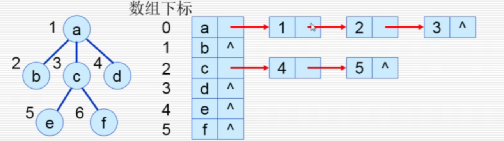
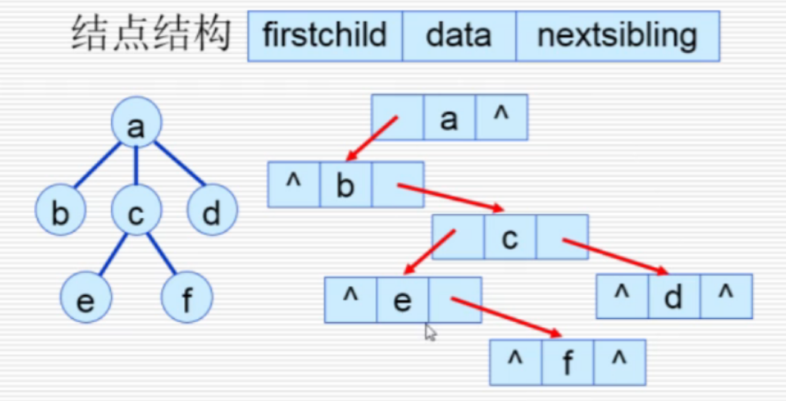

# 树

树。

## 二叉树

### 性质

$k$层二叉树。

* 一共有$2^k-1$个节点。
* 第$i$层上有$2^{k-1}$个节点。

### 特殊形态

#### 1. 满二叉树

深度为$k$，有$2^{k-1}$个节点。

#### 2. 完全二叉树

* 叶子节点只可能在层次最大的两层上出现（对比满二叉树，只能在最大一层出现）
* 由节点$i$可知：
  * 父节点为$\lfloor\frac{i}{2}\rfloor$
  * 子节点为$2*i$和$2i+1$

### 遍历

* 先序遍历
* 中序遍历
* 后序遍历

* 层序遍历：按二叉树的层序编号的次序访问各节点。
  利用队列可实现。

---

非递归方式：

* 利用堆栈

### 寻找父节点

利用遍历。

寻找$n$节点的父节点，
在找到一节点$p$的子节点为$n$时，则中断遍历并返回$p$。

* 有值函数
* 形参函数

### 4. 线索二叉树

要获得前驱后继，如果只通过遍历方式来获得效率太低，  
因此可以通过一次遍历，保存其结点前驱和后继信息，  
提出了“线索二叉树”。

* 前驱和后继：在二叉树的某一种遍历序列中，两个相邻的结点成为前驱后继。  
  注意：与父节点和孩子结点不同，父节点和孩子只表示层关系，是刚开始就定好了的；但前驱后继是根据遍历方法的不同而具体确定的。
* 线索：指向前驱或后继结点的指针称为线索
* 线索二叉树：加上线索的二叉链表表示的二叉树

#### 结点结构

* 左指针指向左孩子或者前驱
* 右指针指向右孩子或者后继

* 左右分别增加个flag(`lTag`、`rTag`)，当为$0$时代表记录的孩子，为$1$时代表记录的前驱后继

```c++
enum {link, thread} typeTag;
struct typeBiThrNode
{
  elemType data;
  typeBiThr *l, *r;
  typeTag lTag, rTag;
};
```

#### 逻辑表示图

因为遍历方式有$4$种，所以对应$4$种线索二叉树

* 前序线索二叉树
* 中序线索二叉树
* 后序线索二叉树
* 层序线索二叉树

#### 线索化 - 中序

将二叉链表中的空指针改为指向前驱或后继的线索，  
而前驱或后继的信息只有在遍历时才能得到，  
因此线索化的过程即为**在遍历的过程中修改空指针的过程**。

---

建立方法：

用主扫描指针`p`；从扫描指针`pre`，其为p的直接前驱节点。  
对`p`的左指针（前驱）和`pre`的右指针（后继）进行操作。

对`p`开始进行中序遍历，  
当`p`不存在左孩子时，则开始建立前驱：  
`p.l = pre;`  
`pre`不存在右孩子时，建立后继：
`pre.r = p;`

---

当线索化完成后，  
可以将头的前驱、尾的后继指向树的根，形成循环链表，  
这样就可以只用根节点来表示整个遍历线索。

#### 线索二叉树的查找

* 查找节点`p`的后继节点：
  * 右标示为`1`，即无左孩子：  
    则右指针直接是后继
  * 右标示为`0`，即有左孩子：
    则后继是该节点右子树中最左下的节点。  
    即沿着右子树的左指针链向下，直到找到左标示为`1`的节点
* 查找节点`p`的前驱节点：
  * 左标示为`0`，直接。
  * 左标示为`1`，找左子树中最右下的节点。

```c++
typeBiTNode prev(typeBiTNode bt)
{
  while (bt && bt.lTag == link)
    bt = bt.l;
  return bt;
}

typeBiTNode last(typeBiTNode bt)
{
  while (bt && bt.rTag == link)
    bt = bt.r;
  return bt;
}
```

## 树和森林

### 存储方法

1. 双亲表示法  
   只记录每个节点的父节点。  
   查找父节点很容易，但找子节点很难。
2. 多叉链表表示法  
   1. 保证节点同构：每个节点都给$k$个指针，指向子节点。  
      可以方便处理和运算，但会浪费空间。
   2. 节点不同构：每个节点有多少个子节点分配几个指针，用$degree$(度)来记录有多少个子节点。  
      减少空间浪费，但对每个节点处理或运算麻烦。

   *故多叉链表很少使用。*
3. 孩子链表表示法  
   为$n$个节点设置$n$个单链表，存放他们各自的孩子，该单链表即为孩子链表。  
     
   *是既有顺序表又有链表的混合储存方法。*

   ```c++
   struct typeChild
   {
     int index;
     typeChild *next;
   };

   struct typeHead
   {
     typeElem data;
     typeChild 
   };

   struct typeLink
   {

   }
   ```

4. 孩子兄弟表示法  
   用二叉树链表的存储结构，但每个节点的两个指针域分别变为指向第一个子节点和指向下一个兄弟节点。  
     
   缺点：树的层次实际上变大了。  
   **是一种将树转换为二叉树的方案。**

### 2. 树、森林、二叉树相互转换

#### 1. 树转换为二叉树

#### 2. 森林转换为二叉树

1. 每棵树分别转换为二叉树
2. 将每棵树的根视为兄弟。按一个方向，分别将下一棵树作为这一棵树的右子树。

#### 3. 二叉树转换为森林

1. 从根开始，将右子树的连接断开，并递归到右子树，继续上述操作。
2. 再对每一棵子树，不断将某一节点的右子树作为其左子树的兄弟（根的另一个子节点）

### 3. 树的遍历

由于子树数目太多，故中序遍历没有意义（访问根的位置太多），  
故为一下两种遍历方案：

1. 先根遍历
2. 后根遍历

## 应用 - 哈夫曼树

### 1. 定义

几个名词：

* 路径：从树一个节点到另一个节点之间的分支。
* 路径长度：路径上的分支数。
* 树的路径长度：从树的根开始到每个节点的路径长度之和。
* 节点的带权路径长度：从该节点到根之前的路径长度，与节点上的权值的乘积$w_k\cdot l_k$。
* 树的带权路径长度：树中所有带权**叶子节点**的路径长度之和，记为：
  $$WPL=\sum_{k=1}^nw_kl_k$$
  其中$n$为叶子节点数。

> 定义 - 哈夫曼树：
>
> 假设有$n$个数值$\{w_1,w_2,\cdots,w_n\}$，  
> 任意构造有$n$个叶子节点的二叉树，将这$n$个数作为叶子节点的权值，  
> 其中树的带权路径长度$WPL$最小的一种树，称为哈夫曼树（最有二叉树）

### 2. 构造

思路：使$WPL$最小：权值越大的叶子离根越近$\rightarrow$权值越小的叶子离根越远

1. 对于给定的$n$个数$\{w_1,w_2,\cdots,w_n\}$，先分别将他们作为$n$个树。
2. 将**路径长度最小**（而不是带权路径）的两棵树合并。  
   合并时不要求左右子树顺序。
3. 重复$n-1$次步骤2,直到形成一棵树。该树即为哈夫曼树。

几个特殊现象：

* 当所有叶节点的权重相同时，则哈夫曼树为完全二叉树。
* 每一个节点的度只能为$2$或$0$

### 3. 含义

哈夫曼树的带权路径的含义：
> 如果$w_i$定义为概率，即需要满足$\sum_{i=1}^nw_i=1$，  
> 则$WPL$表示的是：从根到$n$个叶子节点路径长度的**数学期望**。

当权重$w_i$不满足$\sum_{i=1}^nw_i=1$时，可以归一化，  
将$w_i$化为$p_i$，使得$p_i$代表每个节点的概率。  
其中$p_i=\frac{w_i}{\sum w_i}$

### 4. 应用

可以用于编码，即哈夫曼编码。

> 编码分类：
>
> * 等长码：每个编码的数位相同，如ASCII码（都是4bits）
> * 不等长码：数位不同。
>
> 但不等长码可能会出现歧义：  
> 不同系统对划分长度确定可能不相同。

哈夫曼编码便能解决这种歧义。

---

提出概念：
> 前缀编码：  
> 任意一个字符的编码，都不是另一个字符编码的前缀，  
> 这样的不等长码，称为前缀编码（非续长码）。
>
> e.g.  
> `A`的编码如果是`1011`，  
> 则对另一个字符`B`，其编码则不能为`1011xxx`。

前缀编码可以确保通信系统收信端受到的二进制比特流**单义且可译**。

---

哈夫曼编码：
> 利用二叉树来设计前缀编码，  
> 以$n$种字符出现的频率为权值，由此得到的二进制前缀编码是使得电文总长度最短的编码方式。

只要各符号出现概率不同，便可以实现数据压缩。  
若其$WPL<\log_2n$，则可实现无损数据压缩。

同时因为小概率符号编码长、大概率符号编码短，  
所以传输平均码长最短。

#### 哈夫曼编码过程

1. 根据字符出现频率构造哈夫曼树
2. 将树中结点左孩子分支标$0$，右孩子标$1$
3. 每个字符的编码为根到叶子的路径

> 例：
>
> 平均码长：$L_{av}=\frac{1}{20}(4\times2+4\times2+...)=2.25 bit$  
> 等长码码长：$L=\lceil log_25\rceil= 3 bit$

#### 哈夫曼树储存结构

设符号数为$n$，则二元哈夫曼树有$2n-1$个结点，  
适合用数组的方式存储。

```c++
//结点
struct typeHFT_Node
{
  int 
      lson,
      rson
      weight;
};
//树
struct typeHFT
{
  int n;
  typeELem symbol[N]; //符号表
  double weight[N]; //权重标

}
```

树为反的，前面$n$个为叶子，最后为根。

```c++
void buildHFT(typeHFT &t)
{
  m=2*t.n-1; //总结点数
  for (int i=0; i<m; i++) //初始化
    t.hf[i].parent=t.hf[i].lson=t.hf[i].rson=-1;
  for (int i=0; i<m; i++) //初始化 - 新建n棵子树
    t.hf[i].w=t.weight[i];

  for (int i=a.n; i<m; i++) //开始合并，n-1ci次
  {
    for (int min=0; min<i; min++) //寻找最小权重结点，范围到目前的有效结点i
      if (t.hf[min].parent==-1) //之前可能存在非根结点，用来跳过
        break;
    for (int find=min+1; find<i; find++)
      if (t.hf[find].parent==-1 && t.hf[find].w < t.hf[min].w>)
        min=find;
    t.hf[min].parent=i, t.hf[i].lson=min; //找到最小权值结点min
    //寻找第二小的合并
  }
  //生成编码code
  //思路：从叶子到根，方向生成编码
  for (int i=0; i<t.n; i++)
  {
    int node=i;
    char* _code=t.code[i];
    while (t.hf[node].parent!=-1)
    {
      int son=node;
      node=t.tf[son].parent;
      左儿子 ? *p++='1' : *p++='0';
    }
    *p='/0';
    revert(p);
  }
}
```

#### 哈夫曼树 译码

从根开始，按照编码沿路径走，直到走到叶子结点，  
则之前部分成功译出一字符。

然后回到根，继续上过程译码，  
直到所有编码译完。