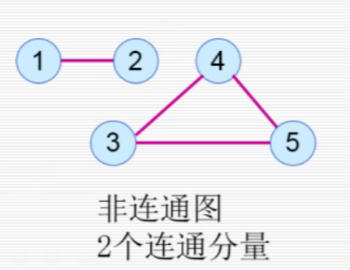
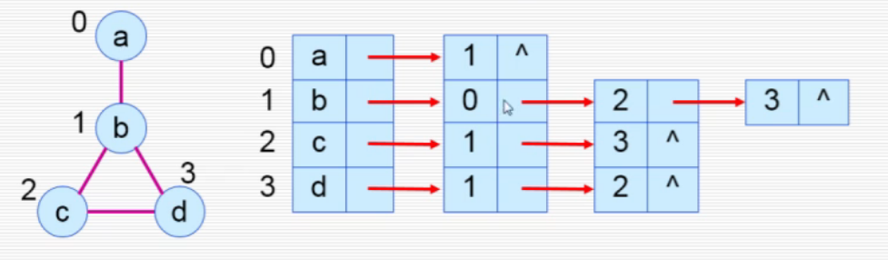
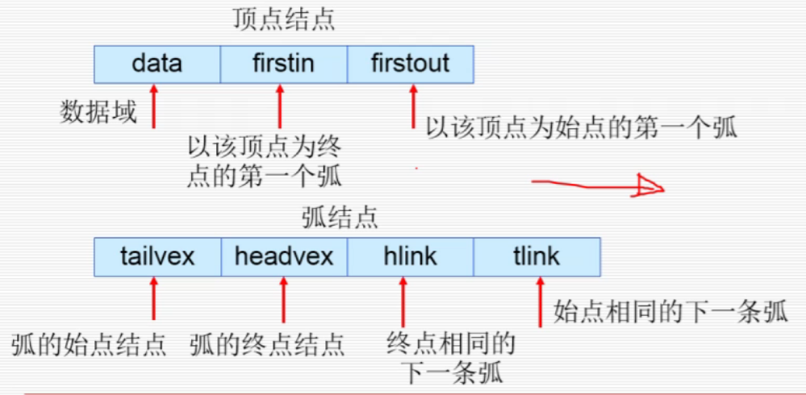
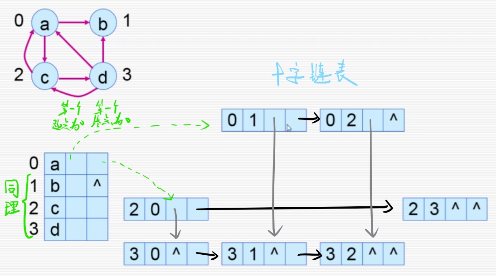

# 图

## 一、简介

### 1. 基本概念

* 点集
* 边集
* 有向图 - 有向边
* 无向图 - 无向边
* 完全图：任何两顶点都有边相连。
  * 完全无向图有$\frac{n(n-1)}{2}$条边。
* 稠密图
* 稀疏图

本章讨论的都是简单图。  
在简单图中，有以下限制：

1. 不允许存在自环。
2. 不允许多条相同的路。

* 子图：点集和边集都在某图之内。

### 2. 基本术语

* 权：反映边或顶点的某些特性的数据。
* 网络（网）：**每条边都存在权值**。
* 度（TD）
  * 入度（ID）
  * 出度（OD）
  
  与边的关系：
  * 有向图：$e=\frac{1}{2}\sum TD$
  * 无向图：$e=\sum ID=\sum OD$
* 路径：顶点$v$到顶点$v'$的顶点序列。
  * 简单路径：顶点不重复出现。
  * 回路（环）：第一个顶点和最后一个顶点相同的路径。
  * 简单回路：不出现其他重复顶点。

### 3. 连通性

> 对于顶点$v_i$到$v_j$，其有路径连通（不是直接连接），  
> 则称这两结点联通。

对于无向图来说。

> 无向图中，

* 连通图：任意两点都连通。
* 连通分量：对于非连通图，其极大连通子图（包括了子图的所有顶点和所有边）。


对于有向图来说：

* 强连通图：每一对顶点，都有**路径**连接。（注意**只是可以走通**，不是两点之间直接连接）  
* 强连通分量：对于非强连通图，极大的强连通子图。

---

存在性质：

1. $n$阶无向连通图，至少有$n-1$条边。  
   $n$阶有向连通图，至少有$n$条边。
2. 有向强连通图的充要条件：该图存在一个回路，且其**经过所有顶点至少一次**。

## 二、存储结构

图是一种任意的逻辑关系，既不适合元素在存储区的物理位置来表示（如树的线性表），也不适合在结点中设置多个指针域来实现（如树的多叉链表）。  
故单纯的顺序和链式存储均不适合。

### 1. 邻接矩阵

*是图的一种顺序存储结构。*

相当于一个二维数组，将行$a_i$作为一个结点，列$a_j$作为另一个结点。  
该行列对应下来的单元格$a_{i,j}$，便**储存的这两个节点边的信息**。

无权图中：
$$
\left(a_{i, j}\right)=\left\{\begin{array}{ll}
1, & (i,j)\textrm {两节点有边}\\
0, & (i,j)\textrm {两节点没有边}
\end{array}\right.
$$

有权图中，则将上述的$1$改成对应的权值，**将$0$改成$\infty$无穷**。  
$$
\left(a_{i, j}\right)=\left\{\begin{array}{ll}
w_{i,j}, & (i,j)\textrm {两节点有边}\\
\infty, & (i,j)\textrm {两节点没有边}
\end{array}\right.
$$
> 定义为无穷的原因：
>
> 有权图的现实意义，可以当作一个路径的问题，  
> 如果没有边，就相当于距离为无穷，怎么也到不了。
>
> 如果将没有边定义为$0$，但权值有可能会包含$0$，造成冲突，  
> 但也当然可以用一个很特殊的数值来定义没有边，比如用没出现在权值的$86278$这个数来代表，甚至专门用个字符来表示，如果为`n`则代表没有。  
> 但这样会使得之后的操作变得困难。  
> 所以直接用现实意义的$\infty$统一起来，更容易今后操作（比如找最短路）。

有向边直接对对应的$a_{i,j}$进行修改（比如结点$2$到结点$4$有条有向边，则将$a_{2,4}=1$），  
对于**无向边，当成两条相反方向的无向边**即可（比如结点$2$到结点$4$有条无向边，则将$a_{2,4}=a_{4,2}=1$）。

所以之后的储存方式，**对于无向边，都当作两条方向相反的有向边来处理。**

### 2. 邻接表

*是图的一种链表存储结构。*

相当于一个指针数组，将每个结点的边（或者说每个结点用边连接的结点）用链表记录下来。  
比如结点$2$与结点$4$、$7$均有边连接，则结点$2$这个链表依次存储结点$2$和$4$这两个信息。

*这里单讲可能不好理解，看示意图好理解一些：*  
  
每一个顶点就是一个链表，对于每个链表里面存的就是与自己有边相连的结点。

但需要注意，这里链表的每个结点不是依次连接的，也就是前一个结点与后一个结点没有直接关系，  
而链表里的每个结点，**都是针对于头节点的关系**，代表与头节点有边。  
只是我们用链表来存储而已。  
*所以不用链表，改成变长**数组**`vector`也可以。*

### 3. 十字链表 - 有向图

是针对有向图的存储方式。

* 十字链表中 - 每一个弧一个结点。
* 还需要额外对每一个顶点记录一个结点。

  

特性：

* 表结点数等于弧的结点数
* 求入度和出度都很方便

  

### 4. 邻接多重表 - 无向图

*是十字链表针对无向图的存储方式。*

跟十字链表相近，  
不过存边的十字链表中，由于边无序，可以默认将序号小的结点作为起点，序号大的结点作为重点。

同时对于结点的表，由于没有入边和出边，  
只用一个“第一条边”指针域来连接边。

## 三、图的遍历

一些可以解决的问题：

* 没有首结点：自己指定一个首结点
* 有环的情况：加一个`visited[]`，标记访问过。

### 1. DFS

从$v$开始，任意选择一个其未被访问的邻接点$w$开始搜索，并把$w$作为新的$v$继续上述操作。  
如果结束一次遍历后仍没有访问完，则从任意一个未被访问的开始继续DFS。

相当于一个个连通分量进行遍历。

用堆栈实现。

### 2. BFS

指定起点$v$，访问完其所有的邻接点，并以此按照访问的顺序$w_1,w_2,\cdots$，将$w$作为新的$v$继续上述操作。

用队列实现。

## 四、图的连通性

### 1. 判断方法

* 无向图：从**任意一顶点**出发，若DFS或BFS可以访问所有顶点，则为连通图。
* 有向图：从**所有顶点**出发，BFS或DFS可以访问，则为强连通图。

### 2. 生成树

对一个连通图$G$，按照遍历方式，其走过的所有边构成的图形，是一个树型。  
将这种树成为这个图的极小连通子图，也成为“生成树”。
> 证明：遍历需要走完$n$个点，而走到一个点，必须要经过一条边，但每个边只能走一次，因此只会用到$n-1$条边，满足树的性质。

* 由DFS形成的生成树，称为深度优先搜索树
* 由BFS形成的生成树，称为广度优先搜索树

> 扩展 - 生成森林：
>
> 对于非连通图，则会生成若干个生成树，即构成“生成森林”。

### 3. 最小生成树

对于有权图来说，如果将所采用的边，其权视为生成树的代价，  
那么需要一种方法，使得这个代价最小。
> 现实意义：
>
> 比如给若干个农村搭网线，使得他们连通、能互相通讯，  
> 这个问题即是求一个生成树（最小连通子图），使得他们连通。
>
> 但不同的农村间架设的花费不同，  
> 所以需要一种最小生成树。

关键思想：

* 尽量选择权值最小的边（贪心解决）
* 选边时不能构成回路（并查集解决）

这样选$n-1$条边，则能构成最小生成树。  
称为“Kruskal”算法。

> 可以将思想2转换为一条定理：
>
> 若$(u,v)$是一条较小边，且其顶点$u$在点集$U$
> 对于两个连通分量$U$和$V$，如果要使得他们两相连

#### 1. Prim算法

令已连通部分的集合为$U$，  
初始将任意一点$u_0$放入$U$，  
此时从$U$中找出一条最小权值的边$(u_i,v_i)$，其中$v_i$不在已连通部分$U$中，  
将$v_i$放入$U$中，然后开始新的查找。

不断重复上述过程，当选了$n-1$条边后，即可构成最小生成树。

总结：**从点（集合）开始选**能选的边（在不同集合）。

* 时间复杂度：$O(n^2)$  
  取决于点数，适合稠密图。

---

利用一个`closeEdge`结构体，用来储存$V-U$（不在$U$中）的点，能连接到$U$中某一点的最小值。

```c++
struct typeCloseEdge
{
  int adjNode; //储存能连接到U中最小的边那个顶点
  int lowW; //最小的边的权值
};
```

当每连接一个点$v_i$后，更新`closeEdge`：  
遍历`closeEdge`，当前为$v_j$，判断`closeEdge[v_j].lowW > W[v_j][v_i] ?`，成立则更新`adjNode=v_i, low=W[v_j][v_i]`。

#### 2. Kruskal算法

*基本思想还是从$U$到$V-U$中选最小的边连接起来。*

区别：**从所有边开始连**能连的点（在不同集合）。  
思想：并查集+贪心

* 时间复杂度：$O(e\log e)$
  取决于边数，适合稀疏图。

## 五、有向无环图

又称“DAG”图。  
可以用来描述一项工程的进行，从开始到结束分为一项项活动（子工程），这些活动之间又有制约关系（做这个活动之前必须要先做前置活动）。

解决两个问题：

1. 工程能否顺利进行（拓朴排序）
2. 完成最小代价（关键路径）

### 1. 拓朴排序

> 介绍 - AOV网：
>
> 顶点表示活动，有向边表示活动间的优先关系。
>
> 必须要求：没有回路存在。  
> 检查方法：拓朴排序

步骤：

1. 在有向图中选择一个没有入度的顶点作为起点$u$。
2. 输出并删除该点$u$，故要将与之相连的点$u_i$的入度减一。

重复以上两步，直到全部顶点输出完，为拓朴排序成功；或者还剩顶点无法输出，为有环。

---

利用邻接表的方式处理，  
为了便于找到入度为$0$的节点，可以构造一个队列或栈，用来在每次修改入度的时候判断是否为$0$并加入到队列或栈中。

* 时间复杂度：$O(n+e)$

### 2. 关键路径

对于工程，若将每个活动的时间考虑进去，  
即为带权的有向无环图，此时称为AOE网。

定义以下关键变量：

* 源点：整个图中入度为$0$
* 汇点：整个图中出度为$0$
* 事件：为结点
* 活动：为带权的边
* $V_e(i)$ - 事件$i$最早开始时间  
  求法：从$i$之前的所有直接相连事件$j$，取$\max(V_e(j)+w(j,i))$  
  求的顺序为一个拓朴排序。
* $V_l(i)$ - 事件$i$最晚开始时间  
  求法：从$i$之后的所有直接相连事件$j$，取$\min(V_l(j)-w(i,j))$（注意不能影响其他事件，所以取最小，否则就会影响一个事件的开始时间）  
  求的顺序为一个逆的拓朴排序。
  * 对于汇点：$V_l(i)=V_e(i)$
* $e(i,j)$ - 活动$<v_i,v_j>$最早开始时间  
  求法：$e(i,j)=V_e(i)$
* $l(i,j)$ - 活动$<v_i,v_j>$最晚开始时间  
  求法：$l(i,j)=V_l(j)-w<i,j>$，注意不能影响事件的$V_l(i)$（否则可以无限晚），所以要从后面的结点往前推。

考虑问题：

1. 完成整个工程至少所需要多少时间。（注意不是最短路，因为有制约关系，而应该是“最长路”）
2. 哪些活动是影响工程进度的关键。（即一个活动到另一个活动最长的路径，其余路径都要等待它）

* 关键活动：$e(i,j)=l(i,j)$的为关键活动。  
  若$e_(i,j)=l(i,j)$，证明这活动不能延迟，所以为关键活动。
* 关键路径：从源点到汇点之间路径长度最长的路径。  
  即为

---

意义：要缩减工程的时间，需要把每一条关键路径的时间都缩短。

## 六、最短路

### 1. Dijkstra算法

用`dist[i]`记录从起点$x$到点$i$的最短路。

初始化：起点$x$直接有边相连的点$j$的`dist[j]`赋为最小边权（多条边取最小），其余的`dist[p]`设为无穷。  
接着选一个最小的`dist[m]`，从$m$开始“松弛”其他与之相连的点$j$，即$dist[j]=min(dist[j],dist[m]+v<m,j>)$，  
完成该结点的所有松弛操作后，`flag[m]`标记为$1$代表不能再选，  
然后再选一个现在最小的结点，重复上面操作$n-1$次。

* 时间复杂度：$O(n^2)$

只能算**一个顶点**到其他点的最短路。

### 2. Floyd算法

用来计算任意两点之间的最短路。  
只用了解。
