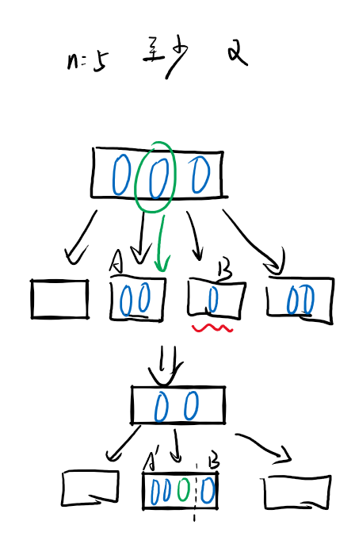
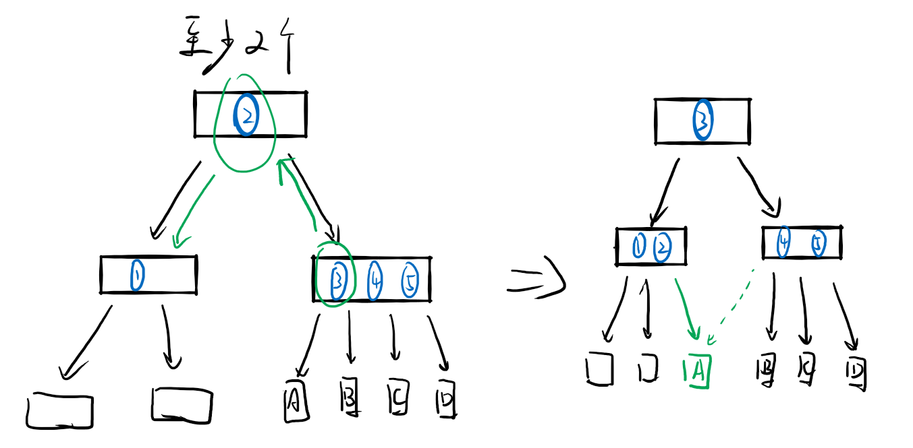

# Ep.9 查找

## 0x01 定义

查找的对象是“查找表”（映射）。  
是一种松散的数据结构：集合。

* 关键字：数据元素中某个数据项或者组合项的值，用它可以标示一个数据元素。
  * 主关键字：唯一的标识一个数据元素的值。
  * 次关键字：只能标识部分数据元素。

四个基本操作：

1. 查询某个“特定的”数据元素是否在查找表中
2. 检索某个“特定的”数据元素的各种属性
3. 在查找标中插入一个数据元素
4. 在查找标中删除某个元素

分为两种查找标：

* 静态查找表：不涉及插入和删除操作的查找表。查找过程中结构始终不发生变化。  
  数据结构为线性表。
* 动态查找表：结构在查找过程中可能会发生变化。  
  数据结构为树。

---

类型定义：

```c++
typedef int KeyType; //关键字（键值）类型

typedef struct{
  KeyType key;
}ELemType; //元素类型
```

## 0x02 静态查找表（顺序表）

```c++
typedef struct{
  int size;
  ELemType Table;
}SSTable;
```

1. 遍历查找：  
   不需要排序，从头到尾全部遍历，$O(n)$
2. 二分查找：  
   需要有序，$O(\log n)$。  
   若为无序，则要排序，为$O(n\log n)$
   * 二叉判定树：描述二分查找这个过程的二叉树，结点记录找到了那个结点`mid`
3. 分块查找：  
   为遍历查找和二分查找的综合，块间用二分（也可顺序），块内用遍历。  
   故块内无序，块间**分块有序**（第$i$块最小关键字大于第$i-1$块最大关键字）

   建立索引表，记录每一块最大（或最小）关键字，以及块的起始位置。
   * 最佳分块长度：$\sqrt n$

## 0x03 动态查找表

### 1. 二叉排序树

> 定义：
>
> * 若左子树不空，则**左子树**上所有结点的值都**小于**根结点的值。
> * 若右子树不空，则**右子树**上所有结点的值都**大于**根结点的值。

基本操作：

1. 查找  
   *就普通的二分查找，很简单。*
2. 插入  
   在查找中额外返回插入结点的位置，为查找过程中找到的空结点的父节点。
3. 删除  
   令$p$为$f$的孩子：  
   * $p$没有左右子树或只有一边：删除后将有的子树连到$f$的对应位置。
   * $p$两个子树都有：需要合并左右子树  
     1. 将左子树连到右子树最左侧，或者将右子树连到左子树最右侧。  
        会导致深度变大，故不采用。
     2. 找左子树的最右侧（最大值）替换$p$，若最大值有左子树（不可能有右子树），需要把左子树连到最大值的父节点。  
        **能减小深度，故使用这个方法。**

由于二叉排序树效率与树的形态有关，所以要采用某种“能保持平衡”的平衡二叉树。

### 2. 平衡二叉树(AVL树)

保证左右子树深度的绝对值不超过$1$，  
关键操作：**旋转**(rotate)。

* 平衡因子$BF$：左子树深度$-$右子树深度，在AVL树中其值只能是$-1,0,1$。

需要在插入的时候根据平衡因子保持平衡。  
在插入的时候，若$BF=0$则不会导致失衡，只有$\pm1$才可能失衡。

步骤：

1. 在查找$s$结点插入位置的过程中，找到**离$s$最近**且$BF\ne0$的上结点$a$。  
   若全平衡，$a$为根结点。
2. 插入后，修改$a$到$s$上所有结点的$BF$。  
   插入的在左子树则$BF-1$，在右子树则$BF+1$。
3. 判断以$a$为根的子树是否失衡，若失衡则根据失衡类型调整。

有四种失衡类型：

1. LL型 - 在A的左子树（其根结点为B）的左子树插入一个结点，$BF=2$  
   顺时针旋转  
   
2. RR型 - 在A的右子树（其根结点为B）的右子树插入一个结点，$BF=-2$  
   逆时针旋转
3. LR型 - 在A的左子树的右子树（其根结点为C）插入一个结点，$BF=-2$  
   先对C逆时针旋转（RR型），再顺时针旋转（LL型）。  
   

   > 不采用LL型同样的方式进行调整的原因：  
   > 可能仍会导致新的根结点$B$失衡。
4. RL型 - 在A的右子树的左子树（其根结点为C）插入一个结点，$BF=2$  
   先对C顺时针旋转（LL型），再逆时针旋转（RR型）。

### 3. B-树

也叫多路平衡查找树。  
每个结点类似于分块有序组织，即**类似于分块查找**。

子树满足以下要求：

* 树中每个结点**至多**有$m$个子树。
* 若根结点不是叶子节点，则**至少**要有两棵子树。
* 除根结点之外的非叶子节点，**至少**要有$\lceil\frac{m}{2}\rceil$个子树

关键字满足以下要求：

* 对于每一个结点，若划分成$N$个区块，则要有$N-1$个关键字
* $N-1$个关键字划分为$N$个区块，其中每个区块都**大于左边的关键字，小于右侧的关键字**。
* ⭐**关键字个数满足**：$\lceil\frac{m}{2}\rceil-1 <cnt <m-1$

---

插入操作：  
直接插入到最后一阶的关键字中。  
若插入后超过$m-1$个，则要“分裂”。

分裂操作：  
将前半部分作为新的结点；后半部分也作为新的结点，  
再将最中央的关键字上移到父节点关键字中。  
*若父节点为根结点，则生成新的根结点。*

**为向上分裂。**

---

  

删除操作：
对于非最后一阶的删除，找一个**最后一阶的结点**代替。  
当删除的小于关键字，从右子树找一个最小的关键字放上去；或从左子树找一个最大的（一直向右）关键字放上去。

⭐完整流程：

1. 删除
   1. 删除叶子结点的关键字，直接删
   2. 删除非叶子节点的关键字，从左子树找最右边的替换。
2. 判断所操作的叶子，其关键字是否小于$\lceil n/2\rceil-1$个，如果小于，尝试找左右兄弟借一个：
   1. 如果有一个临近兄弟，借一个后仍满足条件：  
      则**先从父结点拿一个下来，再让兄弟的补上去**。  

   2. 如果都不满足，开始“**向下合并**”：  
      把父结点中连接这子树的**左关键字**，**放到左子树**中，再**合并左右子树**。
      

      注意是严格的“**向下**”合并，即便父结点被下放到只剩0个了。这个时候再对父结点进行2操作即可。
3. 进行合并操作后，要判断被借的父结点是否满足条件：
   如果不满足，继续2操作。

   但注意这里向兄弟借的时候(操作2.1)，再父结点拿下来，兄弟补上去后，  
   需要把因兄弟补上去后，没有连接的子结点接过来。
     

   如果补到根结点变为了0个，那么树上移一层。

### 4. B+树

*这个不考，只看B-树。*

与B-树基本相同，但B+的叶子节点包含全部关键字。  
全部叶子节点串联成单链表，故关键字是递增有序的。

非叶子节点的关键字可以作为分界的关键字，  
在删除的时候可以不变化非叶子节点的关键字。

* 插入
* 删除  
  删除的时候，如果

## 0x04 哈希表

对之前的查找来说，都是给予的**关键字比较法**，  
元素存储位置与关键字之间不存在确定的关系。

这里则采用**直接获取地址法**，  
主要运用**哈希函数**，又称散列函数。

* 哈希表：根据哈希函数建立的关键字集合**到地址空间**的记录表。
* 哈希查找：在查找时，根据哈希函数找给定值的像。

冲突现象：

* 冲突：不同的$key$，却有相同的$H$
* 填满因子$a$：$a=$标中记录的长度$/$哈希表总长度

有关哈希围绕两个问题：**构造函数和解决冲突**。

### 1. 构造函数

1. 直接定址法：  
   $H(x)=ax+b$  
   虽然不会有冲突，但局限性很大
2. 数值分析法：  
   对于数字关键字来说，可以分析其每一位有多少个数，选种类最多的几位作为哈希值。
3. 平方取中法：  
   平方后选择其中几位作为哈希值。
4. 折叠法：  
   将数字分为几段，每段相加得哈希值。  
   $H(139245167)=139+245+167$
5. 除余数法：  
   $H(x)=x\mod p\qquad (p<len\textrm{且}p\textrm{为质数})$

### 2. 冲突处理

1. 开放地址法  
   当产生冲突时，对$H(x)$增加一个增量$d$，直到$H(x)+kd$没有冲突为止。  
   这种加增量寻找无冲突空间的操作叫“探测”，分为线性探测（朝一边增加增量探测）、二次探测（冲突为止左右往复探测）等方法。

   查找时，如果计算后$H(x)$地址却并不是这个关键字，则增加增量$d$后继续查找。直到找到一个地址为空，证明查找失败。

   删除时，不能直接置空，否则会导致冲突后面的关键字无法找到，只能用标记来标记已删除。
2. 再哈希法  
   发生冲突时，再进行另一个哈希函数的运算。$H(x)=H_2(H_1(x))$
3. 链地址法  
   让冲突地址能存储多个关键字。

### 3. 计算平均查找长度ASL

注意：针对查找失败，ASL的计算为“关键字与查找**值**进行比较的次数”，故**空指针不算比较次数**。

因此链式的失败ASL整体比线性探测少得多。
