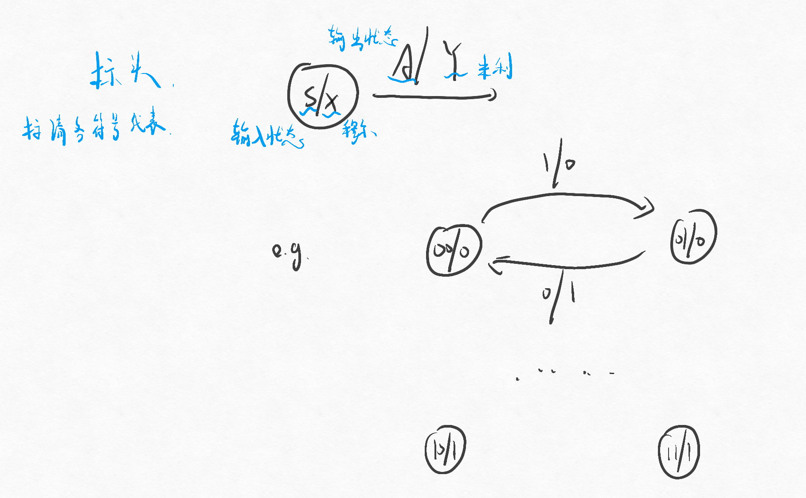

# 第一节 时序逻辑电路的基本概念

## 一、基本结构与分类

### 1. 基本结构

由组合逻辑电路和存储电路组合构成，  
组合电路实现运算，存储电路实现存储。

电路中存在反馈。  
组合逻辑电路用于产生输出和激励信号，  
输出和激励信号由输入信号和状态变量共同决定，  
状态信号由现态和激励信号决定。

1. 输出方程：$O=f_O(I,S)$
2. 激励方程：$E=f_E(I,S)$
3. 状态方程：$S^{n+1}=f_S(E,S^n)$**（只有这里才写上标）**

### 2. 分类

1. 同步/异步时序电路
   * 同步：存储电路中所有触发器共用**统一的时钟源**，状态在同一时刻更新。
   * 异步：没有统一的时钟脉冲（甚至没有），电路中各存储单元的更新不同时发生。
2. 米利型和穆尔型时序电路
   * 米利型：输出信号$O$是输入变量$I$和状态变量$S$的函数。$O=f_O(I,S)$
   * 穆尔型：输出信号$O$只取决于状态变量$S$。$O=f_O(S)$

## 二、功能的表达

### 1. 逻辑方程组

根据电路图，分别写出“输出方程”、“激励方程”、“状态方程”。

### 2. 状态转换真值表

---

当把触发器的控制信号$D,J,K,\cdots$也加上时，就是完全的真值表。  
在**求解激励方程组**$S^{n+1}=f_S(E,S^{n})$时，最好用真值表。  
因为可以单独看出控制信号与输入变量和状态的关系，画卡诺图，写出激励方程。

* 第一栏 - 现态$S^{n}$
* 第二栏 - 次态$S^{n+1}$
* **第三栏 - 激励$E$**  
  $JK$触发器就$J_i,K_i$，$D$触发器就$D_i$。  
  根据现态到次态的转变，确定当前激励信号为什么。  
  注意有几位状态就有几列触发器栏。

### 3. 转换表

* 转换表：更紧凑  
  将所有的现态$Q_1^n, Q_2^n\cdots$放在第一列，  
  将所有的次态$Q_1^{n+1}, Q_2^{n+1}\cdots$放在二大列，  
  对于不同的输入信号，放在第二大列不同的列，（$2bit$则划分$4$列）。

  对于输出：  
  若输出为米利型，跟放在每个次态的后面，用斜线隔开，  
  若输出为穆尔型，则单独放最后一列列。

### 4. 状态表

就是对于转换表，用一个变量或名字（甚至中文名字也行），来命名每个状态，  
可以方便看出状态对于不同输入信号间的转换。

但由于缺少具体状态的编码，不好写出逻辑方程组。

### 5. 状态图

  

**图错误！**  
S为储存电路（触发器）的状态
A为输入信号，控制了状态的变化。（如果没有则不写）

这两个构成了基本的状态转移图，  
但可以加个输出信号更加全面。

用斜线隔开放在后面，  
若为米利（双相关），则写在箭头上（因为会与输入信号有关）；  
若为穆尔（状态相关），则写在圈内（因为只与状态有关）。

## 6. 时序图
