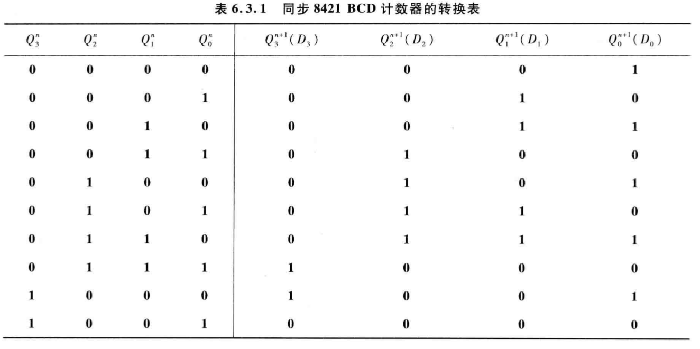
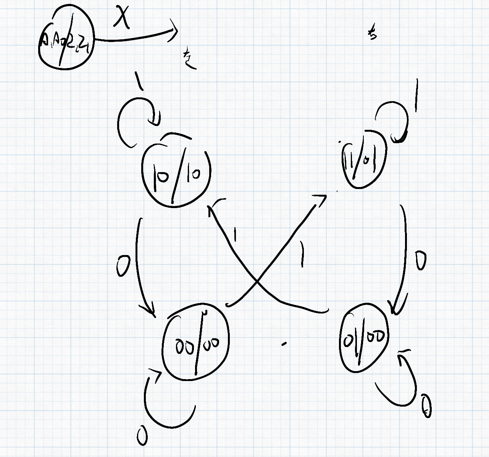

# 第三节 同步时序逻辑电路的设计

是分析的逆过程。

## 一、步骤

0. 基本分析：  
   * 确定状态。  
     此时因为没有化简和状态分配，暂时用$a,b,\cdots$或其他名字来代替。
   * 确定输入变量。
   * 构建对于每种输入变量，状态如何转移。
   * 确定输出变量。  
     判断是米利还是穆尔，有几个输出（几种操作）。
1. 根据给定逻辑功能确定原始状态图、状态表。
2. 状态化简，合并等价状态，求出最简状态图。  
   > 等价状态：在相同输入下有相同输出，并转换到同一个次态。

   反映到状态表：整个次态栏($S^{n+1}/Y$)都相同。  
   反映到状态图：两个结点，不同输入信号都连接到同一个结点，且米利型输出相同。
3. 状态分配，给每个状态赋以二进制代码。  
   至少要保证$2^n \ge M$，$n$为位数，$M$为状态数。
4. 选择触发器类型  
   主要是D或JK。
5. 根据转换表，求出电路的激励方程组和输出方程组。  
   利用卡诺图求得。
6. 画出逻辑图，检查自校验能力。  
   自校验能力：能从异常（未定义）状态自动恢复到正常状态。

## 二、举例

### 1. 8421码计数器

> 题目：  
> 用D触发器设计一个同步递增8421BCD码计数器。

前四步已经给定。

1. 列出转换表  
   
2. 画卡诺图，确定激励方程组
3. 画出逻辑图  
   发现有自校验能力

### 2. 串行数据检测器

> 题目：  
> 对于一个输入端口，不断输入一串编码序列（每次**只输入一位**），  
> 检测该序列是否出现$110$这样一串编码，若出现一次输出$1$，否则输出$0$。

分析：  
因为只能一位位输入，所以要存储检测的状态，**依次检测**，  
匹配成功则进入下一状态，否则回到之前某一状态重新匹配。  
（但注意匹配到$11$时，如果输入$1$失配，此时不是回到起始状态，而是继续这个状态匹配）

### 3. 由时序图设计电路

时序图对应的状态转移十分明确（就是一个周期内的**前后状态关系**），  
直接根据波形图画出状态图即可。

### 4. 由原始状态图设计电路

### 5. 机器人转向

**有问题。**

是否可以用穆尔型。

  

### 6. 余3码十进制加数器

