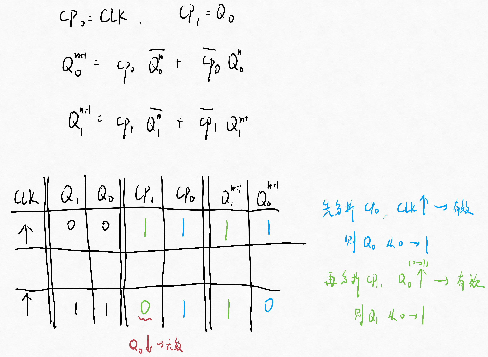

# 第四节 异步时序逻辑电路的分析

## 一、步骤

1. 写出各逻辑方程
   1. **时钟方程**：$CP_n=\cdots$  
      * 对于上升沿触发：$CP_n=$
      * 对于**下降沿触发**：$\overline{CP_n}=$
   2. 触发器的激励方程
   3. 输出方程
   4. 状态方程，需**考虑时钟信号是否有效**$cp_n$。  
      即：$Q^{n+1}=cp\quad f(Q^n) + \overline{cp}\quad Q^n$
2. 转换表
   这里需要加上“时钟信号”一栏，  
   并且需要逐级分析，依次得到各时钟信号是否有效。
3. 状态图
4. 波形图  
   由于存在延迟，因此可能产生延时造成的错误脉冲。

有以下注意点：

1. 分析状态转换时必须考虑各触发器的时钟信号作用情况。  
   利用一个时钟信号是否有效的变量$cp_n$，代表时钟信号是否有作用，  
   $CP_n=1$代表有作用，状态变化（$cp_0M$，$M$代表状态方程）；否则无作用，状态保持（$\overline{cp_0}Q_0^n$）。
2. 必须从输入信号触发的第一个触发器开始逐级分析。  
   *一般从唯一一个的时钟输入信号$CLK$开始，分析其所连触发器的始终方程。*
3. 不同触发器的状态转换存在延迟。

> 写转换表的例子：
>
>   
