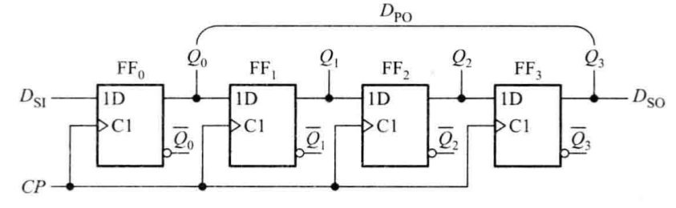
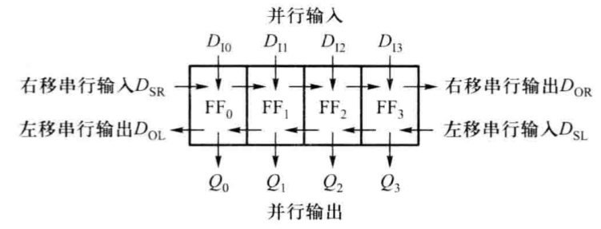
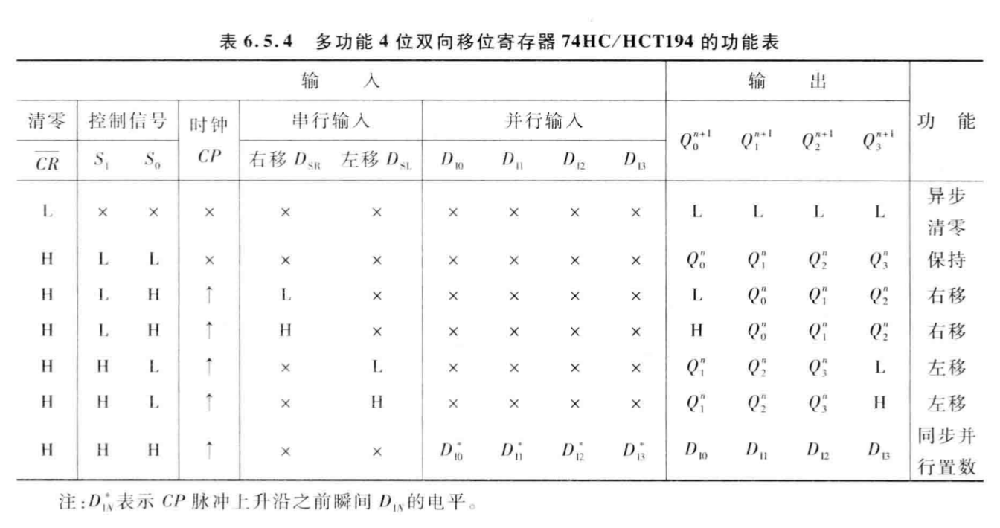
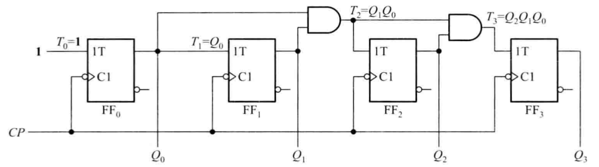
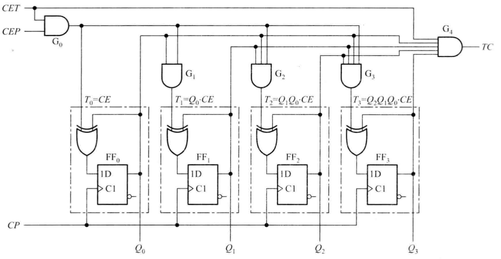
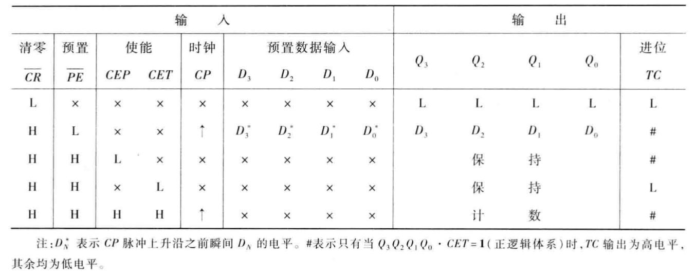
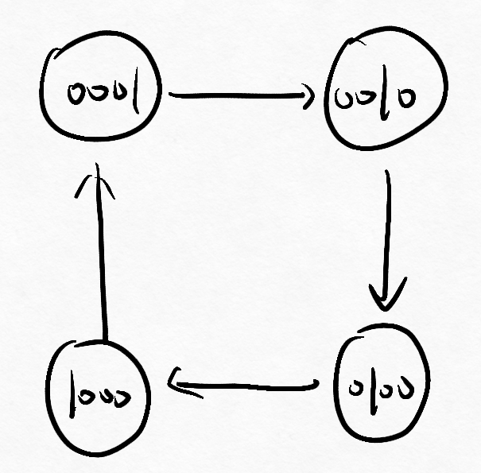
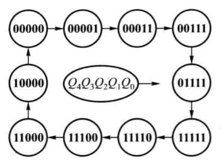

# 第五节 典型的时序逻辑集成电路

## 一、寄存器和移位寄存器

### 1. 寄存器

> 定义 - 寄存器：  
> 是数字系统中用来**储存代码或数据**的逻辑部件。  
> 主要组成器件是**触发器**。

### 2. 移位寄存器

> 定义 - 移位寄存器：  
> 既能寄存数码，也能在时钟脉冲的作用下，**使数码向高位或低位**移动的逻辑功能部件。

分为：

* 单向移位寄存器
  * 左移位寄存器：**高位向低位移动**。
  * 右移位寄存器：**低位向高位移动**。

  **⚠一定注意与C++位移动相反！**  
  因为电路是左边低位右边高位，可以见下图。
* 双向移位寄存器

---

基本移位寄存器：



输出分为两个端口：

* 串行数据输出端$D_{SO}$：必须从低位串到高位。
* 并行数据输出端$D_{PO}$

---

总结：

* $N$位移位寄存器，由$N$个触发器构成，需要$T*N$个周期完成串行传输。
* 必须用寄存器

---

双向移位寄存器：



共有$6$种输入输出模式。

实现：增加一个4选1数据选择器，根据不同的选择信号采用不同模式。

#### 4位双向移位寄存器（74HC194）

  

**⚠警告：为了与左移右移相对应，低位写在左边，高位写在右边！**
即：$D_0D_1D_2D_3$这样。

```verilog
//Behavior
module shift74x194(S1, S0, ...);
    input CP;       //时钟信号
    input CR;       //清零信号
    input S1, S0;   //控制输入
    input Dsr, Dsl; //串行输入的右移低位Dsr和左移高位Dsl
    input D[3:0];   //并行输入
    output reg Q[3:0];  //输出

    always @(posedge CP or negedge CR)
        if (~CR) Q <= 4'b0000; //清零
        else
            case ({S1,S0})
                2'b00: Q <= Q;  //保持
                2'b01: Q <= {Q[2:0], Dsr}; //右移，串行输入到最低位
                2'b10: Q <= {Dsl, Q[3:1]}; //左移，串行输入到最高位
                2'b11: Q <= D; //并行输入
            endcase
endmodule
```

## 二、计数器

> 定义 - 计数器：  
> 基本功能是对**输入时钟脉冲进行计数**。  
> 也可以用于分频、定时、产生节拍脉冲和脉冲序列以及进行数字运算等。

* 计数器的模$M$：计数器一次循环能经历的状态数。

分类：

* 同步计数器
  * 加计数器
    * 二进制计数器
    * 非二进制计数器
  * 减计数器
    * ……
  * 可逆计数器
* 异步计数器
  * ……

### 1. 二进制计数器

实现是利用T'触发器的翻转功能，  
并采用异步时钟信号，下一级时钟信号是前一级的输出。  
则可实现从$0000...\sim 1111...$的依次遍历，完成计数。

  
*$CR$为置零信号*

但总会产生延迟，  
且因为为串联，每一级都有延迟，级越高，延迟越高。  
故称“纹波计数器”。  
会限制计数速率，并可能产生错误。

---

改用同步：  
将“采用前一级的输出作为这一级的始终”，改为“直接用某种不基于前一级输出的信号”。

发现规律：高一级触发器只在**低一级触发器为$1$时准备翻转**。（最低位一直翻转）  
切换为T触发器，$T_n=Q_{n-1}Q_{n-2}\cdots Q_{1}=\Pi_{i=1}^{n-1}Q_i\qquad(T_0=1)$



虽然触发器的延迟减小了（只变为$T_0$的一个延迟），  
但与门还存在延迟，也是串联的。  
称为“同步串行计数器”

---

再改进：



#### 4位同步二进制计数器（74LVC161）

* 使能信号
  * $CET$ - 串行进位使能信号  
    如果要扩展多位计数器，需要输出这个计数器的进位信号。  
    $TC=Q_3Q_2Q_1Q_0\cdot CET$
  * $CEP$ - 内部进位使能信号

  **只有$CET,CEP$均有效（$=1$），才开始计数。**  
  也就是说要工作，总会输出进位信号。
* 操作信号
  * $\overline{CR}$ - 清零
  * $\overline{PE}$ - 置数



> 例 - 用74LVC161构成九进制加计数器。
>
> 分析 1 - 利用清零操作完成循环：  
> 74161有十六种状态，实现九进制可以只用前8种状态$0000\sim 1000$记录，  
> 当出现$1001$时，瞬间使清零信号$\overline{CR}=1$，瞬间清零，达成模$M=9$。
>
> 但这里无论怎么反应多快，总会出现$1001$这种异常状态。
>
> **分析 2 - 改用同步置数操作**：  
> 将利用“清零”完成循环，改为利用“置数”完成循环：
> 当出现$1000$时，将$\overline{PE}=1$，  
> 并将置数端口恒定为$0000$。  
>
> 这样当到$1000$来到时，会进入“预备置数”状态，  
> 下一个有效时钟信号，则会直接置数为$0000$，完成循环。
>
> 如果要用其他状态（比如后8个状态$1000\sim1111$）、或者其他进制，则调整相应的输入端口即可。

---

> 例2 - 扩展为256位计数器：
>
> 用两个74161。有两种方式：
>
> 1. 并行连接 - 将低位的进位信号$TC$，作为高位的**使能信号**$CET \& CEP$。
>    当$TC=1$时，需要进位，故直接将$TC$连到$CET和CEP$。
> 2. 串行连接 - 将低位的进位信号$TC$，作为高位的**时钟信号**$CP$。  
>    且如果高位为下边沿敏感，要加个非门（$\overline{TC}=1\to0$）。

### 2. 二-十进制码(BCD)计数器

### 3. 环形计数器

移位寄存器的$D_{so}$与$D_{sr}$相连。

1. 基本环形计数器  
   
2. 扭环计数器  
   再将最高位的$\overline{Q}$与$D_{S1}$相连。
   
