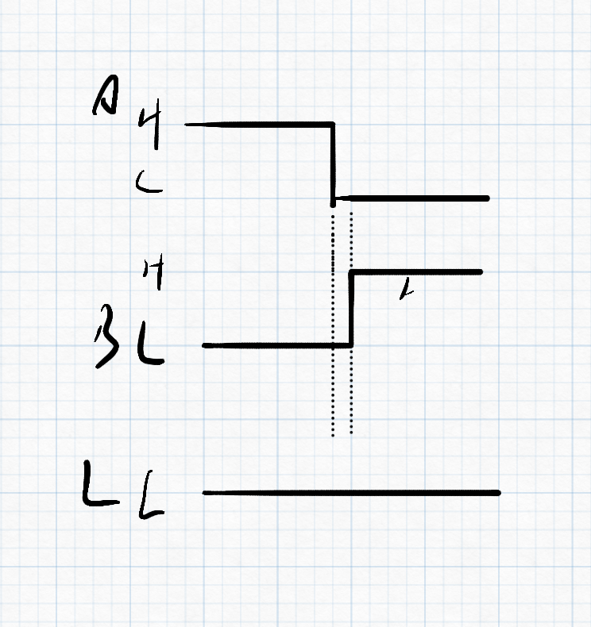
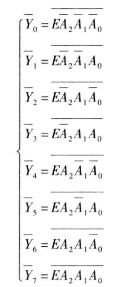

# Ep.4 组合逻辑电路

## 第二节 组合逻辑电路的设计

### 一、 设计

* 对于不可能出现的情况，应将其作为无关项。
* 对于较多情况，可以用多位二进制的组合来表示。
  e.g. 血型A、B、AB、O，可以用两位bit表示。

### 二、 优化

#### 1. 单输出电路

> 通过对逻辑表达式进行变换，以减少芯片资源的数目和连线。

#### 2. 多输出电路

利用多项表达式中共同的乘积部分。

#### 3. 多级逻辑电路

提取公因子后，可以将扇入数减少。

## 第三节 组合逻辑电路的竞争-冒险

现实情况下，任何逻辑电路从输入到输出总是会有延迟。
所以会产生竞争-冒险现象。
导致在稳态电路下本应输出某种结果，实际上却并不是该结果，

### 一、 产生的竞争冒险的原因

> 例子：
>
> 但$L=AB$，其中$B=\notA$时，
> 若不考虑延迟，则$L=0$。
>
> 
>
> 但因为经过一个逻辑元件会产生一定的延时，所以非门的输入会晚一些，
> 导致$L$的处理在短时间内会产生错误。

* 竞争：当一个逻辑门的两个输入端的信号同时向相反方向变化，而变化的时间有差异的现象。
* 冒险：由竞争而可能产生输出干扰脉冲的现象。

由竞争不一定有冒险。



### 二、 消除竞争冒险的方法

1. 发现并消除互补变量$A \overline{A}$、$A + \overline{A}$
2. 增加乘积项，避免互补项相加
   对于$L=X_AM+X_B \overline{M} \rightarrow L=X_AM+X_B \overline{M} + X_AX_B$
3. *输出端并连电容器
   *为物理技术，不在本课讨论范围。*

## 第四节 若干典型的组合逻辑电路

### 一、 编码器(Encoder)

> 赋予二进制代码特定含义的过程成为编码。
>
> 如8421BCD，用1000表示8；
> 如ASCII，用各种二进制表示字符。

分类：

* 普通编码器：任何时候**只允许一个**有效输入信号，否则输出发生混乱。
* 优先编码器

#### 1. 普通编码器 - 4线-2线普通二进制编码器

真值表：


可由表得逻辑式：
$$$
Y_1=\bar{I_0}I_1\bar{I_2}\bar{I_3}+\bar{I_0}\bar{I_1}\bar{I_2}I_3
Y_0=\bar{I_0}\bar{I_1}I_2\bar{I_3}+\bar{I_0}\bar{I_1}\bar{I_2}I_3 \\
$$$

---

异常分析：

当$I_3=1$时，$Y_1Y_0=11$，
而当$I_1=I_2=1$时，$Y_1Y_0=1$，
故当有两个以上的输出信号时会出现异常。

```verilog
module encoder4to2(Y, I);
  input [3:0] I;
  output reg [1:0] Y;

  always @(I)
  begin
    case (I)
      4'b0001: Y=2'b00;
      4'b0010: Y=2'b01;
      4'b0100: Y=2'b10;
      4'b1000: Y=2'b11;
      default: Y=2'b00;
    endcase
  end
```

#### 2. 优先编码器 - 4线-2线优先二进制编码器

根据事情的轻重缓急，实现规定好输入端口的优先级，
当有多个输入信号输入时，只处理优先级高的。

真值表：


异常分析：

* 当所有输入信号为0时，输出为0
* 当$I_1=0$时，输出也为0

```verilog
module encoder4to2(Y, I);
  input [3:0] I;
  output reg [1:0] Y;

  always @(I)
  begin
    casex (I)
      4'b0001: Y=2'b00;
      4'b001x: Y=2'b01;
      4'b01xx: Y=2'b10;
      4'b1xxx: Y=2'b11;
      default: Y=2'b00;
    endcase
  end
```

常用集成电路优先编码器种类

* 74X147
* CD4532

#### 3. 8线-3线优先二进制编码器

### 二、 译码器/数据分配器(Decoder)

#### 1. 定义与分类

> 将二进制码翻译成代表某一特定含义的信号。

分类：

* 唯一地址译码器
  * 二进制译码器
  * 二-十进制译码器
  * 显示译码器
* 代码转换器

#### 2. 2线-4线译码器


*注：端口上有横杆，或者有小圆圈，代表为低电平有效*

```verilog
//Dataflow
module decoder_df(A1,A0,E,Y);
  input A1,A0,E;
  output [3:0]Y;


```

#### 3. 3线-8线译码器(74HC138)



因为每一项可以代表一个最小项（的非），也称为**最小项译码器**。
能很方便实现三变量逻辑函数。

---

用74HC138实现三变量逻辑运算：

1. 先将表达式转换为最小项之和的形式。
2. 再还原律+摩尔根，变为最小项的非的与形式。
3. 用与非门连接在一起。

```verilog
module ecoder3to8_bh(A,En,Y);
  input [2:0]A, En;
  output reg [7:0]Y;
  integer k;

  always @(*)
  begin
    Y = 8'b1111_1111;
    for (k = 0; k <= 7; k++)
      if ((En == 1) && (A == k))
        Y[k]=0;
      else
        Y[k]=1;
  end
endmodule
```

#### 4. 拓展

可将多个译码器组合在一起形成其它形式译码器。
