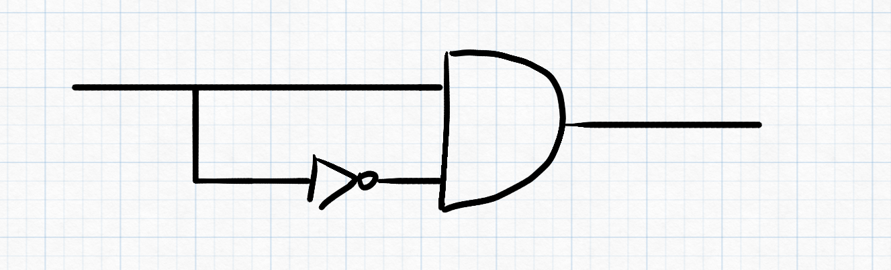
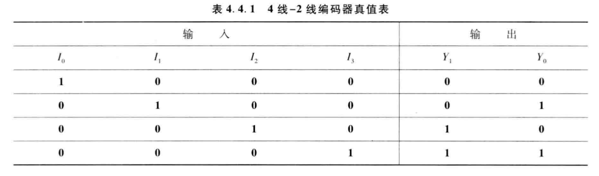

# Ep.4 组合逻辑电路

## 第二节 组合逻辑电路的设计

### 一、 设计

* 对于不可能出现的情况，应将其作为无关项。
* 对于较多情况，可以用多位二进制的组合来表示。
  e.g. 血型A、B、AB、O，可以用两位bit表示。

### 二、 优化

#### 1. 单输出电路

> 通过对逻辑表达式进行变换，以减少芯片资源的数目和连线。

#### 2. 多输出电路

利用多项表达式中共同的乘积部分。

#### 3. 多级逻辑电路

提取公因子后，可以将扇入数减少。

## 第三节 组合逻辑电路的竞争-冒险

现实情况下，任何逻辑电路从输入到输出总是会有延迟。
所以会产生竞争-冒险现象。
导致在稳态电路下本应输出某种结果，实际上却并不是该结果，

### 一、 产生的竞争冒险的原因

> 例子：
>
> 但$L=AB$，其中$B=\overline{A}$时，
> 若不考虑延迟，则$L=0$。
>
> 
>
> 但因为经过一个逻辑元件会产生一定的延时，所以非门的输入会晚一些，  
> 导致$L$的处理在短时间内会产生错误。

* 竞争：当一个逻辑门的两个输入端的信号同时向相反方向变化，而变化的时间有差异的现象。
* 冒险：由竞争而可能产生输出干扰脉冲的现象。

由竞争不一定有冒险。


---

总结：

* 表达式最终是一个$L=M+\overline{M}$  
  （只是要求两变量高低电平反向即可，不一定是同一变量）
* 对于与门：其中一个先从$0$到$1$  
  
* 对于或门：其中一个先从$1$到$0$  
    


### 二、 消除竞争冒险的方法

1. 发现并消除互补变量$A \overline{A}$、$A + \overline{A}$
2. 增加乘积项，避免互补项相加  
   对于$L=X_AM+X_B \overline{M} \rightarrow L=X_AM+X_B \overline{M} + X_AX_B$
3. *输出端并连电容器  
   *为物理技术，不在本课讨论范围。*

## 第四节 若干典型的组合逻辑电路

### 一、 编码器(Encoder)

> 赋予二进制代码特定含义的过程成为编码。
>
> 如8421BCD，用1000表示8；
> 如ASCII，用各种二进制表示字符。

分类：

* 普通编码器：任何时候**只允许一个**有效输入信号，否则输出发生混乱。
* 优先编码器：允许同时输入两个以上的有效输入信号。  
  当同时输入几个有效信号时，只对优先级最高的进行编码。

#### 1. 普通编码器 - 4线-2线普通二进制编码器

真值表：


可由表得逻辑式：
$$
Y_1=\bar{I_0}I_1\bar{I_2}\bar{I_3}+\bar{I_0}\bar{I_1}\bar{I_2}I_3 \\
Y_0=\bar{I_0}\bar{I_1}I_2\bar{I_3}+\bar{I_0}\bar{I_1}\bar{I_2}I_3
$$

---

异常分析：

当$I_3=1$时，$Y_1Y_0=11$，  
而当$I_1=I_2=1$时，$Y_1Y_0=11$，  
故当有两个以上的输出信号时会出现异常。  

```verilog
module encoder4to2(Y, I);
  input [3:0] I;
  output reg [1:0] Y;

  always @(I)
  begin
    case (I)
      4'b0001: Y=2'b00;
      4'b0010: Y=2'b01;
      4'b0100: Y=2'b10;
      4'b1000: Y=2'b11;
      default: Y=2'b00;
    endcase
  end
```

#### 2. 优先编码器 - 4线-2线优先二进制编码器

根据事情的轻重缓急，实现规定好输入端口的优先级，
当有多个输入信号输入时，只处理优先级高的。

真值表：


异常分析：

* 当所有输入信号为0时，输出为0
* 当$I_1=0$时，输出也为0

```verilog
module encoder4to2(Y, I);
  input [3:0] I;
  output reg [1:0] Y;

  always @(I)
  begin
    casex (I)
      4'b0001: Y=2'b00;
      4'b001x: Y=2'b01;
      4'b01xx: Y=2'b10;
      4'b1xxx: Y=2'b11;
      default: Y=2'b00;
    endcase
  end
```

常用集成电路优先编码器种类

* 74X147
* CD4532

#### 3. 8线-3线优先二进制编码器

### 二、 译码器/数据分配器(Decoder)

#### 1. 定义与分类

> 将二进制码翻译成代表某一特定含义的信号。

分类：

* 唯一地址译码器
  * 二进制译码器
  * 二-十进制译码器
  * 显示译码器
* 代码转换器

#### 2. 二进制译码器

##### ① 2线-4线译码器(74HC139)

  
*⭐注：端口上有横杆，或者有小圆圈，代表为**低电平有效***

```verilog
//Dataflow
module decoder_df(A1,A0,E,Y);
  input A1,A0,E;
  output [3:0]Y;

  assign Y[0] = ~(~A1 & ~A0 & ~E);
  assign Y[1] = ~(~A1 & A0 & ~E);
  assign Y[2] = ~(A1 & ~A0 & ~E);
  assign Y[3] = ~(A1 & A0 & ~E);
endmodule
```

##### ② 3线-8线译码器(74HC138)


  
因为每一项可以代表一个**最小项（的非）**，也称为**最小项译码器**。
能很方便实现三变量逻辑函数。

---

用74HC138实现三变量逻辑运算：

1. 先将表达式转换为最小项之和的形式。
2. 再还原律+摩尔根，变为最小项的非的与形式。
3. 用与非门连接在一起。

```verilog
module ecoder3to8_bh(A,En,Y);
  input [2:0]A, En;
  output reg [7:0]Y;
  integer k;

  always @(*)
  begin
    Y = 8'b1111_1111;
    for (k = 0; k <= 7; k++)
      if ((En == 1) && (A == k))
        Y[k]=0;
      else
        Y[k]=1;
  end
endmodule
```

> 拓展 - 用74HC138实现$L=\overline{A}\ \overline{C}+AB$  
>
> 

#### 3. 二-十进制译码器

有$4$个输入端口，代表$4$位8421BCD码，  
有$10$个输出端口，分别代表十进制$0~9$

#### 4. 显示译码器

将输入的4位BCD码（一般为8421BCD）翻译成“七段码”送给数码管，  
以便数码管能够显示各个BCD码所对应的十进制数字。

> 与前面两种译码器的区别：  
>
> * 前面两种，一种输入信号，只会有一个输出端口输出有效电平。
> * 显示译码器，一种输入信后，可能会有多个输出端口输出有效电平。

  
显示器分段布局图

---

* 共阴极电路：所有阴极接地，输入信号为高电平有效
* 共阳极电路：所有阳极接地，输入信号为低电平有效

##### ① 七段显示译码器(74HC4511)

真值表（功能表）：  
  
  
74HC4511功能表

* 灯测试$\overline{LT}$优先级最高 - 正常为1。但只要为0，灯全亮。
* 灭灯$\overline{BL}$优先级第二 - 正常为1。但只要为$BL=0(LT=0)$，灯全灭。
* 锁存$LE$ - 正常为0。但只要$LE=1(LT=1, BL=1)$，则输出信号锁定。

```verilog
module seg7_decoder(
  input LE, BL, LT, D3, D2, D1, D0,
  output reg a, b, c, d, e, f, g
);

  always @(*)
  begin
    if (LT == 0) //灯测试
      {a, b, c, d, e, f, g} = 7'b1111111;
    else if (BL == 0) //灭灯
      {a, b, c, d, e, f, g} = 7'b0000000;
    else if (LE == 1) //锁存
      {a, b, c, d, e, f, g} = {a, b, c, d, e, f, g};
    else //开始判断
      case ({D3, D2, D1, D0})
        4'd0: {a, b, c, d, e, f, g} = 7'b1111110;
        4'd1: {a, b, c, d, e, f, g} = 7'b0110000;
          ...//以下类推
        default: {a, b, c, d, e, f, g} = 7'b0000000;
      endcase
  end
endmodule
```

---

> 拓展 - 由一个显示译码器显示$4$位
>
> 本来一个显示译码器只能显示$1$位，  
> 但搭配74HC139，可以依次显示$4$位，  
> 再利用人的视觉残留，可以看到稳定的$4$位数字。

#### 5. 数据分配器

将公共数据线（一个公共输入端口）上的数据，按照需要，发送到不同的通道（某个输出端口）上去。  
相当于一个单刀多掷开关。

> 原理：
>
> 对于74HC138，当$E_2=0, E_3=1$时，  
> 将$E_1$作为公共输入端口，  
> 可以通过不同的$A_0, A_1, A_2$，可以将$E_1$输出到不同的$Y$端口。
> > 如$A_0=0, A_1=1, A_2=0$， 则$Y_2=E_2$，从$Y_2$端口原样输出。

可以分别将$E_1, E_2, E_3$作为输入端口，并其余两个调整为有效信号即可  
但注意：

* $E_1, E_2$ - 输出跟输入一样
* $E_3$ - 输出是输入取非。

  
功能表

---

实现方式，利用二进制译码器(74HC139、74HC138)，搭配$n$个三态门来实现。

> 例 - 实现一个数据分配器，分配到$4$个通道。
>
> 

### 三、数据选择器

#### 1. 2选1数据选择器

电路图：  
  
电路图

逻辑符号：  
  
逻辑符号

```verilog
//Dataflow
module mux2x1_df(A, B, SEL, L);
  input A, B, SEL;
  output L;

  assign L = SEL ? A : B;
endmodule

//Behavior
module mux2x1_bh(D1, D0, S, L);
  input D1, D0, S;
  output reg Y;

  always @(*)
  //一句话，不用加begin
    L = SEL ? D1: D0;
endmodule
```

---

由该数据选择器可以组合成n选1数据选择器。

> 如4选1数据选择器：  
> 可由$3$个2选1选择器构成  
>   
> 电路图
>
>   
> 逻辑符号
>
> 表达式：$Y=D_0\overline{S_1}\ \overline{S_0} + D_1\overline{S_1}S_0 + D_2S_1\overline{S_0} + D_3S_1S_0$  
> 改为选择信号的最小项$Y=D_0m_0+D_1m_1+D_2m_2+D_3m_3$

---

上例看出：也可以将表达式改为最小项表达，  
故也**可以进行数据运算**。

> 特例 - 利用2选1数据选择器，实现$L=AB+A\overline{C}+BC$
>
> 本来2选1只支持$2$个输入端，但这里有$3$个变量，  
> 因此需要指定一个变量为“控制端”。
>
> 定$A$为控制端，则真值表：  
>   
> 真值表
>
> 所以也可以实现电路如图：
>   
> 电路图

总结：

* 变量数 = 输入端口数  
  则直接把函数转化为最小项表达式，然后根据保留情况，直接确定控制信号$S$为确定的值。  
  这个时候$S$是常量。
* 变量数 > 输入端口数
  将部分变量当作控制信号，根据不同的控制信号，得出每个情况的表达式，然后再设计每种情况的电路。  
  这个时候$S$是变量。

---

* 查找表LUT(Look-Up-Table)  
  *越等于一个8选1数据选择器*

---

##### 典型集成电路数据选择器

1. 8选1数据选择器(74HC151)
   > 扩展：
   >
   > 1. 多位的8选1：几个8选1并联
   > 2. 16选1：  
   >    将两个8选1并联，并将使能端$\overline{E}$利用起来，作为第二个8选1是否启用（即选8~15）的控制信号。

### 四、数值比较器

对**两个数字**进行比较，以判断其大小的逻辑电路。

#### 1. 1位数值比较器

最基本的1位数值比较器：

* 2个输入：$A$、$B$
* 3个输出：$F_{A>B}$、$F_{A=B}$、$F_{A<B}$

可由1位数值比较器构成n位数值比较器。  
当高位不相等时，则直接输出高位的比较信息，  
否则进行下一位的比较。

#### 2. 2位数值比较器

  
真值表

#### 3. 集成数值比较器

##### ① 4位数值比较器(74HC85)

  
74HC85示意图

---

拓展 - 组成$4n$位数值比较器

1. 串联扩展方式  
   

   但注意：可能存在延时情况。  
   最坏情况：每次都比较到最后一位才得出结果。
2. 并联拓展方式  
   

### 六、算术运算电路

#### 1. 半加器和全加器

* 半加：不考虑低位的进位
* 全加：考虑低位的进位

##### ① 1位半加器(Half Adder)


##### ② 1位全加器(Full Adder)


---

可以由两个半加器组成成一个全加器：  
  
即本位半加后再与进位半加。

##### ③ 应用

1. 奇偶校验器  
   对于全加器，其$S$端输出即为$3$个输入端是否为奇数个$1$。

#### 2. 多位加法器

*略。*

## 第五节 组合可编程逻辑器件

> 一种可以有用户定义和设置逻辑功能的器件。

最基本的结构：

* 与门阵列
* 或门阵列

由此构成与非表达式。

### 一、PLD的结构、表示方法及分类

P - program 可编程
L - logic 逻辑
D - device 器件

#### 1. PLD的基本结构

  

#### 2. PLD的逻辑符号表示方式

1. 不可编程单元 - 硬线连接单元
2. 可编程单元
   1. 1
   2. 擦除
  
特殊的组合表达：

1. 输出恒为0的与门
2. 输出恒为1的与门
3. 互补输入缓冲器
4. 三态输出缓冲器

#### 3. 编程连接技术

1. 早期  
   采用金属熔丝技术，  
   通过大电流将金属丝熔断，  
   只能进行一次编程。
2. CMOS中  
   采用可擦除的编程方式，  
   用浮杉CMO代替熔丝，  
   可以多次编程。

#### 4. 分类

1. 按集成密度划分：
   * 低密度可编程逻辑器件
   * 高密度可编程逻辑器件
2. 按复杂程度划分：
3. 按与、或阵列是否编程划分：
   1. 与阵列固定，或阵列可编程(PROM)
   2. 与阵列、或阵列均可变成(PLA)
   3. 与阵列可编程，或称列固定