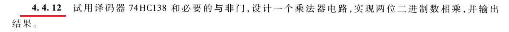
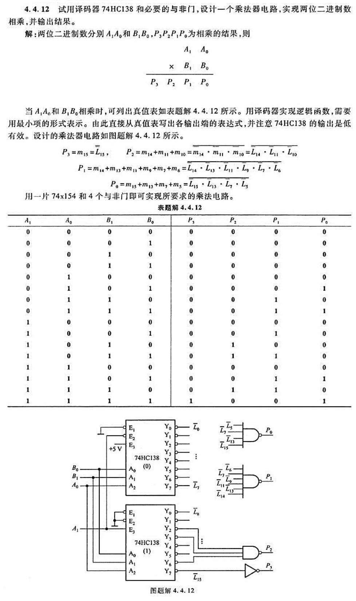
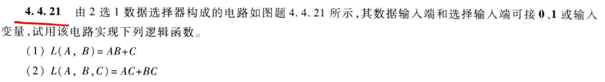

# 11.13 组合逻辑电路 - 电路设计、

## 1. 74HC138实现两位乘法

对应题目：P223 4.4.12

  
题目

* 收获：  
  明白了译码器的作用：将一个特定的编码（也可以就是一串二进制数），翻译成具有具体信号，来代表某种特定意义。  
  因此对于一种输入，**只能有唯一一个且对应的输出**。  
  由此，便也可以达成最小项表达器的功能。

  但是，作为最小项译码器时，  
  对于多输入变量对多输出变量之间的关系，虽然每一个输出变量是一种表达式，  
  但**输出端可以共用**。

  比如$4$个输入变量，无论对应多少个输出变量，  
  可以只用两片74HC138(74x154)，接四个输入变量，  
  然后每一个输出变量，根据表达式接对应的输出端口即可。

> 题解：  
> 

## 2. 数据选择器实现表达式

对应题目：P225 4.4.21

  
题目

* 收获：  
  首先明确：主要把**变量作为控制端口**，实在不够再待定为输入端口。

  以及如果规定只能用选择器，就需要把选择器扩展，  
  同时扩展时，**每一级用同一个控制端**。

## 3. 全加器与半加器

* 注意：  
  全加器和半加器有两个输出端口 - $S$和$C_o$，  
  但全加器要**考虑进位**，有三个输入端口 - $A_i,B_i,C_i$；  
  而半加器**不考虑进位**，有两个输入端口 - $A,B$。
