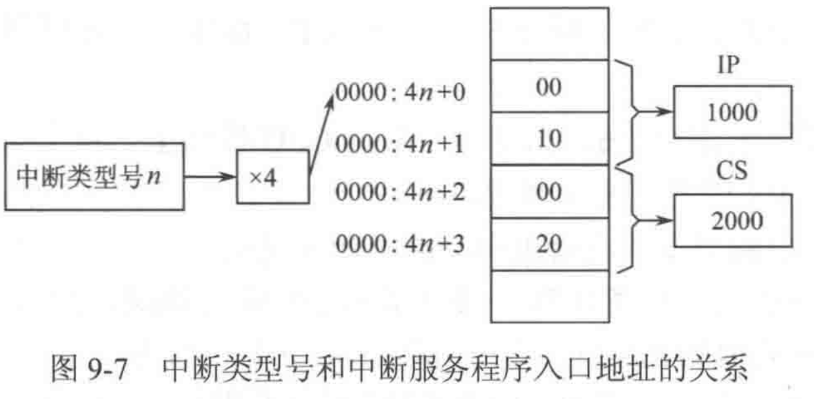

# Ep.8 中断

## 一、中断概念

### 1. 中断

> 定义 - 中断：
>
> CPU执行程序时，由于发生了某种**随机**的事件（外部或内部），CPU暂时**中断正在运行的程序**，转去执行一段**特殊的服务程序**（称为中断服务程序或中断处理程序），以处理该事件，处理完后又返回被中断的程序继续执行。

是微处理器CPU与外部设备**交换信息**的一种方式，是**处理随机事件和外部请求**的主要手段。

**功能：**

* CPU与外部设备并行工作
* 实时信息处理
* 故障检测
* 分时处理

### 2. 中断源

> 定义 - 中断源：
>
> 引起CPU中断的事件，发出中断请求的来源。

* 内部中断
  * 异常中断 - 异常事件引起
  * 软件中断 - 中断指令引起
* 外部中断
  * 可屏蔽中断(INTR中断) - 根据标志位决定是否响应
  * 非屏蔽中断(NMI中断) - 无条件响应

### 3. 中断系统功能

* 中断请求
* 中断源识别、中断判优 - 判断中断先后、轻重缓急
* 中断响应
* 中断处理
* 中断返回 - `IRET`

#### (1) 中断源识别

CPU需要确定是哪一个中断源提出了中断请求，找到该中断服务程序的入口地址。

* 软件查询法
  将中断请求信号或处理。

  * 优点：硬件简单
  * 缺点：时间随着中断源数量增多而增多

  因为中断需要保证及时性，故一般不用。
* 中断矢量法
  通过硬件控制电路，形成一个供CPU识别中断源的**中断向量号**，并由此**获取**中断服务程序**入口地址**。
  
  * 优点：CPU直接通过中断向量表转向中断服务程序，加快处理时间。

#### (2) 中断判优

* 同时发生的中断，根据优先级进行处理。
* 对非同时产生的中断，低优先级会被高优先级中断，为中断潜嵌套

**判优方式：**

* 软件判优  
  在软件中依次判断某中断是否发生，优先级即为检测排序的顺序。
* 硬件判优  
  利用菊花链逻辑电路，优先级即为电路排序的顺序。

#### (3) 中断响应

需要进行以下相应：

* 回复响应信号
* 保护现场

## 二、8086中断系统

### 1. 中断类型

8086中**有256类中断**（0～255），每类中断分配了8位编号，这个编号叫做中断类型号，记为`00H`~`FFH`

* 外部中断  
  * 非屏蔽中断NMI  
    当外设向CPU提出中断请求时，CPU在当前指令执行结束后，立即无条件予以响应。  
    由CPU的NMI引脚引入，高电平有效，至少保持两个时钟周期。
  * 可屏蔽中断INTR
    收CPU的IF控制（0不予响应，1可以）
* 内部中断  
  除法错误、`INT`指令。

优先级：

* 除法错
* `INT`
* 其他内部中断
* 外部中断
* 单步中断

### 2. 中断向量

> 定义 - 中断向量
>
> 需要响应的**每一类中断**都编写有响应的中断服务程序，并预先装入内存，**中断服务程序在内存中的入口地址**叫中断向量。

**每四个连续字节**存放一个中断向量，  
**高**两字节存放**段地址**CS；  
**低**两字节存放**偏移地址**IP。



**中断向量标地址指针：**  

存放中断向量的4个单元的首地址，可以由中断类型号计算得到，为$\text{中断类型号}\times4$。

**中断向量的设置：**

系统的中断向量表(`00H`~`1FH`, 32种)是由BIOS在启动时自己设置的；  
用户自定义的中断，则需要在初始化程序中，将中断向量装入。

### 3. 中断向量设置

1. 用传送指令设置  
   利用`MOV`指令，将中断服务程序（即汇编中一个子程序）的段地址和偏移地址，装入中断类型号对应的地址。  
   e.g. 要把中断服务程序`INT_P`，设定为中断类型号为`40H`，装入中断向量表。

   ```asm
   MOV AX, 0000H
   MOV ES, AX      ; 中断向量标的基址是0
   MOV SI, 40H*4   ; 地址直接是类型号*4
   ; 装入偏移地址
   MOV BX, OFFSET INT1
   MOV [SI], BX
   ; 装入段地址
   MOV BX, SEG INT1
   MOV [SI+1], BX
   ```

## 三、8259中断控制器

**主要功能：**

* 接收和记录8个不同外设发来的中断信号


