# 作业

## 任意斜率直线画线法

### DDA 画线法

#### 算法原理

对于任意一直线段$L(P_0,P_1)\quad (P_0\ne P_1)$，其两端点坐标为$P_0(x_0,y_0)$和$P_1(x_1,y_1)$，若斜率存在，则直线的微分方程为：
$$
\frac{\textrm{d}y}{\textrm{d}x}=\frac{\Delta y}{\Delta x} = k
$$

DDA 是通过在某一位置$(x_i,y_i)$分别加上增量$\Delta x$和$\Delta y$，求得下一点$(x_{i+1},y_{i+1})$的坐标，不断迭代从而生成直线。  
具体原理如下：

* 若斜率存在，且当$x_1-x_0$绝对值较大($x_0\ne x_1,|k|\le1$)，以$x$方向作为步进方向，且每步增量为单位步长（$\Delta x=1$，即一个像素），计算$y$方向的增量（$\Delta y=\Delta x\cdot k =k$），把每次计算出的$(x_{i+1},y_{i+1})$经取整后送到显示器输出，则得到扫描转换后的直线。
* 若斜率存在，且当$y_1-y_0$绝对值较大($x_0\ne x_1,|k|\ge1$)，以$y$方向作为步进方向，且每步增量为单位步长（$\Delta y=1$，即一个像素），计算$x$方向的增量（$\Delta x=\Delta y\cdot k =k$），把每次计算出的$(x_{i+1},y_{i+1})$经取整后送到显示器输出，则得到扫描转换后的直线。
* 若斜率不存在（$x_0=x_1$），以$y$方向作为步进方向，且每步增量为单位步长（$\Delta y=1$，即一个像素），$x$方向不存在增量（$\Delta x=0$），把每次计算出的$(x_{i+1},y_{i+1})$经取整后送到显示器输出，则得到扫描转换后的直线。

以上两种情况可以转换为如下通法：

> 分别计算两端点坐标$P_0(x_0, y_0), P_1(x_1, y_1)$的横纵坐标差值$\Delta x = x_1 - x_0, \Delta y = y_1 - y_0$，选绝对值最大的值作为迭代次数$steps$，则每次迭代的增量为$\mathrm{d}x = \frac{\Delta x}{steps}, \mathrm{d}y=\frac{\Delta y}{steps}$。然后令初始点为$P=P_0$，每次在点$P$处放置像素点后将$P$的横纵坐标加上相应增量，迭代$steps$次后即可生成直线。

#### 算法表示

伪代码：

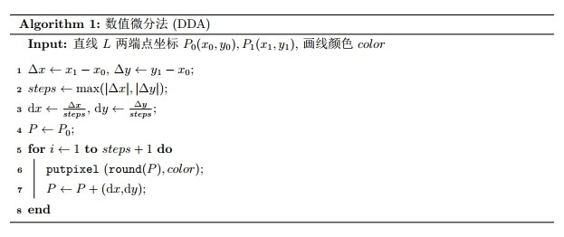

代码：

```c++
void Line_DDA(int x0, int y0, int x1, int y1, Color color)
{
    // 计算delta_x, delta_y, 确定steps，并计算dx, dy
    int delta_x = x1 - x0, delta_y = y1 - y0,
        steps = max(abs(delta_x), abs(delta_y));
    double x = x0, y = y0,
           dx = (double)delta_x / steps, dy = (double)delta_y / steps;
    for (int i = 1; i <= steps + 1; i++)
    {
        putpixel((int)(x + 0.5), (int)(y + 0.5), color); // 四舍五入生成像素点
        x += dx, y += dy;
    }
}
```

### 中点画线法

#### 算法原理

对于任意一直线段$L(P_0,P_1)\quad (P_0\ne P_1)$，其两端点坐标为$P_0(x_0,y_0)$和$P_1(x_1,y_1)$（保证$x_0<x_1$），先讨论直线斜率$0\le k\le 1$的情况。

令直线方程为为如下形式：

$$
F(x,y):ax+by+c = 0
$$

可计算得到相应的参数为：$a = y_0-y_1, b=x_1-x_0, c=x_0y_1-x_1y_0$，且可知$b>0$。

则对于平面上任何点$P_i(x_i,y_i)$，与直线的相对位置有且只有三种情况：

$$
F(x_i, y_i)\left\{\begin{array}{ll}
<0 & \textrm{ 点 }(x_i, y_i) \textrm{ 位于直线下方 } \\
=0 & \textrm{ 点 }(x_i, y_i) \textrm{ 位于直线上 } \\
＞0 & \textrm{ 点 }(x_i, y_i) \textrm{ 位于直线上方 }
\end{array}\right.
$$

从直线左侧向右生成直线，设当前已确定与直线最近的像素点坐标为$P_i(x_i,y_i)$，则下一个与直线最近的右方像素，只能是正右方像素$P_{RM}(x_i+1,y_i)$或右上方像素$P_{RU}(x_i+1,y_i+1)$，称二者为“候选像素”。  
记$P_{RM}$和$P_{RU}$的中点为$M$，易知其坐标为$M(x_i+1,y_i+0.5)$。

再假设$Q$为直线$L$与垂直线$x=x_i+1$的交点，则$M$与$Q$有三种关系：

* 若$F(M)>0$，即$M$在$Q$(直线$L$)上方，说明$P_{RM}$离直线最近，应作为下一个像素。
* 若$F(M)=0$，即$M$与$Q$重合(在直线$L$上)，说明$P_{RM}$与$P_{RU}$离直线等距离，两者均可作为下一个像素，这里约定$P_{RM}$作为下一个像素。
* 若$F(M)<0$，即$M$在$Q$(直线$L$)下方，说明$P_{RU}$离直线最近，应作为下一个像素。

故可用中点$M$的函数值$F(M)$作为决策变量$d_i$，根据$d_i$的符号确定下一个像素的选取。

$$
d_i\left\{\begin{array}{ll}
<0 & \textrm { 取右上方像素 } P_{RU}\left(x_{i}+1, {y}_{i}+1\right) \textrm { 作为下一个像素 } \\
\ge 0 & \textrm { 取正右方像素 } P_{RM}\left(x_{i}+1, {y}_{i}\right) \textrm { 作为下一个像素 }
\end{array}\right.
$$

选择相应像素后，将下两个候选像素的中点$M'$带入，可推导出下一个决策变量$d_{i+1}$的情况为：

$$
d_i\left\{\begin{array}{ll}
<0 & d_{i+1}=d_i+a+b \\
\ge 0 & d_{i+1}=d_i+a
\end{array}\right.
$$

注意到初始的决策变量为$d_0=a+0.5b$，会造成$d_0$为浮点数，进行浮点数加法，  
但$d$只需要关注与0的关系，所以可以将$d_0$乘2，转换为整数加法，即$d_0=2a+b$，$d_{i+1}=d_i+2a$或$d_{i+1}=d_{i}+2(a+b)$。

---

对于$k>1$的情况，其情况相当于$0\le k\le1$情况按直线$y=x$对称处理。  
故可将点$P_i(x_i,y_i)$与直线的三种相对位置情况中的下方改称为右方，上方改称为左方，判断条件仍相同；  
两个候选像素变为正上方像素$P_{MU}(x_i,y_i+1)$或右上方像素$P_{RU}(x_i+1,y_i+1)$，中点坐标为$M(x_i+0.5,y_i+1)$。

仍用中点$M$的函数值$F(M)$作为决策变量$d_i$，决策变量$d_i$的每次迭代处理为：
$$
d_i\left\{\begin{array}{ll}
<0 & \textrm { 取正上方像素 } P_{MU}\left(x_i, {y}_{i}+1\right) \textrm { 作为下一个像素 }, d_{i+1}=d_i+2b \\
\ge 0 & \textrm { 取右上方像素 } P_{RU}\left(x_{i}+1, {y}_{i}+1\right) \textrm { 作为下一个像素 }, d_{i+1} = d_i+2(a+b)
\end{array}\right.
$$

其中：$d_0=a+2b$。  
当$P_i=P_1$时终止迭代。

---

对于其他情况也采用类似分析方法，故只给出决策变量$d_i$每次迭代的处理如下表，不再给出详细分析过程。

| $k$情况       | $k\in[0,1]$           | $k\in(1,+\infty)$     | $k\in[-1,0)$          | $k\in(-\infty,-1)$    |
| ------------- | --------------------- | --------------------- | --------------------- | --------------------- |
| $d_0$         | $d_0=2a+b$            | $d_0=a+2b$            | $d_0=2a-b$            | $d_0=a-2b$            |
| $d_i<0$情况   | `x++, y++, d+=2(a+b)` | `y++, d+=2b`          | `x++, d+=2a`          | `y--, x++, d+=2(a-b)` |
| $d_i\ge0$情况 | `x++, d+=2a`          | `y++, x++, d+=2(a+b)` | `x++, y--, d+=2(a-b)` | `y--, d+=-2b`         |

#### 算法表示

伪代码：

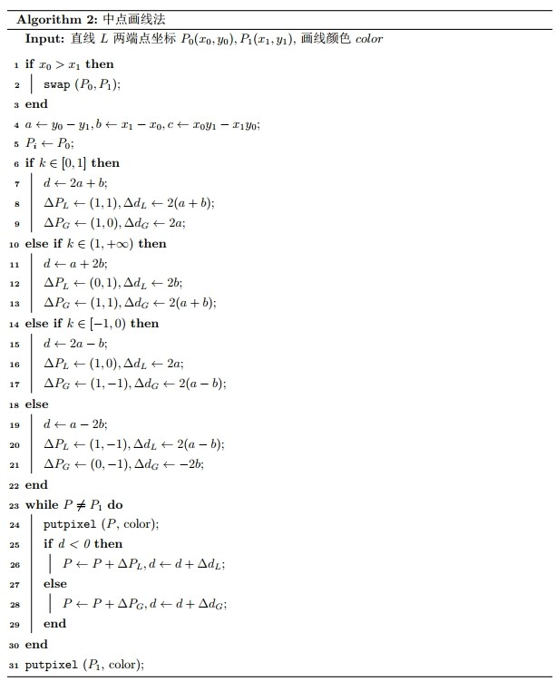

代码：

```c++
void Line_Midpoint(int x0, int y0, int x1, int y1, Color color)
{
    if (x0 > x1) // 保证x0 <= x1
        swap(x0, x1), swap(y0, y1);
    int a = y0 - y1, b = x1 - x0,   // 直线L的参数（c因为没有用到不用计算）
        d,                          // 决策变量d
        dd_L, dd_G,                 // 决策变量d的增量(L代表小于0的情况，G代表大于0的情况)
        x = x0, y = y0,             // 初始P坐标
        dPx_L, dPy_L, dPx_G, dPy_G; // P坐标的增量(L代表小于0的情况，G代表大于0的情况)
    // 根据k值分情况生成决策变量和增量
    if (-b <= a && a <= 0) // k ∈ [0, 1]
    {
        d = 2 * a + b;                            // d0 = 2a + b
        dPx_L = 1, dPy_L = 1, dd_L = 2 * (a + b); // d < 0情况
        dPx_G = 1, dPy_G = 0, dd_G = 2 * a;       // d >= 0 情况
    }
    else if (a < -b) // k ∈ (1, +∞)
    {
        d = a + 2 * b;                            // d0 = a + 2b
        dPx_L = 0, dPy_L = 1, dd_L = 2 * b;       // d < 0情况
        dPx_G = 1, dPy_G = 1, dd_G = 2 * (a + b); // d >= 0 情况
    }
    else if (0 < a && a <= b) // k ∈ [-1, 0)
    {
        d = 2 * a - b;                             // d0 = 2a - b
        dPx_L = 1, dPy_L = 0, dd_L = 2 * a;        // d < 0情况
        dPx_G = 1, dPy_G = -1, dd_G = 2 * (a - b); // d >= 0 情况
    }
    else // k ∈ (-∞, -1)
    {
        d = a - 2 * b;                             // d0 = a - 2b
        dPx_L = 1, dPy_L = -1, dd_L = 2 * (a - b); // d < 0情况
        dPx_G = 0, dPy_G = -1, dd_G = -2 * b;      // d >= 0 情况
    }
    // 迭代生成直线
    while (x != x1 || y != y1)
    {
        putpixel(x, y, color);
        if (d < 0)
            x += dPx_L, y += dPy_L, d += dd_L;
        else
            x += dPx_G, y += dPy_G, d += dd_G;
    }
    putpixel(x, y, color);
}
```

### Bresenham 画线法

#### 算法原理

其与中点画线算法的思想基本一致，只是在判断选$P_{RM}$和$P_{RU}$方法不同，  
这里把用实际位置与中点的位置关系，变为了与$P_{RM}$和$P_{RU}$两距离的大小关系，  
且约定$d_1=d_2$时选择右上方像素$P_{RU}$。  
仍先考虑$0\le k\le 1$的情况。

用$d_1$和$d_2$来表示正右$P_{RM}$和右上$P_{RU}$两个候选像素的$y$值，与线段上理想$y$值（$Q$点$y$值）的差值，  
即$d_1=|P_{RM}Q|, d_2=|P_{RU}Q|$，可得$d_1-d_2=2k(x_i+1)-2y_i+2b-1$，  
其中$k=\frac{\Delta y}{\Delta x}$，代入并在两边同乘$\Delta x$后得：
$$
\Delta x(d_1-d_2) = 2x_i\Delta y - 2y_i\Delta x + C
$$
其中$C$为一常量，$C=2\Delta y + \Delta x(2b-1)$。

设决策变量$d_i=\Delta x(d_1-d_2)$，其符号与$d_1-d_2$相同，起判别作用。  
判别情况如下：

$$
d_i\left\{\begin{array}{ll}
<0 & \textrm { 取正上方像素 } P_{MU}\left(x_i, {y}_{i}+1\right) \textrm { 作为下一个像素 } \\
\ge 0 & \textrm { 取右上方像素 } P_{RU}\left(x_{i}+1, {y}_{i}+1\right) \textrm { 作为下一个像素 }
\end{array}\right.
$$

而对于决策变量的迭代如下：
$$
d_{i+1}=2x_{i+1}\Delta y - 2y_{i+1}\Delta x + C \\
d_{i+1}-d_i = 2(x_{i+1}-x_i)\Delta y - 2(y_{i+1}-y_i)\Delta x \\
d_{i+1}=d_i+2\Delta y -2\Delta x(y_{i+1}-y_i)
$$

* 当$d_i<0$时，$y_{i+1}=y_i$，故$d_{i+1}=d_i+2\Delta y$
* 当$d_i\ge0$时，$y_{i+1}=y_i+1$，故$d_{i+1}=d_i+2(\Delta y - \Delta x)$

总结如下：

$$
d_i\left\{\begin{array}{ll}
<0 & \textrm { 取正上方像素 } P_{MU}\left(x_i, {y}_{i}+1\right) \textrm { 作为下一个像素 }, d_{i+1}=d_i+2\Delta y \\
\ge 0 & \textrm { 取右上方像素 } P_{RU}\left(x_{i}+1, {y}_{i}+1\right) \textrm { 作为下一个像素 }, d_{i+1} = d_i+2(\Delta y - \Delta x)
\end{array}\right.
$$

而对于决策变量初始值$d_0$，仍取左端点$P_0(x_0,y_0)$，计算得到$d_0$为：
$$
d_0 = 2x_0\Delta y - 2y_0\Delta x \\
C = 2\Delta y + \Delta x(2b-1) \\
b = y_0 - \frac{\Delta y}{\Delta x}x_0
$$

整理得：
$$
d_0 = 2\Delta y - \Delta x
$$

当$P_i=P_1$时终止迭代。

---

对于其他情况按中点画线法类似分析，可得到决策变量$d_i$每次迭代的处理如下表：

| $k$情况       | $k\in[0,1]$              | $k\in(1,+\infty)$        | $k\in[-1,0)$              | $k\in(-\infty,-1)$       |
| ------------- | ------------------------ | ------------------------ | ------------------------- | ------------------------ |
| $d_0$         | $d_0=2\Delta y-\Delta x$ | $d_0=2\Delta x-\Delta y$ | $d_0=-2\Delta y-\Delta x$ | $d_0=2\Delta x+\Delta y$ |
| $d_i<0$情况   | `x++, d+=2Δy`            | `y++, d+=2Δx`            | `x++, d+=-2Δy`            | `y--, d+=2Δx`            |
| $d_i\ge0$情况 | `x++, y++, d+=2(Δy-Δx)`  | `x++, y++, d+=2(Δx-Δy)`  | `x++, y--, d+=-2(Δy+Δx)`  | `x++, y--, d+=2(Δx+Δy)`  |

#### 算法表示

伪代码：

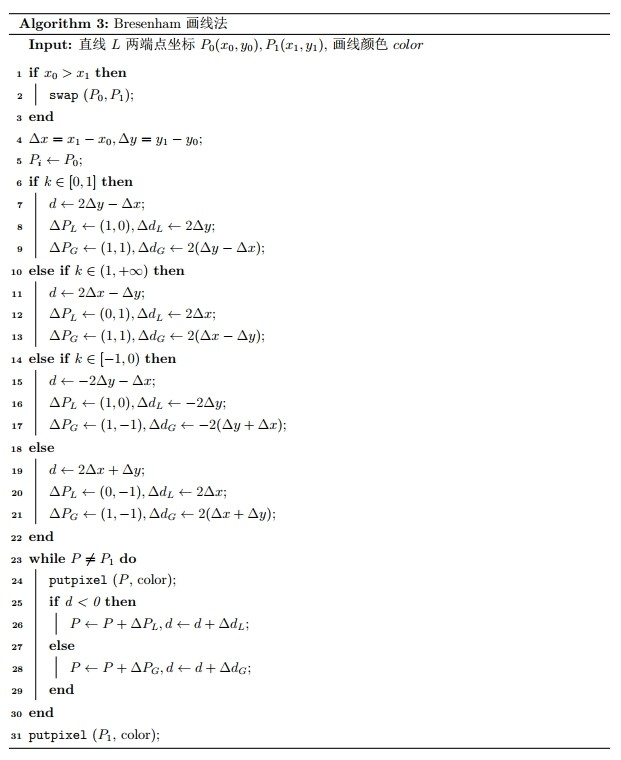

代码：

```c++
void Line_Bresenham(int x0, int y0, int x1, int y1, Color color)
{
    if (x0 > x1) // 保证x0 <= x1
        swap(x0, x1), swap(y0, y1);
    int Delta_x = x1 - x0, Delta_y = y1 - y0,
        d,                          // 决策变量d
        dd_L, dd_G,                 // 决策变量d的增量(L代表小于0的情况，G代表大于0的情况)
        x = x0, y = y0,             // 初始P坐标
        dPx_L, dPy_L, dPx_G, dPy_G; // P坐标的增量(L代表小于0的情况，G代表大于0的情况)
    // 根据k值分情况生成决策变量和增量
    if (0 <= Delta_y && Delta_y <= Delta_x) // k ∈ [0, 1]
    {
        d = 2 * Delta_y - Delta_x;                            // d0 = 2Δy - Δx
        dPx_L = 1, dPy_L = 0, dd_L = 2 * Delta_y;             // d < 0情况
        dPx_G = 1, dPy_G = 1, dd_G = 2 * (Delta_y - Delta_x); // d >= 0 情况
    }
    else if (Delta_x < Delta_y) // k ∈ (1, +∞)
    {
        d = 2 * Delta_x - Delta_y;                            // d0 = 2Δx - Δy
        dPx_L = 0, dPy_L = 1, dd_L = 2 * Delta_x;             // d < 0情况
        dPx_G = 1, dPy_G = 1, dd_G = 2 * (Delta_x - Delta_y); // d >= 0 情况
    }
    else if (-Delta_x <= Delta_y && Delta_y < 0) // k ∈ [-1, 0)
    {
        d = -2 * Delta_y - Delta_x;                             // d0 = -2Δy - Δx
        dPx_L = 1, dPy_L = 0, dd_L = -2 * Delta_y;              // d < 0情况
        dPx_G = 1, dPy_G = -1, dd_G = -2 * (Delta_y + Delta_x); // d >= 0 情况
    }
    else // k ∈ (-∞, -1)
    {
        d = 2 * Delta_x + Delta_y;                             // d0 = 2Δx + Δy
        dPx_L = 0, dPy_L = -1, dd_L = 2 * Delta_x;             // d < 0情况
        dPx_G = 1, dPy_G = -1, dd_G = 2 * (Delta_x + Delta_y); // d >= 0 情况
    }
    // 迭代生成直线
    while (x != x1 || y != y1)
    {
        putpixel(x, y, color);
        if (d < 0)
            x += dPx_L, y += dPy_L, d += dd_L;
        else
            x += dPx_G, y += dPy_G, d += dd_G;
    }
    putpixel(x, y, color);
}
```

### 三种算法的比较分析

* 算法精度  
  对于三种算法生成的直线精度，在这里采用残差平方和$SSE$作为评判标准。  
  对于同样两端点分别调用三种算法生成直线并计算其$SSE$，多次运行比较后发现值均相同，如下图所示：  
  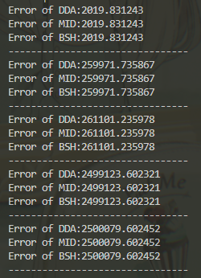  
  故可以判断三种算法的精度基本一致。
* 算法速度  
  由算法代码可分析：  
  对于DDA算法，其存在浮点数运算；  
  而对于中点画线法和 Bresenham 画线法，两者均把浮点数运算转换为了整数运算，而这两种算法的代码操作相近。  
  故DDA算法的速度慢于中点画线法和 Bresenham 画线法，而中点画线法和 Bresenham 画线法两算法速度相近。

## 画圆法

### 中点画圆法

#### 算法原理

对于任意一圆$C(P,r)$，其中$P(x_P,y_P)$为圆心，$r$为半径。根据平移不变性，可以先按照圆心在原点的情况生成圆$C'(O,r)$，然后将所有生成的点按向量$\vec{OP}$平移即可。  
而对于生成圆的操作，由于圆自身的对称性，可以将其以$x=0,y=0,y=x,y=-x$这四条对称轴平均分成八份，每次只用考虑生成某一部分的八分圆弧，其余部分按照对称性生成即可。若已生成圆$O'$某一八分圆弧上一点$Q(x,y)$，则生成圆$O$八个部分对应对称的点的代码如下：

```c++
void CirclePoints(int xP, int yP, int x, int y, int color)
{
    putpixel(xP+x, yP+y, color);
    putpixel(xP+y, yP+x, color);
    putpixel(xP-x, yP+y, color);
    putpixel(xP+y, yP-x, color);
    putpixel(xP+x, yP-y, color);
    putpixel(xP-y, yP+x, color);
    putpixel(xP-x, yP-y, color);
    putpixel(xP-y, yP-x, color);
}
```

由于平移不变性和八分对称性，接下来只考虑中心在原点$(0,0)$，半径为$R$（整数）的圆$C'$中，从点$A(0,R)$顺时针到点$B(\frac{R}{\sqrt{2}},\frac{R}{\sqrt{2}})$的八分圆弧$\overset\frown{AB}$上点的生成方式。

圆$C'$函数形式如下：

$$
F(x,y)=x^2+y^2-R^2
$$

则对于平面上任何点$P_i(x_i,y_i)$，与圆$C'$的相对位置有且只有三种情况：

$$
F(x_i, y_i)\left\{\begin{array}{ll}
<0 & \textrm{ 点 }(x_i, y_i) \textrm{ 位于圆内 } \\
=0 & \textrm{ 点 }(x_i, y_i) \textrm{ 位于圆上 } \\
＞0 & \textrm{ 点 }(x_i, y_i) \textrm{ 位于圆外 }
\end{array}\right.
$$

从圆弧左侧向右侧生成圆弧，设当前已确定与圆弧最近的像素点坐标为$P_i(x_i,y_i)$，则下一个与圆弧最近的右方像素，只能是正右方像素$P_{RM}(x_i+1,y_i)$或右下方像素$P_{RB}(x_i+1,y_i-1)$，称二者为“候选像素”。  
记$P_{RB}$和$P_{RM}$的中点为$M$，易知其坐标为$M(x_i+1,y_i-0.5)$。

再假设$Q$为理想圆弧$\overset\frown{AB}$与垂直线$x=x_i+1$的交点，则$M$与$Q$有三种关系：

* 若$F(M)>0$，即$M$在$Q$上方(圆弧$\overset\frown{AB}$外)，说明$P_{RB}$离直线最近，应作为下一个像素。
* 若$F(M)=0$，即$M$与$Q$重合(圆弧$\overset\frown{AB}$上)，说明$P_{RB}$与$P_{RM}$离圆弧等距离，两者均可作为下一个像素，这里约定$P_{RB}$作为下一个像素。
* 若$F(M)<0$，即$M$在$Q$(圆弧$\overset\frown{AB}$内)，说明$P_{RM}$离直线最近，应作为下一个像素。

故可用中点$M$的函数值$F(M)$作为决策变量$d_i$，根据$d_i$的符号确定下一个像素的选取。

$$
d_i\left\{\begin{array}{ll}
<0 & \textrm { 取正右方像素 } P_{RM}\left(x_{i}+1, {y}_{i}\right) \textrm { 作为下一个像素 } \\
\ge 0 & \textrm { 取右下方像素 } P_{RB}\left(x_{i}+1, {y}_{i}-1\right) \textrm { 作为下一个像素 }
\end{array}\right.
$$

选择相应像素后，将下两个候选像素的中点$M'$带入，可推导出下一个决策变量$d_{i+1}$的情况为：

$$
d_i\left\{\begin{array}{ll}
<0 & d_{i+1}=d_i+2x_i+3 \\
\ge 0 & d_{i+1}=d_i+2(x_i-y_i)+5
\end{array}\right.
$$

初始的决策变量为$d_0=1.25-R$，会造成$d_0$为浮点数，进行浮点数加法，  
但$d$只需要关注与$0$的关系，注意到迭代式中$d_{i+1}$与$d_i$等系数，且$R$以及之后的迭代运算中只会出现整数，则任一决策变量$d_i$的所有取值集合$D=\{x|x=0.25+k,k\in Z\}$，  
故可用$d_0-0.25$代替$d_0$，即$d_0'=1-R$。

由于迭代中$d_{i+1}$与$d_i$等系数，迭代过程中每一项的偏移值不变，则对于任意$d_i'$其值均为$d_i-0.25$，即对应所有取值集合变为$D'=\{x|x=k,k\in Z\}$。  
对于$d_i'$仍与$0$进行大小关系判断，$d_i'$相当于$d_i$沿$x$负半轴平移了$0.25$个单位，而$d_i$原本取值集合为$D=\{x|x=0.25+k,k\in Z\}$，向负半轴平移$0.25$个单位后，对于$k\ne0$的每个元素与$0$的大小关系不会发生变化；而$k=0$即$d_i=0.25$平移后$d_i'=0$，两者均$\ge0$执行取正右方像素的决策，  
因此平移后每个决策变量的执行的决策仍一致，故可以通过该平移变化使得浮点数运算转换为整数运算。

---

将上述原理总结为：

$$
d_i\left\{\begin{array}{ll}
<0 & \textrm { 取正右方像素 } P_{RM}\left(x_{i}+1, {y}_{i}\right) \textrm { 作为下一个像素 },d_{i+1}=d_i+2x_i+3 \\
\ge 0 & \textrm { 取右下方像素 } P_{RB}\left(x_{i}+1, {y}_{i}-1\right) \textrm { 作为下一个像素 },d_{i+1}=d_i+2(x_i-y_i)+5
\end{array}\right.
$$

其中：$d_0=1-R$。  
当$x> y$时终止迭代。

#### 算法表示

伪代码：

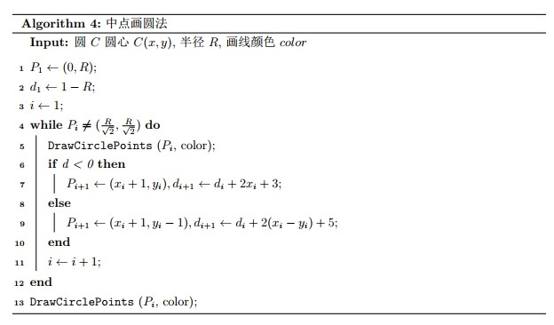

代码：

```c++
void DrawCirclePoints(int xc, int yc, int x, int y, Color color)
{
    putpixel(xc + x, yc + y, color);
    putpixel(xc + y, yc + x, color);
    putpixel(xc - x, yc + y, color);
    putpixel(xc + y, yc - x, color);
    putpixel(xc + x, yc - y, color);
    putpixel(xc - y, yc + x, color);
    putpixel(xc - x, yc - y, color);
    putpixel(xc - y, yc - x, color);
}
void Circle_Midpoint(int xc, int yc, int R, Color color)
{
    int x = 0, y = R, // 初始P坐标
        d = 1 - R;    // 决策变量d
    while (x < y)
    {
        DrawCirclePoints(xc, yc, x, y, color);
        if (d < 0)
            d += 2 * x + 3, x++;
        else
            d += 2 * (x - y) + 5, x++, y--;
    }
    DrawCirclePoints(xc, yc, x, y, color);
}
```

### Bresenham 画圆法

#### 算法原理

其跟中点画线法与 Bresenham 画线法的区别类似，也是在选择$P_{RM}$和$P_{RU}$时，用$P_{RM}$和$P_{RU}$两距离的大小关系判断。  
仍考虑跟中点画圆法一样的八分圆弧，候选像素仍是正右方像素$H(x_i+1,y_i)$和右下方像素$D(x_i+1,y_i-1)$，此时两点$H,D$与理想圆弧存在四种位置关系：

* $H,D$均在圆内  
* $H$在圆外（或圆上），$D$在圆内
* $H$在圆外，$D$在圆上
* $H,D$均在圆外

对于上第一种情况可确定候选像素应选择$H$；第三、四种情况候选像素应选择$D$；而对于第二种情况需要考虑$H,D$点和垂线$HD$与理想圆弧的交点$M$的距离，若$|HM|<|DM|$则选择$H$，若$|HM|<|DM|$选择$D$（若$|HM|=|DM|$则可约定选择$H$），如下图所示：  
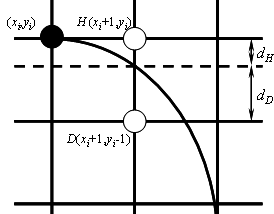

然而对于交点$M$直接求得较为复杂，这里采用近似的方法来代替$d_H$与$d_D$，将$H,D$分别带入圆$C'$函数$F(x,y)$中，记为$\Delta_H,\Delta_D$，则$\Delta_H=|OH|^2-|OM|^2,\Delta_D=|OD|^2-|OM|^2$，记$\Delta_{HD}=\Delta_H+\Delta_D$，则$\Delta_{HD}\approx |OH|-|OM|+|OD|-|OM|\approx d_H-d_M$，故若$\Delta_{HD}\le0$，则应选择$H$，否则选择$D$。

故对于当前已确定点$P_i(x_i,y_i)$，设决策变量$d_i=\Delta D=(x_i+1)^2+(y_i-1)^2-R^2$，综合整理后可得迭代情况如下：

$$
\left\{\begin{array}{ll}
d_i<0\And2(d_i+y_i)-1<=0 & \textrm { 取正右方像素 } H\left(x_i+1, {y}_{i}\right) \textrm { 作为下一个像素 }, d_{i+1}=d_i+2x_i+3 \\
\textrm{否则} & \textrm { 取右下方像素 } D\left(x_{i}+1, {y}_{i}-1\right) \textrm { 作为下一个像素 }, d_{i+1} = d_i+2(x_i-y_i+3)
\end{array}\right.
$$

其中：$d_0=2(1-R)$。  
当$x>y$时终止迭代。

#### 算法表示

伪代码：

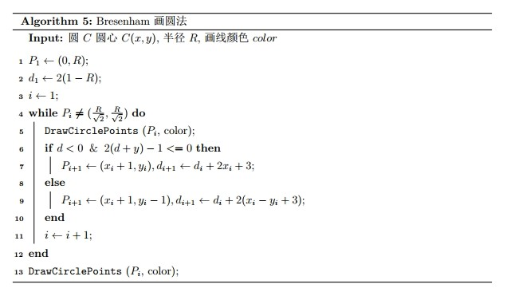

代码：

```c++
// DrawCirclePoints()函数已在中点画圆法给出，这里不再给出
void Circle_Bresenham(int xc, int yc, int R, COLORREF color)
{
    int x = 0, y = R,  // 初始P坐标
        d = 2 - 2 * R; // 决策变量d
    while (x < y)
    {
        DrawCirclePoints(xc, yc, x, y, color);
        if (d < 0 && 2 * (d + y) - 1 <= 0)
            d += 2 * x + 3, x++;
        else
            d += 2 * (x - y + 3), x++, y--;
    }
    DrawCirclePoints(xc, yc, x, y, color);
}
```

### 多边形逼近画圆法

#### 算法推导

对于一正多边形，若其边数足够多时，则可以近似看作圆。利用平移不变性，仍考虑生成中心为原点$O$，各顶点距中心距离为$R$的正$n$边形，可以先通过计算各顶点的坐标，然后利用直线生成算法进行临近顶点的连线，从而生成正多边形。

由于是正$n$边形，临近顶点与中心连线形成的夹角均为$\frac{2\pi}{n}$，记为$\theta$。对于已生成的圆上一顶点$P_i(x_i,y_i)$，其与$x$轴正方向的夹角为$\alpha$，那么存在如下关系：
$$
\left\{\begin{array}{ll}
x_i=R\cos\alpha \\
y_i=R\sin\alpha
\end{array}\right.
$$
则下一个顶点可表示为：
$$
\left\{\begin{array}{ll}
x_{i+1}=R\cos(\alpha+\theta)=x_i\cos\theta-y_i\sin\theta \\
y_{i+1}=R\sin(\alpha+\theta)=y_i\cos\theta+x_i\sin\theta
\end{array}\right.
$$

假设初始顶点为正上方顶点$P_1(0,R)$，按照上述递推式依次生成$n$个顶点，然后采用 Bresenham 画线法连接相邻顶点，从而绘制出多边形完成多边形逼近画圆法。

经过个人测试，当多边形边数定为$3\sqrt{R}$时，在$R\ge25$时均有较好的生成效果（对于较小的$R$，任意$n$其生成效果均不理想）。

#### 算法表示

伪代码：

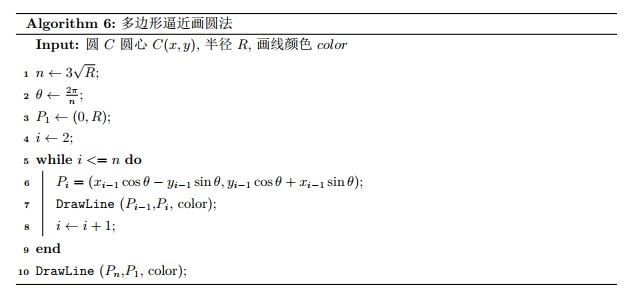

代码：

```c++
const double PI = 3.141592653589793;
void Circle_Polygon(int xc, int yc, int R, COLORREF color)
{
    int n = 3 * sqrt(R); // 正多边形边数
    double cosTheta = cos(2.0 * PI / n), sinTheta = sin(2.0 * PI / n),
           xl = 0, yl = R, // 上一个生成的顶点
           x = 0, y = R;   // 当前生成的顶点
    for (int i = 2; i <= n; i++)
    {
        xl = x, yl = y;
        x = xl * cosTheta - yl * sinTheta, y = yl * cosTheta + xl * sinTheta;
        Line_Midpoint(xc + (int)(xl + 0.5), yc + (int)(yl + 0.5), xc + (int)(x + 0.5), yc + (int)(y + 0.5), color);
    }
    Line_Midpoint(xc + (int)(x + 0.5), yc + (int)(y + 0.5), xc, yc + R, color);
}
```

### 三种算法的比较分析

* 算法精度  
  对于三种算法生成的圆形精度，由于中点画圆法与 Bresenham 画圆法几乎相近，故两者精度相同；  
  而对于多边形逼近法，其精度较低，尤其是当圆半径过大或过小时精度更低。
* 算法速度  
  中点画圆法与 Bresenham 画圆法两者运算速度大致一致，Bresenham 画圆法由于多了一步乘法运算会略慢于中点画圆法；  
  而对于多边形算法，其直线相连的速度远快于等价的圆弧生成的速度，故其速度快于中点画圆法和 Bresenham 画圆法。

## 任意角度画弧法

### 算法推导

对于圆弧的绘制，由于失去了八分对称性，若直接生成过于复杂。其可以在画圆算法的基础上，在以八分对称性绘制像素点时，判断该像素点是否在需要绘制的圆弧上再绘制即可。称需要绘制的像素点集合为绘制区域$D$，若简单的以角度判断像素点是否在$D$中则复杂度过高，需尽量采用原有的直角坐标信息来判断，因此这里给出一种复杂度较低的判断方法。

对于圆弧的描述，这里采用三点描述法，即给定圆弧所在圆的圆心$C(x_c,y_c)$、圆弧的起点$S(x_s,y_s)$和终点方位点$E_{pos}(x_{epos},y_{epos})$，其中圆心和圆弧起点的距离$CS$即为圆的半径$R$。需注意由于用户很难在确定圆心和起点后，给出恰好在圆上的圆弧终点，因此圆弧的实际终点并不是终点方位点，而是终点方位点和圆心的连线$CE_{pos}$与圆$C$的交点，记为$E(x_e,y_e)$，如下图所示。

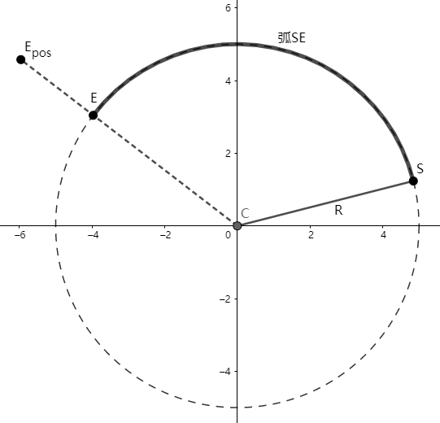

仍考虑平移不变性，将圆$C$平移到圆心为原点的位置变换为圆$C'$，将平移后所有标识都加上$'$表示（如$E'(x_e',y_e')$，其中$x_e'=x_e-x_c,y_e'=y_e-y_c$）。首先需要根据终点方位点确定圆$C'$上的实际圆弧终点，可通过$C'E_{pos}'$的线段与圆的交点确定，若直线$C'E_{pos}'$斜率不存在，则根据$y_{epos}'$的大小可确定$E$点：若$E_{pos}'$在$x$轴上方则$E$为$(0,R)$，否则为$(0,-R)$；若斜率存在，可先求得斜率为$k=\frac{y_{epos}'}{x_{epos}'}$，联立直线$y=kx$与圆方程$x^2+y^2=R^2$可得：

$$
x_e' = \pm \frac{R}{\sqrt{k^2+1}}
$$

若$E_{pos}'$在$y$轴右侧则$E$为$(x_e',kx_e')$，否则为$(-x_e',-kx_e')$。在求得坐标后可对坐标进行四舍五入化整处理。

然后根据八分对称性，将圆$C'$划分成八个区域，将最右侧点$(0,R)$逆时针第一个区域作为区域$1$（记作$R_1$），其余区域按逆时针顺序依次编号为$R_i$。同时将四条对称轴与圆$C'$形成的八个点，称为界点，并将最右侧的界点$(0,R)$作为界点$1$（记作$K_1$），其余界点按逆时针顺序依次编号为$K_i$。如下图：

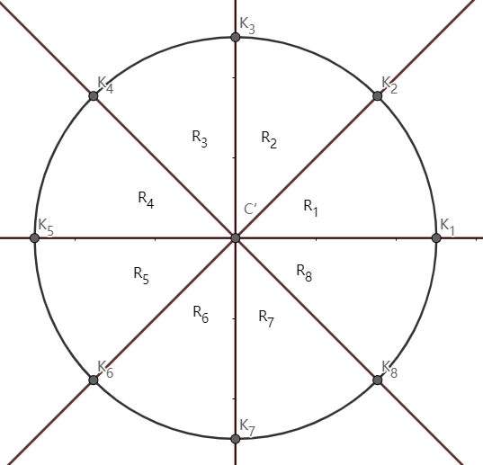  

对于圆$C'$上任意一点$P_i(x_i,y_i)$，根据其与四条对称轴$x=0,y=0,y=x,y=-x$的位置关系，可以唯一确定其属于哪一个区域或在哪一个界点上（如若$y_i<x_i\And y>0$，则$P_i\in R_1$；若$y=0\And x>0$，则$P_i=K_1$。

对于任一区域$R_i$，其包含的像素点集存在以下三种状态：

* $R_i$中的所有像素点均不会被绘制，称为非绘制区域，即$R_i\cap D = \emptyset$
* $R_i$中的部分像素点会被绘制，部分像素点不会被绘制，称为部分绘制区域，即$R_i\cap D \ne \emptyset$
* $R_i$中的所有像素点均会被绘制，称为全绘制区域，即$R_i\subseteq  D$

确定出$S$和$E$所属的区域或界点后，则可根据其逆时针的相对顺序，确定出八个区域的性质，从而确定绘制区域。共存在以下四种情况：

* 若$S,E$分别在界点$K_i,K_j$上：则其之间（$S$逆时针到$E$之间的区域，下同）的区域$R_i\sim R_{j-1}$均为全绘制区域；其之外（$S$顺时针到$E$之间的区域，下同）的其余区域均为非绘制区域。
* 若$S$在界点$K_i$上、$E$在区域$R_j$中：则其之间的区域$R_i\sim R_{j-1}$为全绘制区域（若$i>j-1$则不存在）；$K_j$到$E$之间的区域为部分绘制区；其之外的其余区域为非绘制区域。
* 若$S$在区域$R_i$中、$E$在界点$K_j$上：则其之间的区域$R_{i+1}\sim R_{j}$为全绘制区域（若$i+1>j$则不存在）；$S$到$K_{i+1}$之间的区域为部分绘制区；其之外的其余区域为非绘制区域。
* 若$S$在区域$R_i$中、$E$在区域$R_j$上：则其之间的区域$R_{i+1}\sim R_{j-1}$为全绘制区域（若$i+1>j-1$则不存在）；$S$到$K_{i+1}$与$K_j$到$E$之间（若$K_{i+1}$在$E$逆时针侧则为$S$到$E$之间）的区域为部分绘制区；其之外的其余区域为非绘制区域。

对于全绘制区域和非绘制区域，可采用$0$和$1$二元值标记它们的状态，在判断某像素点是否属于绘制区域时只需要读取该状态值，若其值为$0$则不在绘制区域停止绘制；若其值为$1$则在绘制区域继续绘制。而对于部分绘制区域，根据上述情况可知最多不超过$2$个，且边界端点均属于同一象限，因此可以记录两端点坐标形成的矩形区域中，最左下的坐标$MN(x_{MN},y_{MN})$和最右上坐标$MX(x_{MX},y_{MX})$，若像素点在该矩形区域$Rect$范围内，则属于绘制区域，否则不属于，如下图：

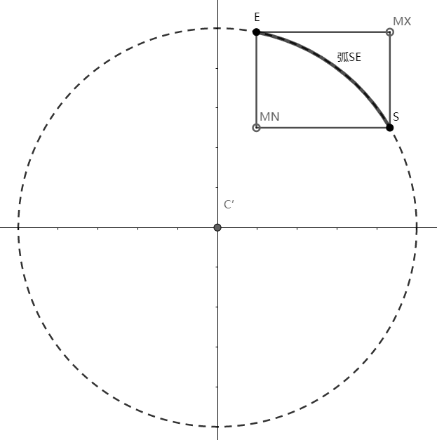  

须同时将该区域的状态标记为另一值$-1$，表示需要根据像素坐标与矩形区域的位置关系进一步判断。同时对于上述第四种情况，若$S,E$属于同一象限且$S$在$E$的顺时针侧，则可将$S$到$K_{i+1}$与$K_j$到$E$之间的区域合并为$S$到$E$之间的区域，以减少判断区域数。

之后就按照中点画圆法的方法，生成第二区域的八分圆弧以生成整个圆，在绘制像素点的时候判断该像素点$P_i$是否属于绘制区域$D$再进行绘制。

### 算法表示

伪代码：

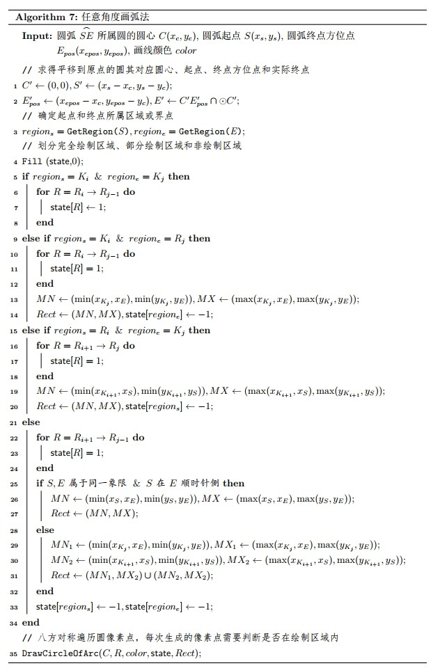

代码：

```c++
struct Vector2
{
    int x, y;
    Vector2() {}
    Vector2(const int &_x, const int &_y) : x(_x), y(_y) {}
};

// 返回在哪个八分区域或界点上
int getRegion(int x, int y)
{
    if (y < x && y > 0)
        return 1;
    else if (y > x && x > 0)
        return 2;
    else if (y > -x && x < 0)
        return 3;
    else if (y < -x && y > 0)
        return 4;
    else if (y > x && y < 0)
        return 5;
    else if (y < x && x < 0)
        return 6;
    else if (y < -x && x > 0)
        return 7;
    else if (y > -x && y < 0)
        return 8;
    // 恰好在界点上的情况（一般情况不会让x==y==0）
    // 为了与区域区分，Ki记录为i+10（如K1记录为11）
    else if (x == 0)
        return y > 0 ? 13 : 17;
    else if (y == 0)
        return x > 0 ? 11 : 15;
    else if (y == x)
        return x > 0 ? 12 : 16;
    else if (y == -x)
        return y > 0 ? 14 : 18;
    else
        return -1;
}

int drawRegionState[9] = {0, 0, 0, 0, 0, 0, 0, 0, 0}; // 某个区域的绘制状态（0 - 非绘制区域；1 - 全绘制区域；-1 - 部分绘制区域）
int judegCount = 0; // 部分绘制区域个数
Vector2 judgeRegion[2][2]; // 部分绘制区域的矩形区域

// 判断像素点(x, y)是否属于绘制区域
bool isInDrawRegion(int x, int y, int region)
{
    if (drawRegionState[region] != -1) // 如果所处区域不需要具体判断，则直接返回预判断结果
        return drawRegionState[region];
    for (int i = 0; i < judegCount; i++)
        if (judgeRegion[i][0].x <= x && x <= judgeRegion[i][1].x && judgeRegion[i][0].y <= y && y <= judgeRegion[i][1].y) // 是否在矩形区域中
            return true;
    return false;
}

// 八分画圆过程中根据是否在绘制区域进行对称绘制
void DrawArcPoints(int xc, int yc, int x, int y, COLORREF color)
{
    isInDrawRegion(x, y, 2) ? putpixel(xc + x, yc + y, color) : (void)0;
    isInDrawRegion(y, x, 1) ? putpixel(xc + y, yc + x, color) : (void)0;
    isInDrawRegion(-x, y, 3) ? putpixel(xc - x, yc + y, color) : (void)0;
    isInDrawRegion(y, -x, 8) ? putpixel(xc + y, yc - x, color) : (void)0;
    isInDrawRegion(x, -y, 7) ? putpixel(xc + x, yc - y, color) : (void)0;
    isInDrawRegion(-y, x, 4) ? putpixel(xc - y, yc + x, color) : (void)0;
    isInDrawRegion(-x, -y, 6) ? putpixel(xc - x, yc - y, color) : (void)0;
    isInDrawRegion(-y, -x, 5) ? putpixel(xc - y, yc - x, color) : (void)0;
}

void Arc(int xc, int yc, int _xs, int _ys, int _xe, int _ye, COLORREF color)
{
    // 确定对于圆心平移到原点的圆C'，其对应终点的在圆C'上的实际位置
    int xs = _xs - xc, ys = _ys - yc, xe = _xe - xc, ye = _ye - yc;
    double R = sqrt(xs * xs + ys * ys), k, tmp_xe;
    if (xe == 0)
        xe = 0, ye = _ye > 0 ? R + .5 : -R - .5;
    else
        k = (double)ye / xe, tmp_xe = xe > 0 ? R / sqrt(k * k + 1) : -R / sqrt(k * k + 1), xe = round(tmp_xe), ye = round(k * tmp_xe);
    // 确定起点和终点所属八分区域或界点
    int region_s = getRegion(xs, ys), region_e = getRegion(xe, ye);
    // 划分完全绘制区域、部分绘制区域和非绘制区域
    double a = R / sqrt(2);
    Vector2 baseJudge[9] = {Vector2(), Vector2(R + .5, 0), Vector2(a + .5, a + .5), Vector2(0, R + .5), Vector2(-a - .5, a + .5), Vector2(-R - .5, 0), Vector2(-a - .5, -a - .5), Vector2(0, -R - .5), Vector2(a + .5, -a - .5)}; // 八个界点坐标
    memset(drawRegionState, 0, sizeof(drawRegionState));
    judegCount = 0;
    if (region_s > 10)
        if (region_e > 10) // 起点在界点上，终点也在界点上
            for (int i = (region_e -= 10, region_s -= 10); i != region_e; i = i % 8 + 1)
                drawRegionState[i] = 1;
        else // 起点在界点上，终点不在界点上
        {
            for (int i = region_s -= 10; i != region_e; i = i % 8 + 1)
                drawRegionState[i] = 1;
            judgeRegion[judegCount][0] = Vector2(min(baseJudge[region_e].x, xe), min(baseJudge[region_e].y, ye)), judgeRegion[judegCount++][1] = Vector2(max(baseJudge[region_e].x, xe), max(baseJudge[region_e].y, ye));
            drawRegionState[region_e] = -1;
        }
    else if (region_e > 10) // 起点不在界点上，终点在界点上
    {
        for (int i = (region_e -= 10, region_s % 8 + 1); i != region_e; i = i % 8 + 1)
            drawRegionState[i] = 1;
        judgeRegion[judegCount][0] = Vector2(min(baseJudge[region_s % 8 + 1].x, xs), min(baseJudge[region_s % 8 + 1].y, ys)), judgeRegion[judegCount++][1] = Vector2(max(baseJudge[region_s % 8 + 1].x, xs), max(baseJudge[region_s % 8 + 1].y, ys));
        drawRegionState[region_s] = -1;
    }
    else // 起点和终点都不在界点上
    {
        for (int i = region_s % 8 + 1; i != region_e; i = i % 8 + 1)
            drawRegionState[i] = 1;
        if ((region_s - 1) / 2 == (region_e - 1) / 2 && region_s < region_e) // 为同一个象限，并且起点在终点顺时针侧（劣弧），可以合并判断区域
            judgeRegion[judegCount][0] = Vector2(min(xs, xe), min(ys, ye)), judgeRegion[judegCount++][1] = Vector2(max(xs, xe), max(ys, ye));
        else
            judgeRegion[judegCount][0] = Vector2(min(baseJudge[region_s % 8 + 1].x, xs), min(baseJudge[region_s % 8 + 1].y, ys)), judgeRegion[judegCount++][1] = Vector2(max(baseJudge[region_s % 8 + 1].x, xs), max(baseJudge[region_s % 8 + 1].y, ys)),
            judgeRegion[judegCount][0] = Vector2(min(baseJudge[region_e].x, xe), min(baseJudge[region_e].y, ye)), judgeRegion[judegCount++][1] = Vector2(max(baseJudge[region_e].x, xe), max(baseJudge[region_e].y, ye));
        drawRegionState[region_s] = drawRegionState[region_e] = -1;
    }
    // 八方生成圆(中点画圆法)，每次生成的像素点需要判断是否在绘制区域内
    int x = 0, y = R + 0.5,
        d = 1 - (R + 0.5);
    while (x < y)
    {
        DrawArcPoints(xc, yc, x, y, color);
        if (d < 0)
            d += 2 * x + 3, x++;
        else
            d += 2 * (x - y) + 5, x++, y--;
    }
    DrawArcPoints(xc, yc, x, y, color);
}
```
