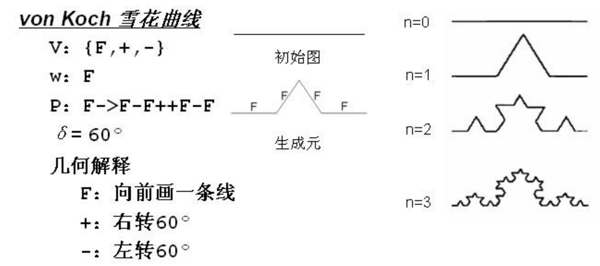
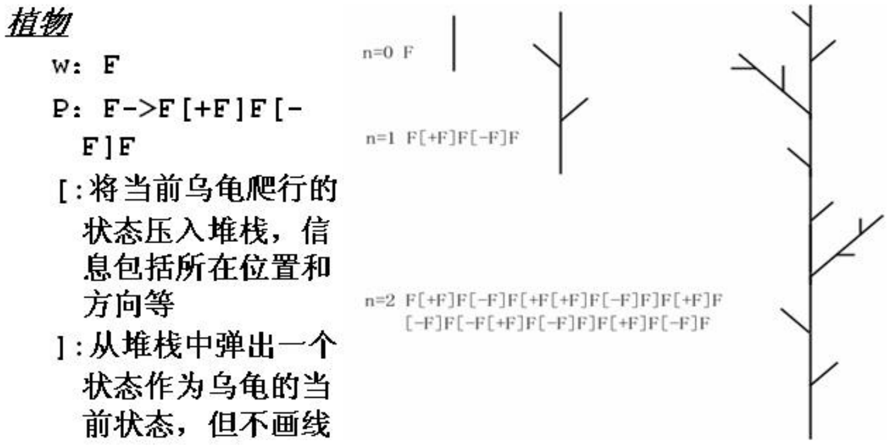

# 三维变换

1. 平移变换
   左下$1\times3$为平移系数。
2. 比例变换  
   对角线的左上三个为局部比例，右下角一个为整体比例。
3. 旋转变换
4. 对称变换
5. 错切变换

## 一、基础变换

### 2. 比例变换

1. 局部比例变换  
   以坐标原点为参考点，沿$x,y,z$轴分别独立地缩放$S_x,S_y,S_z$倍。
2. 整体比例变换  
   整体缩放$S$倍。

### 3. 旋转变换

旋转正方向与坐标轴符合“右手法则”。

绕轴旋转，绕哪个轴，哪个坐标不变。

### 4. 对称变换

以点、线、面为基准，分别对三个、两个、一个坐标取反。

### 5. 错切变换

沿轴产生错切。  
或者沿某轴方向含另一轴错切。

### 6. 逆变换

求变换矩阵的逆矩阵。  
旋转变换时用$-\theta$代替$\theta$。

## 复合变换

### 1. 任意点做基础变换

1. 将参考点$(x,y,z)$平移到坐标原处
2. 进行基础变换
3. 平移回去

### 2. 绕任意轴旋转

绕空间任意一轴线$AB$旋转$\theta$，$A(x_A,y_A,z_A)$、$B(x_B,y_B,z_B)$，AB方向为$(a,b,c)$

1. 平移$AB$轴，到$A$与原点重合。
2. $AB$绕$x$轴旋转$\alpha$，使之落到$xOz$平面上。

---

# 三维观察

模拟实际拍照过程进行三维观察。

* 虚拟相机 - 位于任意空间位置（前部、上或后面），可在位于一组物体的中间或位于某一物体内部，生成一张能看到的视图。  
  任意方向。
* 投影 - 三维物体描述必须投影到输出设备的观察**平面**上，此时裁剪边界围成一个体，需要投影。。

三维视图生成步骤：

1. 建模坐标系→世界坐标系→观察坐标系
2. 投影变换转换到投影平面
3. 裁剪、视面识别、表面绘制输出

## 投影变换

将N维坐标系中的点，变换为小于N维坐标系中的点。

* 投影中心：一个汇集点，点到投影中心的连线，与面的交点，即是投影点。

**三维到二维有两种投影：**

* 透视投影 - 存在一个投影中心，投影线向投影中心汇集，交在投影面上形成投影。
* 平行投影 - 投影线相互平行，相当于投影中心无限远

**平行投影分类：**

* 正投影 - 投影线与投影面垂直
  * 三视图 - 投影平面与某一坐标轴垂直  
    与$x,y,z$轴垂直的分别称为主视图、侧视图和俯视图。
    * 主视图 - 直接投影
    * 俯视图 - (1) 投影；(2) 绕x轴旋转$-90\degree$；(3) 沿z轴平移一段距离$-z_p$
    * 侧视图 - (1) 投影；(2) 绕z轴旋转$90\degree$； (3) 沿x轴平移一段距离$-x_l$
  * 轴侧图（正轴测）
    根据投影平面与三个坐标轴的截距，分为以下三种
    * 正等测
    * 正二测
    * 正三测
* 斜投影（斜轴测） - 不垂直
  * 斜等测 - 投影方向与投影面成$45\degree$
  * 斜二测 - 投影方向与投影面成$\arctan2$

## 透视投影

**投影中心**与**投影平面**之间的**距离为有限**时，投影线必然汇聚于一点，这样的投影称为透视投影。

设：投影中心在$z=d$，投影平面在$xOy$，$d$为投影面与投影中心的距离；  
现求：空间中一点$P(x_p,y_p,z_p)$的透视投影$P'$的坐标。

利用相似三角形，可得：  
$$
x' = \frac{x}{-\frac{z}{d}+1}
$$
$$
y' = \frac{y}{-\frac{z}{d}+1}
$$
$$
z' = 0
$$

* 灭点：对于透视投影，一族平行于投影面的平行线，透视投影后仍保持平行；若不平行投影面的一族平行线，经过透视投影后收敛于一点，称此点为灭点。
* 主灭点：沿某坐标轴的平行线，产生的灭点。  

主灭点最多三个，根据主灭点的个数，将透视投影分为以下三种：

* 一点透视
* 两点透视
* 三点透视

在三维变换矩阵中，第四列上三个$p,q,r$起透视变换作用：

* $p,q,r$只有一个不为$0$ - 一点透视
* $p,q,r$有两个不为$0$ - 两点透视
* $p,q,r$均不为$0$ - 三点透视

# 观察窗口

在三维观察中。

# 三维裁剪

## 1. 规范化裁剪空间

平行投影 - 规范化裁剪空间：

$x=-1\sim1, y=-1\sim1, z=0\sim1$

透视投影 - 规范化裁剪空间：

$x=-z\sim z, y = -z\sim z, z= z_{min}\sim 1$

## 2. 编码裁剪

用6位。

---

## 表示

### 1. 空间位置枚举表示

把物体划分成均匀的小立方体，用三维数据`C[i][j][k]`表示，  
若属于物体，则记`1`；否则记`0`。

优点：

* 简单
* 可以表示任何物体
* 容易实现交、并、差

缺点：

* 精度低
* 占用空间大

### 2. 八叉树表示

对空间进行自适应风格。

先将包围物体的整个立方体，划分成**八个子立方体**，进行以下递归操作：

* 空（内部没有该物体） - 停止分解
* 满（内部完全被该物体占据） - 停止分解
* 部分 - 进一步分解为八个子立方体，直到到达精度要求

**优点：**

* 数据结构简单
* 简化集合运算

**缺点：**

* 非精确表示
* 没有边界信息
* 几何变换困难

### 3. 单元分解表示

以不同类型的基本**体素**（如正方体、四棱椎等），通过**粘合**（集合加）运算来构造新的实体。

**优点：**

* 表示简单
* 表示范围广
* 可精确表示
* 容易几何变换

**缺点：**

* 同一实体多种表现形式，不唯一
* 物体有效性难以保证（物体的参数若不准确，如两体素的距离给大了）

### 2. 构造表示

按照生成过程中定义实体的方法

### 3. 扫描表示

基于一个**基体**（一般是封闭平面轮廓）沿某一**路径**运动而产生的形体。

两个分量：

* 被运动的基体
* 基体运动的路径

基体运动中还可以变化，需要给出变截面的变化规律。

运动方式：

* 平移运动
* 旋转运动
* 广义运动

优点：

* 简单、直观
* 适合做图形输入手段

缺点：

* 几何变换困难
* 边界信息确实
* 覆盖范围非常有限
* 可能维度不一致

### 构造实体几何表示

通过对体素的定义和运算，以表示图形。

CSG可以看作一棵有序的二叉树，  

* 终端结点 - 体素、或变换矩阵
* 非终端结点 - 几何运算、或变换运算

根结点就表示了最终的形体。

优点：

* 有效性能得到保证  
  因为体素的有效性和运算结果的有效性

缺点：

* 受体素种类和操作的限制
* 局部操作不易实现，如不能对交线倒原角

### 特征表示

用若干个参数来表定义，方便用户输入。

### 边界表示

由面的并集来表示。

**广义欧拉公式：**

适用于非简单多面体的计算。

$$
v-e+f-r=2(s-h)
$$

* $v$ - 
* $e$ - 
* $f$ - 
* $r$ - 多免提表面上孔的个数
* $s$ - 相互分离的多面体数
* $h$ - 贯穿多面体的孔洞个数

#### 半边表示

* 几何信息
* 拓扑信息

## 非规则形体的表示

### 1. 分形几何

*即那种带递归的图形构造。*

* 欧式几何 - 使用**方程**描述有平滑的表面和规则形状的物体
* 分形几何 - 使用**过程**对具有不规则几何形态的物体（如自然景物）
  * 分数维数

### 2. 粒子系统

是一个随机模型，用大量的**粒子**图元来描述景物，  
粒子会随着时间推移发生位置和形态变化。

粒子会经过诞生、运动、消亡的状态。

即过程为：

1. 生成新的粒子，分别赋予不同的随机的属性、生命周期，并加到系统中
2. 删去系统中已经死亡的、超过生命周期（如落到地面）的粒子
3. 根据粒子的动态属性，按适当的运动模型或规则，对余下的存活粒子的运动进行控制  
   粒子运动的模拟方式：随机过程模拟、运动路径模拟、力学模拟
4. 根据粒子属性绘制当前系统中存活的所有粒子

**粒子系统**负责管理所有粒子。

### 3. 形状语法

利用分形几何的思想，把物体的递归生成过程用规范化的语法来描述。  
如：L语法。

 

### 4. 基于物理的建模

将**物理特性**加入到其几何模型中，通过物理数值计算对其进行仿真。

包括的物理特性有：

* 物体所具有的一组**物理参量**
* 不同**参量**之间的**关系**
* 物理参量与物体**几何特性**及**运动状态**之间的关系
* 不同物体的物理参量之间的关系